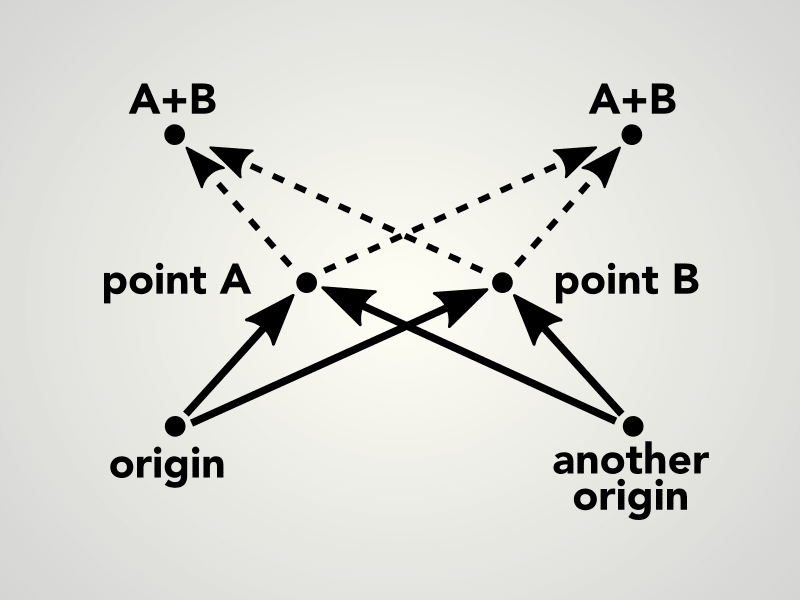
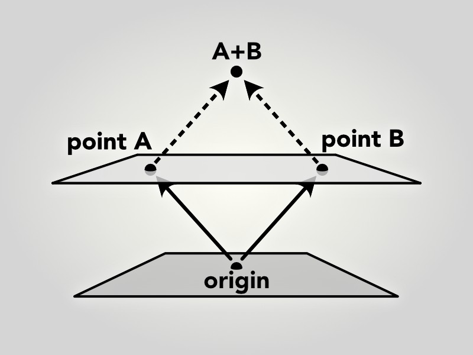

# affineplane

A functional 2D plane geometry and dynamics library for spatial 2D applications. Written in JavaScript (ECMAScript 6) with a functional, immutable, class-free style.

## Install

With [npm](https://www.npmjs.com/package/affineplane) or [yarn](https://yarnpkg.com/en/package/affineplane):

    $ npm install affineplane
    $ yarn add affineplane

## Geometry

Shapes:

- [dir2](docs/API.md#affineplanedir2), direction on a plane, `number` in rad
- [dist2](docs/API.md#affineplanedist2), distance between two locations on a plane, `number`
- [point2](docs/API.md#affineplanepoint2), a location on a plane, `{x,y}`
- [point3](docs/API.md#affineplanepoint3), a location in a 3D space, `{x,y,z}`
- [size2](docs/API.md#affineplanesize2), a rectangle size on a plane, `{w,h}`

Movements:

- [linear2](docs/API.md#affineplanelinear2), a linear transformation on a plane, `{a,b}`
- [tran2](docs/API.md#affineplanetran2), a [helmert](https://en.wikipedia.org/wiki/Helmert_transformation) transformation on a plane, `{a,b,x,y}`
- [vector2](docs/API.md#affineplanevector2), a displacement on a plane, `{x,y}`
- [vector3](docs/API.md#affineplanevector2), a displacement in a 3D space, `{x,y,z}`

Projections:

- [proj2](docs/API.md#affineplaneproj2), projection between parallel planes, `{a,b,x,y}`
- [proj3](docs/API.md#affineplaneproj3), perspective projection between parallel planes, `{a,b,x,y,z}`

See [API docs](docs/API.md) for more.

## Using data structures and functions

Instead of classes, affineplane provides functions that operate on plain objects. The available functions are pure, in a sense that they never modify the input, do not cause side effects, have no hidden state, and they always return new objects computed from the input.

    const aff = require('affineplane')
    const p = aff.point2.create(2, 5)
    const po = aff.point2.offset(3, 0)
    // po equals { x: 5, y: 5 }

The functions are grouped in *namespaces*, each focusing on a certain geometry. A common theme of the lib is to explicitly distinguish static shapes from their dynamic movements, like [point2](docs/API.md#affineplanepoint2) from [vector2](docs/API.md#affineplanevector2). Otherwise, in our experience, it is all too easy to mix these concepts in the code which can break the math especially when projecting the geometry between planes.

## Projecting between planes

In affineplane, we separate geometry, say a point, from its representation, like `{x,y}`. While the representation depends on the frame of reference, meaning the plane and its coordinate system, the geometry itself does not. To illustrate this, the image below shows how the same point has different coordinates depending on which plane to choose for the reference.

We cannot represent geometry without a frame of reference. However, we can _project_ it from one to another. In the case of affineplane, the reference is a 2D plane. A point `{x,y}` is a point on the plane at coordinates (x,y). To project the point to another plane, we only need to know the projection between the planes.

    const p = aff.point2.create(2, 5)
    const projection = aff.proj2.create(1, 0, 10, 10)
    const pp = aff.proj2.point2(projection, p)
    // pp equals { x: 12, y: 15 }

In affineplane, we define a plane using Helmert transformation `{a,b,x,y}`. Such transformation can represent uniform scaling, rotation around z axis, and translation along x and y axis. The transformation acts as the projection from the plane to its reference plane. To project geometry between two planes, we first need to find the projection between the planes and then project the geometry. You can projections for various geometries in the [proj2](docs/API.md#affineplaneproj2) namespace.

    const planeA = aff.proj2.create(2, 0, 10, 0)
    const planeB = aff.proj2.create(1, 0, 100, 0)
    const prAB = aff.proj2.between(planeA, planeB)
    // prAB equals { a: 2, b: 0, x: -90, y: 0 }
    const vA = aff.vector2.create(2, 4)
    const vB = aff.proj2.vector2(prAB, vA)
    // vB equals { x: 4, y: 8 }

In the snippet above, two planes are created with projections to their common reference plane. The plane A has the scale factor of 2 and 10 units of translation along x axis with respect to the reference. The plane B differs from the reference only by 100 units of translation along x axis. We compute the projection from A to B and then apply it to the vector vA on the plane A to produce the same vector represented on the plane B.

Because vectors, unlike points, have length and direction but no location, the translation does not affect them. In the illustration below you can see that regardless of where you place the vector v, its components stay the same.

The difference between points and vectors is important to understand when using or developing affineplane. Thus the topic and its foundations are further discussed below in detail.

## Difference between points and vectors

Affine planes have *no origin* by default. The point (0,0) on an affine plane is not an origin. This has interesting consequences that separates the often analogous concepts of the point and the vector.

Let A and B be points on an affine plane. As illustrated below, the result of their addition A + B is arbitrary and fully depends on the choice of the reference point, the origin. The situation might sound exotic but it is rather commonplace. For example, choose any two items nearby and try add their locations together. The result does not make sense, does it? Our physical world is essentially a space without a fixed origin.

In contrast, the *distance* between points A and B remains constant regardless the choice of origin. Also their difference A - B and mean C have this origin-invariant property. For the two items you chose, although you could not sum their locations, there still is a distance between the items and you can find a location at the middle.

On the other hand, *vectors* represent movement and displacement on the plane. It is easy to imagine adding two moves together to produce a larger move. Therefore, a vector can be added to another vector to produce a third vector – their sum. Also, a vector can be added to a point to produce another point. The same vector can be added to other points as well. Therefore it is apparent that vectors do not have specific location on the plane but instead represent dynamic movements of shapes and can be applied anywhere on the plane.

There is another way to understand why points on an affine plane behave in such a way. Think of a plane in 3D space so that the plane is lifted away from the space origin, as illustrated below. Now, the points A,B on the plane can be described as 3D vectors from the space origin O to the points, denoted as OA and OB. As you can see, addition of two such vectors OA + OB yields a point that does not stay on the plane and therefore cannot be represented on it.

The difference of vectors OA and OB is a vector OA - OB = BA. The vector BA parallel to the plane and the length of BA equals the distance between the points. Also, you can imagine the mean point between A and B. Does it stay on the plane?

## Contribute

Pull requests and [bug reports](https://github.com/axelpale/affineplane/issues) are highly appreciated. Please test your contribution with the following scripts:

Run test suite:

    $ npm run test

Run only linter:

    $ npm run lint

## License

[MIT](LICENSE)
