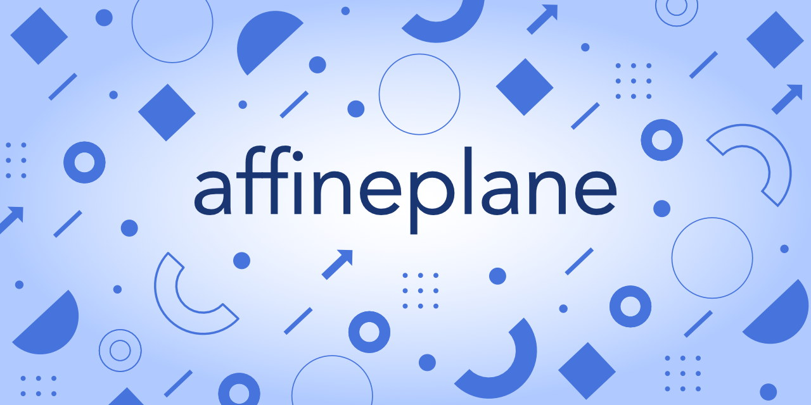
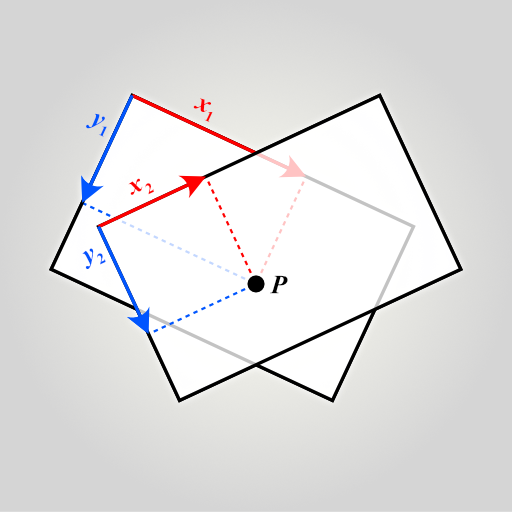
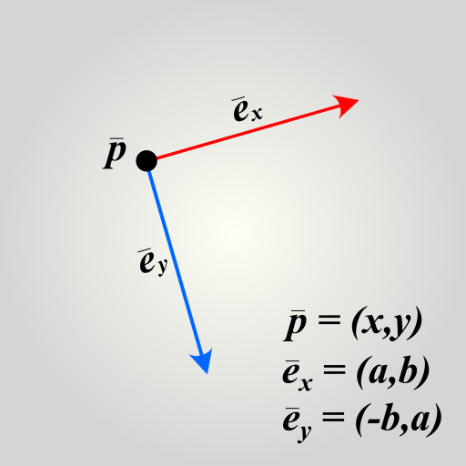
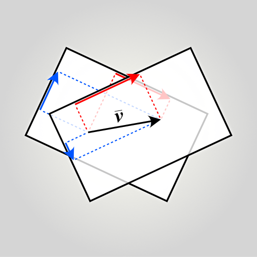
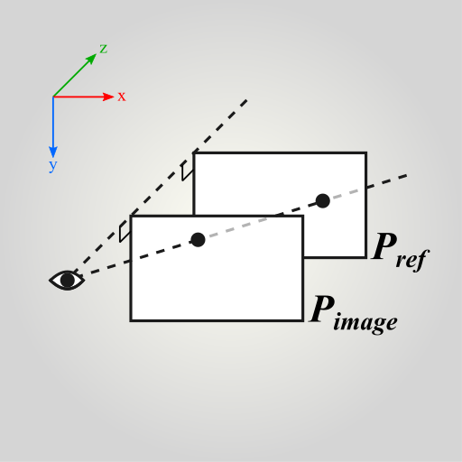

# affineplane

A functional 2D plane geometry and dynamics library for spatial 2D and 3D applications. Designed especially for scaleable and rotatable [affine geometry⎋](https://en.wikipedia.org/wiki/Affine_space) where parallel 2D planes float in 3D space and undergo [perspective projections⎋](https://en.wikipedia.org/wiki/3D_projection) and [basis changes](https://en.wikipedia.org/wiki/Change_of_basis⎋). Written in JavaScript (ECMAScript 6) with a functional, immutable, class-free style.

[Install](#install) - [Geometry](#geometry) - [Usage](#using-data-structures-and-functions) - [API Docs](https://axelpale.github.io/affineplane/docs/API.html) - [Contribute](#contribute) - [Github](https://github.com/axelpale/affineplane)

## Install

With [npm](https://www.npmjs.com/package/affineplane) or [yarn](https://yarnpkg.com/en/package/affineplane):

    $ npm install affineplane
    $ yarn add affineplane

## Geometry

Shapes with position in space:

- [dir2](https://axelpale.github.io/affineplane/docs/API.html#affineplanedir2), direction on a plane, `number` in radians
- [dist2](https://axelpale.github.io/affineplane/docs/API.html#affineplanedist2), distance between two locations on a plane, `number`
- [line2](https://axelpale.github.io/affineplane/docs/API.html#affineplaneline2), a line in 2D, `{origin,span}`
- [line3](https://axelpale.github.io/affineplane/docs/API.html#affineplaneline3), a line in 3D, `{origin,span}`
- [plane2](https://axelpale.github.io/affineplane/docs/API.html#affineplaneplane2), a plane in 2D, `{a,b,x,y}`
- [plane3](https://axelpale.github.io/affineplane/docs/API.html#affineplaneplane3), an xy-plane in 3D, `{a,b,x,y,z}`
- [point2](https://axelpale.github.io/affineplane/docs/API.html#affineplanepoint2), a location on a plane, `{x,y}`
- [point3](https://axelpale.github.io/affineplane/docs/API.html#affineplanepoint3), a location in a 3D space, `{x,y,z}`
- [size2](https://axelpale.github.io/affineplane/docs/API.html#affineplanesize2), a rectangle size on a plane, `{w,h}`

Movements of shapes:

- [helm2](https://axelpale.github.io/affineplane/docs/API.html#affineplanehelm2), a [helmert](https://en.wikipedia.org/wiki/Helmert_transformation) transformation in 2D, `{a,b,x,y}`
- [helm3](https://axelpale.github.io/affineplane/docs/API.html#affineplanehelm3), a [helmert](https://en.wikipedia.org/wiki/Helmert_transformation) in 2D with 3D translation, `{a,b,x,y,z}`
- [vec2](https://axelpale.github.io/affineplane/docs/API.html#affineplanevector2), a vector in 2D, `{x,y}`
- [vec3](https://axelpale.github.io/affineplane/docs/API.html#affineplanevector2), a vector in 3D, `{x,y,z}`

See [API docs](https://axelpale.github.io/affineplane/docs/API.html) for more.

## Using data structures and functions

Instead of classes, affineplane functions operate on plain objects. The available functions are pure, in a sense that they never modify the input, do not cause side effects, have no hidden state, and they always return new objects computed from the input. For example:

    const aff = require('affineplane')
    const point = aff.point2.create(2, 5)
    const po = aff.point2.offset(point, 3, 0)
    // po equals { x: 5, y: 5 }

The functions are grouped in *namespaces*, each focusing on a certain geometry. A common theme of the lib is to explicitly distinguish static shapes from their dynamic movements, like [point2](https://axelpale.github.io/affineplane/docs/API.html#affineplanepoint2) from [vec2](https://axelpale.github.io/affineplane/docs/API.html#affineplanevec2) because they behave differently. For example, while a point has a location in space, a vector does not. On the other hand, two vectors can be added together but the same cannot be done for two points. Thus it is best to keep the concepts separate. For details on the topic and its foundations, see [Difference between points and vectors](docs/FOOTNOTES.md#difference-between-points-and-vectors).

## Coordinate systems and directions

Affineplane uses right-handed, orthonormal coordinate system. Due to orthonormality the axes are perpendicular to each other. All rotations happen around z-axis and the rotation angle grows from the positive x-axis towards positive y-axis. Because affineplane is primarily intented for web applications, it is customary that, under zero rotation, the x-axis grows right, y-axis grows down, and z-axis grows away from the viewer, as illustrated below.

Each shape has a position which we can represent in a coordinate system. We call the used coordinate system the *reference basis* or the *frame of reference*, usually the *reference plane* in 2D case or the *reference space* in 3D case. The reference basis is not absolute, global, or fixed. Instead, it is just the basis to which the coordinates are currently related. To switch geometry to use another reference basis, we must perform a *change of basis*, also known as *transit*.

## Transitions and change of basis

In affineplane, we distinguish geometry, say a point, from its representation, like `{x,y}`. While the representation depends on the frame of reference, like a plane origin, the geometry itself does not. To illustrate this, the image below shows how the same point has different coordinates depending on which plane to choose for the reference.

We cannot represent geometry without a frame of reference. However, we can _transit_ it from one reference basis to another. In the case of affineplane, the reference is usually a 2D plane. A point `{x,y}` is a point on the plane at coordinates (x,y). To transit the point to another plane, we use [point2.transitTo](https://axelpale.github.io/affineplane/docs/API.html#affineplaneplane2transitto) function.

    // Create a point and a plane, both relative to a reference plane.
    const p = { x: 4, y: 2 }
    const plane = aff.plane2.fromFeatures({
      origin: { x: 1, y: 0 }
    })
    // Represent the point on the plane.
    const pp = aff.point2.transitTo(p, plane)
    // pp equals { x: 3, y: 2 }
    // Transit back to original reference plane
    const ppp = aff.point2.transitFrom(pp, plane)
    // ppp equals { x: 4, y: 2 }

In affineplane, we model a plane, such as [plane2](https://axelpale.github.io/affineplane/docs/API.html#affineplaneplane2) or [plane3](https://axelpale.github.io/affineplane/docs/API.html#affineplaneplane3), using a Helmert transformation. Such transformation can represent uniform scaling, rotation around z-axis, and translation along x-, y-, and z-axis. For a plane, these properties define how to transit geometry from the coordinate system of the plane to the coordinate system of the reference. In other words, they effectively define the position of the plane with respect to the reference space.

We call this transformation from a plane to its reference a *transition*. We treat transitions as [*passive transformations*⎋](https://en.wikipedia.org/wiki/Active_and_passive_transformation) in a sense that they do not change the geometry, only the frame of reference. On the contrary, *active transformations* act on the geometry but keep the reference as is. While [plane2](https://axelpale.github.io/affineplane/docs/API.html#affineplaneplane2) and [plane3](https://axelpale.github.io/affineplane/docs/API.html#affineplaneplane3) are passive, see [helm2](https://axelpale.github.io/affineplane/docs/API.html#affineplanehelm2) and [helm3](https://axelpale.github.io/affineplane/docs/API.html#affineplanehelm3) for active variants of the same transformation.

The [plane2](https://axelpale.github.io/affineplane/docs/API.html#affineplaneplane2) represent the transition as an object `{a,b,x,y}` and [plane3](https://axelpale.github.io/affineplane/docs/API.html#affineplaneplane3) as `{a,b,x,y,z}`. The `x,y,z` part of the object defines the position of the plane origin with respect to the reference origin. The `a,b` part defines the plane basis vector, where the vector length gives the scale and direction the angle in terms of the reference basis. See the illustration below for an example.

The following snippet transits a vector from a source plane to the reference plane by using [point2.transitFrom](https://axelpale.github.io/affineplane/docs/API.html#affineplaneplane2transitfrom). The source has scale of 2, angle of +90 degrees, and 100 units of translation along x-axis. Let us see how it affects the vector:

    const v = { x: 5, y: 2 }
    const plane = { a: 0, b: 2, x: 100, y: 0 }
    const vv = aff.vec2.transitFrom(v, plane)
    // vv equals { x: -4, y: 10 }

Due to the scale, one unit of length on the plane is equal to two units on the reference plane. Therefore the coordinate numbers double. Due to the plane angle, the coordinate directions rotate. The translation of 100 units did not affect the coordinates, however, because unlike points, vectors have only length and direction, thus nothing to translate.

Also note that while the coordinates changed, the vector in question did not. It is still the same vector, only represented in a different frame of reference. In the illustration below you can see that regardless of where you place the vector **v**, its components stay the same.

Transitions never lose information and therefore can be done in both directions. Next we discuss projections that do not have this property.

## Projections

A projection maps geometry from a source plane to an image plane. Unlike transitions, projections may lose information and therefore can be performed only in one direction. For example when you project a 3D point onto a 2D surface, information is lost and you cannot project the point back because you do not know the distance.

Affineplane provides orthogonal and perspective projections between parallel planes. Perspective projections require you to specify a camera location. Orthogonal projections do not require camera but can be thought as perspective projections with camera at infinity. The following snippet gives examples of both orthogonal and perspective projections. See also the illustration below for visual aid.

    const p = { x: 4, y: 2, z: 4 }
    const image = { a: 1, b: 0, x: 0, y: 0, z: 2 }
    const portho = aff.point2.projectTo(p, image)
    // portho equals { x: 4, y: 2 }
    const camera = { x: 0, y: 0, z: 0 }
    const ppersp = aff.point2.projectTo(p, image, camera)
    // ppersp equals { x: 2, y: 1 }

In the snippet above, the image plane onto project to is otherwise equivalent to the reference plane but two units off along z-axis. The depth offset does not affect the orthogonal projection which results the same point but without z-axis property. In contrast, the perspective projection and camera at z=0 map the point closer to the camera as illustrated below.

Note that the projections features of affineplane are highly limited. The camera always points towards positive z-axis and its line of sight is orthogonal to the planes. In other words the positive z-axis points away from the viewer.

Vectors and other movements can only be projected orthogonally. This is because perspective projection would require them to have known positions relative to the camera, which they do not have.

## Type safety

Affineplane is very loose on types and requires you to ensure you feed the functions what they minimally expect. This has two benefits: the functions are fast and you can input objects that have extra properties. For example `{ color: 'ff00ff', x: 2, y: 3 }` is a valid affineplane [point2](https://axelpale.github.io/affineplane/docs/API.html#affineplanepoint2). Note that while all affineplane operations return new objects, the extra properties are not carried to them.

To check validity of an object, each geometry type has `validate` function, for example [point2.validate](https://axelpale.github.io/affineplane/docs/API.html#affineplanepoint2validate). We could have included validity checking into each function but that would have caused excess of checking for this kind of low-level math functions. Instead, use `validate` when you need it.

To avoid unefficient type checking, optional parameters and default values are used sparsingly. Keep this in mind especially when making contributions.

## Contribute

Pull requests and [bug reports](https://github.com/axelpale/affineplane/issues) are highly appreciated. Please test your contribution with the following scripts:

Run test suite:

    $ npm run test

Run only linter:

    $ npm run lint

## License

[MIT](LICENSE)
