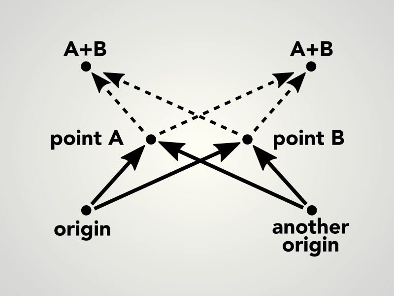

# affineplane

A functional 2D plane geometry and dynamics library for spatial 2D applications. Written in JavaScript (ECMAScript 6) with a functional, immutable, class-free style.

## Shapes

- `distance`
- `point`
- `rectangle`

## Movements

- `vector`
- `transform`

## Data structures and functions

Instead of classes, affineplane provides functions that operate on plain objects. The available functions are pure, in a sense that they never modify the input, do not cause side effects, have no hidden state, and they always return new objects computed from the input.

The functions are grouped in namespaces, each focusing on a certain geometry. A common theme of the lib is to explicitly distinguish static positions from their dynamic movements. Otherwise, in our experience, it is all too easy to mix these concepts in the code. Available namespaces are:
- `point`, a location on a plane
- `vector`, a displacement on a plane
- `point3r`, a location in a 3D space with orientation around z-axis
- `vector3r`, a change in a 3D space with change of orientation
- `formation`, a location on a plane with scale and orientation
- `transformation`, a change of formation on a plane

The functions operate on the following plain objects:
- `{ x, y }` for points and vectors
- `{ x, y, z, r }` for 3D points and vectors with rotation
- `{ a, b, x, y }` for similarity transformations

## Points and vectors on the affine plane

Affine planes have no fixed origin. This has interesting consequences that separates the often analogous concepts of the point and the vector.

Let A and B be points on an affine plane. As illustrated below, the result of their addition A + B is arbitrary and fully depends on the choice of the reference point, *origin*. The situation might sound exotic but it is rather commonplace. For example, choose any two items nearby and try add the locations together. The result does not make sense, does it? Our physical world is essentially a space without a fixed origin.

In contrast, the *distance* between points A and B remains constant regardless the choice of origin. Also their difference A - B and mean C have this origin-invariant property. Although you probably could not add the locations of the two items, there still is a distance between them and you can find a location at the middle.

There is another way to understand why points on an affine plane behave such a way. Think of a plane in 3D space so that the plane is lifted away from the space origin, as illustrated below. Now, the points A,B on the plane can be described as 3D vectors from the space origin O to the points, denoted as OA and OB. As you can see, addition of two such vectors OA + OB yields a result that does not stay on the plane. Their difference OA - OB is a vector parallel to the plane and the distance between the points is the length of that vector. Does the mean of the two vectors stay on the plane?

(3d drawing here)

## Geometries

For `{ x, y }`:

- point2d (alias .point2 .point)
- vector2d (alias .vector2d .vector .vec)

For `{ x, y, z, r }`:

- point3dr (alias .point3r)
- vector3dr (alias .vec3r)

For `{ a, b, x, y }`:

- formation (alias .form .placement)
- transformation (alias .transform, .tran, .motion)
- transition
  - functions to change of basis
  HEY wait a minute. The change of basis is just a couple of methods.
  It should be just a part of transformation api.

Basis change for `{ a, b, x, y }`:

- transition

Conversion between `{ x, y, z, r }` and `{ a, b, x, y }`:

- projection

## Possible geometries

- Vector
  - An abstract `{ x, y }`
  - provides operators for Point and Translation
- Point
  - A 2D point on an affine plane
  - The affine plane has no origin. The operation of adding a point to another point does not mean anything because the result depends on the origin and the plane does not have an origin.
  - `{ x, y }`
- Translation
  - A 2D difference on an affine plane
  - Meaning a kind of translation, change, or move on the plane
  - It has origin at `{ x: 0, y: 0 }` and therefore it also has length and angle, and can be added and multiplied.
  - `{ x, y }`
- Path
  - An open sequence of points
  - `[{ x, y }, { x, y }, ...]`
- Polygon
  - A closed sequence of points
  - `[{ x, y }, { x, y }, ...]`
- Box
  - A 2D rectangle
  - `{ xmin, ymin, xmax, ymax }`
- Transform
  - An abstract `{ a, b, x, y }`
- Linear
  - A linear transformation matrix
  - More strictly: a linear non-reflective similarity transformation matrix
  - It captures scaling and rotation around origin.
  - `{ a, b }`
- Position or Placement or Plane
  - An affine transformation matrix
  - Represents a position and orientation of an object on a plane
  - A point with scale and rotation
  - `{ a, b, x, y }`
- Transit
  - An affine transformation matrix
  - Represents a change of basis
  - Use to convert geometries between coordinate systems
  - `{ a, b, x, y }`
- Affine or Transform
  - An affine transformation matrix
  - Represents a translation, rotation, and/or scaling on a plane
  - `{ a, b, x, y }`
- Scaling
  - `{ ds }`
- Rotation
  - `{ dr }`
- Point3
  - `{ x, y, z }`
- Vector3
  - `{ dx, dy, dz }`
  - `{ x, y, z, r }`
- Perspective or Projection or Vector4
  - `{ x, y, z, r }`
  - `{ a, b, x, y }`
- Origin2
  - `{ ox, oy }`

What if we redefine "point"?

- Point
  - An affine transformation matrix
  - Represents a position of an object on a plane
  - A point with scale and rotation angle
  - `{ a, b, x, y }`
  - `{ x, y, z, r }`
- Vector
  - An affine transformation matrix
  - Represents change of a position on a plane
  - A vector with scaling and rotation
  - `{ da, db, dx, dy }`
  - `{ dx, dy, dz, dr }`

What if

- Formation
- Transformation

Z defined as zoom layers

z <- z - 1 <=> scale <- scale * 2
z <- z + 1 <=> scale <- scale * (1 / 2)
z <- z + 2 <=> scale <- scale * (1 / 4)
z <- z + 3 <=> scale <- scale * (1 / 8)

=> scale = 1 / (z ** 2)

z = -1 <=> scale = 0.5
z = 0 <=> scale = 1
z = 1 <=> scale = 2
z = 2 <=> scale = 4

Z defined as viewing distance

z <- z * 0 <=> scale <- scale / 0
z <- z * 1 <=> scale <- scale / 1
z <- z * 2 <=> scale <- scale / 2
z <- z * 4 <=> scale <- scale / 4

=> scale = 1 / z

## Geometries and API

Point
- create
- copy
- distance
- difference
- equal
- translate
- transform
- mean

Vector
- add
- multiply
- transform

Path
- addPoint
- atIndex
- transform
- mean

Polygon
- addPoint
- atIndex
- transform
- mean

Rectangle or Box
- atTopLeft

Placement
- copy
- create
- between or difference
- equal
- mean (of multiple placements)
- rotate
- translate
- transform

Motion
- copy
- create
- combine, multiply

Transition
- between two placements or planes
