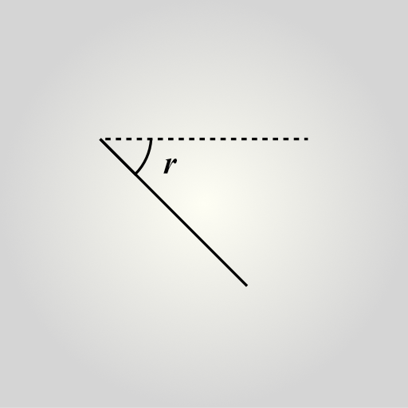
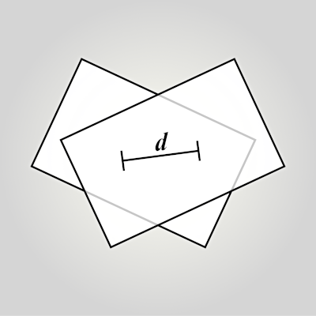
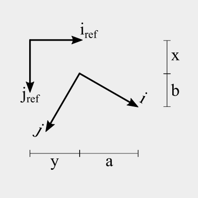
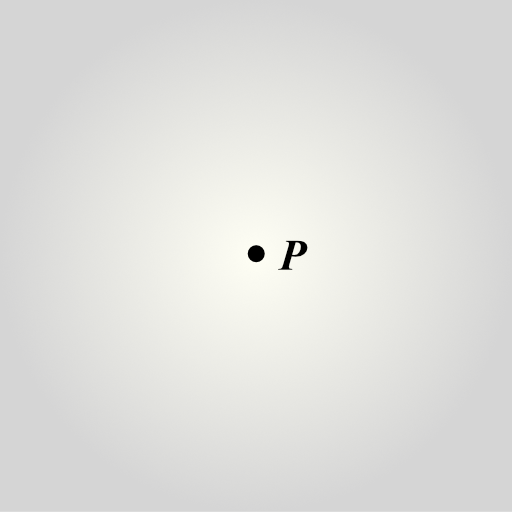
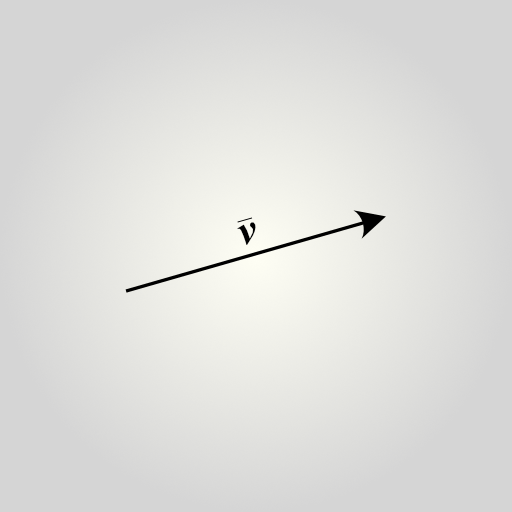

<a name="top"></a>
# Affineplane API Documentation v2.17.1

Welcome to affineplane API reference documentation. These docs are generated with [yamdog](https://axelpale.github.io/yamdog/).

See also [Usage](https://axelpale.github.io/affineplane/) and [GitHub](https://github.com/axelpale/affineplane) for introduction and source code.


<a name="affineplane"></a>
## [affineplane](#affineplane)

The [affineplane](#affineplane) module provides functions for affine 2D and 3D geometry.
The functions are grouped in the following submodules.


<p style="margin-bottom: 0"><strong>Contents:</strong></p>


- [affineplane.angle](#affineplaneangle)
- [affineplane.box2](#affineplanebox2)
- [affineplane.box3](#affineplanebox3)
- [affineplane.circle2](#affineplanecircle2)
- [affineplane.circle3](#affineplanecircle3)
- [affineplane.dir2](#affineplanedir2)
- [affineplane.dir3](#affineplanedir3)
- [affineplane.dist2](#affineplanedist2)
- [affineplane.dist3](#affineplanedist3)
- [affineplane.epsilon](#affineplaneepsilon)
- [affineplane.helm2](#affineplanehelm2)
- [affineplane.helm3](#affineplanehelm3)
- [affineplane.line2](#affineplaneline2)
- [affineplane.line3](#affineplaneline3)
- [affineplane.orient2](#affineplaneorient2)
- [affineplane.path2](#affineplanepath2)
- [affineplane.path3](#affineplanepath3)
- [affineplane.plane2](#affineplaneplane2)
- [affineplane.plane3](#affineplaneplane3)
- [affineplane.point2](#affineplanepoint2)
- [affineplane.point3](#affineplanepoint3)
- [affineplane.poly2](#affineplanepoly2)
- [affineplane.quat4](#affineplanequat4)
- [affineplane.ray3](#affineplaneray3)
- [affineplane.rect2](#affineplanerect2)
- [affineplane.rect3](#affineplanerect3)
- [affineplane.rot2](#affineplanerot2)
- [affineplane.scalar1](#affineplanescalar1)
- [affineplane.scalar2](#affineplanescalar2)
- [affineplane.scalar3](#affineplanescalar3)
- [affineplane.segment2](#affineplanesegment2)
- [affineplane.segment3](#affineplanesegment3)
- [affineplane.size2](#affineplanesize2)
- [affineplane.size3](#affineplanesize3)
- [affineplane.sphere2](#affineplanesphere2)
- [affineplane.sphere3](#affineplanesphere3)
- [affineplane.vec2](#affineplanevec2)
- [affineplane.vec3](#affineplanevec3)
- [affineplane.vec4](#affineplanevec4)
- [affineplane.version](#affineplaneversion)


Source: [lib/index.js](https://github.com/axelpale/affineplane/blob/main/lib/index.js)

<a name="affineplaneangle"></a>
## [affineplane](#affineplane).[angle](#affineplaneangle)

Common utilites to handle angles.




<p style="margin-bottom: 0"><strong>Contents:</strong></p>


- [affineplane.angle.degToRad](#affineplaneangledegtorad)
- [affineplane.angle.modulo](#affineplaneanglemodulo)
- [affineplane.angle.radToDeg](#affineplaneangleradtodeg)


Source: [angle/index.js](https://github.com/axelpale/affineplane/blob/main/lib/angle/index.js)

<a name="affineplaneangledegtorad"></a>
## [affineplane](#affineplane).[angle](#affineplaneangle).[degToRad](#affineplaneangledegtorad)(deg)

Convert angle from degrees to radians, for example 720 becomes 4π.

<p style="margin-bottom: 0"><strong>Parameters:</strong></p>

- *deg*
  - a number, an angle in degrees.


<p style="margin-bottom: 0"><strong>Returns:</strong></p>

- a number, the angle in radians.


Source: [degToRad.js](https://github.com/axelpale/affineplane/blob/main/lib/angle/degToRad.js)

<a name="affineplaneanglemodulo"></a>
## [affineplane](#affineplane).[angle](#affineplaneangle).[modulo](#affineplaneanglemodulo)(r)

Limit an angle between ]-PI, +PI] but preserve the direction.
This can be used to preprocess user input, for example to normalize
4*PI as 0.

<p style="margin-bottom: 0"><strong>Parameters:</strong></p>

- *r*
  - angle in radians, allowed to be outside ]-PI, +PI].


<p style="margin-bottom: 0"><strong>Returns:</strong></p>

- a number, the angle in radians and between ]-PI, +PI]


Source: [modulo.js](https://github.com/axelpale/affineplane/blob/main/lib/angle/modulo.js)

<a name="affineplaneangleradtodeg"></a>
## [affineplane](#affineplane).[angle](#affineplaneangle).[radToDeg](#affineplaneangleradtodeg)(rad)

Convert angle from radians to degrees. For example 4π becomes 720.

<p style="margin-bottom: 0"><strong>Parameters:</strong></p>

- *rad*
  - a number, an angle in radians.


<p style="margin-bottom: 0"><strong>Returns:</strong></p>

- a number, the angle in degrees.


Source: [radToDeg.js](https://github.com/axelpale/affineplane/blob/main/lib/angle/radToDeg.js)

<a name="affineplanebox2"></a>
## [affineplane](#affineplane).[box2](#affineplanebox2)

Two-dimensional rectangle. Unlike [size2](#affineplanesize2), [box2](#affineplanebox2) has location and orientation
and thus can be represented in any basis without loss of information.

<p style="margin-bottom: 0">Represented with an object <code>{ a, b, x, y, w, h }</code> where</p>

- `a,b` provide orientation with respect to the reference basis. The norm of vector (a,b) is always 1.
- `x,y` provide origin position in the reference basis.
- `w,h` provide box size on the reference basis.


<p style="margin-bottom: 0"><strong>Contents:</strong></p>


- [affineplane.box2.UNIT](#affineplanebox2unit)
- [affineplane.box2.ZERO](#affineplanebox2zero)
- [affineplane.box2.almostEqual](#affineplanebox2almostequal)
- [affineplane.box2.at](#affineplanebox2at)
- [affineplane.box2.atBox](#affineplanebox2atbox)
- [affineplane.box2.atNorm](#affineplanebox2atnorm)
- [affineplane.box2.collide](#affineplanebox2collide)
- [affineplane.box2.create](#affineplanebox2create)
- [affineplane.box2.fromPoints](#affineplanebox2frompoints)
- [affineplane.box2.getAngle](#affineplanebox2getangle)
- [affineplane.box2.getArea](#affineplanebox2getarea)
- [affineplane.box2.getBasis](#affineplanebox2getbasis)
- [affineplane.box2.getBasisInverse](#affineplanebox2getbasisinverse)
- [affineplane.box2.getBounds](#affineplanebox2getbounds)
- [affineplane.box2.getCircle](#affineplanebox2getcircle)
- [affineplane.box2.getInnerSquare](#affineplanebox2getinnersquare)
- [affineplane.box2.getMinimumBounds](#affineplanebox2getminimumbounds)
- [affineplane.box2.getPath](#affineplanebox2getpath)
- [affineplane.box2.getPoints](#affineplanebox2getpoints)
- [affineplane.box2.getPolygon](#affineplanebox2getpolygon)
- [affineplane.box2.getSegments](#affineplanebox2getsegments)
- [affineplane.box2.getSize](#affineplanebox2getsize)
- [affineplane.box2.getSphere](#affineplanebox2getsphere)
- [affineplane.box2.hasPoint](#affineplanebox2haspoint)
- [affineplane.box2.homothety](#affineplanebox2homothety)
- [affineplane.box2.offset](#affineplanebox2offset)
- [affineplane.box2.projectTo](#affineplanebox2projectto)
- [affineplane.box2.projectToPlane](#affineplanebox2projecttoplane)
- [affineplane.box2.resizeBy](#affineplanebox2resizeby)
- [affineplane.box2.resizeTo](#affineplanebox2resizeto)
- [affineplane.box2.rotateBy](#affineplanebox2rotateby)
- [affineplane.box2.scaleBy](#affineplanebox2scaleby)
- [affineplane.box2.transitFrom](#affineplanebox2transitfrom)
- [affineplane.box2.transitTo](#affineplanebox2transitto)
- [affineplane.box2.translate](#affineplanebox2translate)
- [affineplane.box2.validate](#affineplanebox2validate)


Source: [box2/index.js](https://github.com/axelpale/affineplane/blob/main/lib/box2/index.js)

<a name="affineplanebox2unit"></a>
## [affineplane](#affineplane).[box2](#affineplanebox2).[UNIT](#affineplanebox2unit)

An origin-centered box with unit width and height.

Source: [box2/index.js](https://github.com/axelpale/affineplane/blob/main/lib/box2/index.js)

<a name="affineplanebox2zero"></a>
## [affineplane](#affineplane).[box2](#affineplanebox2).[ZERO](#affineplanebox2zero)

A zero-size box.

Source: [box2/index.js](https://github.com/axelpale/affineplane/blob/main/lib/box2/index.js)

<a name="affineplanebox3unit"></a>
## [affineplane](#affineplane).[box3](#affineplanebox3).[UNIT](#affineplanebox3unit)

An origin-centered box with unit width, height, and depth.

Source: [box3/index.js](https://github.com/axelpale/affineplane/blob/main/lib/box3/index.js)

<a name="affineplanebox3zero"></a>
## [affineplane](#affineplane).[box3](#affineplanebox3).[ZERO](#affineplanebox3zero)

A zero-size box.

Source: [box3/index.js](https://github.com/axelpale/affineplane/blob/main/lib/box3/index.js)

<a name="affineplanebox2almostequal"></a>
## [affineplane](#affineplane).[box2](#affineplanebox2).[almostEqual](#affineplanebox2almostequal)(b, bb[, tolerance])

Are two boxes almost equal?

<p style="margin-bottom: 0"><strong>Parameters:</strong></p>

- *b*
  - a [box2](#affineplanebox2)
- *bb*
  - a [box2](#affineplanebox2)
- *tolerance*
  - optional number, default is [affineplane.epsilon](#affineplaneepsilon). Set to 0 for strict comparison.


<p style="margin-bottom: 0"><strong>Returns:</strong></p>

- a boolean


Source: [almostEqual.js](https://github.com/axelpale/affineplane/blob/main/lib/box2/almostEqual.js)

<a name="affineplanebox2at"></a>
## [affineplane](#affineplane).[box2](#affineplanebox2).[at](#affineplanebox2at)(box, rx, ry)

Take a point on the box, represented in the reference basis.

<p style="margin-bottom: 0"><strong>Parameters:</strong></p>

- *box*
  - a [box2](#affineplanebox2)
- *rx*
  - horizontal distance from the top-left corner of the box represented on the box's inner basis. The unit of distance is same in the reference basis.
- *ry*
  - vertical distance from the top-left corner of the box represented on the box's inner basis. The unit of distance is same in the reference basis.


<p style="margin-bottom: 0"><strong>Returns:</strong></p>

- a [point2](#affineplanepoint2) in the reference basis.


Source: [at.js](https://github.com/axelpale/affineplane/blob/main/lib/box2/at.js)

<a name="affineplanebox2atbox"></a>
## [affineplane](#affineplane).[box2](#affineplanebox2).[atBox](#affineplanebox2atbox)(box, x, y)

Take a point in the reference basis and represent it in the box basis.
This is like [affineplane.box2.at](#affineplanebox2at) but to the other direction.

<p style="margin-bottom: 0"><strong>Parameters:</strong></p>

- *box*
  - a [box2](#affineplanebox2)
- *x*
  - horizontal coordinate in the reference basis.
- *y*
  - vertical coordinate in the reference basis.


<p style="margin-bottom: 0"><strong>Returns:</strong></p>

- a [point2](#affineplanepoint2) in the box basis.


Source: [atBox.js](https://github.com/axelpale/affineplane/blob/main/lib/box2/atBox.js)

<a name="affineplanebox2atnorm"></a>
## [affineplane](#affineplane).[box2](#affineplanebox2).[atNorm](#affineplanebox2atnorm)(box, nw, nh)

Take a point on the box at the normalized coordinates.

<p style="margin-bottom: 0"><strong>Parameters:</strong></p>

- *box*
  - a [box2](#affineplanebox2)
- *nw*
  - a number, a normalized coordinate along width 0..1
- *nh*
  - a number, a normalized coordinate along height 0..1


<p style="margin-bottom: 0"><strong>Returns:</strong></p>

- a [point2](#affineplanepoint2) in the reference basis.


Source: [atNorm.js](https://github.com/axelpale/affineplane/blob/main/lib/box2/atNorm.js)

<a name="affineplanebox2collide"></a>
## [affineplane](#affineplane).[box2](#affineplanebox2).[collide](#affineplanebox2collide)(b, bb)

Do two boxes collide?

<p style="margin-bottom: 0"><strong>Parameters:</strong></p>

- *b*
  - a [box2](#affineplanebox2), in the reference basis
- *bb*
  - a [box2](#affineplanebox2), in the reference basis


<p style="margin-bottom: 0"><strong>Returns:</strong></p>

- a boolean, true if boxes collide.


Source: [collide.js](https://github.com/axelpale/affineplane/blob/main/lib/box2/collide.js)

<a name="affineplanebox2create"></a>
## [affineplane](#affineplane).[box2](#affineplanebox2).[create](#affineplanebox2create)(plane, size)

Create a [box2](#affineplanebox2) object.

<p style="margin-bottom: 0"><strong>Parameters:</strong></p>

- *plane*
  - a [plane2](#affineplaneplane2) on the reference basis. Defines the box origin and orientation. Scale is defaulted to 1.
- *size*
  - a [size2](#affineplanesize2) on the reference basis. Defines the box size.


<p style="margin-bottom: 0"><strong>Returns:</strong></p>

- a [box2](#affineplanebox2)


Source: [create.js](https://github.com/axelpale/affineplane/blob/main/lib/box2/create.js)

<a name="affineplanebox2frompoints"></a>
## [affineplane](#affineplane).[box2](#affineplanebox2).[fromPoints](#affineplanebox2frompoints)(points)

Get a rectangular boundary of the given points. In other words,
compute such a box that has no rotation and no dilation with respect to
the reference basis but has translation and size so that it covers
the given points.

<p style="margin-bottom: 0"><strong>Parameters:</strong></p>

- *points*
  - array of [point2](#affineplanepoint2), each in the reference basis.


<p style="margin-bottom: 0"><strong>Returns:</strong></p>

- a [box2](#affineplanebox2), in the reference basis.


Source: [fromPoints.js](https://github.com/axelpale/affineplane/blob/main/lib/box2/fromPoints.js)

<a name="affineplanebox2getangle"></a>
## [affineplane](#affineplane).[box2](#affineplanebox2).[getAngle](#affineplanebox2getangle)(box)

Compute box angle in radians with respect to the reference basis.

<p style="margin-bottom: 0"><strong>Parameters:</strong></p>

- *box*
  - a [box2](#affineplanebox2), in the reference basis.


<p style="margin-bottom: 0"><strong>Returns:</strong></p>

- a number, the angle in radians.


Source: [getAngle.js](https://github.com/axelpale/affineplane/blob/main/lib/box2/getAngle.js)

<a name="affineplanebox2getarea"></a>
## [affineplane](#affineplane).[box2](#affineplanebox2).[getArea](#affineplanebox2getarea)(box)

Compute box area. This returns the area in the reference basis.

<p style="margin-bottom: 0"><strong>Parameters:</strong></p>

- *box*
  - a [box2](#affineplanebox2), in the reference basis.


<p style="margin-bottom: 0"><strong>Returns:</strong></p>

- a number, the area in the reference basis.


Source: [getArea.js](https://github.com/axelpale/affineplane/blob/main/lib/box2/getArea.js)

<a name="affineplanebox2getbasis"></a>
## [affineplane](#affineplane).[box2](#affineplanebox2).[getBasis](#affineplanebox2getbasis)(box)

Get the inner basis of the box. In other words, represent the box inner
basis as a plane in the reference basis.
The scale of the resulting basis is always 1.
See also [affineplane.box2.getBasisInverse](#affineplanebox2getbasisinverse).

<p style="margin-bottom: 0"><strong>Parameters:</strong></p>

- *box*
  - a [box2](#affineplanebox2) in the reference basis.


<p style="margin-bottom: 0"><strong>Returns:</strong></p>

- a [plane2](#affineplaneplane2) in the reference basis.


Source: [getBasis.js](https://github.com/axelpale/affineplane/blob/main/lib/box2/getBasis.js)

<a name="affineplanebox2getbasisinverse"></a>
## [affineplane](#affineplane).[box2](#affineplanebox2).[getBasisInverse](#affineplanebox2getbasisinverse)(box)

Get the outer basis of the box represented in the box basis.
The scale of the resulting basis is always 1.
See also [affineplane.box2.getBasis](#affineplanebox2getbasis).

<p style="margin-bottom: 0"><strong>Parameters:</strong></p>

- *box*
  - a [box2](#affineplanebox2) in the reference basis.


<p style="margin-bottom: 0"><strong>Returns:</strong></p>

- a [plane2](#affineplaneplane2) in the box basis. The outer basis.


Source: [getBasisInverse.js](https://github.com/axelpale/affineplane/blob/main/lib/box2/getBasisInverse.js)

<a name="affineplanebox2getbounds"></a>
## [affineplane](#affineplane).[box2](#affineplanebox2).[getBounds](#affineplanebox2getbounds)(boxes)

Get outer rectangular boundary of the given box or boxes. In other words,
compute such a box that has no rotation and no dilation with respect to
the reference basis but has translation and size so that it covers
the given box or boxes.

<p style="margin-bottom: 0"><strong>Parameters:</strong></p>

- *boxes*
  - a [box2](#affineplanebox2), in the reference basis.
  - array of [box2](#affineplanebox2), each in the reference basis.


<p style="margin-bottom: 0"><strong>Returns:</strong></p>

- a [box2](#affineplanebox2), in the reference basis.


Source: [getBounds.js](https://github.com/axelpale/affineplane/blob/main/lib/box2/getBounds.js)

<a name="affineplanebox2getcircle"></a>
## [affineplane](#affineplane).[box2](#affineplanebox2).[getCircle](#affineplanebox2getcircle)(box)

Get the circumscribed circle of the box. In other words, get the circle
that contains the box so that the box corners are on it.
The resulting circle is also the minimum bounding circle of the box.

<p style="margin-bottom: 0"><strong>Parameters:</strong></p>

- *box*
  - a [box2](#affineplanebox2), in the reference basis.


<p style="margin-bottom: 0"><strong>Returns:</strong></p>

- a [sphere2](#affineplanesphere2)


Aliases: [affineplane.box2.getSphere](#affineplanebox2getsphere)

Source: [getCircle.js](https://github.com/axelpale/affineplane/blob/main/lib/box2/getCircle.js)

<a name="affineplanebox2getinnersquare"></a>
## [affineplane](#affineplane).[box2](#affineplanebox2).[getInnerSquare](#affineplanebox2getinnersquare)(box)

Get the largest square that fits inside the box and has the same center.

<p style="margin-bottom: 0"><strong>Parameters:</strong></p>

- *box*
  - a [box2](#affineplanebox2), in the reference basis.


<p style="margin-bottom: 0"><strong>Returns:</strong></p>

- a [box2](#affineplanebox2), in the reference basis.


Source: [getInnerSquare.js](https://github.com/axelpale/affineplane/blob/main/lib/box2/getInnerSquare.js)

<a name="affineplanebox2getminimumbounds"></a>
## [affineplane](#affineplane).[box2](#affineplanebox2).[getMinimumBounds](#affineplanebox2getminimumbounds)(boxes)

Find approximate minimum bounding box aka minimum area rectangle (MAR).
Such MAR contains all the given set of boxes.
The orientation of the resulting bounding box is not necessarily parallel
with the reference basis.

<p style="margin-bottom: 0"><strong>Parameters:</strong></p>

- *boxes*
  - array of [box2](#affineplanebox2)


<p style="margin-bottom: 0"><strong>Returns:</strong></p>

- a [box2](#affineplanebox2)


Source: [getMinimumBounds.js](https://github.com/axelpale/affineplane/blob/main/lib/box2/getMinimumBounds.js)

<a name="affineplanebox2getpath"></a>
## [affineplane](#affineplane).[box2](#affineplanebox2).[getPath](#affineplanebox2getpath)(box)

Get the box corner points as a path. Points are in clock-wise order.

<p style="margin-bottom: 0"><strong>Parameters:</strong></p>

- *box*


<p style="margin-bottom: 0"><strong>Returns:</strong></p>

- a [path2](#affineplanepath2)


Aliases: [affineplane.box2.getPoints](#affineplanebox2getpoints), [affineplane.box2.getPolygon](#affineplanebox2getpolygon)

Source: [getPath.js](https://github.com/axelpale/affineplane/blob/main/lib/box2/getPath.js)

<a name="affineplanebox2getpoints"></a>
## [affineplane](#affineplane).[box2](#affineplanebox2).[getPoints](#affineplanebox2getpoints)

Alias of [affineplane.box2.getPath](#affineplanebox2getpath)

<a name="affineplanebox2getpolygon"></a>
## [affineplane](#affineplane).[box2](#affineplanebox2).[getPolygon](#affineplanebox2getpolygon)

Alias of [affineplane.box2.getPath](#affineplanebox2getpath)

<a name="affineplanebox2getsegments"></a>
## [affineplane](#affineplane).[box2](#affineplanebox2).[getSegments](#affineplanebox2getsegments)(box)

Get the four line segments of the box.

<p style="margin-bottom: 0"><strong>Parameters:</strong></p>

- *box*
  - a [box2](#affineplanebox2), in the reference basis.


<p style="margin-bottom: 0"><strong>Returns:</strong></p>

- array of [segment2](#affineplanesegment2), each segment in the reference basis.


Source: [getSegments.js](https://github.com/axelpale/affineplane/blob/main/lib/box2/getSegments.js)

<a name="affineplanebox2getsize"></a>
## [affineplane](#affineplane).[box2](#affineplanebox2).[getSize](#affineplanebox2getsize)(box)

Get the size of the box.

<p style="margin-bottom: 0"><strong>Parameters:</strong></p>

- *box*
  - a [box2](#affineplanebox2) in the reference basis.


<p style="margin-bottom: 0"><strong>Returns:</strong></p>

- a [size2](#affineplanesize2) in the reference basis.


Source: [getSize.js](https://github.com/axelpale/affineplane/blob/main/lib/box2/getSize.js)

<a name="affineplanebox2getsphere"></a>
## [affineplane](#affineplane).[box2](#affineplanebox2).[getSphere](#affineplanebox2getsphere)

Alias of [affineplane.box2.getCircle](#affineplanebox2getcircle)

<a name="affineplanebox2haspoint"></a>
## [affineplane](#affineplane).[box2](#affineplanebox2).[hasPoint](#affineplanebox2haspoint)(box, point)

Test if a point is inside the box. If the point is at the box edge,
it is counted as being inside.

<p style="margin-bottom: 0"><strong>Parameters:</strong></p>

- *box*
  - a [box2](#affineplanebox2), in the reference basis.
- *point*
  - a [point2](#affineplanepoint2), in the reference basis.


<p style="margin-bottom: 0"><strong>Returns:</strong></p>

- a boolean


Source: [hasPoint.js](https://github.com/axelpale/affineplane/blob/main/lib/box2/hasPoint.js)

<a name="affineplanebox2homothety"></a>
## [affineplane](#affineplane).[box2](#affineplanebox2).[homothety](#affineplanebox2homothety)(box, origin, ratio)

Perform homothety about the origin. In other words, scale the box
about the fixed pivot point.

<p style="margin-bottom: 0"><strong>Parameters:</strong></p>

- *box*
  - a [box2](#affineplanebox2), the box to be scaled.
- *origin*
  - a [point2](#affineplanepoint2), the fixed origin point.
- *ratio*
  - a number, the scaling ratio.


<p style="margin-bottom: 0"><strong>Returns:</strong></p>

- a [box2](#affineplanebox2)


Aliases: [affineplane.box2.scaleBy](#affineplanebox2scaleby)

Source: [homothety.js](https://github.com/axelpale/affineplane/blob/main/lib/box2/homothety.js)

<a name="affineplanebox2offset"></a>
## [affineplane](#affineplane).[box2](#affineplanebox2).[offset](#affineplanebox2offset)(box, dx, dy)

Move the box horizontally and vertically.

<p style="margin-bottom: 0"><strong>Parameters:</strong></p>

- *box*
  - a [box2](#affineplanebox2)
- *dx*
  - a number
- *dy*
  - a number


<p style="margin-bottom: 0"><strong>Returns:</strong></p>

- a [box2](#affineplanebox2)


Source: [offset.js](https://github.com/axelpale/affineplane/blob/main/lib/box2/offset.js)

<a name="affineplanebox2projectto"></a>
## [affineplane](#affineplane).[box2](#affineplanebox2).[projectTo](#affineplanebox2projectto)

Alias of [affineplane.box2.projectToPlane](#affineplanebox2projecttoplane)

<a name="affineplanebox2projecttoplane"></a>
## [affineplane](#affineplane).[box2](#affineplanebox2).[projectToPlane](#affineplanebox2projecttoplane)(box, target[, camera])

Project a box onto a target plane in 3d.
If a camera is given, project perspectively.
Otherwise, project orthogonally.

<p style="margin-bottom: 0"><strong>Parameters:</strong></p>

- *box*
  - a [box2](#affineplanebox2) in the reference basis, assume z=0.
- *target*
  - a [plane3](#affineplaneplane3) in the reference basis.
- *camera*
  - optional [point3](#affineplanepoint3) in the reference basis.


<p style="margin-bottom: 0"><strong>Returns:</strong></p>

- a [box2](#affineplanebox2) on the target plane.


Aliases: [affineplane.box2.projectTo](#affineplanebox2projectto)

Source: [projectToPlane.js](https://github.com/axelpale/affineplane/blob/main/lib/box2/projectToPlane.js)

<a name="affineplanebox2resizeby"></a>
## [affineplane](#affineplane).[box2](#affineplanebox2).[resizeBy](#affineplanebox2resizeby)(box, origin, dw, dh)

Resize the box with respect to a fixed origin by the specified amounts.
For example, this allows resizing the box by its center point.
The operation does not change the box orientation.

<p style="margin-bottom: 0"><strong>Parameters:</strong></p>

- *box*
  - a [box2](#affineplanebox2), in the reference basis
- *origin*
  - a [point2](#affineplanepoint2), in the reference basis. The origin is allowed to be outside the box but will be capped to the nearest point within the box.
- *dw*
  - a number, the width increase. Can be negative.
- *dh*
  - a number, the height increase. Can be negative.


<p style="margin-bottom: 0"><strong>Returns:</strong></p>

- a [box2](#affineplanebox2)


Source: [resizeBy.js](https://github.com/axelpale/affineplane/blob/main/lib/box2/resizeBy.js)

<a name="affineplanebox2resizeto"></a>
## [affineplane](#affineplane).[box2](#affineplanebox2).[resizeTo](#affineplanebox2resizeto)(box, origin, width, height)

Resize the box to the given width and height.
The origin point stays fixed relative to the box size.
For example, this allows resizing the box by its center point.
The operation does not change the box orientation.

<p style="margin-bottom: 0"><strong>Parameters:</strong></p>

- *box*
  - a [box2](#affineplanebox2), in the reference basis
- *origin*
  - a [point2](#affineplanepoint2), in the reference basis. The origin is allowed to be outside the box but will be capped to the nearest point within the box.
- *width*
  - a positive number, the new width.
- *height*
  - a positive number, the new height.


<p style="margin-bottom: 0"><strong>Returns:</strong></p>

- a [box2](#affineplanebox2)


Source: [resizeTo.js](https://github.com/axelpale/affineplane/blob/main/lib/box2/resizeTo.js)

<a name="affineplanebox2rotateby"></a>
## [affineplane](#affineplane).[box2](#affineplanebox2).[rotateBy](#affineplanebox2rotateby)(box, origin, radians)

Rotate the box around an origin point by an angle in radians.
Rotation direction is from positive x axis towards positive y axis.

<p style="margin-bottom: 0"><strong>Parameters:</strong></p>

- *box*
  - a [box2](#affineplanebox2), in the reference basis
- *origin*
  - a [point2](#affineplanepoint2) in the reference basis.
- *radians*
  - a number, rotation angle in radians.


<p style="margin-bottom: 0"><strong>Returns:</strong></p>

- a [box2](#affineplanebox2)


Source: [rotateBy.js](https://github.com/axelpale/affineplane/blob/main/lib/box2/rotateBy.js)

<a name="affineplanebox2scaleby"></a>
## [affineplane](#affineplane).[box2](#affineplanebox2).[scaleBy](#affineplanebox2scaleby)(box, origin, ratio)

Alias of [affineplane.box2.homothety](#affineplanebox2homothety)

<a name="affineplanebox2transitfrom"></a>
## [affineplane](#affineplane).[box2](#affineplanebox2).[transitFrom](#affineplanebox2transitfrom)(box, source)

Convert a box from source basis to the reference basis.

<p style="margin-bottom: 0"><strong>Parameters:</strong></p>

- *box*
  - a [box2](#affineplanebox2), a box in the source basis.
- *source*
  - a [plane2](#affineplaneplane2), the source basis represented in the reference basis.


<p style="margin-bottom: 0"><strong>Returns:</strong></p>

- a [box2](#affineplanebox2), represented in the reference basis.


Source: [transitFrom.js](https://github.com/axelpale/affineplane/blob/main/lib/box2/transitFrom.js)

<a name="affineplanebox2transitto"></a>
## [affineplane](#affineplane).[box2](#affineplanebox2).[transitTo](#affineplanebox2transitto)(box, target)

Convert a box from the reference basis to the target basis.

<p style="margin-bottom: 0"><strong>Parameters:</strong></p>

- *box*
  - a [box2](#affineplanebox2), a rectangle in the reference basis.
- *target*
  - a [plane2](#affineplaneplane2), the target basis represented in the reference basis.


<p style="margin-bottom: 0"><strong>Returns:</strong></p>

- a [box2](#affineplanebox2), represented in the target basis.


Source: [transitTo.js](https://github.com/axelpale/affineplane/blob/main/lib/box2/transitTo.js)

<a name="affineplanebox2translate"></a>
## [affineplane](#affineplane).[box2](#affineplanebox2).[translate](#affineplanebox2translate)(box, vec)

Move the box horizontally and vertically by a vector.
See [affineplane.box2.offset](#affineplanebox2offset) to move by scalars.

<p style="margin-bottom: 0"><strong>Parameters:</strong></p>

- *box*
  - a [box2](#affineplanebox2)
- *vec*
  - a [vec2](#affineplanevec2)


<p style="margin-bottom: 0"><strong>Returns:</strong></p>

- a [box2](#affineplanebox2)


Source: [translate.js](https://github.com/axelpale/affineplane/blob/main/lib/box2/translate.js)

<a name="affineplanebox2validate"></a>
## [affineplane](#affineplane).[box2](#affineplanebox2).[validate](#affineplanebox2validate)(b)

Check if the object is a valid [box2](#affineplanebox2).
Valid [box2](#affineplanebox2) has properties a and b that represent valid rotation matrix,
properties x and y that are valid numbers, and properties w and h that
represent size.

<p style="margin-bottom: 0"><strong>Parameters:</strong></p>

- *b*
  - an object


<p style="margin-bottom: 0"><strong>Returns:</strong></p>

- a boolean, true if valid [box2](#affineplanebox2)


Source: [validate.js](https://github.com/axelpale/affineplane/blob/main/lib/box2/validate.js)

<a name="affineplanebox3"></a>
## [affineplane](#affineplane).[box3](#affineplanebox3)

Three-dimensional cuboid that has the front face parallel with xy-plane.
Unlike [size3](#affineplanesize3), [box3](#affineplanebox3) has location and orientation and
thus can be represented in any basis without loss of information.

<p style="margin-bottom: 0">Represented with an object <code>{ a, b, x, y, z, w, h, d }</code> where</p>

- `a,b` provide orientation on xy-plane with respect to the reference basis.
- `x,y,z` provide origin position in the reference basis.
- `w,h,d` provide box size on the reference basis.


<p style="margin-bottom: 0"><strong>Contents:</strong></p>


- [affineplane.box3.UNIT](#affineplanebox3unit)
- [affineplane.box3.ZERO](#affineplanebox3zero)
- [affineplane.box3.almostEqual](#affineplanebox3almostequal)
- [affineplane.box3.at](#affineplanebox3at)
- [affineplane.box3.atBox](#affineplanebox3atbox)
- [affineplane.box3.atNorm](#affineplanebox3atnorm)
- [affineplane.box3.collide](#affineplanebox3collide)
- [affineplane.box3.create](#affineplanebox3create)
- [affineplane.box3.fromPoints](#affineplanebox3frompoints)
- [affineplane.box3.getAngle](#affineplanebox3getangle)
- [affineplane.box3.getBasis](#affineplanebox3getbasis)
- [affineplane.box3.getBasisInverse](#affineplanebox3getbasisinverse)
- [affineplane.box3.getBounds](#affineplanebox3getbounds)
- [affineplane.box3.getMinimumBounds](#affineplanebox3getminimumbounds)
- [affineplane.box3.getSize](#affineplanebox3getsize)
- [affineplane.box3.getSphere](#affineplanebox3getsphere)
- [affineplane.box3.getVolume](#affineplanebox3getvolume)
- [affineplane.box3.hasPoint](#affineplanebox3haspoint)
- [affineplane.box3.homothety](#affineplanebox3homothety)
- [affineplane.box3.projectTo](#affineplanebox3projectto)
- [affineplane.box3.projectToPlane](#affineplanebox3projecttoplane)
- [affineplane.box3.resizeBy](#affineplanebox3resizeby)
- [affineplane.box3.resizeTo](#affineplanebox3resizeto)
- [affineplane.box3.rotateBy](#affineplanebox3rotateby)
- [affineplane.box3.scaleBy](#affineplanebox3scaleby)
- [affineplane.box3.transitFrom](#affineplanebox3transitfrom)
- [affineplane.box3.transitTo](#affineplanebox3transitto)
- [affineplane.box3.translate](#affineplanebox3translate)
- [affineplane.box3.translateBy](#affineplanebox3translateby)
- [affineplane.box3.validate](#affineplanebox3validate)


Source: [box3/index.js](https://github.com/axelpale/affineplane/blob/main/lib/box3/index.js)

<a name="affineplanebox3almostequal"></a>
## [affineplane](#affineplane).[box3](#affineplanebox3).[almostEqual](#affineplanebox3almostequal)(b, bb[, tolerance])

Are two boxes almost equal?

<p style="margin-bottom: 0"><strong>Parameters:</strong></p>

- *b*
  - a [box3](#affineplanebox3)
- *bb*
  - a [box3](#affineplanebox3)
- *tolerance*
  - optional number, default is [affineplane.epsilon](#affineplaneepsilon). Set to 0 for strict comparison.


<p style="margin-bottom: 0"><strong>Returns:</strong></p>

- a boolean


Source: [almostEqual.js](https://github.com/axelpale/affineplane/blob/main/lib/box3/almostEqual.js)

<a name="affineplanebox3at"></a>
## [affineplane](#affineplane).[box3](#affineplanebox3).[at](#affineplanebox3at)(box, rx, ry, rz)

Take a point on the box, represented in the reference basis.

<p style="margin-bottom: 0"><strong>Parameters:</strong></p>

- *box*
  - a [box3](#affineplanebox3)
- *rx*
  - horizontal distance from the left side of the box represented on the box's inner basis. The unit of distance is same in the reference basis because the box has fixed scale of 1.
- *ry*
  - vertical distance from the top side of the box represented on the box's inner basis. The unit of distance is same in the reference basis.
- *rz*
  - distal distance from the front side of the box represented on the box's inner basis. The unit of distance is same in the reference basis.


<p style="margin-bottom: 0"><strong>Returns:</strong></p>

- a [point3](#affineplanepoint3) in the reference basis.


Source: [at.js](https://github.com/axelpale/affineplane/blob/main/lib/box3/at.js)

<a name="affineplanebox3atbox"></a>
## [affineplane](#affineplane).[box3](#affineplanebox3).[atBox](#affineplanebox3atbox)(box, x, y, z)

Take a point in the reference basis and represent it in the box basis.
This is like [affineplane.box3.at](#affineplanebox3at) but to the other direction.

<p style="margin-bottom: 0"><strong>Parameters:</strong></p>

- *box*
  - a [box3](#affineplanebox3)
- *x*
  - horizontal coordinate in the reference basis.
- *y*
  - vertical coordinate in the reference basis.
- *z*
  - depth coordinate in the reference basis.


<p style="margin-bottom: 0"><strong>Returns:</strong></p>

- a [point3](#affineplanepoint3) in the box basis.


Source: [atBox.js](https://github.com/axelpale/affineplane/blob/main/lib/box3/atBox.js)

<a name="affineplanebox3atnorm"></a>
## [affineplane](#affineplane).[box3](#affineplanebox3).[atNorm](#affineplanebox3atnorm)(box, nw, nh, nd)

Take a point on the box with coordinates normalized to box sizes.

<p style="margin-bottom: 0"><strong>Parameters:</strong></p>

- *box*
  - a [box3](#affineplanebox3)
- *nw*
  - a number, a normalized coordinate 0..1 along width
- *nh*
  - a number, a normalized coordinate 0..1 along height
- *nd*
  - a number, a normalized coordinate 0..1 along depth


<p style="margin-bottom: 0"><strong>Returns:</strong></p>

- a [point3](#affineplanepoint3) in the reference basis.


Source: [atNorm.js](https://github.com/axelpale/affineplane/blob/main/lib/box3/atNorm.js)

<a name="affineplanebox3collide"></a>
## [affineplane](#affineplane).[box3](#affineplanebox3).[collide](#affineplanebox3collide)(b, bb)

Test if the two boxes collide.
The boxes collide when the intersection of their solid cuboids
is not empty.

<p style="margin-bottom: 0"><strong>Parameters:</strong></p>

- *b*
  - a [box3](#affineplanebox3), in the reference basis
- *bb*
  - a [box3](#affineplanebox3), in the reference basis


<p style="margin-bottom: 0"><strong>Returns:</strong></p>

- a boolean, true if boxes collide.


Source: [collide.js](https://github.com/axelpale/affineplane/blob/main/lib/box3/collide.js)

<a name="affineplanebox3create"></a>
## [affineplane](#affineplane).[box3](#affineplanebox3).[create](#affineplanebox3create)(basis, size)

Create a [box3](#affineplanebox3) object.

<p style="margin-bottom: 0"><strong>Parameters:</strong></p>

- *basis*
  - a [plane3](#affineplaneplane3) on the reference basis. Defines the box origin and orientation.
- *size*
  - a [size3](#affineplanesize3) on the reference basis. Defines the box size.


<p style="margin-bottom: 0"><strong>Returns:</strong></p>

- a [box3](#affineplanebox3)


Source: [create.js](https://github.com/axelpale/affineplane/blob/main/lib/box3/create.js)

<a name="affineplanebox3frompoints"></a>
## [affineplane](#affineplane).[box3](#affineplanebox3).[fromPoints](#affineplanebox3frompoints)(points)

Get a cuboid boundary of the given points. In other words,
compute such a 3D box that has no rotation and no dilation with respect to
the reference basis but has translation and size so that it encloses
the given points.

<p style="margin-bottom: 0"><strong>Parameters:</strong></p>

- *points*
  - array of [point3](#affineplanepoint3), each in the reference basis.


<p style="margin-bottom: 0"><strong>Returns:</strong></p>

- a [box3](#affineplanebox3), in the reference basis.


Source: [fromPoints.js](https://github.com/axelpale/affineplane/blob/main/lib/box3/fromPoints.js)

<a name="affineplanebox3getangle"></a>
## [affineplane](#affineplane).[box3](#affineplanebox3).[getAngle](#affineplanebox3getangle)(box)

Compute box angle in radians with respect to the reference basis.

<p style="margin-bottom: 0"><strong>Parameters:</strong></p>

- *box*
  - a [box2](#affineplanebox2), in the reference basis.


<p style="margin-bottom: 0"><strong>Returns:</strong></p>

- a number, the angle in radians.


Source: [getAngle.js](https://github.com/axelpale/affineplane/blob/main/lib/box3/getAngle.js)

<a name="affineplanebox3getbasis"></a>
## [affineplane](#affineplane).[box3](#affineplanebox3).[getBasis](#affineplanebox3getbasis)(box)

Get the inner basis of the box.
The scale of the resulting basis is always 1.

<p style="margin-bottom: 0"><strong>Parameters:</strong></p>

- *box*
  - a [box3](#affineplanebox3) in the reference basis.


<p style="margin-bottom: 0"><strong>Returns:</strong></p>

- a [plane3](#affineplaneplane3) in the reference basis.


Source: [getBasis.js](https://github.com/axelpale/affineplane/blob/main/lib/box3/getBasis.js)

<a name="affineplanebox3getbasisinverse"></a>
## [affineplane](#affineplane).[box3](#affineplanebox3).[getBasisInverse](#affineplanebox3getbasisinverse)(box)

Get the outer basis of the box represented in the box basis.
The scale of the resulting basis is always 1.
See also [affineplane.box3.getBasis](#affineplanebox3getbasis).

<p style="margin-bottom: 0"><strong>Parameters:</strong></p>

- *box*
  - a [box3](#affineplanebox3) in the reference basis.


<p style="margin-bottom: 0"><strong>Returns:</strong></p>

- a [plane3](#affineplaneplane3) in the box basis. The outer basis.


Source: [getBasisInverse.js](https://github.com/axelpale/affineplane/blob/main/lib/box3/getBasisInverse.js)

<a name="affineplanebox3getbounds"></a>
## [affineplane](#affineplane).[box3](#affineplanebox3).[getBounds](#affineplanebox3getbounds)(boxes)

Get outer cuboid boundary of the given box or boxes. In other words,
compute such a box that has no rotation and no dilation with respect to
the reference basis but has translation and size so that it covers
all the given boxes.

<p style="margin-bottom: 0"><strong>Parameters:</strong></p>

- *boxes*
  - a [box3](#affineplanebox3), in the reference basis.
  - array of [box3](#affineplanebox3), each in the reference basis.


<p style="margin-bottom: 0"><strong>Returns:</strong></p>

- a [box3](#affineplanebox3), in the reference basis.


Source: [getBounds.js](https://github.com/axelpale/affineplane/blob/main/lib/box3/getBounds.js)

<a name="affineplanebox3getminimumbounds"></a>
## [affineplane](#affineplane).[box3](#affineplanebox3).[getMinimumBounds](#affineplanebox3getminimumbounds)(boxes)

Find approximate minimum bounding box.
Such a box contains all the given set of boxes.
The orientation of the resulting bounding box (on xy-plane) is selected so
that the box volume is minimal. Thus the orientation is not necessarily
parallel with the reference basis.

<p style="margin-bottom: 0"><strong>Parameters:</strong></p>

- *boxes*
  - array of [box3](#affineplanebox3)


<p style="margin-bottom: 0"><strong>Returns:</strong></p>

- a [box3](#affineplanebox3)


Source: [getMinimumBounds.js](https://github.com/axelpale/affineplane/blob/main/lib/box3/getMinimumBounds.js)

<a name="affineplanebox3getsize"></a>
## [affineplane](#affineplane).[box3](#affineplanebox3).[getSize](#affineplanebox3getsize)(box)

Get the size of the box.

<p style="margin-bottom: 0"><strong>Parameters:</strong></p>

- *box*
  - a [box3](#affineplanebox3) in the reference basis.


<p style="margin-bottom: 0"><strong>Returns:</strong></p>

- a [size3](#affineplanesize3) in the reference basis.


Source: [getSize.js](https://github.com/axelpale/affineplane/blob/main/lib/box3/getSize.js)

<a name="affineplanebox3getsphere"></a>
## [affineplane](#affineplane).[box3](#affineplanebox3).[getSphere](#affineplanebox3getsphere)(box)

Get the circumscribed sphere of the box. In other words, get the sphere
that contains the box so that the box corners are on the sphere.
The resulting sphere is also the minimum bounding sphere of the box.

<p style="margin-bottom: 0"><strong>Parameters:</strong></p>

- *box*
  - a [box3](#affineplanebox3), in the reference basis.


<p style="margin-bottom: 0"><strong>Returns:</strong></p>

- a [sphere3](#affineplanesphere3)


Source: [getSphere.js](https://github.com/axelpale/affineplane/blob/main/lib/box3/getSphere.js)

<a name="affineplanebox3getvolume"></a>
## [affineplane](#affineplane).[box3](#affineplanebox3).[getVolume](#affineplanebox3getvolume)(box)

Compute box volume. This returns the volume as a measure
in the reference basis.

<p style="margin-bottom: 0"><strong>Parameters:</strong></p>

- *box*
  - a [box3](#affineplanebox3), a cuboid in the reference basis.


<p style="margin-bottom: 0"><strong>Returns:</strong></p>

- a number, the volume in the reference basis.


Source: [getVolume.js](https://github.com/axelpale/affineplane/blob/main/lib/box3/getVolume.js)

<a name="affineplanebox3haspoint"></a>
## [affineplane](#affineplane).[box3](#affineplanebox3).[hasPoint](#affineplanebox3haspoint)(box, point)

Test if a point is inside the box. If the point is at the box edge,
it is counted as being inside.

<p style="margin-bottom: 0"><strong>Parameters:</strong></p>

- *box*
  - a [box3](#affineplanebox3), in the reference basis.
- *point*
  - a [point3](#affineplanepoint3), in the reference basis.


<p style="margin-bottom: 0"><strong>Returns:</strong></p>

- a boolean


Source: [hasPoint.js](https://github.com/axelpale/affineplane/blob/main/lib/box3/hasPoint.js)

<a name="affineplanebox3homothety"></a>
## [affineplane](#affineplane).[box3](#affineplanebox3).[homothety](#affineplanebox3homothety)(box, origin, ratio)

Perform homothety about an origin point. In other words, scale the box
about the fixed pivot point.

<p style="margin-bottom: 0"><strong>Parameters:</strong></p>

- *box*
  - a [box3](#affineplanebox3), the box to be scaled.
- *origin*
  - a [point3](#affineplanepoint3), the fixed pivot point.
- *ratio*
  - a number, the scaling ratio.


<p style="margin-bottom: 0"><strong>Returns:</strong></p>

- a [box3](#affineplanebox3)


Aliases: [affineplane.box3.scaleBy](#affineplanebox3scaleby)

Source: [homothety.js](https://github.com/axelpale/affineplane/blob/main/lib/box3/homothety.js)

<a name="affineplanebox3projectto"></a>
## [affineplane](#affineplane).[box3](#affineplanebox3).[projectTo](#affineplanebox3projectto)

Alias of [affineplane.box3.projectToPlane](#affineplanebox3projecttoplane)

<a name="affineplanebox3projecttoplane"></a>
## [affineplane](#affineplane).[box3](#affineplanebox3).[projectToPlane](#affineplanebox3projecttoplane)(box, target[, camera])

Project a 3D box onto a target plane.
If a camera is given, project perspectively.
Otherwise, project orthogonally along z axis.
The resulting box is in 2D.

We only project the front face of the 3D box.
This is because if we projected a full 3D box perspectively,
we would get a lattice mesh in which we are not currently interested.
To scale the box towards camera, see [affineplane.box3.homothety](#affineplanebox3homothety).

<p style="margin-bottom: 0"><strong>Parameters:</strong></p>

- *box*
  - a [box3](#affineplanebox3) in the reference basis.
- *target*
  - a [plane3](#affineplaneplane3) in the reference basis.
- *camera*
  - optional [point3](#affineplanepoint3) in the reference space. The camera position.


<p style="margin-bottom: 0"><strong>Returns:</strong></p>

- a [box2](#affineplanebox2) on the target plane.


Aliases: [affineplane.box3.projectTo](#affineplanebox3projectto)

Source: [projectToPlane.js](https://github.com/axelpale/affineplane/blob/main/lib/box3/projectToPlane.js)

<a name="affineplanebox3resizeby"></a>
## [affineplane](#affineplane).[box3](#affineplanebox3).[resizeBy](#affineplanebox3resizeby)(box, origin, dw, dh, dd)

Resize the box with respect to a fixed origin by the specified amounts.
For example, this allows resizing the box by its center point.
The operation does not change the box orientation.

<p style="margin-bottom: 0"><strong>Parameters:</strong></p>

- *box*
  - a [box3](#affineplanebox3), in the reference basis
- *origin*
  - a [point3](#affineplanepoint3), in the reference basis. The origin is allowed to be outside the box but will be capped to the nearest point within the box.
- *dw*
  - a number, the width increase. Can be negative.
- *dh*
  - a number, the height increase. Can be negative.
- *dd*
  - a number, the depth increase. Can be negative.


<p style="margin-bottom: 0"><strong>Returns:</strong></p>

- a [box3](#affineplanebox3)


Source: [resizeBy.js](https://github.com/axelpale/affineplane/blob/main/lib/box3/resizeBy.js)

<a name="affineplanebox3resizeto"></a>
## [affineplane](#affineplane).[box3](#affineplanebox3).[resizeTo](#affineplanebox3resizeto)(box, origin, width, height, depth)

Resize the box to the given width, height, and depth.
The origin point stays fixed relative to the box size.
For example, this allows resizing the box by its center point.
The operation does not change the box orientation.

<p style="margin-bottom: 0"><strong>Parameters:</strong></p>

- *box*
  - a [box3](#affineplanebox3), in the reference basis
- *origin*
  - a [point3](#affineplanepoint3), in the reference basis. The origin is allowed to be outside the box but will be capped to the nearest point within the box.
- *width*
  - a positive number, the new width.
- *height*
  - a positive number, the new height.
- *depth*
  - a positive number, the new depth.


<p style="margin-bottom: 0"><strong>Returns:</strong></p>

- a [box3](#affineplanebox3)


Source: [resizeTo.js](https://github.com/axelpale/affineplane/blob/main/lib/box3/resizeTo.js)

<a name="affineplanebox3rotateby"></a>
## [affineplane](#affineplane).[box3](#affineplanebox3).[rotateBy](#affineplanebox3rotateby)(box, origin, radians)

Rotate the box around an origin point by an angle in radians.
Rotation direction is from positive x axis towards positive y axis.

<p style="margin-bottom: 0"><strong>Parameters:</strong></p>

- *box*
  - a [box3](#affineplanebox3), in the reference basis
- *origin*
  - a [point3](#affineplanepoint3) in the reference basis.
- *radians*
  - a number, rotation angle in radians.


<p style="margin-bottom: 0"><strong>Returns:</strong></p>

- a [box3](#affineplanebox3)


Source: [rotateBy.js](https://github.com/axelpale/affineplane/blob/main/lib/box3/rotateBy.js)

<a name="affineplanebox3scaleby"></a>
## [affineplane](#affineplane).[box3](#affineplanebox3).[scaleBy](#affineplanebox3scaleby)(box, origin, ratio)

Alias of [affineplane.box3.homothety](#affineplanebox3homothety)

<a name="affineplanebox3transitfrom"></a>
## [affineplane](#affineplane).[box3](#affineplanebox3).[transitFrom](#affineplanebox3transitfrom)(box, source)

Convert a box from source basis to the reference basis.

<p style="margin-bottom: 0"><strong>Parameters:</strong></p>

- *box*
  - a [box3](#affineplanebox3), a cuboid in the source basis.
- *source*
  - a [plane3](#affineplaneplane3), the source basis represented in the reference basis.


<p style="margin-bottom: 0"><strong>Returns:</strong></p>

- a [box3](#affineplanebox3), represented in the reference basis.


Source: [transitFrom.js](https://github.com/axelpale/affineplane/blob/main/lib/box3/transitFrom.js)

<a name="affineplanebox3transitto"></a>
## [affineplane](#affineplane).[box3](#affineplanebox3).[transitTo](#affineplanebox3transitto)(box, target)

Convert a box from the reference basis to the target basis.

<p style="margin-bottom: 0"><strong>Parameters:</strong></p>

- *box*
  - a [box3](#affineplanebox3), a cuboid in the reference basis.
- *target*
  - a [plane3](#affineplaneplane3), the target basis represented in the reference basis.


<p style="margin-bottom: 0"><strong>Returns:</strong></p>

- a [box3](#affineplanebox3), represented in the target basis.


Source: [transitTo.js](https://github.com/axelpale/affineplane/blob/main/lib/box3/transitTo.js)

<a name="affineplanebox3translate"></a>
## [affineplane](#affineplane).[box3](#affineplanebox3).[translate](#affineplanebox3translate)(box, vec)

Move the box by the given vector.
See [affineplane.box3](#affineplanebox3).offset to translate by scalars.

<p style="margin-bottom: 0"><strong>Parameters:</strong></p>

- *box*
  - a [box3](#affineplanebox3)
- *vec*
  - a [vec3](#affineplanevec3) or [vec2](#affineplanevec2)


<p style="margin-bottom: 0"><strong>Returns:</strong></p>

- a [box3](#affineplanebox3)


Source: [translate.js](https://github.com/axelpale/affineplane/blob/main/lib/box3/translate.js)

<a name="affineplanebox3translateby"></a>
## [affineplane](#affineplane).[box3](#affineplanebox3).[translateBy](#affineplanebox3translateby)(box, dx, dy, dz)

Move the box along x, y, and/or z axis by the given amounts.

<p style="margin-bottom: 0"><strong>Parameters:</strong></p>

- *box*
  - a [box3](#affineplanebox3)
- *dx*
  - a number
- *dy*
  - a number
- *dz*
  - a number


<p style="margin-bottom: 0"><strong>Returns:</strong></p>

- a [box3](#affineplanebox3)


Source: [offset.js](https://github.com/axelpale/affineplane/blob/main/lib/box3/offset.js)

<a name="affineplanebox3validate"></a>
## [affineplane](#affineplane).[box3](#affineplanebox3).[validate](#affineplanebox3validate)(b)

Check if the object is a valid [box3](#affineplanebox3).
Valid [box3](#affineplanebox3) has properties a and b that represent valid rotation matrix,
properties x, y, z that are valid numbers, and properties w, h, d that
represent size.

<p style="margin-bottom: 0"><strong>Parameters:</strong></p>

- *b*
  - an object


<p style="margin-bottom: 0"><strong>Returns:</strong></p>

- a boolean, true if valid [box2](#affineplanebox2)


Source: [validate.js](https://github.com/axelpale/affineplane/blob/main/lib/box3/validate.js)

<a name="affineplanecircle2"></a>
## [affineplane](#affineplane).[circle2](#affineplanecircle2)

Alias of [affineplane.sphere2](#affineplanesphere2)

<a name="affineplanecircle3"></a>
## [affineplane](#affineplane).[circle3](#affineplanecircle3)

Flat round circle in three dimensional space. Parallel to the xy-plane.

Represented with an object `{ x, y, z, r }` for the origin and the radius.


<p style="margin-bottom: 0"><strong>Contents:</strong></p>


- [affineplane.circle3.UNIT](#affineplanecircle3unit)
- [affineplane.circle3.ZERO](#affineplanecircle3zero)
- [affineplane.circle3.almostEqual](#affineplanecircle3almostequal)
- [affineplane.circle3.area](#affineplanecircle3area)
- [affineplane.circle3.atCenter](#affineplanecircle3atcenter)
- [affineplane.circle3.boundingBox](#affineplanecircle3boundingbox)
- [affineplane.circle3.boundingCircle](#affineplanecircle3boundingcircle)
- [affineplane.circle3.collide](#affineplanecircle3collide)
- [affineplane.circle3.collideCircle](#affineplanecircle3collidecircle)
- [affineplane.circle3.collideSegment](#affineplanecircle3collidesegment)
- [affineplane.circle3.copy](#affineplanecircle3copy)
- [affineplane.circle3.create](#affineplanecircle3create)
- [affineplane.circle3.hasPoint](#affineplanecircle3haspoint)
- [affineplane.circle3.homothety](#affineplanecircle3homothety)
- [affineplane.circle3.offset](#affineplanecircle3offset)
- [affineplane.circle3.polarOffset](#affineplanecircle3polaroffset)
- [affineplane.circle3.projectTo](#affineplanecircle3projectto)
- [affineplane.circle3.projectToPlane](#affineplanecircle3projecttoplane)
- [affineplane.circle3.rotateBy](#affineplanecircle3rotateby)
- [affineplane.circle3.scaleBy](#affineplanecircle3scaleby)
- [affineplane.circle3.size](#affineplanecircle3size)
- [affineplane.circle3.transitFrom](#affineplanecircle3transitfrom)
- [affineplane.circle3.transitTo](#affineplanecircle3transitto)
- [affineplane.circle3.translate](#affineplanecircle3translate)
- [affineplane.circle3.validate](#affineplanecircle3validate)


Source: [circle3/index.js](https://github.com/axelpale/affineplane/blob/main/lib/circle3/index.js)

<a name="affineplanecircle3unit"></a>
## [affineplane](#affineplane).[circle3](#affineplanecircle3).[UNIT](#affineplanecircle3unit)

The unit circle, radius=1.

Source: [circle3/index.js](https://github.com/axelpale/affineplane/blob/main/lib/circle3/index.js)

<a name="affineplanecircle3zero"></a>
## [affineplane](#affineplane).[circle3](#affineplanecircle3).[ZERO](#affineplanecircle3zero)

A zero-radius circle.

Source: [circle3/index.js](https://github.com/axelpale/affineplane/blob/main/lib/circle3/index.js)

<a name="affineplanecircle3almostequal"></a>
## [affineplane](#affineplane).[circle3](#affineplanecircle3).[almostEqual](#affineplanecircle3almostequal)(c, d[, tolerance])

Test if two circles are almost equal by the margin of tolerance.

<p style="margin-bottom: 0"><strong>Parameters:</strong></p>

- *c*
  - a [circle3](#affineplanecircle3)
- *d*
  - a [circle3](#affineplanecircle3)
- *tolerance*
  - optional number, default to [affineplane.epsilon](#affineplaneepsilon). Set to 0 for strict comparison.


<p style="margin-bottom: 0"><strong>Returns:</strong></p>

- a boolean


Source: [almostEqual.js](https://github.com/axelpale/affineplane/blob/main/lib/circle3/almostEqual.js)

<a name="affineplanecircle3area"></a>
## [affineplane](#affineplane).[circle3](#affineplanecircle3).[area](#affineplanecircle3area)(c)

Get area of the circle.

<p style="margin-bottom: 0"><strong>Parameters:</strong></p>

- a [circle3](#affineplanecircle3)


<p style="margin-bottom: 0"><strong>Returns:</strong></p>

- a [scalar2](#affineplanescalar2), a number representing area


Source: [area.js](https://github.com/axelpale/affineplane/blob/main/lib/circle3/area.js)

<a name="affineplanecircle3atcenter"></a>
## [affineplane](#affineplane).[circle3](#affineplanecircle3).[atCenter](#affineplanecircle3atcenter)(c)

Get the center point of the circle.
Note that the [circle3](#affineplanecircle3) object itself can act as a [point3](#affineplanepoint3) in many cases.

<p style="margin-bottom: 0"><strong>Parameters:</strong></p>

- *c*
  - a [circle3](#affineplanecircle3)


<p style="margin-bottom: 0"><strong>Returns:</strong></p>

- a [point3](#affineplanepoint3)


Source: [atCenter.js](https://github.com/axelpale/affineplane/blob/main/lib/circle3/atCenter.js)

<a name="affineplanecircle3boundingbox"></a>
## [affineplane](#affineplane).[circle3](#affineplanecircle3).[boundingBox](#affineplanecircle3boundingbox)(circle)

Get outer cuboid boundary of the given circle.

<p style="margin-bottom: 0"><strong>Parameters:</strong></p>

- *circle*
  - a [circle3](#affineplanecircle3), in the reference basis.


<p style="margin-bottom: 0"><strong>Returns:</strong></p>

- a [box3](#affineplanebox3), in the reference basis.


Source: [boundingBox.js](https://github.com/axelpale/affineplane/blob/main/lib/circle3/boundingBox.js)

<a name="affineplanecircle3boundingcircle"></a>
## [affineplane](#affineplane).[circle3](#affineplanecircle3).[boundingCircle](#affineplanecircle3boundingcircle)(circles)

Find a circle that encloses all the given circles
when projected onto the same xy-plane.
The resulting circle shares the largest z coordinate of the given circles.
The result is approximate but is quaranteed to contain the optimal
(projected) bounding circle.

<p style="margin-bottom: 0"><strong>Parameters:</strong></p>

- *circles*
  - an array of [circle3](#affineplanecircle3)


<p style="margin-bottom: 0"><strong>Returns:</strong></p>

- a [circle3](#affineplanecircle3)


Source: [boundingCircle.js](https://github.com/axelpale/affineplane/blob/main/lib/circle3/boundingCircle.js)

<a name="affineplanecircle3collide"></a>
## [affineplane](#affineplane).[circle3](#affineplanecircle3).[collide](#affineplanecircle3collide)(c, cc)

Detect collision between two circles.

<p style="margin-bottom: 0"><strong>Parameters:</strong></p>

- *c*
  - a [circle3](#affineplanecircle3)
- *cc*
  - a [circle3](#affineplanecircle3)


<p style="margin-bottom: 0"><strong>Returns:</strong></p>

- boolean, true if the circles collide


Aliases: [affineplane.circle3.collideCircle](#affineplanecircle3collidecircle)

Source: [collide.js](https://github.com/axelpale/affineplane/blob/main/lib/circle3/collide.js)

<a name="affineplanecircle3collidecircle"></a>
## [affineplane](#affineplane).[circle3](#affineplanecircle3).[collideCircle](#affineplanecircle3collidecircle)(c, cc)

Alias of [affineplane.circle3.collide](#affineplanecircle3collide)

<a name="affineplanecircle3collidesegment"></a>
## [affineplane](#affineplane).[circle3](#affineplanecircle3).[collideSegment](#affineplanecircle3collidesegment)(c, seg)

Detect collision between a circle and a line segment.

<p style="margin-bottom: 0"><strong>Parameters:</strong></p>

- *c*
  - a [circle3](#affineplanecircle3)
- *seg*
  - a [segment3](#affineplanesegment3)


<p style="margin-bottom: 0"><strong>Returns:</strong></p>

- boolean, true if the shapes collide


Source: [collideSegment.js](https://github.com/axelpale/affineplane/blob/main/lib/circle3/collideSegment.js)

<a name="affineplanecircle3copy"></a>
## [affineplane](#affineplane).[circle3](#affineplanecircle3).[copy](#affineplanecircle3copy)(c)

Copy a circle object.

<p style="margin-bottom: 0"><strong>Parameters:</strong></p>

- *c*
  - a [circle3](#affineplanecircle3)


<p style="margin-bottom: 0"><strong>Returns:</strong></p>

- a [circle3](#affineplanecircle3)


Source: [copy.js](https://github.com/axelpale/affineplane/blob/main/lib/circle3/copy.js)

<a name="affineplanecircle3create"></a>
## [affineplane](#affineplane).[circle3](#affineplanecircle3).[create](#affineplanecircle3create)(x, y, z, r)

Create a circle object in 3D. The circle is a flat round shape
parallel to xy-plane.

<p style="margin-bottom: 0"><strong>Parameters:</strong></p>

- *x*
  - a number
- *y*
  - a number
- *z*
  - a number
- *r*
  - a number, the radius


<p style="margin-bottom: 0"><strong>Returns:</strong></p>

- a [circle3](#affineplanecircle3)


Source: [create.js](https://github.com/axelpale/affineplane/blob/main/lib/circle3/create.js)

<a name="affineplanecircle3haspoint"></a>
## [affineplane](#affineplane).[circle3](#affineplanecircle3).[hasPoint](#affineplanecircle3haspoint)(c, point)

Detect collision between a circle and a point.

<p style="margin-bottom: 0"><strong>Parameters:</strong></p>

- *c*
  - a [circle3](#affineplanecircle3)
- *point*
  - a [point2](#affineplanepoint2)


<p style="margin-bottom: 0"><strong>Returns:</strong></p>

- boolean, true if the point is at the edge or inside the circle.


Source: [hasPoint.js](https://github.com/axelpale/affineplane/blob/main/lib/circle3/hasPoint.js)

<a name="affineplanecircle3homothety"></a>
## [affineplane](#affineplane).[circle3](#affineplanecircle3).[homothety](#affineplanecircle3homothety)(circle, origin, ratio)

Perform homothety for the circle about a pivot.
In other words, scale the circle by the given ratio,
so that the origin point stays fixed.

<p style="margin-bottom: 0"><strong>Parameters:</strong></p>

- *circle*
  - a [circle3](#affineplanecircle3)
- *origin*
  - a [point3](#affineplanepoint3), the transform origin, the pivot point
- *ratio*
  - a number, the scaling ratio


<p style="margin-bottom: 0"><strong>Returns:</strong></p>

- a [circle3](#affineplanecircle3)


Aliases: [affineplane.circle3.scaleBy](#affineplanecircle3scaleby)

Source: [homothety.js](https://github.com/axelpale/affineplane/blob/main/lib/circle3/homothety.js)

<a name="affineplanecircle3offset"></a>
## [affineplane](#affineplane).[circle3](#affineplanecircle3).[offset](#affineplanecircle3offset)(c, dx, dy[, dz])

Offset a circle by scalars dx, dy, dz.
See [affineplane.circle3.translate](#affineplanecircle3translate) to offset by a vector.

<p style="margin-bottom: 0"><strong>Parameters:</strong></p>

- *c*
  - a [circle3](#affineplanecircle3)
- *dx*
  - a number, an offset along x-axis.
- *dy*
  - a number, an offset along y-axis.
- *dz*
  - optional number. The offset along z-axis, default is 0.


<p style="margin-bottom: 0"><strong>Returns:</strong></p>

- a [circle3](#affineplanecircle3), translated


Source: [offset.js](https://github.com/axelpale/affineplane/blob/main/lib/circle3/offset.js)

<a name="affineplanecircle3polaroffset"></a>
## [affineplane](#affineplane).[circle3](#affineplanecircle3).[polarOffset](#affineplanecircle3polaroffset)(circle, distance, theta[, phi])

Offset a circle by the given distance towards the direction given by
the spherical theta and phi angles.

<p style="margin-bottom: 0"><strong>Parameters:</strong></p>

- *circle*
  - a [circle3](#affineplanecircle3)
- *distance*
  - a number, the distance from p.
- *theta*
  - a number, the angle around z-axis, the azimuthal angle. Clockwise rotation, following the right-hand rule.
- *phi*
  - optional number, default π/2. The polar angle in radians measured from the positive z-axis.


<p style="margin-bottom: 0"><strong>Returns:</strong></p>

- a [circle3](#affineplanecircle3)


Source: [polarOffset.js](https://github.com/axelpale/affineplane/blob/main/lib/circle3/polarOffset.js)

<a name="affineplanecircle3projectto"></a>
## [affineplane](#affineplane).[circle3](#affineplanecircle3).[projectTo](#affineplanecircle3projectto)

Alias of [affineplane.circle3.projectToPlane](#affineplanecircle3projecttoplane)

<a name="affineplanecircle3projecttoplane"></a>
## [affineplane](#affineplane).[circle3](#affineplanecircle3).[projectToPlane](#affineplanecircle3projecttoplane)(circle, plane[, camera])

Project a circle onto a plane in 3D space. The result is a 2D circle.
If the camera is undefined, project orthogonally.

<p style="margin-bottom: 0"><strong>Parameters:</strong></p>

- *sphere*
  - a [circle3](#affineplanecircle3) in the reference space.
- *plane*
  - a [plane3](#affineplaneplane3) in the reference space. The target plane.
- *camera*
  - optional [point3](#affineplanepoint3) in the reference space. The camera position.


<p style="margin-bottom: 0"><strong>Returns:</strong></p>

- a [circle2](#affineplanecircle2) on the target plane.


Aliases: [affineplane.circle3.projectTo](#affineplanecircle3projectto)

Source: [projectToPlane.js](https://github.com/axelpale/affineplane/blob/main/lib/circle3/projectToPlane.js)

<a name="affineplanecircle3rotateby"></a>
## [affineplane](#affineplane).[circle3](#affineplanecircle3).[rotateBy](#affineplanecircle3rotateby)(c, origin, radians)

Rotate a circle about a line parallel to z-axis that goes through
the given origin point. The rotation direction follows the right hand rule
about the positive z-axis.

<p style="margin-bottom: 0"><strong>Parameters:</strong></p>

- *c*
  - a [circle3](#affineplanecircle3)
- *origin*
  - a [point3](#affineplanepoint3), the point that defines the line around which to rotate
- *radians*
  - a number, angle in radians


<p style="margin-bottom: 0"><strong>Returns:</strong></p>

- a [circle3](#affineplanecircle3), the rotated circle


Source: [rotateBy.js](https://github.com/axelpale/affineplane/blob/main/lib/circle3/rotateBy.js)

<a name="affineplanecircle3scaleby"></a>
## [affineplane](#affineplane).[circle3](#affineplanecircle3).[scaleBy](#affineplanecircle3scaleby)

Alias of [affineplane.circle3.homothety](#affineplanecircle3homothety)

<a name="affineplanecircle3size"></a>
## [affineplane](#affineplane).[circle3](#affineplanecircle3).[size](#affineplanecircle3size)(c)

Get the cuboid size of a circle. Circles always have zero depth.

<p style="margin-bottom: 0"><strong>Parameters:</strong></p>

- *c*
  - a [circle3](#affineplanecircle3) in the reference basis.


<p style="margin-bottom: 0"><strong>Returns:</strong></p>

- a [size3](#affineplanesize3) in the reference basis.


Source: [size.js](https://github.com/axelpale/affineplane/blob/main/lib/circle3/size.js)

<a name="affineplanecircle3transitfrom"></a>
## [affineplane](#affineplane).[circle3](#affineplanecircle3).[transitFrom](#affineplanecircle3transitfrom)(circle, source)

Transit a [circle3](#affineplanecircle3) from the source basis
to the reference basis.

<p style="margin-bottom: 0"><strong>Parameters:</strong></p>

- *circle*
  - a [circle3](#affineplanecircle3) in the source basis.
- *source*
  - a [plane3](#affineplaneplane3), the source basis, represented in the reference basis.


<p style="margin-bottom: 0"><strong>Returns:</strong></p>

- a [circle3](#affineplanecircle3), represented in the reference basis.


Source: [transitFrom.js](https://github.com/axelpale/affineplane/blob/main/lib/circle3/transitFrom.js)

<a name="affineplanecircle3transitto"></a>
## [affineplane](#affineplane).[circle3](#affineplanecircle3).[transitTo](#affineplanecircle3transitto)(circle, target)

Transit a [circle3](#affineplanecircle3) to the target basis
from the reference basis.

<p style="margin-bottom: 0"><strong>Parameters:</strong></p>

- *circle*
  - a [circle3](#affineplanecircle3) in the source basis.
- *source*
  - a [plane3](#affineplaneplane3), the source basis, represented in the reference basis.


<p style="margin-bottom: 0"><strong>Returns:</strong></p>

- a [circle3](#affineplanecircle3), represented in the reference basis.


Source: [transitTo.js](https://github.com/axelpale/affineplane/blob/main/lib/circle3/transitTo.js)

<a name="affineplanecircle3translate"></a>
## [affineplane](#affineplane).[circle3](#affineplanecircle3).[translate](#affineplanecircle3translate)(c, vec)

Translate a circle by the vector. Does not affect radius.
See [affineplane.circle3.offset](#affineplanecircle3offset) to translate by scalars.

<p style="margin-bottom: 0"><strong>Parameters:</strong></p>

- *c*
  - a [circle3](#affineplanecircle3)
- *vec*
  - a [vec3](#affineplanevec3)


<p style="margin-bottom: 0"><strong>Returns:</strong></p>

- a [circle3](#affineplanecircle3), translated


Source: [translate.js](https://github.com/axelpale/affineplane/blob/main/lib/circle3/translate.js)

<a name="affineplanecircle3validate"></a>
## [affineplane](#affineplane).[circle3](#affineplanecircle3).[validate](#affineplanecircle3validate)(c)

Check if the object is a valid [circle3](#affineplanecircle3).
A valid [circle3](#affineplanecircle3) has x, y, z, r properties that are valid numbers.

<p style="margin-bottom: 0"><strong>Parameters:</strong></p>

- *c*
  - an object


<p style="margin-bottom: 0"><strong>Returns:</strong></p>

- a boolean, true if valid


Source: [validate.js](https://github.com/axelpale/affineplane/blob/main/lib/circle3/validate.js)

<a name="affineplanedir2"></a>
## [affineplane](#affineplane).[dir2](#affineplanedir2)

A direction on 2D space, represented by the object `{ x, y }`.

A direction is basically a unit vector.
When a direction is transited between planes, only the rotation of
the coordinate space affects the direction. Scale change does not affect it.


<p style="margin-bottom: 0"><strong>Contents:</strong></p>


- [affineplane.dir2.copy](#affineplanedir2copy)
- [affineplane.dir2.create](#affineplanedir2create)
- [affineplane.dir2.fromPolar](#affineplanedir2frompolar)
- [affineplane.dir2.fromVector](#affineplanedir2fromvector)
- [affineplane.dir2.projectTo](#affineplanedir2projectto)
- [affineplane.dir2.projectToPlane](#affineplanedir2projecttoplane)
- [affineplane.dir2.toAngle](#affineplanedir2toangle)
- [affineplane.dir2.toPolar](#affineplanedir2topolar)
- [affineplane.dir2.toVector](#affineplanedir2tovector)
- [affineplane.dir2.transitFrom](#affineplanedir2transitfrom)
- [affineplane.dir2.transitTo](#affineplanedir2transitto)
- [affineplane.dir2.validate](#affineplanedir2validate)


Source: [dir2/index.js](https://github.com/axelpale/affineplane/blob/main/lib/dir2/index.js)

<a name="affineplanedir2copy"></a>
## [affineplane](#affineplane).[dir2](#affineplanedir2).[copy](#affineplanedir2copy)(dir)

Copy direction object.

<p style="margin-bottom: 0"><strong>Parameters:</strong></p>

- *dir*
  - a [dir2](#affineplanedir2)


<p style="margin-bottom: 0"><strong>Returns:</strong></p>

- a [dir2](#affineplanedir2)


Source: [copy.js](https://github.com/axelpale/affineplane/blob/main/lib/dir2/copy.js)

<a name="affineplanedir2create"></a>
## [affineplane](#affineplane).[dir2](#affineplanedir2).[create](#affineplanedir2create)

Alias of [affineplane.dir2.fromPolar](#affineplanedir2frompolar)

<a name="affineplanedir2frompolar"></a>
## [affineplane](#affineplane).[dir2](#affineplanedir2).[fromPolar](#affineplanedir2frompolar)(r)

Create a new direction from an angle.

<p style="margin-bottom: 0"><strong>Parameters:</strong></p>

- *r*
  - a number. The angle in radians.


<p style="margin-bottom: 0"><strong>Returns:</strong></p>

- a [dir2](#affineplanedir2)


Aliases: [affineplane.dir2.create](#affineplanedir2create)

Source: [fromPolar.js](https://github.com/axelpale/affineplane/blob/main/lib/dir2/fromPolar.js)

<a name="affineplanedir2fromvector"></a>
## [affineplane](#affineplane).[dir2](#affineplanedir2).[fromVector](#affineplanedir2fromvector)(v)

Create a new direction from a vector.
Basically, extract an unit vector from the given vector.
If given a zero vector, return a
direction towards positive x-axis.

<p style="margin-bottom: 0"><strong>Parameters:</strong></p>

- *v*
  - a [vec2](#affineplanevec2)


<p style="margin-bottom: 0"><strong>Returns:</strong></p>

- a [dir2](#affineplanedir2)


Source: [fromVector.js](https://github.com/axelpale/affineplane/blob/main/lib/dir2/fromVector.js)

<a name="affineplanedir2projectto"></a>
## [affineplane](#affineplane).[dir2](#affineplanedir2).[projectTo](#affineplanedir2projectto)

Alias of [affineplane.dir2.projectToPlane](#affineplanedir2projecttoplane)

<a name="affineplanedir2projecttoplane"></a>
## [affineplane](#affineplane).[dir2](#affineplanedir2).[projectToPlane](#affineplanedir2projecttoplane)(dir, plane)

Project a 2D direction onto a 2D plane. Perspective does not
affect the direction.

<p style="margin-bottom: 0"><strong>Parameters:</strong></p>

- *dir*
  - a [dir2](#affineplanedir2) in the reference basis.
- *plane*
  - a [plane3](#affineplaneplane3) in the reference basis. The image plane.


<p style="margin-bottom: 0"><strong>Returns:</strong></p>

- a [dir2](#affineplanedir2) on the image plane.


Aliases: [affineplane.dir2.projectTo](#affineplanedir2projectto)

Source: [projectToPlane.js](https://github.com/axelpale/affineplane/blob/main/lib/dir2/projectToPlane.js)

<a name="affineplanedir2toangle"></a>
## [affineplane](#affineplane).[dir2](#affineplanedir2).[toAngle](#affineplanedir2toangle)

Alias of [affineplane.dir2.toPolar](#affineplanedir2topolar)

<a name="affineplanedir2topolar"></a>
## [affineplane](#affineplane).[dir2](#affineplanedir2).[toPolar](#affineplanedir2topolar)(dir)

Get the direction as angle around z-axis measured from positive x-axis.

<p style="margin-bottom: 0"><strong>Parameters:</strong></p>

- *dir*
  - a [dir2](#affineplanedir2) object or unit [vec2](#affineplanevec2).


<p style="margin-bottom: 0"><strong>Returns:</strong></p>

- a number, an angle in radians in ]-π, π].


Aliases: [affineplane.dir2.toAngle](#affineplanedir2toangle)

Source: [toPolar.js](https://github.com/axelpale/affineplane/blob/main/lib/dir2/toPolar.js)

<a name="affineplanedir2tovector"></a>
## [affineplane](#affineplane).[dir2](#affineplanedir2).[toVector](#affineplanedir2tovector)(dir, magn)

Get a vector from the direction with the given length.

<p style="margin-bottom: 0"><strong>Parameters:</strong></p>

- *dir*
  - a [dir2](#affineplanedir2)
- *magn*
  - a number, the magnitude of the vector to create.


<p style="margin-bottom: 0"><strong>Returns:</strong></p>

- a [vec2](#affineplanevec2)


Source: [toVector.js](https://github.com/axelpale/affineplane/blob/main/lib/dir2/toVector.js)

<a name="affineplanedir2transitfrom"></a>
## [affineplane](#affineplane).[dir2](#affineplanedir2).[transitFrom](#affineplanedir2transitfrom)(dir, source)

Transit a direction from the source plane
to the reference plane.

<p style="margin-bottom: 0"><strong>Parameters:</strong></p>

- *dir*
  - a [dir2](#affineplanedir2) on the source plane.
- *source*
  - a [plane2](#affineplaneplane2), the source plane, represented on the reference plane.


<p style="margin-bottom: 0"><strong>Returns:</strong></p>

- a [dir2](#affineplanedir2), represented on the reference plane.


Source: [transitFrom.js](https://github.com/axelpale/affineplane/blob/main/lib/dir2/transitFrom.js)

<a name="affineplanedir2transitto"></a>
## [affineplane](#affineplane).[dir2](#affineplanedir2).[transitTo](#affineplanedir2transitto)(dir, target)

Transit a [dir2](#affineplanedir2) to a target plane.
In other words, represent the direction
in the coordinate system of the target plane.

<p style="margin-bottom: 0"><strong>Parameters:</strong></p>

- *dir*
  - a number, a [dir2](#affineplanedir2) on the reference plane.
- *target*
  - a [plane2](#affineplaneplane2), the target plane, represented on the reference plane.


<p style="margin-bottom: 0"><strong>Returns:</strong></p>

- a [dir2](#affineplanedir2) on the target plane.


Source: [transitTo.js](https://github.com/axelpale/affineplane/blob/main/lib/dir2/transitTo.js)

<a name="affineplanedir2validate"></a>
## [affineplane](#affineplane).[dir2](#affineplanedir2).[validate](#affineplanedir2validate)(d)

Check if object is a valid [dir2](#affineplanedir2). Valid [dir2](#affineplanedir2) is an object with
properties x,y that represent a unit vector.

<p style="margin-bottom: 0"><strong>Parameters:</strong></p>

- *d*
  - an object


<p style="margin-bottom: 0"><strong>Returns:</strong></p>

- a boolean


Source: [validate.js](https://github.com/axelpale/affineplane/blob/main/lib/dir2/validate.js)

<a name="affineplanedir3"></a>
## [affineplane](#affineplane).[dir3](#affineplanedir3)

A direction in 3D, represented by the object `{ x, y, z }`.

The direction is basically a unit vector that carries semantics of direction.
Under a change of the reference frame, the change in translation and scale
do not affect the direction, only the change in orientation (=attitude) does.


<p style="margin-bottom: 0"><strong>Contents:</strong></p>


- [affineplane.dir3.almostEqual](#affineplanedir3almostequal)
- [affineplane.dir3.almostEqual](#affineplanedir3almostequal)
- [affineplane.dir3.copy](#affineplanedir3copy)
- [affineplane.dir3.create](#affineplanedir3create)
- [affineplane.dir3.fromSpherical](#affineplanedir3fromspherical)
- [affineplane.dir3.fromVector](#affineplanedir3fromvector)
- [affineplane.dir3.projectTo](#affineplanedir3projectto)
- [affineplane.dir3.projectToPlane](#affineplanedir3projecttoplane)
- [affineplane.dir3.toSpherical](#affineplanedir3tospherical)
- [affineplane.dir3.toVector](#affineplanedir3tovector)
- [affineplane.dir3.transitFrom](#affineplanedir3transitfrom)
- [affineplane.dir3.transitTo](#affineplanedir3transitto)
- [affineplane.dir3.validate](#affineplanedir3validate)


Source: [dir3/index.js](https://github.com/axelpale/affineplane/blob/main/lib/dir3/index.js)

<a name="affineplanedir3almostequal"></a>
## [affineplane](#affineplane).[dir3](#affineplanedir3).[almostEqual](#affineplanedir3almostequal)(d, dd[, epsilon])

Test if directions are almost equal by the margin of epsilon.
The directions are compared as two unit vectors.

<p style="margin-bottom: 0"><strong>Parameters:</strong></p>

- *d*
  - a [dir2](#affineplanedir2)
- *dd*
  - a [dir2](#affineplanedir2)
- *epsilon*
  - Optional number, default to [affineplane.epsilon](#affineplaneepsilon).
  - Set to 0 for strict comparison.


<p style="margin-bottom: 0"><strong>Returns:</strong></p>

- a boolean


Source: [almostEqual.js](https://github.com/axelpale/affineplane/blob/main/lib/dir2/almostEqual.js)

<a name="affineplanedir3almostequal"></a>
## [affineplane](#affineplane).[dir3](#affineplanedir3).[almostEqual](#affineplanedir3almostequal)(d, dd[, epsilon])

Test if directions are almost equal by the margin of epsilon.
The directions are compared as two unit vectors.

<p style="margin-bottom: 0"><strong>Parameters:</strong></p>

- *d*
  - a [dir3](#affineplanedir3)
- *dd*
  - a [dir3](#affineplanedir3)
- *epsilon*
  - Optional number, default to [affineplane.epsilon](#affineplaneepsilon).
  - Set to 0 for strict comparison.


<p style="margin-bottom: 0"><strong>Returns:</strong></p>

- a boolean


Source: [almostEqual.js](https://github.com/axelpale/affineplane/blob/main/lib/dir3/almostEqual.js)

<a name="affineplanedir3copy"></a>
## [affineplane](#affineplane).[dir3](#affineplanedir3).[copy](#affineplanedir3copy)(dir)

Copy direction object.

<p style="margin-bottom: 0"><strong>Parameters:</strong></p>

- *dir*
  - a [dir3](#affineplanedir3)


<p style="margin-bottom: 0"><strong>Returns:</strong></p>

- a [dir3](#affineplanedir3)


Source: [copy.js](https://github.com/axelpale/affineplane/blob/main/lib/dir3/copy.js)

<a name="affineplanedir3create"></a>
## [affineplane](#affineplane).[dir3](#affineplanedir3).[create](#affineplanedir3create)

Alias of [affineplane.dir3.fromSpherical](#affineplanedir3fromspherical)

<a name="affineplanedir3fromspherical"></a>
## [affineplane](#affineplane).[dir3](#affineplanedir3).[fromSpherical](#affineplanedir3fromspherical)(theta, phi)

Create a direction in 3D space from two angles.
The angles correspond to azimuthal and polar angles in the
[spherical coordinates system](
https://en.wikipedia.org/wiki/Spherical_coordinate_system)
when z-axis is considered the polar axis.

<p style="margin-bottom: 0"><strong>Parameters:</strong></p>

- *theta*
  - a number, an angle in radians around z-axis from positive x-axis.
  - Gives the direction on xy-plane.
  - In geographical terms, a longitude when z-axis points the north pole.
  - In spherical coordinate system, this is often called azimuthal angle.
- *phi*
  - a number, an angle in radians from the positive z-axis.
  - The angle π/2 corresponds to a direction perpendicular to z-axis.
  - In geographical terms, a latitude if measured from the north pole.
  - In spherical coordinate system, this is often called polar angle.


<p style="margin-bottom: 0"><strong>Returns:</strong></p>

- a [dir3](#affineplanedir3)


<p style="margin-bottom: 0">Examples:</p>

- Toward positive x-axis: [dir3](#affineplanedir3).fromSpherical(0, π/2)
- Toward positive y-axis: [dir3](#affineplanedir3).fromSpherical(π/2, π/2)
- Toward positive z-axis: [dir3](#affineplanedir3).fromSpherical(0, 0)
- Toward point (1,1,1): [dir3](#affineplanedir3).fromSpherical(π/4, π/4)


Aliases: [affineplane.dir3.create](#affineplanedir3create)

Source: [fromSpherical.js](https://github.com/axelpale/affineplane/blob/main/lib/dir3/fromSpherical.js)

<a name="affineplanedir3fromvector"></a>
## [affineplane](#affineplane).[dir3](#affineplanedir3).[fromVector](#affineplanedir3fromvector)(vec)

Create a new direction from a vector.
Basically extract an unit vector from the vector.
If the case of zero vector, return the default direction
towards positive x-axis.

<p style="margin-bottom: 0"><strong>Parameters:</strong></p>

- *vec*
  - a [vec3](#affineplanevec3), represented in the reference frame.


<p style="margin-bottom: 0"><strong>Returns:</strong></p>

- a [dir3](#affineplanedir3)


Source: [fromVector.js](https://github.com/axelpale/affineplane/blob/main/lib/dir3/fromVector.js)

<a name="affineplanedir3projectto"></a>
## [affineplane](#affineplane).[dir3](#affineplanedir3).[projectTo](#affineplanedir3projectto)

Alias of [affineplane.dir3.projectToPlane](#affineplanedir3projecttoplane)

<a name="affineplanedir3projecttoplane"></a>
## [affineplane](#affineplane).[dir3](#affineplanedir3).[projectToPlane](#affineplanedir3projecttoplane)(dir, plane)

Project a 3D direction onto a 2D plane orthogonally.
We cannot project 3D directions perspectively because
they have no fixed position and the perspective position
depends on the position.

<p style="margin-bottom: 0"><strong>Parameters:</strong></p>

- *dir*
  - a [dir3](#affineplanedir3) in the reference space.
- *plane*
  - a [plane3](#affineplaneplane3) in the reference space. The image plane.


<p style="margin-bottom: 0"><strong>Returns:</strong></p>

- a [dir2](#affineplanedir2) on the image plane.


Aliases: [affineplane.dir3.projectTo](#affineplanedir3projectto)

Source: [projectToPlane.js](https://github.com/axelpale/affineplane/blob/main/lib/dir3/projectToPlane.js)

<a name="affineplanedir3tospherical"></a>
## [affineplane](#affineplane).[dir3](#affineplanedir3).[toSpherical](#affineplanedir3tospherical)(dir)

Get theta and phi angles of spherical coordinate system for
the given direction.
The two angles are unique for all directions.
The function is compatible with [affineplane.dir3.fromSpherical](#affineplanedir3fromspherical)

<p style="margin-bottom: 0"><strong>Parameters:</strong></p>

- *dir*
  - a [dir3](#affineplanedir3) object or unit [vec3](#affineplanevec3).


<p style="margin-bottom: 0"><strong>Returns:</strong></p>

- an object with properties
  - *theta*
    - a number, an angle in radians on the xy-plane when
    - measured from positive x-axis and around z-axis.
    - In geographical terms, if z-axis points the north pole, a longitude.
    - In spherical coordinate system, this is often called azimuthal angle.
  - *phi*
    - a number, an angle in radians from the positive z-axis.
    - In geographical terms, a latitude if measured from the north pole.
    - In spherical coordinate system, this is often called the polar angle.


Source: [toSpherical.js](https://github.com/axelpale/affineplane/blob/main/lib/dir3/toSpherical.js)

<a name="affineplanedir3tovector"></a>
## [affineplane](#affineplane).[dir3](#affineplanedir3).[toVector](#affineplanedir3tovector)(dir[, magn])

<p style="margin-bottom: 0"><strong>Parameters:</strong></p>

- *dir*
  - a [dir3](#affineplanedir3)
- *magn*
  - optional number, default to 1. The magnitude of the vector to create.
  - Note that a negative magnitude creates a vector to opposite direction.


<p style="margin-bottom: 0"><strong>Returns:</strong></p>

- a [vec3](#affineplanevec3)


Source: [toVector.js](https://github.com/axelpale/affineplane/blob/main/lib/dir3/toVector.js)

<a name="affineplanedir3transitfrom"></a>
## [affineplane](#affineplane).[dir3](#affineplanedir3).[transitFrom](#affineplanedir3transitfrom)(dir, plane)

Represent the direction on the reference plane
without losing information.
Note that plane translation or scale does not affect direction.

<p style="margin-bottom: 0"><strong>Parameters:</strong></p>

- *dir*
  - a [dir3](#affineplanedir3) on the source plane.
- *plane*
  - a [plane3](#affineplaneplane3) on the reference plane. The source plane.


<p style="margin-bottom: 0"><strong>Returns:</strong></p>

- a [dir3](#affineplanedir3), represented on the reference plane.


Source: [transitFrom.js](https://github.com/axelpale/affineplane/blob/main/lib/dir3/transitFrom.js)

<a name="affineplanedir3transitto"></a>
## [affineplane](#affineplane).[dir3](#affineplanedir3).[transitTo](#affineplanedir3transitto)(dir, target)

Transit a [dir3](#affineplanedir3) to a target plane.
In other words, represent the direction
in the coordinate system of the target plane.

<p style="margin-bottom: 0"><strong>Parameters:</strong></p>

- *dir*
  - a number, a [dir3](#affineplanedir3) on the reference plane.
- *target*
  - a [plane3](#affineplaneplane3), the target plane, represented on the reference plane.


<p style="margin-bottom: 0"><strong>Returns:</strong></p>

- a [dir3](#affineplanedir3), represented on the target plane.


Source: [transitTo.js](https://github.com/axelpale/affineplane/blob/main/lib/dir3/transitTo.js)

<a name="affineplanedir3validate"></a>
## [affineplane](#affineplane).[dir3](#affineplanedir3).[validate](#affineplanedir3validate)(d)

Check if object is a valid [dir3](#affineplanedir3). Valid [dir3](#affineplanedir3) is an object with
properties x,y,z that represent a unit vector.

<p style="margin-bottom: 0"><strong>Parameters:</strong></p>

- *d*
  - an object


<p style="margin-bottom: 0"><strong>Returns:</strong></p>

- a boolean


Source: [validate.js](https://github.com/axelpale/affineplane/blob/main/lib/dir3/validate.js)

<a name="affineplanedist2"></a>
## [affineplane](#affineplane).[dist2](#affineplanedist2)

The distance measure is a directionless, always positive number (≥0).
If transited between bases, only a change in the coordinate scale
affects the distance. Rotation or translation of the basis does not
change the distance measure.




<p style="margin-bottom: 0"><strong>Contents:</strong></p>


- [affineplane.dist2.almostEqual](#affineplanedist2almostequal)
- [affineplane.dist2.create](#affineplanedist2create)
- [affineplane.dist2.equal](#affineplanedist2equal)
- [affineplane.dist2.projectTo](#affineplanedist2projectto)
- [affineplane.dist2.projectToPlane](#affineplanedist2projecttoplane)
- [affineplane.dist2.transitFrom](#affineplanedist2transitfrom)
- [affineplane.dist2.transitTo](#affineplanedist2transitto)
- [affineplane.dist2.validate](#affineplanedist2validate)


Source: [dist2/index.js](https://github.com/axelpale/affineplane/blob/main/lib/dist2/index.js)

<a name="affineplanedist2almostequal"></a>
## [affineplane](#affineplane).[dist2](#affineplanedist2).[almostEqual](#affineplanedist2almostequal)(c, d[, tolerance])

Test if distances c, d are almost equal by the margin of tolerance.

<p style="margin-bottom: 0"><strong>Parameters:</strong></p>

- *c*
  - a number, the [dist2](#affineplanedist2)
- *d*
  - a number, the [dist2](#affineplanedist2)
- *tolerance*
  - optional number, default is [affineplane.epsilon](#affineplaneepsilon). Set to 0 for strict comparison.


<p style="margin-bottom: 0"><strong>Returns:</strong></p>

- a boolean


Source: [almostEqual.js](https://github.com/axelpale/affineplane/blob/main/lib/dist2/almostEqual.js)

<a name="affineplanedist2create"></a>
## [affineplane](#affineplane).[dist2](#affineplanedist2).[create](#affineplanedist2create)(d)

Create a distance measure.
Basically it is just the absolute value of the number.

<p style="margin-bottom: 0"><strong>Parameters:</strong></p>

- *d*
  - a number


<p style="margin-bottom: 0"><strong>Returns:</strong></p>

- a number, always zero or positive.


Source: [create.js](https://github.com/axelpale/affineplane/blob/main/lib/dist2/create.js)

<a name="affineplanedist2equal"></a>
## [affineplane](#affineplane).[dist2](#affineplanedist2).[equal](#affineplanedist2equal)(c, d)

Test if distances c, d are strictly equal.

<p style="margin-bottom: 0"><strong>Parameters:</strong></p>

- *c*
  - a number, the [dist2](#affineplanedist2)
- *d*
  - a number, the [dist2](#affineplanedist2)


<p style="margin-bottom: 0"><strong>Returns:</strong></p>

- a boolean


Source: [equal.js](https://github.com/axelpale/affineplane/blob/main/lib/dist2/equal.js)

<a name="affineplanedist2projectto"></a>
## [affineplane](#affineplane).[dist2](#affineplanedist2).[projectTo](#affineplanedist2projectto)

Alias of [affineplane.dist2.projectToPlane](#affineplanedist2projecttoplane)

<a name="affineplanedist2projecttoplane"></a>
## [affineplane](#affineplane).[dist2](#affineplanedist2).[projectToPlane](#affineplanedist2projecttoplane)(dist, target[, camera])

Project a distance onto a target plane in 3D.
The distance is assumed to be measured on the reference plane z=0.
If camera is given, project perspectively.
Otherwise, project orthogonally.

<p style="margin-bottom: 0"><strong>Parameters:</strong></p>

- *dist*
  - a [dist2](#affineplanedist2) in the reference basis.
- *target*
  - a [plane3](#affineplaneplane3) in the reference basis.
- *camera*
  - optional [point3](#affineplanepoint3) in the reference basis.


<p style="margin-bottom: 0"><strong>Returns:</strong></p>

- a [dist2](#affineplanedist2) on the target plane.


Aliases: [affineplane.dist2.projectTo](#affineplanedist2projectto)

Source: [projectToPlane.js](https://github.com/axelpale/affineplane/blob/main/lib/dist2/projectToPlane.js)

<a name="affineplanedist2transitfrom"></a>
## [affineplane](#affineplane).[dist2](#affineplanedist2).[transitFrom](#affineplanedist2transitfrom)(dist, source)

Transit a distance from the source basis
to the reference basis.

<p style="margin-bottom: 0"><strong>Parameters:</strong></p>

- *dist*
  - a number, a [dist2](#affineplanedist2) distance measure in the source basis.
- *source*
  - a [plane2](#affineplaneplane2), the source plane, represented in the reference basis.


<p style="margin-bottom: 0"><strong>Returns:</strong></p>

- a number, a [dist2](#affineplanedist2), represented on the reference basis.


Source: [transitFrom.js](https://github.com/axelpale/affineplane/blob/main/lib/dist2/transitFrom.js)

<a name="affineplanedist2transitto"></a>
## [affineplane](#affineplane).[dist2](#affineplanedist2).[transitTo](#affineplanedist2transitto)(dist, target)

Transit a [dist2](#affineplanedist2) to another basis.
In other words, represent the distance
in the coordinate system of the target.

<p style="margin-bottom: 0"><strong>Parameters:</strong></p>

- *dist*
  - a number, a [dist2](#affineplanedist2) in the reference basis.
- *target*
  - a [plane2](#affineplaneplane2), the target basis, represented in the reference basis.


<p style="margin-bottom: 0"><strong>Returns:</strong></p>

- a number, a [dist2](#affineplanedist2) in the target basis.


Source: [transitTo.js](https://github.com/axelpale/affineplane/blob/main/lib/dist2/transitTo.js)

<a name="affineplanedist2validate"></a>
## [affineplane](#affineplane).[dist2](#affineplanedist2).[validate](#affineplanedist2validate)(d)

Check if the argument is a valid [dist2](#affineplanedist2).
Valid [dist2](#affineplanedist2) is a zero or positive number and not NaN.

<p style="margin-bottom: 0"><strong>Parameters:</strong></p>

- *d*
  - a value


<p style="margin-bottom: 0"><strong>Returns:</strong></p>

- a boolean, true if valid


Source: [validate.js](https://github.com/axelpale/affineplane/blob/main/lib/dist2/validate.js)

<a name="affineplanedist3"></a>
## [affineplane](#affineplane).[dist3](#affineplanedist3)

The distance measure is a directionless, always positive number (≥0).
When transited between bases, only a change in the coordinate scale
affects the distance. Rotation or translation of the basis does not
change the distance measure.


<p style="margin-bottom: 0"><strong>Contents:</strong></p>


- [affineplane.dist3.almostEqual](#affineplanedist3almostequal)
- [affineplane.dist3.create](#affineplanedist3create)
- [affineplane.dist3.equal](#affineplanedist3equal)
- [affineplane.dist3.projectTo](#affineplanedist3projectto)
- [affineplane.dist3.projectToPlane](#affineplanedist3projecttoplane)
- [affineplane.dist3.transitFrom](#affineplanedist3transitfrom)
- [affineplane.dist3.transitTo](#affineplanedist3transitto)
- [affineplane.dist3.validate](#affineplanedist3validate)


Source: [dist3/index.js](https://github.com/axelpale/affineplane/blob/main/lib/dist3/index.js)

<a name="affineplanedist3almostequal"></a>
## [affineplane](#affineplane).[dist3](#affineplanedist3).[almostEqual](#affineplanedist3almostequal)(c, d[, tolerance])

Test if distances c, d are equal by the margin of tolerance.

<p style="margin-bottom: 0"><strong>Parameters:</strong></p>

- *c*
  - a number, the [dist3](#affineplanedist3)
- *d*
  - a number, the [dist3](#affineplanedist3)
- *tolerance*
  - optional number, default is [affineplane.epsilon](#affineplaneepsilon). Set to 0 for strict comparison.


<p style="margin-bottom: 0"><strong>Returns:</strong></p>

- a boolean


Source: [almostEqual.js](https://github.com/axelpale/affineplane/blob/main/lib/dist3/almostEqual.js)

<a name="affineplanedist3create"></a>
## [affineplane](#affineplane).[dist3](#affineplanedist3).[create](#affineplanedist3create)(d)

Create a measure. Basically it is just the absolute value of the number.

<p style="margin-bottom: 0"><strong>Parameters:</strong></p>

- *d*
  - a number


<p style="margin-bottom: 0"><strong>Returns:</strong></p>

- a number, always zero or positive.


Source: [create.js](https://github.com/axelpale/affineplane/blob/main/lib/dist3/create.js)

<a name="affineplanedist3equal"></a>
## [affineplane](#affineplane).[dist3](#affineplanedist3).[equal](#affineplanedist3equal)(c, d)

Test if distances c, d are strictly equal.

<p style="margin-bottom: 0"><strong>Parameters:</strong></p>

- *c*
  - a number, the [dist3](#affineplanedist3)
- *d*
  - a number, the [dist3](#affineplanedist3)


<p style="margin-bottom: 0"><strong>Returns:</strong></p>

- a boolean


Source: [equal.js](https://github.com/axelpale/affineplane/blob/main/lib/dist3/equal.js)

<a name="affineplanedist3projectto"></a>
## [affineplane](#affineplane).[dist3](#affineplanedist3).[projectTo](#affineplanedist3projectto)

Alias of [affineplane.dist3.projectToPlane](#affineplanedist3projecttoplane)

<a name="affineplanedist3projecttoplane"></a>
## [affineplane](#affineplane).[dist3](#affineplanedist3).[projectToPlane](#affineplanedist3projecttoplane)(dist, target[, camera])

Project a distance onto a target plane in 3D basis.
The distance is assumed to be measured
on the plane z=0 of the reference basis.
If camera is given, project perspectively.
Otherwise, project orthogonally.
Note that when projected perspectively, only the change of scale in
the perspective projection affects the distance.

<p style="margin-bottom: 0"><strong>Parameters:</strong></p>

- *dist*
  - a [dist3](#affineplanedist3) in the reference basis.
- *target*
  - a [plane3](#affineplaneplane3) in the reference basis.
- *camera*
  - optional [point3](#affineplanepoint3) in the reference basis.


<p style="margin-bottom: 0"><strong>Returns:</strong></p>

- a [dist3](#affineplanedist3) on the target plane.


Aliases: [affineplane.dist3.projectTo](#affineplanedist3projectto)

Source: [projectToPlane.js](https://github.com/axelpale/affineplane/blob/main/lib/dist3/projectToPlane.js)

<a name="affineplanedist3transitfrom"></a>
## [affineplane](#affineplane).[dist3](#affineplanedist3).[transitFrom](#affineplanedist3transitfrom)(dist, source)

Transit a distance from the source basis
to the reference basis.

<p style="margin-bottom: 0"><strong>Parameters:</strong></p>

- *dist*
  - a [dist3](#affineplanedist3), represented in the source basis.
- *source*
  - a [plane3](#affineplaneplane3), the source basis, represented in the reference basis.


<p style="margin-bottom: 0"><strong>Returns:</strong></p>

- a [dist3](#affineplanedist3), represented in the reference basis.


Source: [transitFrom.js](https://github.com/axelpale/affineplane/blob/main/lib/dist3/transitFrom.js)

<a name="affineplanedist3transitto"></a>
## [affineplane](#affineplane).[dist3](#affineplanedist3).[transitTo](#affineplanedist3transitto)(dist, target)

Transit a [dist3](#affineplanedist3) to a target basis.
In other words, represent the distance
in the coordinate system of the basis.

<p style="margin-bottom: 0"><strong>Parameters:</strong></p>

- *dist*
  - a [dist3](#affineplanedist3) in the reference basis.
- *target*
  - a [plane3](#affineplaneplane3), the target basis, represented in the reference basis.


<p style="margin-bottom: 0"><strong>Returns:</strong></p>

- a [dist3](#affineplanedist3) in the target basis.


Source: [transitTo.js](https://github.com/axelpale/affineplane/blob/main/lib/dist3/transitTo.js)

<a name="affineplanedist3validate"></a>
## [affineplane](#affineplane).[dist3](#affineplanedist3).[validate](#affineplanedist3validate)(d)

Check if the argument is a valid [dist3](#affineplanedist3).
Valid [dist3](#affineplanedist3) is a zero or positive number and not NaN.

<p style="margin-bottom: 0"><strong>Parameters:</strong></p>

- *d*
  - a value


<p style="margin-bottom: 0"><strong>Returns:</strong></p>

- a boolean, true if valid


Source: [validate.js](https://github.com/axelpale/affineplane/blob/main/lib/dist3/validate.js)

<a name="affineplaneepsilon"></a>
## [affineplane](#affineplane).[epsilon](#affineplaneepsilon)

Default margin for non-strict numeric equality.
For example `0.0000000001`.

Source: [epsilon.js](https://github.com/axelpale/affineplane/blob/main/lib/epsilon.js)

<a name="affineplanehelm2"></a>
## [affineplane](#affineplane).[helm2](#affineplanehelm2)

Provides functions for a special kind of 2D transformation matrices,
*two-dimensional Helmert transformations*.
These matrices represent translation, rotation, and uniform dilation.
They are also known as *affine non-reflective similarity transformations*.

The functions expect the transformation as an object with properties
`{ a, b, x, y }`

Like [vec2](#affineplanevec2) and unlike [point2](#affineplanepoint2), [helm2](#affineplanehelm2) represents movement.
Therefore it has no single position in space,
and is not affected by plane translations.
See [affineplane.plane2](#affineplaneplane2) for a positional variant.


<p style="margin-bottom: 0"><strong>Contents:</strong></p>


- [affineplane.helm2.addDilation](#affineplanehelm2adddilation)
- [affineplane.helm2.addRotation](#affineplanehelm2addrotation)
- [affineplane.helm2.almostEqual](#affineplanehelm2almostequal)
- [affineplane.helm2.almostEquals](#affineplanehelm2almostequals)
- [affineplane.helm2.clone](#affineplanehelm2clone)
- [affineplane.helm2.combine](#affineplanehelm2combine)
- [affineplane.helm2.compose](#affineplanehelm2compose)
- [affineplane.helm2.copy](#affineplanehelm2copy)
- [affineplane.helm2.create](#affineplanehelm2create)
- [affineplane.helm2.det](#affineplanehelm2det)
- [affineplane.helm2.determinant](#affineplanehelm2determinant)
- [affineplane.helm2.equal](#affineplanehelm2equal)
- [affineplane.helm2.equals](#affineplanehelm2equals)
- [affineplane.helm2.fromArray](#affineplanehelm2fromarray)
- [affineplane.helm2.fromBasisVector](#affineplanehelm2frombasisvector)
- [affineplane.helm2.fromFeatures](#affineplanehelm2fromfeatures)
- [affineplane.helm2.fromPlane](#affineplanehelm2fromplane)
- [affineplane.helm2.fromPolar](#affineplanehelm2frompolar)
- [affineplane.helm2.fromVector](#affineplanehelm2fromvector)
- [affineplane.helm2.getDilation](#affineplanehelm2getdilation)
- [affineplane.helm2.getRotation](#affineplanehelm2getrotation)
- [affineplane.helm2.getScale](#affineplanehelm2getscale)
- [affineplane.helm2.getTranslation](#affineplanehelm2gettranslation)
- [affineplane.helm2.inverse](#affineplanehelm2inverse)
- [affineplane.helm2.invert](#affineplanehelm2invert)
- [affineplane.helm2.limitDilation](#affineplanehelm2limitdilation)
- [affineplane.helm2.multiply](#affineplanehelm2multiply)
- [affineplane.helm2.projectTo](#affineplanehelm2projectto)
- [affineplane.helm2.projectToCameraTransform](#affineplanehelm2projecttocameratransform)
- [affineplane.helm2.projectToPlane](#affineplanehelm2projecttoplane)
- [affineplane.helm2.rotateBy](#affineplanehelm2rotateby)
- [affineplane.helm2.scaleBy](#affineplanehelm2scaleby)
- [affineplane.helm2.setDilation](#affineplanehelm2setdilation)
- [affineplane.helm2.setRotation](#affineplanehelm2setrotation)
- [affineplane.helm2.setTranslation](#affineplanehelm2settranslation)
- [affineplane.helm2.setTranslation](#affineplanehelm2settranslation)
- [affineplane.helm2.snapRotation](#affineplanehelm2snaprotation)
- [affineplane.helm2.solveLeft](#affineplanehelm2solveleft)
- [affineplane.helm2.solveRight](#affineplanehelm2solveright)
- [affineplane.helm2.toArray](#affineplanehelm2toarray)
- [affineplane.helm2.toMatrix](#affineplanehelm2tomatrix)
- [affineplane.helm2.toString](#affineplanehelm2tostring)
- [affineplane.helm2.transform](#affineplanehelm2transform)
- [affineplane.helm2.transitFrom](#affineplanehelm2transitfrom)
- [affineplane.helm2.validate](#affineplanehelm2validate)


Source: [helm2/index.js](https://github.com/axelpale/affineplane/blob/main/lib/helm2/index.js)

<a name="affineplanehelm2adddilation"></a>
## [affineplane](#affineplane).[helm2](#affineplanehelm2).[addDilation](#affineplanehelm2adddilation)(tr, delta)

Increase the scale multiplier of the transformation by addition.
The rotation and translation properties are preserved.

<p style="margin-bottom: 0"><strong>Parameters:</strong></p>

- *tr*
  - a [helm2](#affineplanehelm2)
- *delta*
  - a number, the increment in scaling.


<p style="margin-bottom: 0"><strong>Returns:</strong></p>

- a [helm2](#affineplanehelm2)


Source: [addDilation.js](https://github.com/axelpale/affineplane/blob/main/lib/helm2/addDilation.js)

<a name="affineplanehelm2addrotation"></a>
## [affineplane](#affineplane).[helm2](#affineplanehelm2).[addRotation](#affineplanehelm2addrotation)(tr, angle)

Increase rotation angle of the transformation by angle.
The dilation and translation properties are preserved.

<p style="margin-bottom: 0"><strong>Parameters:</strong></p>

- *tr*
  - a [helm2](#affineplanehelm2)
- *rotation*
  - a number in radians


<p style="margin-bottom: 0"><strong>Returns:</strong></p>

- a [helm2](#affineplanehelm2)


Source: [addRotation.js](https://github.com/axelpale/affineplane/blob/main/lib/helm2/addRotation.js)

<a name="affineplanehelm2almostequal"></a>
## [affineplane](#affineplane).[helm2](#affineplanehelm2).[almostEqual](#affineplanehelm2almostequal)(tr, ts[, epsilon])

Are two transforms almost equal? Return true if a matrix norm
of the difference is smaller than epsilon. We use modified
[L1 norm](https://mathworld.wolfram.com/L1-Norm.html) aka
Manhattan Distance to compute the difference.

<p style="margin-bottom: 0"><strong>Parameters:</strong></p>

- *tr*
  - a [helm2](#affineplanehelm2), a transform
- *ts*
  - a [helm2](#affineplanehelm2), a transform
- *epsilon*
  - optional number, default to [affineplane.epsilon](#affineplaneepsilon). Set to 0 for strict comparison.


<p style="margin-bottom: 0"><strong>Returns:</strong></p>

- a boolean


Aliases: [affineplane.helm2.almostEquals](#affineplanehelm2almostequals)

Source: [almostEqual.js](https://github.com/axelpale/affineplane/blob/main/lib/helm2/almostEqual.js)

<a name="affineplanehelm2almostequals"></a>
## [affineplane](#affineplane).[helm2](#affineplanehelm2).[almostEquals](#affineplanehelm2almostequals)

Alias of [affineplane.helm2.almostEqual](#affineplanehelm2almostequal)

<a name="affineplanehelm2clone"></a>
## [affineplane](#affineplane).[helm2](#affineplanehelm2).[clone](#affineplanehelm2clone)

Alias of [affineplane.helm2.copy](#affineplanehelm2copy)

<a name="affineplanehelm2combine"></a>
## [affineplane](#affineplane).[helm2](#affineplanehelm2).[combine](#affineplanehelm2combine)

Alias of [affineplane.helm2.compose](#affineplanehelm2compose)

<a name="affineplanehelm2compose"></a>
## [affineplane](#affineplane).[helm2](#affineplanehelm2).[compose](#affineplanehelm2compose)(tr, ts)

Multiply transformation matrix tr from
the right with the given transformation matrix ts.
In other words, transform the image of ts by tr.

<p style="margin-bottom: 0"><strong>Parameters:</strong></p>

- *tr*
  - a [helm2](#affineplanehelm2)
- *ts*
  - a [helm2](#affineplanehelm2)


<p style="margin-bottom: 0"><strong>Returns:</strong></p>

- a [helm2](#affineplanehelm2)


Aliases: [affineplane.helm2.combine](#affineplanehelm2combine), [affineplane.helm2.multiply](#affineplanehelm2multiply)

Source: [compose.js](https://github.com/axelpale/affineplane/blob/main/lib/helm2/compose.js)

<a name="affineplanehelm2copy"></a>
## [affineplane](#affineplane).[helm2](#affineplanehelm2).[copy](#affineplanehelm2copy)(tr)

<p style="margin-bottom: 0"><strong>Parameters:</strong></p>

- *tr*
  - a [helm2](#affineplanehelm2), a transform


<p style="margin-bottom: 0"><strong>Returns:</strong></p>

- a [helm2](#affineplanehelm2), a transform


Aliases: [affineplane.helm2.clone](#affineplanehelm2clone)

Source: [copy.js](https://github.com/axelpale/affineplane/blob/main/lib/helm2/copy.js)

<a name="affineplanehelm2create"></a>
## [affineplane](#affineplane).[helm2](#affineplanehelm2).[create](#affineplanehelm2create)(a, b, x, y)

Create a 2D non-reflective similarity transform object.

<p style="margin-bottom: 0"><strong>Parameters:</strong></p>

- *a*
  - a number. The diagonal of linear transformation.
- *b*
  - a number. The upper and lower triangle of lin. transf.
- *x*
  - a number. The translation towards x
- *y*
  - a number. The translation towards y


<p style="margin-bottom: 0"><strong>Returns:</strong></p>

- a [helm2](#affineplanehelm2), a transform object


Source: [create.js](https://github.com/axelpale/affineplane/blob/main/lib/helm2/create.js)

<a name="affineplanehelm2det"></a>
## [affineplane](#affineplane).[helm2](#affineplanehelm2).[det](#affineplanehelm2det)(tr)

The matrix determinant of the transformation. If the determinant equals
zero then the matrix cannot be inverted and thus is not a valid
transformation. In practice, determinants close to zero are also
problematic due to floating point arithmetics.

<p style="margin-bottom: 0"><strong>Parameters:</strong></p>

- *tr*
  - a [helm2](#affineplanehelm2)


<p style="margin-bottom: 0"><strong>Returns:</strong></p>

- a number, the determinant.


Aliases: [affineplane.helm2.determinant](#affineplanehelm2determinant)

Source: [det.js](https://github.com/axelpale/affineplane/blob/main/lib/helm2/det.js)

<a name="affineplanehelm2determinant"></a>
## [affineplane](#affineplane).[helm2](#affineplanehelm2).[determinant](#affineplanehelm2determinant)(tr)

Alias of [affineplane.helm2.det](#affineplanehelm2det)

<a name="affineplanehelm2equal"></a>
## [affineplane](#affineplane).[helm2](#affineplanehelm2).[equal](#affineplanehelm2equal)(tr, ts)

Are transforms exactly equal?
Note that due to floating-point arithmetics, computation
might cause exact equality to be broken.
See [affineplane.helm2.almostEqual](#affineplanehelm2almostequal) for relaxed alternative.

<p style="margin-bottom: 0"><strong>Parameters:</strong></p>

- *tr*
  - a [helm2](#affineplanehelm2), a transform
- *ts*
  - a [helm2](#affineplanehelm2), a transform


<p style="margin-bottom: 0"><strong>Returns:</strong></p>

- a boolean


Aliases: [affineplane.helm2.equals](#affineplanehelm2equals)

Source: [equal.js](https://github.com/axelpale/affineplane/blob/main/lib/helm2/equal.js)

<a name="affineplanehelm2equals"></a>
## [affineplane](#affineplane).[helm2](#affineplanehelm2).[equals](#affineplanehelm2equals)

Alias of [affineplane.helm2.equal](#affineplanehelm2equal)

<a name="affineplanehelm2fromarray"></a>
## [affineplane](#affineplane).[helm2](#affineplanehelm2).[fromArray](#affineplanehelm2fromarray)(abxy)

Create an affine similarity transform from 4-element array.

<p style="margin-bottom: 0"><strong>Parameters:</strong></p>

- *abxy*
  - an array with four number elements `[a, b, x, y]`


<p style="margin-bottom: 0"><strong>Returns:</strong></p>

- a [helm2](#affineplanehelm2), a similarity transform.


Source: [fromArray.js](https://github.com/axelpale/affineplane/blob/main/lib/helm2/fromArray.js)

<a name="affineplanehelm2frombasisvector"></a>
## [affineplane](#affineplane).[helm2](#affineplanehelm2).[fromBasisVector](#affineplanehelm2frombasisvector)(vec)

Create a linear transformation from the basis vector for x-axis.
This uniquely determines the basis vector for y-axis, at
90 degrees clock-wise.

<p style="margin-bottom: 0"><strong>Parameters:</strong></p>

- *vec*
  - a [vec2](#affineplanevec2), the basis vector for x-axis.


<p style="margin-bottom: 0"><strong>Returns:</strong></p>

- a [helm2](#affineplanehelm2), but with zero translation.


Source: [fromBasisVector.js](https://github.com/axelpale/affineplane/blob/main/lib/helm2/fromBasisVector.js)

<a name="affineplanehelm2fromfeatures"></a>
## [affineplane](#affineplane).[helm2](#affineplanehelm2).[fromFeatures](#affineplanehelm2fromfeatures)(feats)

Create a [helm2](#affineplanehelm2) transformation from human-readable features.

<p style="margin-bottom: 0"><strong>Parameters:</strong></p>

- *feats*
  - object with properties:
    - *dilation*
      - a number, a multiplier
    - *rotation*
      - a number, in radians
    - *translation*
      - a [vec2](#affineplanevec2), the displacement vector


<p style="margin-bottom: 0"><strong>Returns:</strong></p>

- a [helm2](#affineplanehelm2)


Source: [fromFeatures.js](https://github.com/axelpale/affineplane/blob/main/lib/helm2/fromFeatures.js)

<a name="affineplanehelm2fromplane"></a>
## [affineplane](#affineplane).[helm2](#affineplanehelm2).[fromPlane](#affineplanehelm2fromplane)(plane, origin)

Capture a Helmert transform from a plane.
In other words, convert a passive affine transformation to an active one.
The result answers to the task: create such Helmert transformation
so that when applied to an identity plane at the given origin,
it transforms the plane so that the result is equal to the given plane.

<p style="margin-bottom: 0"><strong>Parameters:</strong></p>

- *plane*
  - a [plane2](#affineplaneplane2) on the reference plane
- *origin*
  - a [point2](#affineplanepoint2) on the reference plane.


<p style="margin-bottom: 0"><strong>Returns:</strong></p>

- a [helm2](#affineplanehelm2) on the reference plane


Source: [fromPlane.js](https://github.com/axelpale/affineplane/blob/main/lib/helm2/fromPlane.js)

<a name="affineplanehelm2frompolar"></a>
## [affineplane](#affineplane).[helm2](#affineplanehelm2).[fromPolar](#affineplanehelm2frompolar)(scale, rotation[, tx[, ty]])

Create a transform object by using scale magnitude,
rotation angle, and translation.

<p style="margin-bottom: 0"><strong>Parameters:</strong></p>

- *scale*
  - a number, the scaling factor
- *rotation*
  - a number, rotation in radians from positive x-axis towards pos. y-axis.
- *tx*
  - optional number, translation toward positive x. Default 0.
- *ty*
  - optional number, translation toward positive y. Default 0.


<p style="margin-bottom: 0"><strong>Returns:</strong></p>

- a [helm2](#affineplanehelm2), a transform object


<p style="margin-bottom: 0">Precondition:</p>

- scale must be positive


Source: [fromPolar.js](https://github.com/axelpale/affineplane/blob/main/lib/helm2/fromPolar.js)

<a name="affineplanehelm2fromvector"></a>
## [affineplane](#affineplane).[helm2](#affineplanehelm2).[fromVector](#affineplanehelm2fromvector)(vec)

Create a [helm2](#affineplanehelm2) transformation from a translation vector.

<p style="margin-bottom: 0"><strong>Parameters:</strong></p>

- *vec*
  - a [vec2](#affineplanevec2), the displacement vector


<p style="margin-bottom: 0"><strong>Returns:</strong></p>

- a [helm2](#affineplanehelm2)


Source: [fromVector.js](https://github.com/axelpale/affineplane/blob/main/lib/helm2/fromVector.js)

<a name="affineplanehelm2getdilation"></a>
## [affineplane](#affineplane).[helm2](#affineplanehelm2).[getDilation](#affineplanehelm2getdilation)(tr)

Get the dilation component of the transformation.

<p style="margin-bottom: 0"><strong>Parameters:</strong></p>

- *tr*
  - a [helm2](#affineplanehelm2)


<p style="margin-bottom: 0"><strong>Returns:</strong></p>

- a number, the scale multiplier.


Aliases: [affineplane.helm2.getScale](#affineplanehelm2getscale)

Source: [getDilation.js](https://github.com/axelpale/affineplane/blob/main/lib/helm2/getDilation.js)

<a name="affineplanehelm2getrotation"></a>
## [affineplane](#affineplane).[helm2](#affineplanehelm2).[getRotation](#affineplanehelm2getrotation)(tr)

Get the rotation component of the transform in radians.

<p style="margin-bottom: 0"><strong>Parameters:</strong></p>

- *tr*
  - a [helm2](#affineplanehelm2)


<p style="margin-bottom: 0"><strong>Returns:</strong></p>

- a number, in radians


Source: [getRotation.js](https://github.com/axelpale/affineplane/blob/main/lib/helm2/getRotation.js)

<a name="affineplanehelm2getscale"></a>
## [affineplane](#affineplane).[helm2](#affineplanehelm2).[getScale](#affineplanehelm2getscale)

Alias of [affineplane.helm2.getDilation](#affineplanehelm2getdilation)

<a name="affineplanehelm2gettranslation"></a>
## [affineplane](#affineplane).[helm2](#affineplanehelm2).[getTranslation](#affineplanehelm2gettranslation)(tr)

Get translation component of the transformation as a vector.

<p style="margin-bottom: 0"><strong>Parameters:</strong></p>

- *tr*
  - a [helm2](#affineplanehelm2)


<p style="margin-bottom: 0"><strong>Returns:</strong></p>

- a [vec2](#affineplanevec2)


Source: [getTranslation.js](https://github.com/axelpale/affineplane/blob/main/lib/helm2/getTranslation.js)

<a name="affineplanehelm2inverse"></a>
## [affineplane](#affineplane).[helm2](#affineplanehelm2).[inverse](#affineplanehelm2inverse)(tr)

Alias of [affineplane.helm2.invert](#affineplanehelm2invert)

<a name="affineplanehelm2invert"></a>
## [affineplane](#affineplane).[helm2](#affineplanehelm2).[invert](#affineplanehelm2invert)(tr)

Invert the transform. A transform from B to C
becomes a transform from C to B.

<p style="margin-bottom: 0"><strong>Parameters:</strong></p>

- *tr*
  - a [helm2](#affineplanehelm2)


<p style="margin-bottom: 0"><strong>Returns:</strong></p>

- a [helm2](#affineplanehelm2), inversed transform


Aliases: [affineplane.helm2.inverse](#affineplanehelm2inverse)

Source: [invert.js](https://github.com/axelpale/affineplane/blob/main/lib/helm2/invert.js)

<a name="affineplanehelm2limitdilation"></a>
## [affineplane](#affineplane).[helm2](#affineplanehelm2).[limitDilation](#affineplanehelm2limitdilation)(tr, min, max)

Limit the dilating/scaling component of the transformation between
min and max (inclusive).

<p style="margin-bottom: 0"><strong>Parameters:</strong></p>

- *tr*
  - a [helm2](#affineplanehelm2), in the reference basis.
- *min*
  - a number, the minimum dilation relative to the reference basis. Must be positive.
- *max*
  - a number, the maximum dilation relative to the reference basis. Must be positive.


<p style="margin-bottom: 0"><strong>Returns:</strong></p>

- a [helm2](#affineplanehelm2)


Source: [limitDilation.js](https://github.com/axelpale/affineplane/blob/main/lib/helm2/limitDilation.js)

<a name="affineplanehelm2multiply"></a>
## [affineplane](#affineplane).[helm2](#affineplanehelm2).[multiply](#affineplanehelm2multiply)

Alias of [affineplane.helm2.compose](#affineplanehelm2compose)

<a name="affineplanehelm2projectto"></a>
## [affineplane](#affineplane).[helm2](#affineplanehelm2).[projectTo](#affineplanehelm2projectto)

Alias of [affineplane.helm2.projectToPlane](#affineplanehelm2projecttoplane)

<a name="affineplanehelm2projecttocameratransform"></a>
## [affineplane](#affineplane).[helm2](#affineplanehelm2).[projectToCameraTransform](#affineplanehelm2projecttocameratransform)(helm, origin, camera)

Convert the dilation in the transform to a translation of the camera,
so that the plane would dilate the same amount due to the perspective.
This can be used to convert pinch gestures to forward movement.
Also invert rotation and translation for camera movement.

<p style="margin-bottom: 0"><strong>Parameters:</strong></p>

- *helm*
  - a [helm2](#affineplanehelm2) in the reference basis. Applied at origin.
- *origin*
  - a [point3](#affineplanepoint3) in the reference basis. Position of the transform.
- *camera*
  - a [point3](#affineplanepoint3), in the reference basis.


<p style="margin-bottom: 0"><strong>Returns:</strong></p>

- a [helm3](#affineplanehelm3), with scale of 1, in the reference basis.


Source: [projectToCameraTransform.js](https://github.com/axelpale/affineplane/blob/main/lib/helm2/projectToCameraTransform.js)

<a name="affineplanehelm2projecttoplane"></a>
## [affineplane](#affineplane).[helm2](#affineplanehelm2).[projectToPlane](#affineplanehelm2projecttoplane)(tr, plane[, camera])

Project transformation onto a plane.
If camera is given, project perspectively.
Projection does not affect the dilation or rotation property of the tr.
Projection only affects the scale of the translation.

<p style="margin-bottom: 0"><strong>Parameters:</strong></p>

- *tr*
  - a [helm2](#affineplanehelm2) on the reference plane z=0.
- *plane*
  - a [plane3](#affineplaneplane3) in the reference space. The projection plane.
- *camera*
  - optional [point3](#affineplanepoint3) in the reference space. The camera position. Set for perspective projection.


<p style="margin-bottom: 0"><strong>Returns:</strong></p>

- a [helm2](#affineplanehelm2) on the projection plane.


Aliases: [affineplane.helm2.projectTo](#affineplanehelm2projectto)

Source: [projectToPlane.js](https://github.com/axelpale/affineplane/blob/main/lib/helm2/projectToPlane.js)

<a name="affineplanehelm2rotateby"></a>
## [affineplane](#affineplane).[helm2](#affineplanehelm2).[rotateBy](#affineplanehelm2rotateby)(tr, radians)

Rotate image of the transform by the given radians.
This changes the direction of the translation but
preserves the scaling and rotating effects.

<p style="margin-bottom: 0"><strong>Parameters:</strong></p>

- *tr*
  - a [helm2](#affineplanehelm2), a transform
- *radians*
  - a number, angle in radians


<p style="margin-bottom: 0"><strong>Returns:</strong></p>

- a [helm2](#affineplanehelm2), a transform


Source: [rotateBy.js](https://github.com/axelpale/affineplane/blob/main/lib/helm2/rotateBy.js)

<a name="affineplanehelm2scaleby"></a>
## [affineplane](#affineplane).[helm2](#affineplanehelm2).[scaleBy](#affineplanehelm2scaleby)(tr, multiplier)

Scale image of the transform by the given multiplier.
Dilation and translation are multiplied,
rotation and translation direction are preserved.

<p style="margin-bottom: 0"><strong>Parameters:</strong></p>

- *tr*
  - a [helm2](#affineplanehelm2), a transform on the reference plane.
- *multiplier*
  - a number


<p style="margin-bottom: 0"><strong>Returns:</strong></p>

- a [helm2](#affineplanehelm2), a transform


Source: [scaleBy.js](https://github.com/axelpale/affineplane/blob/main/lib/helm2/scaleBy.js)

<a name="affineplanehelm2setdilation"></a>
## [affineplane](#affineplane).[helm2](#affineplanehelm2).[setDilation](#affineplanehelm2setdilation)(tr, dilation)

Replace scaling of the transformation.
The rotation and translation properties are preserved.

<p style="margin-bottom: 0"><strong>Parameters:</strong></p>

- *tr*
  - a [helm2](#affineplanehelm2)
- *dilation*
  - a number


<p style="margin-bottom: 0"><strong>Returns:</strong></p>

- a [helm2](#affineplanehelm2)


Source: [setDilation.js](https://github.com/axelpale/affineplane/blob/main/lib/helm2/setDilation.js)

<a name="affineplanehelm2setrotation"></a>
## [affineplane](#affineplane).[helm2](#affineplanehelm2).[setRotation](#affineplanehelm2setrotation)(tr, angle)

Replace rotation angle of the transformation.
The dilation and translation properties are preserved.

<p style="margin-bottom: 0"><strong>Parameters:</strong></p>

- *tr*
  - a [helm2](#affineplanehelm2)
- *rotation*
  - a number in radians


<p style="margin-bottom: 0"><strong>Returns:</strong></p>

- a [helm2](#affineplanehelm2)


Source: [setRotation.js](https://github.com/axelpale/affineplane/blob/main/lib/helm2/setRotation.js)

<a name="affineplanehelm2settranslation"></a>
## [affineplane](#affineplane).[helm2](#affineplanehelm2).[setTranslation](#affineplanehelm2settranslation)(tr, vec)

Increase translation property of the transformation by a vector.
The dilation and rotation properties are preserved.

<p style="margin-bottom: 0"><strong>Parameters:</strong></p>

- *tr*
  - a [helm2](#affineplanehelm2)
- *vec*
  - a [vec2](#affineplanevec2), the new translation vector


<p style="margin-bottom: 0"><strong>Returns:</strong></p>

- a [helm2](#affineplanehelm2)


Source: [addTranslation.js](https://github.com/axelpale/affineplane/blob/main/lib/helm2/addTranslation.js)

<a name="affineplanehelm2settranslation"></a>
## [affineplane](#affineplane).[helm2](#affineplanehelm2).[setTranslation](#affineplanehelm2settranslation)(tr, vec)

Replace translation property of the transformation.
The dilation and rotation properties are preserved.

<p style="margin-bottom: 0"><strong>Parameters:</strong></p>

- *tr*
  - a [helm2](#affineplanehelm2)
- *vec*
  - a [vec2](#affineplanevec2), the new translation vector


<p style="margin-bottom: 0"><strong>Returns:</strong></p>

- a [helm2](#affineplanehelm2)


Source: [setTranslation.js](https://github.com/axelpale/affineplane/blob/main/lib/helm2/setTranslation.js)

<a name="affineplanehelm2snaprotation"></a>
## [affineplane](#affineplane).[helm2](#affineplanehelm2).[snapRotation](#affineplanehelm2snaprotation)(tr)

Round the rotation property of the transformation
to nearest orthogonal angle 0, 90, 180, and 270 deg.
Note that if the given transform has exact 45, 135, 225, or 315 deg
rotation then the nearest orthogonal angle is arbitrarily either the next
or previous orthogonal angle due to the variation caused by
floating-point arithmetics.

<p style="margin-bottom: 0"><strong>Parameters:</strong></p>

- *tr*
  - a [helm2](#affineplanehelm2)


<p style="margin-bottom: 0"><strong>Returns:</strong></p>

- a [helm2](#affineplanehelm2)


Source: [snapRotation.js](https://github.com/axelpale/affineplane/blob/main/lib/helm2/snapRotation.js)

<a name="affineplanehelm2solveleft"></a>
## [affineplane](#affineplane).[helm2](#affineplanehelm2).[solveLeft](#affineplanehelm2solveleft)(tb, tc)

Given transforms B, C, find transform A, where AB = C.
Given that B is invertible, then A = C * iB.

<p style="margin-bottom: 0"><strong>Parameters:</strong></p>

- *tb*
  - a [helm2](#affineplanehelm2)
- *tc*
  - a [helm2](#affineplanehelm2)


<p style="margin-bottom: 0"><strong>Returns:</strong></p>

- a [helm2](#affineplanehelm2), a transform


Source: [solveLeft.js](https://github.com/axelpale/affineplane/blob/main/lib/helm2/solveLeft.js)

<a name="affineplanehelm2solveright"></a>
## [affineplane](#affineplane).[helm2](#affineplanehelm2).[solveRight](#affineplanehelm2solveright)(ta, tc)

Given the transforms A and C, find the transform B, where A * B = C.
Given that A is invertible, then B = iA * C.

<p style="margin-bottom: 0"><strong>Parameters:</strong></p>

- *ta*
  - a [helm2](#affineplanehelm2)
- *tc*
  - a [helm2](#affineplanehelm2)


<p style="margin-bottom: 0"><strong>Returns:</strong></p>

- a [helm2](#affineplanehelm2), a transform


Source: [solveRight.js](https://github.com/axelpale/affineplane/blob/main/lib/helm2/solveRight.js)

<a name="affineplanehelm2toarray"></a>
## [affineplane](#affineplane).[helm2](#affineplanehelm2).[toArray](#affineplanehelm2toarray)(tr)

**Returns:** an array representation of the transformation.
Compatible with [affineplane.helm2.fromArray](#affineplanehelm2fromarray).

<p style="margin-bottom: 0"><strong>Parameters:</strong></p>

- *tr*
  - a [helm2](#affineplanehelm2)


<p style="margin-bottom: 0"><strong>Returns:</strong></p>

- an array, `[a, b, x, y]`


Source: [toArray.js](https://github.com/axelpale/affineplane/blob/main/lib/helm2/toArray.js)

<a name="affineplanehelm2tomatrix"></a>
## [affineplane](#affineplane).[helm2](#affineplanehelm2).[toMatrix](#affineplanehelm2tomatrix)(tr)

Get the similarity transformation matrix
in the format common to other APIs, including:
- WebKitCSSMatrix alias DOMMatrix
- kld-affine
- MDN documentation in some parts

<p style="margin-bottom: 0"><strong>Parameters:</strong></p>

- *tr*
  - a [helm2](#affineplanehelm2)


<p style="margin-bottom: 0"><strong>Returns:</strong></p>

- `{ a, b, c, d, e, f }`


Source: [toMatrix.js](https://github.com/axelpale/affineplane/blob/main/lib/helm2/toMatrix.js)

<a name="affineplanehelm2tostring"></a>
## [affineplane](#affineplane).[helm2](#affineplanehelm2).[toString](#affineplanehelm2tostring)(tr)

Convert the transformation to a string compatible with the CSS
transform-function data type, for example `matrix(1, 2, -2, 1, 3, 4)`.
Together with [affineplane.helm2](#affineplanehelm2).fromString(...), this method enables
[helm2](#affineplanehelm2) serialization to and from strings.

<p style="margin-bottom: 0"><strong>Parameters:</strong></p>

- *tr*
  - a [helm2](#affineplanehelm2)


<p style="margin-bottom: 0"><strong>Returns:</strong></p>

- a string, CSS transform


Source: [toString.js](https://github.com/axelpale/affineplane/blob/main/lib/helm2/toString.js)

<a name="affineplanehelm2transform"></a>
## [affineplane](#affineplane).[helm2](#affineplanehelm2).[transform](#affineplanehelm2transform)(tr, ts)

Multiply transformation matrix tr from
the left with the given transformation matrix ts.
In other words, transform the image of tr by ts.

For multiplication from right, see [affineplane.helm2.compose](#affineplanehelm2compose).

<p style="margin-bottom: 0"><strong>Parameters:</strong></p>

- *tr*
  - a [helm2](#affineplanehelm2)
- *ts*
  - a [helm2](#affineplanehelm2)


<p style="margin-bottom: 0"><strong>Returns:</strong></p>

- a [helm2](#affineplanehelm2)


Source: [transform.js](https://github.com/axelpale/affineplane/blob/main/lib/helm2/transform.js)

<a name="affineplanehelm2transitfrom"></a>
## [affineplane](#affineplane).[helm2](#affineplanehelm2).[transitFrom](#affineplanehelm2transitfrom)(tr, plane)

Transit a [helm2](#affineplanehelm2) from the source plane
to the reference plane. Note that:
- scale and rotation of the plane affects only the translating property of [helm2](#affineplanehelm2), so that the direction of translation is preserved.
- translation of the plane does not affect [helm2](#affineplanehelm2) at all.
- scaling and rotation properties of [helm2](#affineplanehelm2) are preserved as is.

<p style="margin-bottom: 0"><strong>Parameters:</strong></p>

- *tr*
  - a [helm2](#affineplanehelm2) transformation on the source plane.
- *plane*
  - a [plane2](#affineplaneplane2), the source plane, represented on the reference plane.


<p style="margin-bottom: 0"><strong>Returns:</strong></p>

- a [helm2](#affineplanehelm2), represented on the reference plane.


Source: [transitFrom.js](https://github.com/axelpale/affineplane/blob/main/lib/helm2/transitFrom.js)

<a name="affineplanehelm2validate"></a>
## [affineplane](#affineplane).[helm2](#affineplanehelm2).[validate](#affineplanehelm2validate)(tr)

Check if object is a valid [helm2](#affineplanehelm2).

<p style="margin-bottom: 0"><strong>Parameters:</strong></p>

- *tr*
  - an object


<p style="margin-bottom: 0"><strong>Returns:</strong></p>

- a boolean


Source: [validate.js](https://github.com/axelpale/affineplane/blob/main/lib/helm2/validate.js)

<a name="affineplanehelm3"></a>
## [affineplane](#affineplane).[helm3](#affineplanehelm3)

Functions for a special 3D affine transformation that consists of
a translation in 3D, rotation around z-axis, and uniform scaling,
alias dilation.
In other words, the transformation is a 3D Helmert transformation
with a limited ability to rotate only about z-axis.

A [helm3](#affineplanehelm3) is an object `{ a, b, x, y, z }`

Like [vec3](#affineplanevec3) and unlike [point3](#affineplanepoint3), [helm3](#affineplanehelm3) represents movement.
Therefore it has no single position in space,
and is not affected by plane translations.
See [affineplane.plane3](#affineplaneplane3) for a positional variant.


<p style="margin-bottom: 0"><strong>Contents:</strong></p>


- [affineplane.helm3.addDilation](#affineplanehelm3adddilation)
- [affineplane.helm3.addRotation](#affineplanehelm3addrotation)
- [affineplane.helm3.addTranslation](#affineplanehelm3addtranslation)
- [affineplane.helm3.almostEqual](#affineplanehelm3almostequal)
- [affineplane.helm3.almostEquals](#affineplanehelm3almostequals)
- [affineplane.helm3.clone](#affineplanehelm3clone)
- [affineplane.helm3.combine](#affineplanehelm3combine)
- [affineplane.helm3.compose](#affineplanehelm3compose)
- [affineplane.helm3.copy](#affineplanehelm3copy)
- [affineplane.helm3.create](#affineplanehelm3create)
- [affineplane.helm3.det](#affineplanehelm3det)
- [affineplane.helm3.determinant](#affineplanehelm3determinant)
- [affineplane.helm3.difference](#affineplanehelm3difference)
- [affineplane.helm3.equal](#affineplanehelm3equal)
- [affineplane.helm3.equals](#affineplanehelm3equals)
- [affineplane.helm3.fromArray](#affineplanehelm3fromarray)
- [affineplane.helm3.fromBasisVector](#affineplanehelm3frombasisvector)
- [affineplane.helm3.fromFeatures](#affineplanehelm3fromfeatures)
- [affineplane.helm3.fromPlane](#affineplanehelm3fromplane)
- [affineplane.helm3.fromVector](#affineplanehelm3fromvector)
- [affineplane.helm3.getDilation](#affineplanehelm3getdilation)
- [affineplane.helm3.getRotation](#affineplanehelm3getrotation)
- [affineplane.helm3.getScale](#affineplanehelm3getscale)
- [affineplane.helm3.getTranslation](#affineplanehelm3gettranslation)
- [affineplane.helm3.inverse](#affineplanehelm3inverse)
- [affineplane.helm3.invert](#affineplanehelm3invert)
- [affineplane.helm3.limitDilation](#affineplanehelm3limitdilation)
- [affineplane.helm3.projectTo](#affineplanehelm3projectto)
- [affineplane.helm3.projectToPlane](#affineplanehelm3projecttoplane)
- [affineplane.helm3.rotateBy](#affineplanehelm3rotateby)
- [affineplane.helm3.scaleBy](#affineplanehelm3scaleby)
- [affineplane.helm3.setDilation](#affineplanehelm3setdilation)
- [affineplane.helm3.setRotation](#affineplanehelm3setrotation)
- [affineplane.helm3.setTranslation](#affineplanehelm3settranslation)
- [affineplane.helm3.toArray](#affineplanehelm3toarray)
- [affineplane.helm3.toMatrix](#affineplanehelm3tomatrix)
- [affineplane.helm3.transitFrom](#affineplanehelm3transitfrom)
- [affineplane.helm3.transitTo](#affineplanehelm3transitto)
- [affineplane.helm3.translateBy](#affineplanehelm3translateby)
- [affineplane.helm3.validate](#affineplanehelm3validate)


Source: [helm3/index.js](https://github.com/axelpale/affineplane/blob/main/lib/helm3/index.js)

<a name="affineplanehelm3adddilation"></a>
## [affineplane](#affineplane).[helm3](#affineplanehelm3).[addDilation](#affineplanehelm3adddilation)(tr, delta)

Increase the scale multiplier of the transformation by addition.
The rotation and translation properties are preserved.

<p style="margin-bottom: 0"><strong>Parameters:</strong></p>

- *tr*
  - a [helm3](#affineplanehelm3)
- *delta*
  - a number, the increment in scaling.


<p style="margin-bottom: 0"><strong>Returns:</strong></p>

- a [helm3](#affineplanehelm3)


Source: [addDilation.js](https://github.com/axelpale/affineplane/blob/main/lib/helm3/addDilation.js)

<a name="affineplanehelm3addrotation"></a>
## [affineplane](#affineplane).[helm3](#affineplanehelm3).[addRotation](#affineplanehelm3addrotation)(tr, angle)

Increase rotation angle of the transformation by an angle.
The dilation and translation properties are preserved.

<p style="margin-bottom: 0"><strong>Parameters:</strong></p>

- *tr*
  - a [helm3](#affineplanehelm3)
- *rotation*
  - a number in radians


<p style="margin-bottom: 0"><strong>Returns:</strong></p>

- a [helm3](#affineplanehelm3)


Source: [addRotation.js](https://github.com/axelpale/affineplane/blob/main/lib/helm3/addRotation.js)

<a name="affineplanehelm3addtranslation"></a>
## [affineplane](#affineplane).[helm3](#affineplanehelm3).[addTranslation](#affineplanehelm3addtranslation)(tr, vec)

Modify transformation so that its image
is translated by the given vector.
In other words it transforms points
further by the given vector.

<p style="margin-bottom: 0"><strong>Parameters:</strong></p>

- *tr*
  - a [helm3](#affineplanehelm3), a transform
- *vec*
  - a [vec2](#affineplanevec2) or [vec3](#affineplanevec3)


<p style="margin-bottom: 0"><strong>Returns:</strong></p>

- a [helm3](#affineplanehelm3), a transform


Aliases: [affineplane.helm3.translateBy](#affineplanehelm3translateby)

Source: [addTranslation.js](https://github.com/axelpale/affineplane/blob/main/lib/helm3/addTranslation.js)

<a name="affineplanehelm3almostequal"></a>
## [affineplane](#affineplane).[helm3](#affineplanehelm3).[almostEqual](#affineplanehelm3almostequal)(tr, ts[, epsilon])

Are two transforms almost equal? Return true if a matrix norm
of the difference is smaller than epsilon. We use modified
[L1 norm](https://mathworld.wolfram.com/L1-Norm.html) aka
Manhattan Distance to compute the difference.

<p style="margin-bottom: 0"><strong>Parameters:</strong></p>

- *tr*
  - a [helm3](#affineplanehelm3), a transform
- *ts*
  - a [helm3](#affineplanehelm3), a transform
- *epsilon*
  - optional number, default to [affineplane.epsilon](#affineplaneepsilon). Set to 0 for strict comparison.


<p style="margin-bottom: 0"><strong>Returns:</strong></p>

- a boolean, true if equal


Aliases: [affineplane.helm3.almostEquals](#affineplanehelm3almostequals)

Source: [almostEqual.js](https://github.com/axelpale/affineplane/blob/main/lib/helm3/almostEqual.js)

<a name="affineplanehelm3almostequals"></a>
## [affineplane](#affineplane).[helm3](#affineplanehelm3).[almostEquals](#affineplanehelm3almostequals)

Alias of [affineplane.helm3.almostEqual](#affineplanehelm3almostequal)

<a name="affineplanehelm3clone"></a>
## [affineplane](#affineplane).[helm3](#affineplanehelm3).[clone](#affineplanehelm3clone)

Alias of [affineplane.helm3.copy](#affineplanehelm3copy)

<a name="affineplanehelm3combine"></a>
## [affineplane](#affineplane).[helm3](#affineplanehelm3).[combine](#affineplanehelm3combine)

Alias of [affineplane.helm3.compose](#affineplanehelm3compose)

<a name="affineplanehelm3compose"></a>
## [affineplane](#affineplane).[helm3](#affineplanehelm3).[compose](#affineplanehelm3compose)(tr, ts)

Multiply the [helm3](#affineplanehelm3) matrix tr from
the right with the [helm3](#affineplanehelm3) matrix ts.
In other words, transform the image of ts by tr.

<p style="margin-bottom: 0"><strong>Parameters:</strong></p>

- *tr*
  - a [helm3](#affineplanehelm3)
- *ts*
  - a [helm3](#affineplanehelm3)


<p style="margin-bottom: 0"><strong>Returns:</strong></p>

- a [helm3](#affineplanehelm3)


Aliases: [affineplane.helm3.combine](#affineplanehelm3combine)

Source: [compose.js](https://github.com/axelpale/affineplane/blob/main/lib/helm3/compose.js)

<a name="affineplanehelm3copy"></a>
## [affineplane](#affineplane).[helm3](#affineplanehelm3).[copy](#affineplanehelm3copy)(tr)

<p style="margin-bottom: 0"><strong>Parameters:</strong></p>

- *tr*
  - a [helm3](#affineplanehelm3), a transform


<p style="margin-bottom: 0"><strong>Returns:</strong></p>

- a [helm3](#affineplanehelm3), a transform


Aliases: [affineplane.helm3.clone](#affineplanehelm3clone)

Source: [copy.js](https://github.com/axelpale/affineplane/blob/main/lib/helm3/copy.js)

<a name="affineplanehelm3create"></a>
## [affineplane](#affineplane).[helm3](#affineplanehelm3).[create](#affineplanehelm3create)(a, b, x, y, z)

Create a new [helm3](#affineplanehelm3) object.

<p style="margin-bottom: 0"><strong>Parameters:</strong></p>

- *a*
  - number, linear transform basis vector element
- *b*
  - number, linear transform basis vector element
- *x*
  - number, change in horizontal position
- *y*
  - number, change in vertical position
- *z*
  - number, change in depth


<p style="margin-bottom: 0"><strong>Returns:</strong></p>

- a [helm3](#affineplanehelm3)


Source: [create.js](https://github.com/axelpale/affineplane/blob/main/lib/helm3/create.js)

<a name="affineplanehelm3det"></a>
## [affineplane](#affineplane).[helm3](#affineplanehelm3).[det](#affineplanehelm3det)(tr)

The matrix determinant of the transformation.
If the determinant equals zero then the matrix cannot be inverted and
thus is not a valid transformation.
In practice, determinants close to zero are also
problematic due to floating point arithmetics.

<p style="margin-bottom: 0"><strong>Parameters:</strong></p>

- *tr*
  - a [helm3](#affineplanehelm3)


<p style="margin-bottom: 0"><strong>Returns:</strong></p>

- a number, the determinant.


Aliases: [affineplane.helm3.determinant](#affineplanehelm3determinant)

Source: [det.js](https://github.com/axelpale/affineplane/blob/main/lib/helm3/det.js)

<a name="affineplanehelm3determinant"></a>
## [affineplane](#affineplane).[helm3](#affineplanehelm3).[determinant](#affineplanehelm3determinant)(tr)

Alias of [affineplane.helm3.det](#affineplanehelm3det)

<a name="affineplanehelm3difference"></a>
## [affineplane](#affineplane).[helm3](#affineplanehelm3).[difference](#affineplanehelm3difference)(h, hh)

Compute a transformation that maps the codomain of hh to the codomain of h.
In other words, find transformation T such that T*hh = h <=> T = h*inv(hh).
The result is the difference between the transformations h and hh.

<p style="margin-bottom: 0"><strong>Parameters:</strong></p>

- *h*
  - a [helm3](#affineplanehelm3)
- *hh*
  - a [helm3](#affineplanehelm3)


<p style="margin-bottom: 0"><strong>Returns:</strong></p>

- a [helm3](#affineplanehelm3)


Source: [difference.js](https://github.com/axelpale/affineplane/blob/main/lib/helm3/difference.js)

<a name="affineplanehelm3equal"></a>
## [affineplane](#affineplane).[helm3](#affineplanehelm3).[equal](#affineplanehelm3equal)(tr, ts)

True if transformations are exactly equal.
Note that due to floating-point arithmetics, computation
might cause exact equality to be broken.
See [affineplane.helm3.almostEqual](#affineplanehelm3almostequal) for a relaxed alternative.

<p style="margin-bottom: 0"><strong>Parameters:</strong></p>

- *tr*
  - a [helm3](#affineplanehelm3), a transform
- *ts*
  - a [helm3](#affineplanehelm3), a transform


<p style="margin-bottom: 0"><strong>Returns:</strong></p>

- a boolean


Aliases: [affineplane.helm3.equals](#affineplanehelm3equals)

Source: [equal.js](https://github.com/axelpale/affineplane/blob/main/lib/helm3/equal.js)

<a name="affineplanehelm3equals"></a>
## [affineplane](#affineplane).[helm3](#affineplanehelm3).[equals](#affineplanehelm3equals)

Alias of [affineplane.helm3.equal](#affineplanehelm3equal)

<a name="affineplanehelm3fromarray"></a>
## [affineplane](#affineplane).[helm3](#affineplanehelm3).[fromArray](#affineplanehelm3fromarray)(arr)

Create an affine similarity transform from 5-element array.

<p style="margin-bottom: 0"><strong>Parameters:</strong></p>

- *arr*
  - an array of five numbers `[a, b, x, y, z]`


<p style="margin-bottom: 0"><strong>Returns:</strong></p>

- a [helm3](#affineplanehelm3)


Source: [fromArray.js](https://github.com/axelpale/affineplane/blob/main/lib/helm3/fromArray.js)

<a name="affineplanehelm3frombasisvector"></a>
## [affineplane](#affineplane).[helm3](#affineplanehelm3).[fromBasisVector](#affineplanehelm3frombasisvector)(vec)

Create a linear transformation from the basis vector for x-axis.
This basis vector is limited to 2D and does not have z-component.
This uniquely determines the basis vector for y-axis, at
90 degrees clock-wise, and consequently the z-axis according to the
right-hand rule.

<p style="margin-bottom: 0"><strong>Parameters:</strong></p>

- *vec*
  - a [vec2](#affineplanevec2), the basis vector for x-axis in the xy-plane of the reference basis.


<p style="margin-bottom: 0"><strong>Returns:</strong></p>

- a helm2z, but with zero translation.


Source: [fromBasisVector.js](https://github.com/axelpale/affineplane/blob/main/lib/helm3/fromBasisVector.js)

<a name="affineplanehelm3fromfeatures"></a>
## [affineplane](#affineplane).[helm3](#affineplanehelm3).[fromFeatures](#affineplanehelm3fromfeatures)(feats)

Create a [helm3](#affineplanehelm3) transformation from human-readable features.

<p style="margin-bottom: 0"><strong>Parameters:</strong></p>

- *feats*
  - object with properties:
    - *dilation*
      - a number, a scale multiplier
    - *rotation*
      - a number, delta angle in radians
    - *translation*
      - a [vec3](#affineplanevec3), the displacement vector


<p style="margin-bottom: 0"><strong>Returns:</strong></p>

- [helm3](#affineplanehelm3)


Source: [fromFeatures.js](https://github.com/axelpale/affineplane/blob/main/lib/helm3/fromFeatures.js)

<a name="affineplanehelm3fromplane"></a>
## [affineplane](#affineplane).[helm3](#affineplanehelm3).[fromPlane](#affineplanehelm3fromplane)(plane, origin)

Capture a Helmert transform from a plane.
In other words, convert a passive affine transformation to an active one.
The result answers to the task: create such Helmert transformation
so that when applied to an identity plane at the given origin,
it transforms the plane so that the result is equal to the given plane.

<p style="margin-bottom: 0"><strong>Parameters:</strong></p>

- *plane*
  - a [plane3](#affineplaneplane3) on the reference plane
- *origin*
  - a [point3](#affineplanepoint3) on the reference plane.


<p style="margin-bottom: 0"><strong>Returns:</strong></p>

- a [helm3](#affineplanehelm3) on the reference plane


Source: [fromPlane.js](https://github.com/axelpale/affineplane/blob/main/lib/helm3/fromPlane.js)

<a name="affineplanehelm3fromvector"></a>
## [affineplane](#affineplane).[helm3](#affineplanehelm3).[fromVector](#affineplanehelm3fromvector)(vec)

Create a [helm3](#affineplanehelm3) transformation from a translation vector.

<p style="margin-bottom: 0"><strong>Parameters:</strong></p>

- *vec*
  - a [vec3](#affineplanevec3), the displacement vector


<p style="margin-bottom: 0"><strong>Returns:</strong></p>

- a [helm3](#affineplanehelm3)


Source: [fromVector.js](https://github.com/axelpale/affineplane/blob/main/lib/helm3/fromVector.js)

<a name="affineplanehelm3getdilation"></a>
## [affineplane](#affineplane).[helm3](#affineplanehelm3).[getDilation](#affineplanehelm3getdilation)(tr)

Get the dilation component of the transformation.

<p style="margin-bottom: 0"><strong>Parameters:</strong></p>

- *tr*
  - a [helm3](#affineplanehelm3)


<p style="margin-bottom: 0"><strong>Returns:</strong></p>

- a number, the scale multiplier.


Aliases: [affineplane.helm3.getScale](#affineplanehelm3getscale)

Source: [getDilation.js](https://github.com/axelpale/affineplane/blob/main/lib/helm3/getDilation.js)

<a name="affineplanehelm3getrotation"></a>
## [affineplane](#affineplane).[helm3](#affineplanehelm3).[getRotation](#affineplanehelm3getrotation)(tr)

Get the rotation component of the transform in radians.
This is rotation around z-axis to right hand direction.

<p style="margin-bottom: 0"><strong>Parameters:</strong></p>

- *tr*
  - a [helm3](#affineplanehelm3)


<p style="margin-bottom: 0"><strong>Returns:</strong></p>

- a number, angle in radians


Source: [getRotation.js](https://github.com/axelpale/affineplane/blob/main/lib/helm3/getRotation.js)

<a name="affineplanehelm3getscale"></a>
## [affineplane](#affineplane).[helm3](#affineplanehelm3).[getScale](#affineplanehelm3getscale)

Alias of [affineplane.helm3.getDilation](#affineplanehelm3getdilation)

<a name="affineplanehelm3gettranslation"></a>
## [affineplane](#affineplane).[helm3](#affineplanehelm3).[getTranslation](#affineplanehelm3gettranslation)(tr)

Get translation component of the transformation as a vector.

<p style="margin-bottom: 0"><strong>Parameters:</strong></p>

- *tr*
  - a [helm3](#affineplanehelm3)


<p style="margin-bottom: 0"><strong>Returns:</strong></p>

- a [vec3](#affineplanevec3)


Source: [getTranslation.js](https://github.com/axelpale/affineplane/blob/main/lib/helm3/getTranslation.js)

<a name="affineplanehelm3inverse"></a>
## [affineplane](#affineplane).[helm3](#affineplanehelm3).[inverse](#affineplanehelm3inverse)(tr)

Alias of [affineplane.helm3.invert](#affineplanehelm3invert)

<a name="affineplanehelm3invert"></a>
## [affineplane](#affineplane).[helm3](#affineplanehelm3).[invert](#affineplanehelm3invert)(tr)

Invert the transform. A transform from B to C
becomes a transform from C to B.

<p style="margin-bottom: 0"><strong>Parameters:</strong></p>

- *tr*
  - a [helm3](#affineplanehelm3)


<p style="margin-bottom: 0"><strong>Returns:</strong></p>

- a [helm3](#affineplanehelm3), inversed transform


Aliases: [affineplane.helm3.inverse](#affineplanehelm3inverse)

Source: [invert.js](https://github.com/axelpale/affineplane/blob/main/lib/helm3/invert.js)

<a name="affineplanehelm3limitdilation"></a>
## [affineplane](#affineplane).[helm3](#affineplanehelm3).[limitDilation](#affineplanehelm3limitdilation)(tr, min, max)

Limit the dilating/scaling component of the transformation between
min and max (inclusive).

<p style="margin-bottom: 0"><strong>Parameters:</strong></p>

- *tr*
  - a [helm3](#affineplanehelm3), in the reference basis.
- *min*
  - a number, the minimum dilation measured in the reference basis. Must be positive.
- *max*
  - a number, the maximum dilation measured in the reference basis. Must be positive.


<p style="margin-bottom: 0"><strong>Returns:</strong></p>

- a [helm3](#affineplanehelm3)


Source: [limitDilation.js](https://github.com/axelpale/affineplane/blob/main/lib/helm3/limitDilation.js)

<a name="affineplanehelm3projectto"></a>
## [affineplane](#affineplane).[helm3](#affineplanehelm3).[projectTo](#affineplanehelm3projectto)

Alias of [affineplane.helm3.projectToPlane](#affineplanehelm3projecttoplane)

<a name="affineplanehelm3projecttoplane"></a>
## [affineplane](#affineplane).[helm3](#affineplanehelm3).[projectToPlane](#affineplanehelm3projecttoplane)(tr, plane)

Project transformation onto a plane orthogonally.
The transformation loses z translation.

<p style="margin-bottom: 0"><strong>Parameters:</strong></p>

- *tr*
  - a [helm3](#affineplanehelm3) in the reference space.
- *plane*
  - a [plane3](#affineplaneplane3) in the reference space. The image plane.


<p style="margin-bottom: 0"><strong>Returns:</strong></p>

- a [helm2](#affineplanehelm2) on the image plane.


Aliases: [affineplane.helm3.projectTo](#affineplanehelm3projectto)

Source: [projectToPlane.js](https://github.com/axelpale/affineplane/blob/main/lib/helm3/projectToPlane.js)

<a name="affineplanehelm3rotateby"></a>
## [affineplane](#affineplane).[helm3](#affineplanehelm3).[rotateBy](#affineplanehelm3rotateby)(tr, radians)

Rotate image of the transform by the given radians around z-axis.
This rotates the direction of the translation but
preserves the scaling and rotating effects as well as
the translation along z.

<p style="margin-bottom: 0"><strong>Parameters:</strong></p>

- *tr*
  - a [helm3](#affineplanehelm3), a transform
- *radians*
  - a number, angle in radians


<p style="margin-bottom: 0"><strong>Returns:</strong></p>

- a [helm3](#affineplanehelm3), a transform


Source: [rotateBy.js](https://github.com/axelpale/affineplane/blob/main/lib/helm3/rotateBy.js)

<a name="affineplanehelm3scaleby"></a>
## [affineplane](#affineplane).[helm3](#affineplanehelm3).[scaleBy](#affineplanehelm3scaleby)(tr, multiplier)

Scale image of the transform by the given multiplier.
Dilation and translation are multiplied,
rotation and translation direction are preserved.
Note that also translation along z becomes multiplied.

<p style="margin-bottom: 0"><strong>Parameters:</strong></p>

- *tr*
  - a [helm3](#affineplanehelm3), a transform on the reference plane.
- *multiplier*
  - a number


<p style="margin-bottom: 0"><strong>Returns:</strong></p>

- a [helm3](#affineplanehelm3), a transform


Source: [scaleBy.js](https://github.com/axelpale/affineplane/blob/main/lib/helm3/scaleBy.js)

<a name="affineplanehelm3setdilation"></a>
## [affineplane](#affineplane).[helm3](#affineplanehelm3).[setDilation](#affineplanehelm3setdilation)(tr, dilation)

Replace scaling of the transformation.
The rotation and translation properties are preserved.

<p style="margin-bottom: 0"><strong>Parameters:</strong></p>

- *tr*
  - a [helm3](#affineplanehelm3)
- *dilation*
  - a number


<p style="margin-bottom: 0"><strong>Returns:</strong></p>

- a [helm3](#affineplanehelm3)


Source: [setDilation.js](https://github.com/axelpale/affineplane/blob/main/lib/helm3/setDilation.js)

<a name="affineplanehelm3setrotation"></a>
## [affineplane](#affineplane).[helm3](#affineplanehelm3).[setRotation](#affineplanehelm3setrotation)(tr, angle)

Replace rotation angle of the transformation.
The dilation and translation properties are preserved.

<p style="margin-bottom: 0"><strong>Parameters:</strong></p>

- *tr*
  - a [helm3](#affineplanehelm3)
- *rotation*
  - a number in radians


<p style="margin-bottom: 0"><strong>Returns:</strong></p>

- a [helm3](#affineplanehelm3)


Source: [setRotation.js](https://github.com/axelpale/affineplane/blob/main/lib/helm3/setRotation.js)

<a name="affineplanehelm3settranslation"></a>
## [affineplane](#affineplane).[helm3](#affineplanehelm3).[setTranslation](#affineplanehelm3settranslation)(tr, vec)

Replace translation property of the transformation.
The dilation and rotation properties are preserved.

<p style="margin-bottom: 0"><strong>Parameters:</strong></p>

- *tr*
  - a [helm3](#affineplanehelm3)
- *vec*
  - a [vec3](#affineplanevec3), the new translation vector


<p style="margin-bottom: 0"><strong>Returns:</strong></p>

- a [helm3](#affineplanehelm3)


Source: [setTranslation.js](https://github.com/axelpale/affineplane/blob/main/lib/helm3/setTranslation.js)

<a name="affineplanehelm3toarray"></a>
## [affineplane](#affineplane).[helm3](#affineplanehelm3).[toArray](#affineplanehelm3toarray)(tr)

Serializes the transformation into an array representation.
Compatible with [affineplane.helm3.fromArray](#affineplanehelm3fromarray).

<p style="margin-bottom: 0"><strong>Parameters:</strong></p>

- *tr*
  - a [helm3](#affineplanehelm3)


<p style="margin-bottom: 0"><strong>Returns:</strong></p>

- an array `[a, b, x, y, z]`


Source: [toArray.js](https://github.com/axelpale/affineplane/blob/main/lib/helm3/toArray.js)

<a name="affineplanehelm3tomatrix"></a>
## [affineplane](#affineplane).[helm3](#affineplanehelm3).[toMatrix](#affineplanehelm3tomatrix)(tr)

Get the transformation as a 4x4 homogeneous 3D transformation matrix,
using indexing similar to MDN matrix3d article.

<p style="margin-bottom: 0"><strong>Parameters:</strong></p>

- *tr*
  - a [helm3](#affineplanehelm3)


<p style="margin-bottom: 0"><strong>Returns:</strong></p>

- an object with properties:
  - `{ a1, a2, a3, a4, b1, b2, b3, b4, c1, c2, c3, c4 d1, d2, d3, d4 }`


Elements are constructed like this:
```
┌                      ┐   ┌             ┐
│ tr.a -tr.b  0   tr.x │   │ a1 a2 a3 a4 │
│ tr.b  tr.a  0   tr.y │ = │ b1 b2 b3 b4 │
│ 0     0     m   tr.z │   │ c1 c2 c3 c4 │
│ 0     0     0   1    │   │ d1 d2 d3 d4 │
└                      ┘   └             ┘
where m = sqrt(tr.a*tr.a + tr.b*tr.b)
```

Source: [toMatrix.js](https://github.com/axelpale/affineplane/blob/main/lib/helm3/toMatrix.js)

<a name="affineplanehelm3transitfrom"></a>
## [affineplane](#affineplane).[helm3](#affineplanehelm3).[transitFrom](#affineplanehelm3transitfrom)(tr, source)

Transit a [helm3](#affineplanehelm3) from the source plane
to the reference plane.

<p style="margin-bottom: 0"><strong>Parameters:</strong></p>

- *tr*
  - a [helm3](#affineplanehelm3) transformation on the source plane.
- *source*
  - a [plane3](#affineplaneplane3), the source plane, represented on the reference plane.


<p style="margin-bottom: 0"><strong>Returns:</strong></p>

- a [helm3](#affineplanehelm3), represented on the reference plane.


<p style="margin-bottom: 0">Invariants:</p>

- scale and rotation of the plane affects only the translating property of [helm3](#affineplanehelm3), so that the direction of translation is preserved.
- translation of the plane does not affect [helm3](#affineplanehelm3) at all.
- scaling and rotation properties of [helm3](#affineplanehelm3) are preserved as is.


Source: [transitFrom.js](https://github.com/axelpale/affineplane/blob/main/lib/helm3/transitFrom.js)

<a name="affineplanehelm3transitto"></a>
## [affineplane](#affineplane).[helm3](#affineplanehelm3).[transitTo](#affineplanehelm3transitto)(tr, target)

Transit a [helm3](#affineplanehelm3) to a target plane.
In other words, represent the [helm3](#affineplanehelm3)
in the coordinate system of the plane.

<p style="margin-bottom: 0"><strong>Parameters:</strong></p>

- *tr*
  - a [helm3](#affineplanehelm3) transformation represented on the reference plane.
- *target*
  - a [plane3](#affineplaneplane3), the target plane, represented on the reference plane.


<p style="margin-bottom: 0"><strong>Returns:</strong></p>

- a [helm3](#affineplanehelm3), represented on the target plane.


Source: [transitTo.js](https://github.com/axelpale/affineplane/blob/main/lib/helm3/transitTo.js)

<a name="affineplanehelm3translateby"></a>
## [affineplane](#affineplane).[helm3](#affineplanehelm3).[translateBy](#affineplanehelm3translateby)

Alias of [affineplane.helm3.addTranslation](#affineplanehelm3addtranslation)

<a name="affineplanehelm3validate"></a>
## [affineplane](#affineplane).[helm3](#affineplanehelm3).[validate](#affineplanehelm3validate)(tr)

Check if object is a valid [helm3](#affineplanehelm3).

<p style="margin-bottom: 0"><strong>Parameters:</strong></p>

- *tr*
  - an object


<p style="margin-bottom: 0"><strong>Returns:</strong></p>

- a boolean, true if valid [helm3](#affineplanehelm3)


Source: [validate.js](https://github.com/axelpale/affineplane/blob/main/lib/helm3/validate.js)

<a name="affineplaneline2"></a>
## [affineplane](#affineplane).[line2](#affineplaneline2)

Directed line object with origin point in space and a spanning vector.

A [line2](#affineplaneline2) is an object `{ origin: {x,y}, span: {x,y} }`


<p style="margin-bottom: 0"><strong>Contents:</strong></p>


- [affineplane.line2.at](#affineplaneline2at)
- [affineplane.line2.create](#affineplaneline2create)
- [affineplane.line2.fromPoints](#affineplaneline2frompoints)
- [affineplane.line2.intersection](#affineplaneline2intersection)
- [affineplane.line2.normal](#affineplaneline2normal)
- [affineplane.line2.validate](#affineplaneline2validate)


Source: [line2/index.js](https://github.com/axelpale/affineplane/blob/main/lib/line2/index.js)

<a name="affineplaneline2at"></a>
## [affineplane](#affineplane).[line2](#affineplaneline2).[at](#affineplaneline2at)(line, c)

Get a point on the line at position c from the line origin.
For example c=2 gives a point at two spanning vectors away
from the origin.

<p style="margin-bottom: 0"><strong>Parameters:</strong></p>

- *line*
  - a [line2](#affineplaneline2)
- *c*
  - a number, one-dimensional coordinate along the line


<p style="margin-bottom: 0"><strong>Returns:</strong></p>

- a [point2](#affineplanepoint2)


Source: [at.js](https://github.com/axelpale/affineplane/blob/main/lib/line2/at.js)

<a name="affineplaneline2create"></a>
## [affineplane](#affineplane).[line2](#affineplaneline2).[create](#affineplaneline2create)(origin, span)

Create a line from an origin point and a spanning vector.

<p style="margin-bottom: 0"><strong>Parameters:</strong></p>

- *origin*
  - a [point2](#affineplanepoint2)
- *span*
  - a [vec2](#affineplanevec2), the line spanning vector. Defines the unit on the line.


<p style="margin-bottom: 0"><strong>Returns:</strong></p>

- a [line2](#affineplaneline2)


Source: [create.js](https://github.com/axelpale/affineplane/blob/main/lib/line2/create.js)

<a name="affineplaneline2frompoints"></a>
## [affineplane](#affineplane).[line2](#affineplaneline2).[fromPoints](#affineplaneline2frompoints)(p, q)

Create a line from two points
with a spanning vector from p to q.

<p style="margin-bottom: 0"><strong>Parameters:</strong></p>

- *p*
  - a [point2](#affineplanepoint2)
- *q*
  - a [point2](#affineplanepoint2)


<p style="margin-bottom: 0"><strong>Returns:</strong></p>

- a [line2](#affineplaneline2)


Source: [fromPoints.js](https://github.com/axelpale/affineplane/blob/main/lib/line2/fromPoints.js)

<a name="affineplaneline2intersection"></a>
## [affineplane](#affineplane).[line2](#affineplaneline2).[intersection](#affineplaneline2intersection)(l, ll)

Find intersection point between two lines, if any.
If the lines are parallel but not equal, no intersection exist and
therefore the result is null.
If the lines are equal, while the whole line
would be the true intersection,
the result is the origin point of the first line.

<p style="margin-bottom: 0"><strong>Parameters:</strong></p>

- *l*
  - a [line2](#affineplaneline2)
- *ll*
  - a [line2](#affineplaneline2)


<p style="margin-bottom: 0"><strong>Returns:</strong></p>

- a [point2](#affineplanepoint2) or null


Source: [intersection.js](https://github.com/axelpale/affineplane/blob/main/lib/line2/intersection.js)

<a name="affineplaneline2normal"></a>
## [affineplane](#affineplane).[line2](#affineplaneline2).[normal](#affineplaneline2normal)(line)

Get a normal vector for the line. It is perpendicular to the line.
Note that a line has two normal vectors, one for each side.
The returned normal is the one at the right hand.

<p style="margin-bottom: 0"><strong>Parameters:</strong></p>

- *line*
  - a [line2](#affineplaneline2)


<p style="margin-bottom: 0"><strong>Returns:</strong></p>

- a [vec2](#affineplanevec2), a vector perpendicular to the line.


Source: [normal.js](https://github.com/axelpale/affineplane/blob/main/lib/line2/normal.js)

<a name="affineplaneline2validate"></a>
## [affineplane](#affineplane).[line2](#affineplaneline2).[validate](#affineplaneline2validate)(obj)

Check if the object is a valid [line2](#affineplaneline2).
Valid [line2](#affineplaneline2) has origin and span properties
that are valid [point2](#affineplanepoint2) and [vec2](#affineplanevec2), respectively.

<p style="margin-bottom: 0"><strong>Parameters:</strong></p>

- *obj*
  - an object, the line candidate.


<p style="margin-bottom: 0"><strong>Returns:</strong></p>

- a boolean, true if valid [line2](#affineplaneline2)


Source: [validate.js](https://github.com/axelpale/affineplane/blob/main/lib/line2/validate.js)

<a name="affineplaneline3"></a>
## [affineplane](#affineplane).[line3](#affineplaneline3)

Directed line object in 3D,
Represented as an origin point and a spanning vector.

A [line3](#affineplaneline3) is an object `{ origin: {x,y,z}, span: {x,y,z} }`


<p style="margin-bottom: 0"><strong>Contents:</strong></p>


- [affineplane.line3.at](#affineplaneline3at)
- [affineplane.line3.create](#affineplaneline3create)
- [affineplane.line3.fromPoints](#affineplaneline3frompoints)
- [affineplane.line3.intersection](#affineplaneline3intersection)
- [affineplane.line3.validate](#affineplaneline3validate)


Source: [line3/index.js](https://github.com/axelpale/affineplane/blob/main/lib/line3/index.js)

<a name="affineplaneline3at"></a>
## [affineplane](#affineplane).[line3](#affineplaneline3).[at](#affineplaneline3at)(line, c)

Get a point on the line at position c from the line origin.
For example c=2 gives a point at two spanning vectors away
from the origin.

<p style="margin-bottom: 0"><strong>Parameters:</strong></p>

- *line*
  - a [line3](#affineplaneline3)
- *c*
  - a number


<p style="margin-bottom: 0"><strong>Returns:</strong></p>

- a [point3](#affineplanepoint3)


Source: [at.js](https://github.com/axelpale/affineplane/blob/main/lib/line3/at.js)

<a name="affineplaneline3create"></a>
## [affineplane](#affineplane).[line3](#affineplaneline3).[create](#affineplaneline3create)(origin, span)

Create a 3d line from an origin point and a spanning vector.

<p style="margin-bottom: 0"><strong>Parameters:</strong></p>

- *origin*
  - a [point3](#affineplanepoint3)
- *span*
  - a [vec3](#affineplanevec3), the line spanning vector. Defines the unit on the line.


<p style="margin-bottom: 0"><strong>Returns:</strong></p>

- a [line3](#affineplaneline3)


Source: [create.js](https://github.com/axelpale/affineplane/blob/main/lib/line3/create.js)

<a name="affineplaneline3frompoints"></a>
## [affineplane](#affineplane).[line3](#affineplaneline3).[fromPoints](#affineplaneline3frompoints)(p, q)

Create a line from two points
with a spanning vector from p to q.

<p style="margin-bottom: 0"><strong>Parameters:</strong></p>

- *p*
  - a [point3](#affineplanepoint3)
- *q*
  - a [point3](#affineplanepoint3)


<p style="margin-bottom: 0"><strong>Returns:</strong></p>

- a [line3](#affineplaneline3)


Source: [fromPoints.js](https://github.com/axelpale/affineplane/blob/main/lib/line3/fromPoints.js)

<a name="affineplaneline3intersection"></a>
## [affineplane](#affineplane).[line3](#affineplaneline3).[intersection](#affineplaneline3intersection)(l, ll)

Find intersection point between two lines, if any.
If the lines are parallel but not equal, or the lines are skew,
no intersection exist and therefore the result is null.
If the lines are equal, while the whole line
would be the true intersection. However, in this case we pick
the origin point of the first line.

<p style="margin-bottom: 0"><strong>Parameters:</strong></p>

- *l*
  - a [line3](#affineplaneline3)
- *ll*
  - a [line3](#affineplaneline3)


<p style="margin-bottom: 0"><strong>Returns:</strong></p>

- a [point3](#affineplanepoint3) or null


Source: [intersection.js](https://github.com/axelpale/affineplane/blob/main/lib/line3/intersection.js)

<a name="affineplaneline3validate"></a>
## [affineplane](#affineplane).[line3](#affineplaneline3).[validate](#affineplaneline3validate)(line)

Check if the object is a valid [line3](#affineplaneline3).
Valid [line3](#affineplaneline3) has origin and span properties
that are valid [point3](#affineplanepoint3) and [vec3](#affineplanevec3), respectively.

<p style="margin-bottom: 0"><strong>Parameters:</strong></p>

- *line*
  - an object


<p style="margin-bottom: 0"><strong>Returns:</strong></p>

- a boolean, true if valid [line2](#affineplaneline2)


Source: [validate.js](https://github.com/axelpale/affineplane/blob/main/lib/line3/validate.js)

<a name="affineplaneorient2"></a>
## [affineplane](#affineplane).[orient2](#affineplaneorient2)

Orientation in 2D. Represented by an object `{ a, b }`.


<p style="margin-bottom: 0"><strong>Contents:</strong></p>


- [affineplane.orient2.almostEqual](#affineplaneorient2almostequal)
- [affineplane.orient2.create](#affineplaneorient2create)
- [affineplane.orient2.fromPolar](#affineplaneorient2frompolar)
- [affineplane.orient2.fromVector](#affineplaneorient2fromvector)
- [affineplane.orient2.transitFrom](#affineplaneorient2transitfrom)
- [affineplane.orient2.transitTo](#affineplaneorient2transitto)
- [affineplane.orient2.validate](#affineplaneorient2validate)


Source: [orient2/index.js](https://github.com/axelpale/affineplane/blob/main/lib/orient2/index.js)

<a name="affineplaneorient2almostequal"></a>
## [affineplane](#affineplane).[orient2](#affineplaneorient2).[almostEqual](#affineplaneorient2almostequal)(p, q[, tolerance])

Test if two orientations are almost equal within the tolerance.

<p style="margin-bottom: 0"><strong>Parameters:</strong></p>

- *p*
  - an [orient2](#affineplaneorient2)
- *q*
  - an [orient2](#affineplaneorient2)
- *tolerance*
  - optional number, default to [affineplane.epsilon](#affineplaneepsilon). Set to 0 for strict comparison.


<p style="margin-bottom: 0"><strong>Returns:</strong></p>

- a boolean


Source: [almostEqual.js](https://github.com/axelpale/affineplane/blob/main/lib/orient2/almostEqual.js)

<a name="affineplaneorient2create"></a>
## [affineplane](#affineplane).[orient2](#affineplaneorient2).[create](#affineplaneorient2create)(a, b)

<p style="margin-bottom: 0"><strong>Parameters:</strong></p>

- *a*
  - a number
- *b*
  - a number


<p style="margin-bottom: 0"><strong>Returns:</strong></p>

- a [orient2](#affineplaneorient2)


Source: [create.js](https://github.com/axelpale/affineplane/blob/main/lib/orient2/create.js)

<a name="affineplaneorient2frompolar"></a>
## [affineplane](#affineplane).[orient2](#affineplaneorient2).[fromPolar](#affineplaneorient2frompolar)(direction)

Create an orientation from angle or vector.

<p style="margin-bottom: 0"><strong>Parameters:</strong></p>

- *direction*
  - a number, the azimuth angle in radians.
  - a [dir2](#affineplanedir2)
  - a [vec2](#affineplanevec2)


<p style="margin-bottom: 0"><strong>Returns:</strong></p>

- an [orient2](#affineplaneorient2)


Aliases: [affineplane.orient2.fromVector](#affineplaneorient2fromvector)

Source: [fromPolar.js](https://github.com/axelpale/affineplane/blob/main/lib/orient2/fromPolar.js)

<a name="affineplaneorient2fromvector"></a>
## [affineplane](#affineplane).[orient2](#affineplaneorient2).[fromVector](#affineplaneorient2fromvector)(vec)

Alias of [affineplane.orient2.fromPolar](#affineplaneorient2frompolar)

<a name="affineplaneorient2transitfrom"></a>
## [affineplane](#affineplane).[orient2](#affineplaneorient2).[transitFrom](#affineplaneorient2transitfrom)(r, source)

Transit an orientation from the source basis
to the reference basis.

<p style="margin-bottom: 0"><strong>Parameters:</strong></p>

- *r*
  - a [orient2](#affineplaneorient2) in the source basis.
- *source*
  - a [plane2](#affineplaneplane2), the source basis, represented in the reference basis.


<p style="margin-bottom: 0"><strong>Returns:</strong></p>

- a [orient2](#affineplaneorient2), represented in the reference basis.


Source: [transitFrom.js](https://github.com/axelpale/affineplane/blob/main/lib/orient2/transitFrom.js)

<a name="affineplaneorient2transitto"></a>
## [affineplane](#affineplane).[orient2](#affineplaneorient2).[transitTo](#affineplaneorient2transitto)(r, target)

Transit a [orient2](#affineplaneorient2) to a target basis.
In other words, represent the direction
in the coordinate system of the target basis.

<p style="margin-bottom: 0"><strong>Parameters:</strong></p>

- *r*
  - a number, a [orient2](#affineplaneorient2) in the reference basis.
- *target*
  - a [plane2](#affineplaneplane2), the target basis, represented in the reference basis.


<p style="margin-bottom: 0"><strong>Returns:</strong></p>

- a [orient2](#affineplaneorient2) in the target basis.


Source: [transitTo.js](https://github.com/axelpale/affineplane/blob/main/lib/orient2/transitTo.js)

<a name="affineplaneorient2validate"></a>
## [affineplane](#affineplane).[orient2](#affineplaneorient2).[validate](#affineplaneorient2validate)(r)

Check if the object is a valid [orient2](#affineplaneorient2).
Valid object has properties a and b
which represent valid rotation matrix.

<p style="margin-bottom: 0"><strong>Parameters:</strong></p>

- *r*
  - an object


<p style="margin-bottom: 0"><strong>Returns:</strong></p>

- a boolean


Source: [validate.js](https://github.com/axelpale/affineplane/blob/main/lib/orient2/validate.js)

<a name="affineplanepath2"></a>
## [affineplane](#affineplane).[path2](#affineplanepath2)

Two-dimensional path; Array of [point2](#affineplanepoint2); Open sequence of points;
Does not form a polygon but a sequence of line segments.

Example: `[{ x, y }, { x, y }, ...]`


<p style="margin-bottom: 0"><strong>Contents:</strong></p>


- [affineplane.path2.combine](#affineplanepath2combine)
- [affineplane.path2.create](#affineplanepath2create)
- [affineplane.path2.transitFrom](#affineplanepath2transitfrom)
- [affineplane.path2.transitTo](#affineplanepath2transitto)
- [affineplane.path2.validate](#affineplanepath2validate)


Source: [path2/index.js](https://github.com/axelpale/affineplane/blob/main/lib/path2/index.js)

<a name="affineplanepath2combine"></a>
## [affineplane](#affineplane).[path2](#affineplanepath2).[combine](#affineplanepath2combine)(pa, pb)

Combine paths together.

<p style="margin-bottom: 0"><strong>Parameters:</strong></p>

- *pa*
  - a [path2](#affineplanepath2)
- *pb*
  - a [path2](#affineplanepath2)


<p style="margin-bottom: 0"><strong>Returns:</strong></p>

- a [path2](#affineplanepath2)


Source: [combine.js](https://github.com/axelpale/affineplane/blob/main/lib/path2/combine.js)

<a name="affineplanepath2create"></a>
## [affineplane](#affineplane).[path2](#affineplanepath2).[create](#affineplanepath2create)(points)

Create a path on plane. Deep-clones the points array.

<p style="margin-bottom: 0"><strong>Parameters:</strong></p>

- *points*
  - array of [point2](#affineplanepoint2)


<p style="margin-bottom: 0"><strong>Returns:</strong></p>

- a [path2](#affineplanepath2), array of points


Source: [create.js](https://github.com/axelpale/affineplane/blob/main/lib/path2/create.js)

<a name="affineplanepath2transitfrom"></a>
## [affineplane](#affineplane).[path2](#affineplanepath2).[transitFrom](#affineplanepath2transitfrom)(path, source)

Represent a path on the reference basis.

<p style="margin-bottom: 0"><strong>Parameters:</strong></p>

- *path*
  - a [path2](#affineplanepath2), represented on the source basis.
- *source*
  - a [plane2](#affineplaneplane2), the source basis, represented on the reference basis.


<p style="margin-bottom: 0"><strong>Returns:</strong></p>

- a [path2](#affineplanepath2), represented on the reference basis.


Source: [transitFrom.js](https://github.com/axelpale/affineplane/blob/main/lib/path2/transitFrom.js)

<a name="affineplanepath2transitto"></a>
## [affineplane](#affineplane).[path2](#affineplanepath2).[transitTo](#affineplanepath2transitto)(path, target)

Transit a path to the target basis.

<p style="margin-bottom: 0"><strong>Parameters:</strong></p>

- *path*
  - a [path2](#affineplanepath2), on the reference basis.
- *target*
  - a [plane2](#affineplaneplane2), the target basis, represented on the reference basis.


<p style="margin-bottom: 0"><strong>Returns:</strong></p>

- a [path2](#affineplanepath2), represented on the target basis.


Source: [transitTo.js](https://github.com/axelpale/affineplane/blob/main/lib/path2/transitTo.js)

<a name="affineplanepath2validate"></a>
## [affineplane](#affineplane).[path2](#affineplanepath2).[validate](#affineplanepath2validate)(p)

Check if the object is a valid [path2](#affineplanepath2).
A valid [path2](#affineplanepath2) is an array of valid [point2](#affineplanepoint2) objects.

<p style="margin-bottom: 0"><strong>Parameters:</strong></p>

- *p*
  - an object


<p style="margin-bottom: 0"><strong>Returns:</strong></p>

- a boolean, true if valid


Source: [validate.js](https://github.com/axelpale/affineplane/blob/main/lib/path2/validate.js)

<a name="affineplanepath3"></a>
## [affineplane](#affineplane).[path3](#affineplanepath3)

Three-dimensional path; Array of [point3](#affineplanepoint3); Open sequence of points;
Does not form a polygon but a sequence of line segments.

Example: `[{ x, y, z }, { x, y, z }, ...]`


<p style="margin-bottom: 0"><strong>Contents:</strong></p>


- [affineplane.path3.combine](#affineplanepath3combine)
- [affineplane.path3.create](#affineplanepath3create)
- [affineplane.path3.projectTo](#affineplanepath3projectto)
- [affineplane.path3.projectToPlane](#affineplanepath3projecttoplane)
- [affineplane.path3.transitFrom](#affineplanepath3transitfrom)
- [affineplane.path3.transitTo](#affineplanepath3transitto)
- [affineplane.path3.validate](#affineplanepath3validate)


Source: [path3/index.js](https://github.com/axelpale/affineplane/blob/main/lib/path3/index.js)

<a name="affineplanepath3combine"></a>
## [affineplane](#affineplane).[path3](#affineplanepath3).[combine](#affineplanepath3combine)(pa, pb)

Combine paths together.

<p style="margin-bottom: 0"><strong>Parameters:</strong></p>

- *pa*
  - a [path3](#affineplanepath3)
- *pb*
  - a [path3](#affineplanepath3)


<p style="margin-bottom: 0"><strong>Returns:</strong></p>

- a [path3](#affineplanepath3)


Source: [combine.js](https://github.com/axelpale/affineplane/blob/main/lib/path3/combine.js)

<a name="affineplanepath3create"></a>
## [affineplane](#affineplane).[path3](#affineplanepath3).[create](#affineplanepath3create)(points)

Create a path on plane. Deep-clones the points array.

<p style="margin-bottom: 0"><strong>Parameters:</strong></p>

- *points*
  - array of [point3](#affineplanepoint3)


<p style="margin-bottom: 0"><strong>Returns:</strong></p>

- a [path3](#affineplanepath3), array of points


Source: [create.js](https://github.com/axelpale/affineplane/blob/main/lib/path3/create.js)

<a name="affineplanepath3projectto"></a>
## [affineplane](#affineplane).[path3](#affineplanepath3).[projectTo](#affineplanepath3projectto)

Alias of [affineplane.path3.projectToPlane](#affineplanepath3projecttoplane)

<a name="affineplanepath3projecttoplane"></a>
## [affineplane](#affineplane).[path3](#affineplanepath3).[projectToPlane](#affineplanepath3projecttoplane)(path, plane[, camera])

Project a 3D path onto a 2D plane orthogonally.
Project perspectively if a camera position is given.

<p style="margin-bottom: 0"><strong>Parameters:</strong></p>

- *path*
  - a [path3](#affineplanepath3), in the reference basis.
- *plane*
  - a [plane3](#affineplaneplane3), in the reference basis. The image plane to which to project.
- *camera*
  - a [point3](#affineplanepoint3), in the reference basis. The location of the camera.


<p style="margin-bottom: 0"><strong>Returns:</strong></p>

- a [path2](#affineplanepath2) on the image plane.


Aliases: [affineplane.path3.projectTo](#affineplanepath3projectto)

Source: [projectToPlane.js](https://github.com/axelpale/affineplane/blob/main/lib/path3/projectToPlane.js)

<a name="affineplanepath3transitfrom"></a>
## [affineplane](#affineplane).[path3](#affineplanepath3).[transitFrom](#affineplanepath3transitfrom)(path, source)

Represent a path on the reference basis.

<p style="margin-bottom: 0"><strong>Parameters:</strong></p>

- *path*
  - a [path3](#affineplanepath3), represented on the source basis.
- *source*
  - a [plane3](#affineplaneplane3), the source basis, represented on the reference basis.


<p style="margin-bottom: 0"><strong>Returns:</strong></p>

- a [path3](#affineplanepath3), represented on the reference basis.


Source: [transitFrom.js](https://github.com/axelpale/affineplane/blob/main/lib/path3/transitFrom.js)

<a name="affineplanepath3transitto"></a>
## [affineplane](#affineplane).[path3](#affineplanepath3).[transitTo](#affineplanepath3transitto)(path, target)

Transit a path to the target basis.

<p style="margin-bottom: 0"><strong>Parameters:</strong></p>

- *path*
  - a [path3](#affineplanepath3), on the reference basis.
- *target*
  - a [plane3](#affineplaneplane3), the target basis, represented on the reference basis.


<p style="margin-bottom: 0"><strong>Returns:</strong></p>

- a [path3](#affineplanepath3), represented on the target basis.


Source: [transitTo.js](https://github.com/axelpale/affineplane/blob/main/lib/path3/transitTo.js)

<a name="affineplanepath3validate"></a>
## [affineplane](#affineplane).[path3](#affineplanepath3).[validate](#affineplanepath3validate)(p)

Check if the object is a valid [path3](#affineplanepath3).
A valid [path3](#affineplanepath3) is an array of valid [point3](#affineplanepoint3) objects.

<p style="margin-bottom: 0"><strong>Parameters:</strong></p>

- *p*
  - an object


<p style="margin-bottom: 0"><strong>Returns:</strong></p>

- a boolean, true if valid


Source: [validate.js](https://github.com/axelpale/affineplane/blob/main/lib/path3/validate.js)

<a name="affineplaneplane2"></a>
## [affineplane](#affineplane).[plane2](#affineplaneplane2)

A 2D euclidean plane.

A plane is a 2D Helmert transformation
from the plane coordinates to a reference
coordinate system called the *reference plane*.
The transform defines the scale and angle of the plane
and its origin position on the reference.

The plane is represented with an object `{ a, b, x, y }`.
See the illustration below for visual explanation of these properties.

For example `{ a: 1, b: 0, x: 0, y: 0 }` defines a plane
is an exact copy of its reference plane. For another example
`{ a: 1, b: 0, x: 20, y: 0 }` defines a plane which
is located +20 units along x-axis of the reference plane.




<p style="margin-bottom: 0"><strong>Contents:</strong></p>


- [affineplane.plane2.IDENTITY](#affineplaneplane2identity)
- [affineplane.plane2.almostEqual](#affineplaneplane2almostequal)
- [affineplane.plane2.at](#affineplaneplane2at)
- [affineplane.plane2.between](#affineplaneplane2between)
- [affineplane.plane2.compose](#affineplaneplane2compose)
- [affineplane.plane2.copy](#affineplaneplane2copy)
- [affineplane.plane2.create](#affineplaneplane2create)
- [affineplane.plane2.difference](#affineplaneplane2difference)
- [affineplane.plane2.equal](#affineplaneplane2equal)
- [affineplane.plane2.fromFeatures](#affineplaneplane2fromfeatures)
- [affineplane.plane2.fromHelmert](#affineplaneplane2fromhelmert)
- [affineplane.plane2.getScale](#affineplaneplane2getscale)
- [affineplane.plane2.invert](#affineplaneplane2invert)
- [affineplane.plane2.limitScale](#affineplaneplane2limitscale)
- [affineplane.plane2.orientation](#affineplaneplane2orientation)
- [affineplane.plane2.projectTo](#affineplaneplane2projectto)
- [affineplane.plane2.projectToPlane](#affineplaneplane2projecttoplane)
- [affineplane.plane2.rotateBy](#affineplaneplane2rotateby)
- [affineplane.plane2.rotateTo](#affineplaneplane2rotateto)
- [affineplane.plane2.rotateToOrtho](#affineplaneplane2rotatetoortho)
- [affineplane.plane2.scaleBy](#affineplaneplane2scaleby)
- [affineplane.plane2.scaleTo](#affineplaneplane2scaleto)
- [affineplane.plane2.transform](#affineplaneplane2transform)
- [affineplane.plane2.transformInside](#affineplaneplane2transforminside)
- [affineplane.plane2.transitFrom](#affineplaneplane2transitfrom)
- [affineplane.plane2.transitTo](#affineplaneplane2transitto)
- [affineplane.plane2.translateBy](#affineplaneplane2translateby)
- [affineplane.plane2.translateTo](#affineplaneplane2translateto)
- [affineplane.plane2.validate](#affineplaneplane2validate)


Source: [plane2/index.js](https://github.com/axelpale/affineplane/blob/main/lib/plane2/index.js)

<a name="affineplaneplane2identity"></a>
## [affineplane](#affineplane).[plane2](#affineplaneplane2).[IDENTITY](#affineplaneplane2identity)

The identity plane is identical to its reference plane.

Source: [plane2/index.js](https://github.com/axelpale/affineplane/blob/main/lib/plane2/index.js)

<a name="affineplaneplane3identity"></a>
## [affineplane](#affineplane).[plane3](#affineplaneplane3).[IDENTITY](#affineplaneplane3identity)

The identity plane is identical to its reference plane.

Source: [plane3/index.js](https://github.com/axelpale/affineplane/blob/main/lib/plane3/index.js)

<a name="affineplaneplane2almostequal"></a>
## [affineplane](#affineplane).[plane2](#affineplaneplane2).[almostEqual](#affineplaneplane2almostequal)(pa, pb[, tolerance])

Test if two planes are almost equal.

<p style="margin-bottom: 0"><strong>Parameters:</strong></p>

- *pa*
  - a [plane2](#affineplaneplane2)
- *pb*
  - a [plane2](#affineplaneplane2)
- *tolerance*
  - optional number, default to [affineplane.epsilon](#affineplaneepsilon). Set to 0 for strict comparison.


<p style="margin-bottom: 0"><strong>Returns:</strong></p>

- a boolean


Source: [almostEqual.js](https://github.com/axelpale/affineplane/blob/main/lib/plane2/almostEqual.js)

<a name="affineplaneplane2at"></a>
## [affineplane](#affineplane).[plane2](#affineplaneplane2).[at](#affineplaneplane2at)(plane, x, y)

Take a point on the plane and transit it to the reference basis.

<p style="margin-bottom: 0"><strong>Parameters:</strong></p>

- *plane*
  - a [plane2](#affineplaneplane2), in the reference basis.
- *x*
  - a number, the horizontal coordinate on the plane
- *y*
  - a number, the vertical coordinate on the plane


<p style="margin-bottom: 0"><strong>Returns:</strong></p>

- a [point2](#affineplanepoint2) in the reference basis.


Source: [at.js](https://github.com/axelpale/affineplane/blob/main/lib/plane2/at.js)

<a name="affineplaneplane2between"></a>
## [affineplane](#affineplane).[plane2](#affineplaneplane2).[between](#affineplaneplane2between)

Alias of [affineplane.plane2.difference](#affineplaneplane2difference)

<a name="affineplaneplane2compose"></a>
## [affineplane](#affineplane).[plane2](#affineplaneplane2).[compose](#affineplaneplane2compose)(planea, planeb)

Combine two planes together.

<p style="margin-bottom: 0"><strong>Parameters:</strong></p>

- *planea*
  - a [plane2](#affineplaneplane2) on the reference plane
- *planeb*
  - a [plane2](#affineplaneplane2) on the planea


<p style="margin-bottom: 0"><strong>Returns:</strong></p>

- a [plane2](#affineplaneplane2) on the reference plane


Source: [compose.js](https://github.com/axelpale/affineplane/blob/main/lib/plane2/compose.js)

<a name="affineplaneplane2copy"></a>
## [affineplane](#affineplane).[plane2](#affineplaneplane2).[copy](#affineplaneplane2copy)(plane)

Clone the plane object.

<p style="margin-bottom: 0"><strong>Parameters:</strong></p>

- *plane*
  - a [plane2](#affineplaneplane2)


<p style="margin-bottom: 0"><strong>Returns:</strong></p>

- a [plane2](#affineplaneplane2)


Source: [copy.js](https://github.com/axelpale/affineplane/blob/main/lib/plane2/copy.js)

<a name="affineplaneplane2create"></a>
## [affineplane](#affineplane).[plane2](#affineplaneplane2).[create](#affineplaneplane2create)(origin, span)

Create a [plane2](#affineplaneplane2) from an origin point and a basis vector.

<p style="margin-bottom: 0"><strong>Parameters:</strong></p>

- *origin*
  - a [point2](#affineplanepoint2) on the reference plane.
- *span*
  - a [vec2](#affineplanevec2) on the reference plane. This vector is the basis vector for the x-axis of the plane. The basis vector for y can be found 90deg clockwise from x-axis.


<p style="margin-bottom: 0"><strong>Returns:</strong></p>

- a [plane2](#affineplaneplane2)


Source: [create.js](https://github.com/axelpale/affineplane/blob/main/lib/plane2/create.js)

<a name="affineplaneplane2difference"></a>
## [affineplane](#affineplane).[plane2](#affineplaneplane2).[difference](#affineplaneplane2difference)(p, pp)

Find the difference between two planes. In other words,
compute such transformation T that maps the plane pp to the plane p.

<p style="margin-bottom: 0"><strong>Parameters:</strong></p>

- *p*
  - a [plane2](#affineplaneplane2), in the reference basis.
- *pp*
  - a [plane2](#affineplaneplane2), in the reference basis.


<p style="margin-bottom: 0"><strong>Returns:</strong></p>

- a [helm2](#affineplanehelm2), in the reference basis.


Aliases: [affineplane.plane2.between](#affineplaneplane2between)

Source: [difference.js](https://github.com/axelpale/affineplane/blob/main/lib/plane2/difference.js)

<a name="affineplaneplane2equal"></a>
## [affineplane](#affineplane).[plane2](#affineplaneplane2).[equal](#affineplaneplane2equal)(p1, p2)

Test if two planes are strictly equal in their properties.
See [affineplane.plane2.almostEqual](#affineplaneplane2almostequal) for a relaxed alternative.

<p style="margin-bottom: 0"><strong>Parameters:</strong></p>

- *p1*
  - a [plane2](#affineplaneplane2)
- *p2*
  - a [plane2](#affineplaneplane2)


<p style="margin-bottom: 0"><strong>Returns:</strong></p>

- a boolean


Source: [equal.js](https://github.com/axelpale/affineplane/blob/main/lib/plane2/equal.js)

<a name="affineplaneplane2fromfeatures"></a>
## [affineplane](#affineplane).[plane2](#affineplaneplane2).[fromFeatures](#affineplaneplane2fromfeatures)(feats)

Create a plane from human readable features.

<p style="margin-bottom: 0"><strong>Parameters:</strong></p>

- *feats*
  - an object with optional props:
    - *angle*
      - a number, angle in radians with respect to the reference plane.
    - *scale*
      - a number, scale multiplier with respect to the reference plane.
    - *origin*
      - a [point2](#affineplanepoint2), the plane origin point on the reference plane.


<p style="margin-bottom: 0"><strong>Returns:</strong></p>

- a [plane2](#affineplaneplane2)


Source: [fromFeatures.js](https://github.com/axelpale/affineplane/blob/main/lib/plane2/fromFeatures.js)

<a name="affineplaneplane2fromhelmert"></a>
## [affineplane](#affineplane).[plane2](#affineplaneplane2).[fromHelmert](#affineplaneplane2fromhelmert)(tr, origin)

Create a plane by transforming an identity plane about
the given transform origin. For example, you can create
a plane that has been rotated around a point (100, 100).
The choice of transform origin does not affect scale or rotation
of the created plane but does affect its translative component.

<p style="margin-bottom: 0"><strong>Parameters:</strong></p>

- *tr*
  - a [helm2](#affineplanehelm2) on the reference plane
- *origin*
  - a [point2](#affineplanepoint2) on the reference plane


<p style="margin-bottom: 0"><strong>Returns:</strong></p>

- a [plane2](#affineplaneplane2) on the reference plane


Source: [fromHelmert.js](https://github.com/axelpale/affineplane/blob/main/lib/plane2/fromHelmert.js)

<a name="affineplaneplane2getscale"></a>
## [affineplane](#affineplane).[plane2](#affineplaneplane2).[getScale](#affineplaneplane2getscale)(plane)

The length of the vector.

<p style="margin-bottom: 0"><strong>Parameters:</strong></p>

- *plane*
  - a [plane2](#affineplaneplane2) on the reference plane


<p style="margin-bottom: 0"><strong>Returns:</strong></p>

- a number, the scale multiplier with respect to the reference plane.


Source: [getScale.js](https://github.com/axelpale/affineplane/blob/main/lib/plane2/getScale.js)

<a name="affineplaneplane2invert"></a>
## [affineplane](#affineplane).[plane2](#affineplaneplane2).[invert](#affineplaneplane2invert)(plane)

A plane is a mapping from the plane's coordinates onto
the reference plane. The inversion of the plane switches
the roles so that the result is the reference plane,
represented in the coordinates of the given plane.

<p style="margin-bottom: 0"><strong>Parameters:</strong></p>

- *plane*
  - a [plane2](#affineplaneplane2), the plane to invert represented on the reference plane.


<p style="margin-bottom: 0"><strong>Returns:</strong></p>

- a [plane2](#affineplaneplane2), the reference plane represented on the given plane.


Source: [invert.js](https://github.com/axelpale/affineplane/blob/main/lib/plane2/invert.js)

<a name="affineplaneplane2limitscale"></a>
## [affineplane](#affineplane).[plane2](#affineplaneplane2).[limitScale](#affineplaneplane2limitscale)(plane, min, max)

Limit the scale the plane transformation between
min and max (inclusive).

<p style="margin-bottom: 0"><strong>Parameters:</strong></p>

- *plane*
  - a [plane2](#affineplaneplane2), in the reference basis.
- *min*
  - a number, the minimum scale measured in the reference basis. Must be positive.
- *max*
  - a number, the maximum scale measured in the reference basis. Must be positive.


<p style="margin-bottom: 0"><strong>Returns:</strong></p>

- a [plane2](#affineplaneplane2)


Source: [limitScale.js](https://github.com/axelpale/affineplane/blob/main/lib/plane2/limitScale.js)

<a name="affineplaneplane2orientation"></a>
## [affineplane](#affineplane).[plane2](#affineplaneplane2).[orientation](#affineplaneplane2orientation)(plane)

The orientation of the plane, i.e. the rotation from default.
If the plane is singular, falls back to the default orientation.

<p style="margin-bottom: 0"><strong>Parameters:</strong></p>

- *plane*
  - a [plane2](#affineplaneplane2), in the reference basis


<p style="margin-bottom: 0"><strong>Returns:</strong></p>

- a [orient2](#affineplaneorient2), in the reference basis


Source: [orientation.js](https://github.com/axelpale/affineplane/blob/main/lib/plane2/orientation.js)

<a name="affineplaneplane2projectto"></a>
## [affineplane](#affineplane).[plane2](#affineplaneplane2).[projectTo](#affineplaneplane2projectto)

Alias of [affineplane.plane2.projectToPlane](#affineplaneplane2projecttoplane)

<a name="affineplaneplane2projecttoplane"></a>
## [affineplane](#affineplane).[plane2](#affineplaneplane2).[projectToPlane](#affineplaneplane2projecttoplane)(plane, target[, camera])

Project a 2D plane from reference to the target parallel 2D plane in 3D.
If camera is given, project perspectively, otherwise orthogonally.

<p style="margin-bottom: 0"><strong>Parameters:</strong></p>

- *plane*
  - a [plane2](#affineplaneplane2) in the reference space, z=0.
- *target*
  - a [plane3](#affineplaneplane3) in the reference space. The image plane to which to project.
- *camera*
  - optional [point3](#affineplanepoint3) in the reference space.


<p style="margin-bottom: 0"><strong>Returns:</strong></p>

- a [plane2](#affineplaneplane2) on the image plane.


Aliases: [affineplane.plane2.projectTo](#affineplaneplane2projectto)

Source: [projectToPlane.js](https://github.com/axelpale/affineplane/blob/main/lib/plane2/projectToPlane.js)

<a name="affineplaneplane2rotateby"></a>
## [affineplane](#affineplane).[plane2](#affineplaneplane2).[rotateBy](#affineplaneplane2rotateby)(plane, center, radians)

Rotate the given plane on the reference plane around
a center point.

<p style="margin-bottom: 0"><strong>Parameters:</strong></p>

- *plane*
  - a [plane2](#affineplaneplane2) on the reference plane. The plane to rotate.
- *center*
  - a [point2](#affineplanepoint2), a point on the reference plane.
- *radians*
  - a number, angle in radians, direction x->y.


<p style="margin-bottom: 0"><strong>Returns:</strong></p>

- a [plane2](#affineplaneplane2) on the reference plane after rotation.


Source: [rotateBy.js](https://github.com/axelpale/affineplane/blob/main/lib/plane2/rotateBy.js)

<a name="affineplaneplane2rotateto"></a>
## [affineplane](#affineplane).[plane2](#affineplaneplane2).[rotateTo](#affineplaneplane2rotateto)(plane, center, radians)

Rotate the plane around a point so that after the rotation,
the x-axis of the plane points to the given direction.
The center point stays fixed during the operation.

<p style="margin-bottom: 0"><strong>Parameters:</strong></p>

- *plane*
  - a [plane2](#affineplaneplane2), the plane to rotate. Represented on the reference plane.
- *center*
  - a [point2](#affineplanepoint2), the point around which to rotate. Represented on the reference plane.
- *radians*
  - a number, angle to rotate to. Relative to the reference plane x-axis.


<p style="margin-bottom: 0"><strong>Returns:</strong></p>

- a [plane2](#affineplaneplane2), the plane after rotation.


Source: [rotateTo.js](https://github.com/axelpale/affineplane/blob/main/lib/plane2/rotateTo.js)

<a name="affineplaneplane2rotatetoortho"></a>
## [affineplane](#affineplane).[plane2](#affineplaneplane2).[rotateToOrtho](#affineplaneplane2rotatetoortho)(plane, center)

Rotate plane to nearest orthogonal angle 0, 90, 180, and 270 deg
with respect to the reference plane.

<p style="margin-bottom: 0"><strong>Parameters:</strong></p>

- *plane*
  - a [plane2](#affineplaneplane2) to rotate.
- *center*
  - a [point2](#affineplanepoint2), a point on the reference plane. The rotation center.


<p style="margin-bottom: 0"><strong>Returns:</strong></p>

- a [plane2](#affineplaneplane2)


Note that if the plane is at the middle of two ortho angles,
namely at 45, 135, 225, or 315 deg, then
the nearest orthogonal angle is arbitrarily either the next
or previous orthogonal angle due to the small variations
caused by floating-point arithmetics.

Source: [rotateToOrtho.js](https://github.com/axelpale/affineplane/blob/main/lib/plane2/rotateToOrtho.js)

<a name="affineplaneplane2scaleby"></a>
## [affineplane](#affineplane).[plane2](#affineplaneplane2).[scaleBy](#affineplaneplane2scaleby)(plane, center, multiplier)

Create a plane that is scaled by the multiplier around
a center point. For example, if a plane with basis vectors
ex = (1,0), ey = (0,1) is scaled by 2, the basis vectors
of the new plane are ex_hat = (2,0), ey_hat = (0,2).

<p style="margin-bottom: 0"><strong>Parameters:</strong></p>

- *plane*
  - a [plane2](#affineplaneplane2) on the reference plane
- *center*
  - a [point2](#affineplanepoint2) on the reference plane
- *multiplier*
  - a number, the scaling factor


<p style="margin-bottom: 0"><strong>Returns:</strong></p>

- a [plane2](#affineplaneplane2), a scaled plane


Source: [scaleBy.js](https://github.com/axelpale/affineplane/blob/main/lib/plane2/scaleBy.js)

<a name="affineplaneplane2scaleto"></a>
## [affineplane](#affineplane).[plane2](#affineplaneplane2).[scaleTo](#affineplaneplane2scaleto)(plane, center, scale)

Create a plane that has the given scale.
This is achieved by scaling the plane around
a center point so that afterwards the plane scale
becomes the desired scale.

<p style="margin-bottom: 0"><strong>Parameters:</strong></p>

- *plane*
  - a [plane2](#affineplaneplane2) on the reference plane
- *center*
  - a [point2](#affineplanepoint2) on the reference plane
- *scale*
  - a number, the desired scale


<p style="margin-bottom: 0"><strong>Returns:</strong></p>

- a [plane2](#affineplaneplane2), a scaled plane


Source: [scaleTo.js](https://github.com/axelpale/affineplane/blob/main/lib/plane2/scaleTo.js)

<a name="affineplaneplane2transform"></a>
## [affineplane](#affineplane).[plane2](#affineplaneplane2).[transform](#affineplaneplane2transform)(plane, tr[, origin])

Transform the plane with a helmert transformation applied at origin.

<p style="margin-bottom: 0"><strong>Parameters:</strong></p>

- *plane*
  - a [plane2](#affineplaneplane2) on the reference basis
- *tr*
  - a [helm2](#affineplanehelm2) on the reference basis
- *origin*
  - optional [point2](#affineplanepoint2) on the reference basis. Default `{x:0,y:0}`. The transformation will be applied to the plane at this point.


<p style="margin-bottom: 0"><strong>Returns:</strong></p>

- a [plane2](#affineplaneplane2) on the reference plane


Source: [transform.js](https://github.com/axelpale/affineplane/blob/main/lib/plane2/transform.js)

<a name="affineplaneplane2transforminside"></a>
## [affineplane](#affineplane).[plane2](#affineplaneplane2).[transformInside](#affineplaneplane2transforminside)(plane, tr[, origin])

Transform the plane with a Helmert transformation applied at the origin.
Same as [affineplane.plane2.transform](#affineplaneplane2transform) except the transform and the origin
are represented on the plane instead of the reference basis.

<p style="margin-bottom: 0"><strong>Parameters:</strong></p>

- *plane*
  - a [plane2](#affineplaneplane2) on the reference basis
- *tr*
  - a [helm2](#affineplanehelm2) on the plane
- *origin*
  - optional [point2](#affineplanepoint2) on the plane. Default `{x:0,y:0}`. The transformation will be applied to the plane at this point.


<p style="margin-bottom: 0"><strong>Returns:</strong></p>

- a [plane2](#affineplaneplane2) on the reference plane


Source: [transformInside.js](https://github.com/axelpale/affineplane/blob/main/lib/plane2/transformInside.js)

<a name="affineplaneplane2transitfrom"></a>
## [affineplane](#affineplane).[plane2](#affineplaneplane2).[transitFrom](#affineplaneplane2transitfrom)(plane, source)

Transit a [plane2](#affineplaneplane2) from the source plane
to the reference plane. In other words,
represent the plane in the coordinate system
of the reference plane instead of the source plane.

<p style="margin-bottom: 0"><strong>Parameters:</strong></p>

- *plane*
  - a [plane2](#affineplaneplane2) on the source plane.
- *source*
  - a [plane2](#affineplaneplane2), the source plane, represented on the reference plane.


<p style="margin-bottom: 0"><strong>Returns:</strong></p>

- a [plane2](#affineplaneplane2), represented on the reference plane.


Source: [transitFrom.js](https://github.com/axelpale/affineplane/blob/main/lib/plane2/transitFrom.js)

<a name="affineplaneplane2transitto"></a>
## [affineplane](#affineplane).[plane2](#affineplaneplane2).[transitTo](#affineplaneplane2transitto)

Transit a [plane2](#affineplaneplane2) to a target plane.
In other words, represent the [plane2](#affineplaneplane2)
in the coordinate system of the target plane.

<p style="margin-bottom: 0"><strong>Parameters:</strong></p>

- *plane*
  - a [plane2](#affineplaneplane2) on the reference plane.
- *target*
  - a [plane2](#affineplaneplane2), the target plane, represented on the reference plane.


<p style="margin-bottom: 0"><strong>Returns:</strong></p>

- a [plane2](#affineplaneplane2), represented on the target plane.


Source: [transitTo.js](https://github.com/axelpale/affineplane/blob/main/lib/plane2/transitTo.js)

<a name="affineplaneplane2translateby"></a>
## [affineplane](#affineplane).[plane2](#affineplaneplane2).[translateBy](#affineplaneplane2translateby)(plane, vec)

Translate the plane by a vector.
Basically this moves the plane origin
on the reference plane.

<p style="margin-bottom: 0"><strong>Parameters:</strong></p>

- *plane*
  - a [plane2](#affineplaneplane2) on the reference plane.
- *vec*
  - a [vec2](#affineplanevec2), the translation vector. Represented on the reference plane.


<p style="margin-bottom: 0"><strong>Returns:</strong></p>

- a [plane2](#affineplaneplane2) on the reference plane.


Source: [translateBy.js](https://github.com/axelpale/affineplane/blob/main/lib/plane2/translateBy.js)

<a name="affineplaneplane2translateto"></a>
## [affineplane](#affineplane).[plane2](#affineplaneplane2).[translateTo](#affineplaneplane2translateto)(plane, p)

Move the plane origin to a new point.
This translates the plane to a new position.

<p style="margin-bottom: 0"><strong>Parameters:</strong></p>

- *plane*
  - a [plane2](#affineplaneplane2) on the reference plane
- *p*
  - a [point2](#affineplanepoint2) on the reference plane


<p style="margin-bottom: 0"><strong>Returns:</strong></p>

- a [plane2](#affineplaneplane2)


Source: [translateTo.js](https://github.com/axelpale/affineplane/blob/main/lib/plane2/translateTo.js)

<a name="affineplaneplane2validate"></a>
## [affineplane](#affineplane).[plane2](#affineplaneplane2).[validate](#affineplaneplane2validate)(plane)

Check if object is a valid [plane2](#affineplaneplane2).

<p style="margin-bottom: 0"><strong>Parameters:</strong></p>

- *plane*
  - an object


<p style="margin-bottom: 0"><strong>Returns:</strong></p>

- a boolean


Source: [validate.js](https://github.com/axelpale/affineplane/blob/main/lib/plane2/validate.js)

<a name="affineplaneplane3"></a>
## [affineplane](#affineplane).[plane3](#affineplaneplane3)

A [plane3](#affineplaneplane3) does not model any possible plane in 3D space, but is limited
to xy planes perpendicular to z-axis and with a known z position.
Additionally, [plane3](#affineplaneplane3) models orientation
around z-axis and uniform scale in all three dimensions.

In other words, a plane is a helmert transform (helm3)
from the plane coordinates to a reference
coordinate system. Unlike [helm3](#affineplanehelm3), the [plane3](#affineplaneplane3)
has position in the space.
Therefore it can be projected perspectively.

The plane is represented with an object `{ a, b, x, y, z }`

For example `{ a: 1, b: 0, x: 0, y: 0, z: 0 }` is an exact
copy of its reference plane. For another example
`{ a: 1, b: 0, x: 20, y: 0, z: 0 }` is +20 units along x-axis
relative to its reference plane.


<p style="margin-bottom: 0"><strong>Contents:</strong></p>


- [affineplane.plane3.IDENTITY](#affineplaneplane3identity)
- [affineplane.plane3.almostEqual](#affineplaneplane3almostequal)
- [affineplane.plane3.at](#affineplaneplane3at)
- [affineplane.plane3.between](#affineplaneplane3between)
- [affineplane.plane3.compose](#affineplaneplane3compose)
- [affineplane.plane3.copy](#affineplaneplane3copy)
- [affineplane.plane3.create](#affineplaneplane3create)
- [affineplane.plane3.difference](#affineplaneplane3difference)
- [affineplane.plane3.equal](#affineplaneplane3equal)
- [affineplane.plane3.fromFeatures](#affineplaneplane3fromfeatures)
- [affineplane.plane3.fromHelmert](#affineplaneplane3fromhelmert)
- [affineplane.plane3.getNormal](#affineplaneplane3getnormal)
- [affineplane.plane3.getScale](#affineplaneplane3getscale)
- [affineplane.plane3.invert](#affineplaneplane3invert)
- [affineplane.plane3.limitScale](#affineplaneplane3limitscale)
- [affineplane.plane3.orientation](#affineplaneplane3orientation)
- [affineplane.plane3.projectByDepth](#affineplaneplane3projectbydepth)
- [affineplane.plane3.projectTo](#affineplaneplane3projectto)
- [affineplane.plane3.projectToDepth](#affineplaneplane3projecttodepth)
- [affineplane.plane3.projectToPlane](#affineplaneplane3projecttoplane)
- [affineplane.plane3.projectToScale](#affineplaneplane3projecttoscale)
- [affineplane.plane3.rotateBy](#affineplaneplane3rotateby)
- [affineplane.plane3.rotateTo](#affineplaneplane3rotateto)
- [affineplane.plane3.rotateToOrtho](#affineplaneplane3rotatetoortho)
- [affineplane.plane3.scaleBy](#affineplaneplane3scaleby)
- [affineplane.plane3.scaleTo](#affineplaneplane3scaleto)
- [affineplane.plane3.transform](#affineplaneplane3transform)
- [affineplane.plane3.transformBy](#affineplaneplane3transformby)
- [affineplane.plane3.transformInside](#affineplaneplane3transforminside)
- [affineplane.plane3.transitFrom](#affineplaneplane3transitfrom)
- [affineplane.plane3.transitTo](#affineplaneplane3transitto)
- [affineplane.plane3.translateBy](#affineplaneplane3translateby)
- [affineplane.plane3.translateTo](#affineplaneplane3translateto)
- [affineplane.plane3.validate](#affineplaneplane3validate)


Source: [plane3/index.js](https://github.com/axelpale/affineplane/blob/main/lib/plane3/index.js)

<a name="affineplaneplane3almostequal"></a>
## [affineplane](#affineplane).[plane3](#affineplaneplane3).[almostEqual](#affineplaneplane3almostequal)(pa, pb[, tolerance])

Test if two planes are almost equal.

<p style="margin-bottom: 0"><strong>Parameters:</strong></p>

- *pa*
  - a [plane3](#affineplaneplane3)
- *pb*
  - a [plane3](#affineplaneplane3)
- *tolerance*
  - optional number, default to [affineplane.epsilon](#affineplaneepsilon). Set to 0 for strict comparison.


<p style="margin-bottom: 0"><strong>Returns:</strong></p>

- a boolean


Source: [almostEqual.js](https://github.com/axelpale/affineplane/blob/main/lib/plane3/almostEqual.js)

<a name="affineplaneplane3at"></a>
## [affineplane](#affineplane).[plane3](#affineplaneplane3).[at](#affineplaneplane3at)(plane, x, y, z)

Take a point relative to the plane and transit it to the reference basis.

<p style="margin-bottom: 0"><strong>Parameters:</strong></p>

- *plane*
  - a [plane3](#affineplaneplane3), in the reference basis.
- *x*
  - a number, the horizontal coordinate on the plane
- *y*
  - a number, the vertical coordinate on the plane
- *z*
  - a number, the depth offset relative to the plane


<p style="margin-bottom: 0"><strong>Returns:</strong></p>

- a [point3](#affineplanepoint3) in the reference basis.


Source: [at.js](https://github.com/axelpale/affineplane/blob/main/lib/plane3/at.js)

<a name="affineplaneplane3between"></a>
## [affineplane](#affineplane).[plane3](#affineplaneplane3).[between](#affineplaneplane3between)

Alias of [affineplane.plane3.difference](#affineplaneplane3difference)

<a name="affineplaneplane3compose"></a>
## [affineplane](#affineplane).[plane3](#affineplaneplane3).[compose](#affineplaneplane3compose)(planea, planeb)

Combine two planes together.

<p style="margin-bottom: 0"><strong>Parameters:</strong></p>

- *planea*
  - a [plane3](#affineplaneplane3) on the reference plane. This plane maps from plane A to the reference plane.
- *planeb*
  - a [plane3](#affineplaneplane3) on the planea. This plane maps from plane B to plane A.


<p style="margin-bottom: 0"><strong>Returns:</strong></p>

- a [plane3](#affineplaneplane3) on the reference plane. This plane maps from plane B to the reference plane.


Source: [compose.js](https://github.com/axelpale/affineplane/blob/main/lib/plane3/compose.js)

<a name="affineplaneplane3copy"></a>
## [affineplane](#affineplane).[plane3](#affineplaneplane3).[copy](#affineplaneplane3copy)(plane)

Clone the plane object.

<p style="margin-bottom: 0"><strong>Parameters:</strong></p>

- *plane*
  - a [plane3](#affineplaneplane3)


<p style="margin-bottom: 0"><strong>Returns:</strong></p>

- a [plane3](#affineplaneplane3)


Source: [copy.js](https://github.com/axelpale/affineplane/blob/main/lib/plane3/copy.js)

<a name="affineplaneplane3create"></a>
## [affineplane](#affineplane).[plane3](#affineplaneplane3).[create](#affineplaneplane3create)(origin, span)

Create a plane from 3D origin point and 2D basis vector.

<p style="margin-bottom: 0"><strong>Parameters:</strong></p>

- *origin*
  - a [point3](#affineplanepoint3), the position of the plane origin in the reference space.
- *span*
  - a [vec2](#affineplanevec2), the basis vector for the x-axis. The basis for y-axis is always 90deg from x-axis, the direction determined by the right-hand rule where thumb is parallel with positive z-axis.


<p style="margin-bottom: 0"><strong>Returns:</strong></p>

- a [plane3](#affineplaneplane3)


Source: [create.js](https://github.com/axelpale/affineplane/blob/main/lib/plane3/create.js)

<a name="affineplaneplane3difference"></a>
## [affineplane](#affineplane).[plane3](#affineplaneplane3).[difference](#affineplaneplane3difference)(p, pp)

Find the difference between the two planes.
In other words, compute a transformation that would map the plane pp
to the plane p: `T * pp = p <=> T = p * inv(pp)`

To represent planes on each other, see [affineplane.plane3.transitFrom](#affineplaneplane3transitfrom)
and [affineplane.plane3.transitTo](#affineplaneplane3transitto).

<p style="margin-bottom: 0"><strong>Parameters:</strong></p>

- *p*
  - a [plane3](#affineplaneplane3), in the reference basis.
- *pp*
  - a [plane3](#affineplaneplane3), in the reference basis.


<p style="margin-bottom: 0"><strong>Returns:</strong></p>

- a [helm3](#affineplanehelm3), a transformation, in the reference basis.


Aliases: [affineplane.plane3.between](#affineplaneplane3between)

Source: [difference.js](https://github.com/axelpale/affineplane/blob/main/lib/plane3/difference.js)

<a name="affineplaneplane3equal"></a>
## [affineplane](#affineplane).[plane3](#affineplaneplane3).[equal](#affineplaneplane3equal)(p1, p2)

Test if two planes are strictly equal in their properties.
See [affineplane.plane3.almostEqual](#affineplaneplane3almostequal) for a relaxed alternative.

<p style="margin-bottom: 0"><strong>Parameters:</strong></p>

- *p1*
  - a [plane3](#affineplaneplane3)
- *p2*
  - a [plane3](#affineplaneplane3)


<p style="margin-bottom: 0"><strong>Returns:</strong></p>

- a boolean


Source: [equal.js](https://github.com/axelpale/affineplane/blob/main/lib/plane3/equal.js)

<a name="affineplaneplane3fromfeatures"></a>
## [affineplane](#affineplane).[plane3](#affineplaneplane3).[fromFeatures](#affineplaneplane3fromfeatures)(feats)

Create a plane from human readable features.

<p style="margin-bottom: 0"><strong>Parameters:</strong></p>

- *feats*
  - an object with optional props
    - *angle*
      - a number, angle in radians with respect to the reference plane.
    - *scale*
      - a number, scale multiplier with respect to the reference plane.
    - *origin*
      - a [point3](#affineplanepoint3), the plane origin point in the reference space.


<p style="margin-bottom: 0"><strong>Returns:</strong></p>

- a [plane3](#affineplaneplane3)


Source: [fromFeatures.js](https://github.com/axelpale/affineplane/blob/main/lib/plane3/fromFeatures.js)

<a name="affineplaneplane3fromhelmert"></a>
## [affineplane](#affineplane).[plane3](#affineplaneplane3).[fromHelmert](#affineplaneplane3fromhelmert)(tr, origin)

Create a plane by applying a transformation to an identity plane
at the given transform origin. For example, you can create
a plane that has been scaled about a point (100, 100, 100).
The choice of transform origin does not affect scale or rotation
of the created plane but does affect its translative component.
Note that any rotation is performed around such a line that is
parallel to z-axis and goes through the given origin point.

<p style="margin-bottom: 0"><strong>Parameters:</strong></p>

- *tr*
  - a helm2z on the reference plane
- *origin*
  - a [point3](#affineplanepoint3) on the reference plane.


<p style="margin-bottom: 0"><strong>Returns:</strong></p>

- a [plane3](#affineplaneplane3) on the reference plane


Source: [fromHelmert.js](https://github.com/axelpale/affineplane/blob/main/lib/plane3/fromHelmert.js)

<a name="affineplaneplane3getnormal"></a>
## [affineplane](#affineplane).[plane3](#affineplaneplane3).[getNormal](#affineplaneplane3getnormal)(plane)

Get a unit vector perpendicular to the plane.

<p style="margin-bottom: 0"><strong>Parameters:</strong></p>

- *plane*
  - a [plane3](#affineplaneplane3) on the reference plane


<p style="margin-bottom: 0"><strong>Returns:</strong></p>

- a [vec3](#affineplanevec3), the plane normal vector.


Source: [getNormal.js](https://github.com/axelpale/affineplane/blob/main/lib/plane3/getNormal.js)

<a name="affineplaneplane3getscale"></a>
## [affineplane](#affineplane).[plane3](#affineplaneplane3).[getScale](#affineplaneplane3getscale)(plane)

The length of the basis vector, the scale multiplier.

<p style="margin-bottom: 0"><strong>Parameters:</strong></p>

- *plane*
  - a [plane3](#affineplaneplane3) on the reference plane


<p style="margin-bottom: 0"><strong>Returns:</strong></p>

- a number, the scale multiplier with respect to the reference plane.


Source: [getScale.js](https://github.com/axelpale/affineplane/blob/main/lib/plane3/getScale.js)

<a name="affineplaneplane3invert"></a>
## [affineplane](#affineplane).[plane3](#affineplaneplane3).[invert](#affineplaneplane3invert)(plane)

<p style="margin-bottom: 0"><strong>Parameters:</strong></p>

- *plane*
  - a [plane3](#affineplaneplane3), represented on the reference plane.


<p style="margin-bottom: 0"><strong>Returns:</strong></p>

- a [plane3](#affineplaneplane3), the reference plane represented on the given plane.


Source: [invert.js](https://github.com/axelpale/affineplane/blob/main/lib/plane3/invert.js)

<a name="affineplaneplane3limitscale"></a>
## [affineplane](#affineplane).[plane3](#affineplaneplane3).[limitScale](#affineplaneplane3limitscale)(plane, min, max)

Limit the scale the plane transformation between
min and max (inclusive).

<p style="margin-bottom: 0"><strong>Parameters:</strong></p>

- *plane*
  - a [plane3](#affineplaneplane3), in the reference basis.
- *min*
  - a number, the minimum scale measured in the reference basis. Must be positive.
- *max*
  - a number, the maximum scale measured in the reference basis. Must be positive.


<p style="margin-bottom: 0"><strong>Returns:</strong></p>

- a [plane3](#affineplaneplane3)


Source: [limitScale.js](https://github.com/axelpale/affineplane/blob/main/lib/plane3/limitScale.js)

<a name="affineplaneplane3orientation"></a>
## [affineplane](#affineplane).[plane3](#affineplaneplane3).[orientation](#affineplaneplane3orientation)(plane)

The orientation of the plane, i.e. the rotation from default.
If the plane is singular, falls back to the default orientation.

<p style="margin-bottom: 0"><strong>Parameters:</strong></p>

- *plane*
  - a [plane3](#affineplaneplane3), in the reference basis


<p style="margin-bottom: 0"><strong>Returns:</strong></p>

- a [orient2](#affineplaneorient2), in the reference basis


Source: [orientation.js](https://github.com/axelpale/affineplane/blob/main/lib/plane3/orientation.js)

<a name="affineplaneplane3projectbydepth"></a>
## [affineplane](#affineplane).[plane3](#affineplaneplane3).[projectByDepth](#affineplaneplane3projectbydepth)(plane, origin, deltaDepth)

Project a plane so that it translates by
the given delta depth from the origin.
The plane is also scaled so that it would look
similar from the origin point of view.

If the origin point is on the plane,
not projection is made and the given plane is returned as-is.

<p style="margin-bottom: 0"><strong>Parameters:</strong></p>

- *plane*
  - a [plane3](#affineplaneplane3) in the reference basis.
- *origin*
  - a [point3](#affineplanepoint3) in the reference basis.
- *deltaDepth*
  - a number, can be negative.


<p style="margin-bottom: 0"><strong>Returns:</strong></p>

- a [plane3](#affineplaneplane3) in the reference basis.


Source: [projectByDepth.js](https://github.com/axelpale/affineplane/blob/main/lib/plane3/projectByDepth.js)

<a name="affineplaneplane3projectto"></a>
## [affineplane](#affineplane).[plane3](#affineplaneplane3).[projectTo](#affineplaneplane3projectto)

Alias of [affineplane.plane3.projectToPlane](#affineplaneplane3projecttoplane)

<a name="affineplaneplane3projecttodepth"></a>
## [affineplane](#affineplane).[plane3](#affineplaneplane3).[projectToDepth](#affineplaneplane3projecttodepth)(plane, depth, camera)

Project the plane to the given depth so that it still looks the same
to the camera. The plane is scaled and translated to match the appearance.

<p style="margin-bottom: 0"><strong>Parameters:</strong></p>

- *plane*
  - a [plane3](#affineplaneplane3) in the reference space.
- *depth*
  - a number, the z coordinate in the reference space. The resulting plane will have this for its z coordinate.
- *camera*
  - a [point3](#affineplanepoint3) in the reference space.


<p style="margin-bottom: 0"><strong>Returns:</strong></p>

- a [plane3](#affineplaneplane3) in the reference space.


Source: [projectToDepth.js](https://github.com/axelpale/affineplane/blob/main/lib/plane3/projectToDepth.js)

<a name="affineplaneplane3projecttoplane"></a>
## [affineplane](#affineplane).[plane3](#affineplaneplane3).[projectToPlane](#affineplaneplane3projecttoplane)(plane, target[, camera])

Project the plane based on the image plane position
and the optional camera position.
If camera is given, project perspectively, otherwise orthogonally.

<p style="margin-bottom: 0"><strong>Parameters:</strong></p>

- *plane*
  - a [plane3](#affineplaneplane3) in the reference space.
- *target*
  - a [plane3](#affineplaneplane3) in the reference space. The image plane to which to project.
- *camera*
  - optional [point3](#affineplanepoint3) in the reference space.


<p style="margin-bottom: 0"><strong>Returns:</strong></p>

- a [plane2](#affineplaneplane2) on the image plane.


Aliases: [affineplane.plane3.projectTo](#affineplaneplane3projectto)

Source: [projectToPlane.js](https://github.com/axelpale/affineplane/blob/main/lib/plane3/projectToPlane.js)

<a name="affineplaneplane3projecttoscale"></a>
## [affineplane](#affineplane).[plane3](#affineplaneplane3).[projectToScale](#affineplaneplane3projecttoscale)(plane, scale, camera)

Project the plane to the given scale so that it still looks the same
to the camera. The plane is scaled and translated to match the appearance.
Can be used to perspectively convert plane scale to translation.

<p style="margin-bottom: 0"><strong>Parameters:</strong></p>

- *plane*
  - a [plane3](#affineplaneplane3) in the reference space.
- *scale*
  - a number, the desired scale, represented in the reference space.
- *camera*
  - a [point3](#affineplanepoint3) in the reference space.


<p style="margin-bottom: 0"><strong>Returns:</strong></p>

- a [plane3](#affineplaneplane3) in the reference space


Source: [projectToScale.js](https://github.com/axelpale/affineplane/blob/main/lib/plane3/projectToScale.js)

<a name="affineplaneplane3rotateby"></a>
## [affineplane](#affineplane).[plane3](#affineplaneplane3).[rotateBy](#affineplaneplane3rotateby)(plane, center, radians)

Rotate the given plane in the reference space around
a line parallel to z-axis and which goes through
the given center point. The plane z depth is preserved.

<p style="margin-bottom: 0"><strong>Parameters:</strong></p>

- *plane*
  - a [plane3](#affineplaneplane3) in the reference space. The plane to rotate.
- *center*
  - a [point3](#affineplanepoint3), a point in the reference space. Defines the line around which to rotate.
- *radians*
  - a number, angle in radians, direction x -> y.


<p style="margin-bottom: 0"><strong>Returns:</strong></p>

- a [plane3](#affineplaneplane3) on the reference plane after rotation.


Source: [rotateBy.js](https://github.com/axelpale/affineplane/blob/main/lib/plane3/rotateBy.js)

<a name="affineplaneplane3rotateto"></a>
## [affineplane](#affineplane).[plane3](#affineplaneplane3).[rotateTo](#affineplaneplane3rotateto)(plane, center, radians)

Rotate the plane around a line parallel to z-axis
and which goes though the given center point.
After the rotation, the x-axis of the plane
points to the given direction.
The point where the line intersects the plane
stays fixed during the operation.

<p style="margin-bottom: 0"><strong>Parameters:</strong></p>

- *plane*
  - a [plane3](#affineplaneplane3), the plane to rotate. Represented on the reference plane.
- *center*
  - a [point3](#affineplanepoint3), the point that defines the line around which to rotate. Represented on the reference plane.
- *radians*
  - a number, angle to rotate to. Relative to the reference plane x-axis.


<p style="margin-bottom: 0"><strong>Returns:</strong></p>

- a [plane3](#affineplaneplane3), the plane after rotation.


Source: [rotateTo.js](https://github.com/axelpale/affineplane/blob/main/lib/plane3/rotateTo.js)

<a name="affineplaneplane3rotatetoortho"></a>
## [affineplane](#affineplane).[plane3](#affineplaneplane3).[rotateToOrtho](#affineplaneplane3rotatetoortho)(plane, center)

Rotate plane to nearest orthogonal angle 0, 90, 180, and 270 deg
with respect to the reference plane. The rotation happens on xy-plane,
around the line parallel to z-axis and travelling through the given point.

<p style="margin-bottom: 0"><strong>Parameters:</strong></p>

- *plane*
  - a [plane3](#affineplaneplane3) to rotate.
- *center*
  - a [point3](#affineplanepoint3), a point in the reference space.
  - Determines the rotation center.


<p style="margin-bottom: 0"><strong>Returns:</strong></p>

- a [plane2](#affineplaneplane2)


Note that if the plane is at the middle of two ortho angles,
namely at 45, 135, 225, or 315 deg, then
the nearest orthogonal angle is arbitrarily either the next
or previous orthogonal angle due to the small variations
caused by floating-point arithmetics.

Source: [rotateToOrtho.js](https://github.com/axelpale/affineplane/blob/main/lib/plane3/rotateToOrtho.js)

<a name="affineplaneplane3scaleby"></a>
## [affineplane](#affineplane).[plane3](#affineplaneplane3).[scaleBy](#affineplaneplane3scaleby)(plane, center, multiplier)

Create a plane that is scaled by the multiplier around
a center point. The center point is allowed to be off the plane.
The scaling is performed about this center point.

For example, if a plane P with basis vectors
  ex = (1,0,0), ey = (0,1,0), ez = (0,1,0)
is scaled by 2, the basis vectors of the new plane P_hat are
  ex_hat = (2,0,0), ey_hat = (0,2,0), ez_hat = (0,0,2)
meaning that 3 units on P_hat are 6 units on P.

<p style="margin-bottom: 0"><strong>Parameters:</strong></p>

- *plane*
  - a [plane3](#affineplaneplane3) on the reference plane
- *center*
  - a [point3](#affineplanepoint3) on the reference plane
- *multiplier*
  - a number, the scaling factor


<p style="margin-bottom: 0"><strong>Returns:</strong></p>

- a [plane3](#affineplaneplane3), a scaled plane


Source: [scaleBy.js](https://github.com/axelpale/affineplane/blob/main/lib/plane3/scaleBy.js)

<a name="affineplaneplane3scaleto"></a>
## [affineplane](#affineplane).[plane3](#affineplaneplane3).[scaleTo](#affineplaneplane3scaleto)(plane, center, scale)

Scale a plane to the given scale towards the center point.

<p style="margin-bottom: 0"><strong>Parameters:</strong></p>

- *plane*
  - a [plane3](#affineplaneplane3) on the reference plane
- *center*
  - a [point3](#affineplanepoint3) on the reference plane
- *scale*
  - a number, the desired scale


<p style="margin-bottom: 0"><strong>Returns:</strong></p>

- a [plane3](#affineplaneplane3), a scaled plane


Source: [scaleTo.js](https://github.com/axelpale/affineplane/blob/main/lib/plane3/scaleTo.js)

<a name="affineplaneplane3transform"></a>
## [affineplane](#affineplane).[plane3](#affineplaneplane3).[transform](#affineplaneplane3transform)(plane, tr[, origin])

Transform the plane with a helmert transformation applied at origin.

<p style="margin-bottom: 0"><strong>Parameters:</strong></p>

- *plane*
  - a [plane3](#affineplaneplane3) on the reference basis
- *tr*
  - a [helm2](#affineplanehelm2) or [helm3](#affineplanehelm3) on the reference basis
- *origin*
  - optional [point3](#affineplanepoint3) on the reference basis. Default `{x:0,y:0,z:0}`. The transformation will be applied to the plane at this point.


<p style="margin-bottom: 0"><strong>Returns:</strong></p>

- a [plane3](#affineplaneplane3) on the reference basis


Aliases: [affineplane.plane3.transformBy](#affineplaneplane3transformby)

Source: [transform.js](https://github.com/axelpale/affineplane/blob/main/lib/plane3/transform.js)

<a name="affineplaneplane3transformby"></a>
## [affineplane](#affineplane).[plane3](#affineplaneplane3).[transformBy](#affineplaneplane3transformby)

Alias of [affineplane.plane3.transform](#affineplaneplane3transform)

<a name="affineplaneplane3transforminside"></a>
## [affineplane](#affineplane).[plane3](#affineplaneplane3).[transformInside](#affineplaneplane3transforminside)(plane, tr[, origin])

Transform the plane with a Helmert transformation applied at the origin.
Same as [affineplane.plane3.transform](#affineplaneplane3transform) except the transform and the origin
are represented on the plane instead of the reference basis.

<p style="margin-bottom: 0"><strong>Parameters:</strong></p>

- *plane*
  - a [plane3](#affineplaneplane3) on the reference basis
- *tr*
  - a [helm3](#affineplanehelm3) on the plane
- *origin*
  - optional [point3](#affineplanepoint3) on the plane. Default `{x:0,y:0,z:0}`. The transformation will be applied to the plane at this point.


<p style="margin-bottom: 0"><strong>Returns:</strong></p>

- a [plane3](#affineplaneplane3) on the reference plane


Source: [transformInside.js](https://github.com/axelpale/affineplane/blob/main/lib/plane3/transformInside.js)

<a name="affineplaneplane3transitfrom"></a>
## [affineplane](#affineplane).[plane3](#affineplaneplane3).[transitFrom](#affineplaneplane3transitfrom)(plane, source)

Transit a [plane3](#affineplaneplane3) from the source plane
to the reference plane. In other words,
represent the same plane in the coordinate
system of the reference plane.

<p style="margin-bottom: 0"><strong>Parameters:</strong></p>

- *plane*
  - a [plane3](#affineplaneplane3), represented on the source plane.
- *source*
  - a [plane3](#affineplaneplane3), the source plane, represented on the reference plane.


<p style="margin-bottom: 0"><strong>Returns:</strong></p>

- a [plane3](#affineplaneplane3), represented on the reference plane.


Source: [transitFrom.js](https://github.com/axelpale/affineplane/blob/main/lib/plane3/transitFrom.js)

<a name="affineplaneplane3transitto"></a>
## [affineplane](#affineplane).[plane3](#affineplaneplane3).[transitTo](#affineplaneplane3transitto)(plane, target)

Transit a [plane3](#affineplaneplane3) to a target plane.
In other words, represent the [plane3](#affineplaneplane3)
in the coordinate system of the target plane.

<p style="margin-bottom: 0"><strong>Parameters:</strong></p>

- *plane*
  - a [plane3](#affineplaneplane3), represented on the reference plane.
- *target*
  - a [plane3](#affineplaneplane3), the target plane, represented on the reference plane.


<p style="margin-bottom: 0"><strong>Returns:</strong></p>

- a [plane3](#affineplaneplane3), represented on the target plane.


Source: [transitTo.js](https://github.com/axelpale/affineplane/blob/main/lib/plane3/transitTo.js)

<a name="affineplaneplane3translateby"></a>
## [affineplane](#affineplane).[plane3](#affineplaneplane3).[translateBy](#affineplaneplane3translateby)(plane, vec)

Translate the plane by a vector.
Basically this moves the plane origin
on the reference plane by the given vector.

<p style="margin-bottom: 0"><strong>Parameters:</strong></p>

- *plane*
  - a [plane3](#affineplaneplane3) in the reference space.
- *vec*
  - a [vec2](#affineplanevec2) or [vec3](#affineplanevec3) in the reference space.


<p style="margin-bottom: 0"><strong>Returns:</strong></p>

- a [plane3](#affineplaneplane3) in the reference space.


Source: [translateBy.js](https://github.com/axelpale/affineplane/blob/main/lib/plane3/translateBy.js)

<a name="affineplaneplane3translateto"></a>
## [affineplane](#affineplane).[plane3](#affineplaneplane3).[translateTo](#affineplaneplane3translateto)(plane, p)

Source: [translateTo.js](https://github.com/axelpale/affineplane/blob/main/lib/plane3/translateTo.js)

<a name="affineplaneplane3validate"></a>
## [affineplane](#affineplane).[plane3](#affineplaneplane3).[validate](#affineplaneplane3validate)(plane)

Check if object is a valid [plane3](#affineplaneplane3).

<p style="margin-bottom: 0"><strong>Parameters:</strong></p>

- *plane*
  - an object


<p style="margin-bottom: 0"><strong>Returns:</strong></p>

- a boolean


Source: [validate.js](https://github.com/axelpale/affineplane/blob/main/lib/plane3/validate.js)

<a name="affineplanepoint2"></a>
## [affineplane](#affineplane).[point2](#affineplanepoint2)

A two-dimensional point. A point is a position in affine space.
Due to affinity, two points cannot be added together,
although the distance between and their mean can be computed.
An affine space does not have origin; `{ x:0, y:0 }` is not an origin.




<p style="margin-bottom: 0"><strong>Contents:</strong></p>


- [affineplane.point2.ZERO](#affineplanepoint2zero)
- [affineplane.point2.almostEqual](#affineplanepoint2almostequal)
- [affineplane.point2.average](#affineplanepoint2average)
- [affineplane.point2.copy](#affineplanepoint2copy)
- [affineplane.point2.create](#affineplanepoint2create)
- [affineplane.point2.delta](#affineplanepoint2delta)
- [affineplane.point2.diff](#affineplanepoint2diff)
- [affineplane.point2.difference](#affineplanepoint2difference)
- [affineplane.point2.direction](#affineplanepoint2direction)
- [affineplane.point2.distance](#affineplanepoint2distance)
- [affineplane.point2.equal](#affineplanepoint2equal)
- [affineplane.point2.equals](#affineplanepoint2equals)
- [affineplane.point2.fromArray](#affineplanepoint2fromarray)
- [affineplane.point2.homothety](#affineplanepoint2homothety)
- [affineplane.point2.mean](#affineplanepoint2mean)
- [affineplane.point2.move](#affineplanepoint2move)
- [affineplane.point2.offset](#affineplanepoint2offset)
- [affineplane.point2.polarOffset](#affineplanepoint2polaroffset)
- [affineplane.point2.projectByDistance](#affineplanepoint2projectbydistance)
- [affineplane.point2.projectTo](#affineplanepoint2projectto)
- [affineplane.point2.projectToLine](#affineplanepoint2projecttoline)
- [affineplane.point2.projectToPlane](#affineplanepoint2projecttoplane)
- [affineplane.point2.rotateBy](#affineplanepoint2rotateby)
- [affineplane.point2.toArray](#affineplanepoint2toarray)
- [affineplane.point2.transform](#affineplanepoint2transform)
- [affineplane.point2.transformMany](#affineplanepoint2transformmany)
- [affineplane.point2.transitFrom](#affineplanepoint2transitfrom)
- [affineplane.point2.transitTo](#affineplanepoint2transitto)
- [affineplane.point2.translate](#affineplanepoint2translate)
- [affineplane.point2.validate](#affineplanepoint2validate)
- [affineplane.point2.vectorTo](#affineplanepoint2vectorto)


Source: [point2/index.js](https://github.com/axelpale/affineplane/blob/main/lib/point2/index.js)

<a name="affineplanepoint2zero"></a>
## [affineplane](#affineplane).[point2](#affineplanepoint2).[ZERO](#affineplanepoint2zero)

The zero point

Source: [point2/index.js](https://github.com/axelpale/affineplane/blob/main/lib/point2/index.js)

<a name="affineplanepoint2almostequal"></a>
## [affineplane](#affineplane).[point2](#affineplanepoint2).[almostEqual](#affineplanepoint2almostequal)(p, q[, epsilon])

Test if points are almost equal by the margin of epsilon.

<p style="margin-bottom: 0"><strong>Parameters:</strong></p>

- *p*
  - a [point2](#affineplanepoint2)
- *q*
  - a [point2](#affineplanepoint2)
- *epsilon*
  - optional number, default to [affineplane.epsilon](#affineplaneepsilon). Set to 0 for strict comparison.


<p style="margin-bottom: 0"><strong>Returns:</strong></p>

- a boolean


Source: [almostEqual.js](https://github.com/axelpale/affineplane/blob/main/lib/point2/almostEqual.js)

<a name="affineplanepoint2average"></a>
## [affineplane](#affineplane).[point2](#affineplanepoint2).[average](#affineplanepoint2average)(ps)

Average of points.

<p style="margin-bottom: 0"><strong>Parameters:</strong></p>

- *ps*
  - array of [point2](#affineplanepoint2)


<p style="margin-bottom: 0"><strong>Returns:</strong></p>

- a [point2](#affineplanepoint2)


Aliases: [affineplane.point2.mean](#affineplanepoint2mean)

Source: [average.js](https://github.com/axelpale/affineplane/blob/main/lib/point2/average.js)

<a name="affineplanepoint2copy"></a>
## [affineplane](#affineplane).[point2](#affineplanepoint2).[copy](#affineplanepoint2copy)(p)

Copy point object.

<p style="margin-bottom: 0"><strong>Parameters:</strong></p>

- *p*
  - a [point2](#affineplanepoint2)


<p style="margin-bottom: 0"><strong>Returns:</strong></p>

- a [point2](#affineplanepoint2)


Source: [copy.js](https://github.com/axelpale/affineplane/blob/main/lib/point2/copy.js)

<a name="affineplanepoint2create"></a>
## [affineplane](#affineplane).[point2](#affineplanepoint2).[create](#affineplanepoint2create)(x, y)

Create a [point2](#affineplanepoint2) object: `{ x, y }`.

<p style="margin-bottom: 0"><strong>Parameters:</strong></p>

- *x*
  - a number. The x coordinate.
- *y*
  - a number. The y coordinate.


<p style="margin-bottom: 0"><strong>Returns:</strong></p>

- a [point2](#affineplanepoint2)


Source: [create.js](https://github.com/axelpale/affineplane/blob/main/lib/point2/create.js)

<a name="affineplanepoint2delta"></a>
## [affineplane](#affineplane).[point2](#affineplanepoint2).[delta](#affineplanepoint2delta)

Alias of [affineplane.point2.difference](#affineplanepoint2difference)

<a name="affineplanepoint2diff"></a>
## [affineplane](#affineplane).[point2](#affineplanepoint2).[diff](#affineplanepoint2diff)

Alias of [affineplane.point2.difference](#affineplanepoint2difference)

<a name="affineplanepoint2difference"></a>
## [affineplane](#affineplane).[point2](#affineplanepoint2).[difference](#affineplanepoint2difference)(p, q)

A vector from point p to point q.

<p style="margin-bottom: 0"><strong>Parameters:</strong></p>

- *p*
  - a [point2](#affineplanepoint2)
- *q*
  - a [point2](#affineplanepoint2)


<p style="margin-bottom: 0"><strong>Returns:</strong></p>

- a [vec2](#affineplanevec2)


Aliases: [affineplane.point2.diff](#affineplanepoint2diff), [affineplane.point2.delta](#affineplanepoint2delta), [affineplane.point2.vectorTo](#affineplanepoint2vectorto)

Source: [difference.js](https://github.com/axelpale/affineplane/blob/main/lib/point2/difference.js)

<a name="affineplanepoint2direction"></a>
## [affineplane](#affineplane).[point2](#affineplanepoint2).[direction](#affineplanepoint2direction)(p, q)

Get direction from point to point.

<p style="margin-bottom: 0"><strong>Parameters:</strong></p>

- *p*
  - a [point2](#affineplanepoint2), the direction origin
- *q*
  - a [point2](#affineplanepoint2), the direction target


<p style="margin-bottom: 0"><strong>Returns:</strong></p>

- a [dir2](#affineplanedir2), a unit vector. If no direction can be computed, for example in the case where the points are equal, then the direction will be `{ x: 1, y: 0 }`


Source: [direction.js](https://github.com/axelpale/affineplane/blob/main/lib/point2/direction.js)

<a name="affineplanepoint2distance"></a>
## [affineplane](#affineplane).[point2](#affineplanepoint2).[distance](#affineplanepoint2distance)(p, q)

Distance between two points.

<p style="margin-bottom: 0"><strong>Parameters:</strong></p>

- *p*
  - a [point2](#affineplanepoint2)
- *q*
  - a [point2](#affineplanepoint2)


<p style="margin-bottom: 0"><strong>Returns:</strong></p>

- a number, a distance from p to q (= distance from q to p)


Source: [distance.js](https://github.com/axelpale/affineplane/blob/main/lib/point2/distance.js)

<a name="affineplanepoint2equal"></a>
## [affineplane](#affineplane).[point2](#affineplanepoint2).[equal](#affineplanepoint2equal)(p, q)

Test if points p, q are equal.

<p style="margin-bottom: 0"><strong>Parameters:</strong></p>

- *p*
  - a [point2](#affineplanepoint2)
- *q*
  - a [point2](#affineplanepoint2)


<p style="margin-bottom: 0"><strong>Returns:</strong></p>

- a boolean


Aliases: [affineplane.point2.equals](#affineplanepoint2equals)

Source: [equal.js](https://github.com/axelpale/affineplane/blob/main/lib/point2/equal.js)

<a name="affineplanepoint2equals"></a>
## [affineplane](#affineplane).[point2](#affineplanepoint2).[equals](#affineplanepoint2equals)

Alias of [affineplane.point2.equal](#affineplanepoint2equal)

<a name="affineplanepoint2fromarray"></a>
## [affineplane](#affineplane).[point2](#affineplanepoint2).[fromArray](#affineplanepoint2fromarray)(arrp)

Create `{ x, y }` point from array [x, y].

<p style="margin-bottom: 0"><strong>Parameters:</strong></p>

- *arrp*
  - a two-element array


<p style="margin-bottom: 0"><strong>Returns:</strong></p>

- a [point2](#affineplanepoint2)


Source: [fromArray.js](https://github.com/axelpale/affineplane/blob/main/lib/point2/fromArray.js)

<a name="affineplanepoint2homothety"></a>
## [affineplane](#affineplane).[point2](#affineplanepoint2).[homothety](#affineplanepoint2homothety)(point, origin, ratio)

Perform homothety about the origin point.

<p style="margin-bottom: 0"><strong>Parameters:</strong></p>

- *point*
  - a [point2](#affineplanepoint2)
- *origin*
  - a [point2](#affineplanepoint2), the pivot point
- *ratio*
  - a number, the scaling ratio


<p style="margin-bottom: 0"><strong>Returns:</strong></p>

- a [point2](#affineplanepoint2)


Source: [homothety.js](https://github.com/axelpale/affineplane/blob/main/lib/point2/homothety.js)

<a name="affineplanepoint2mean"></a>
## [affineplane](#affineplane).[point2](#affineplanepoint2).[mean](#affineplanepoint2mean)

Alias of [affineplane.point2.average](#affineplanepoint2average)

<a name="affineplanepoint2move"></a>
## [affineplane](#affineplane).[point2](#affineplanepoint2).[move](#affineplanepoint2move)

Alias of [affineplane.point2.translate](#affineplanepoint2translate)

<a name="affineplanepoint2offset"></a>
## [affineplane](#affineplane).[point2](#affineplanepoint2).[offset](#affineplanepoint2offset)(p, dx, dy)

Offset a point by scalars dx dy.

<p style="margin-bottom: 0"><strong>Parameters:</strong></p>

- *p*
  - a [point2](#affineplanepoint2)
- *dx*
  - a number, an offset along x-axis.
- *dy*
  - a number, an offset along y-axis.


<p style="margin-bottom: 0"><strong>Returns:</strong></p>

- a [point2](#affineplanepoint2), translated by the vector `{ x: dx, y: dy }`


Source: [offset.js](https://github.com/axelpale/affineplane/blob/main/lib/point2/offset.js)

<a name="affineplanepoint2polaroffset"></a>
## [affineplane](#affineplane).[point2](#affineplanepoint2).[polarOffset](#affineplanepoint2polaroffset)(p, distance, angle)

Create a point away from p at the given distance and angle.

<p style="margin-bottom: 0"><strong>Parameters:</strong></p>

- *p*
  - a [point2](#affineplanepoint2)
- *distance*
  - a number, the distance from p.
- *angle*
  - a number, the angle in radians


<p style="margin-bottom: 0"><strong>Returns:</strong></p>

- a [point2](#affineplanepoint2)


Source: [polarOffset.js](https://github.com/axelpale/affineplane/blob/main/lib/point2/polarOffset.js)

<a name="affineplanepoint2projectbydistance"></a>
## [affineplane](#affineplane).[point2](#affineplanepoint2).[projectByDistance](#affineplanepoint2projectbydistance)(point, origin, distance)

Perform homothety about the origin point so that the point translates
by the given distance. If the point and origin are the same point,
no translation will occur and the original point is returned.

<p style="margin-bottom: 0"><strong>Parameters:</strong></p>

- *point*
  - a [point2](#affineplanepoint2)
- *origin*
  - a [point2](#affineplanepoint2), the pivot point
- *distance*
  - a number, can be negative.


<p style="margin-bottom: 0"><strong>Returns:</strong></p>

- a [point2](#affineplanepoint2)


Source: [projectByDistance.js](https://github.com/axelpale/affineplane/blob/main/lib/point2/projectByDistance.js)

<a name="affineplanepoint2projectto"></a>
## [affineplane](#affineplane).[point2](#affineplanepoint2).[projectTo](#affineplanepoint2projectto)

Alias of [affineplane.point2.projectToPlane](#affineplanepoint2projecttoplane)

<a name="affineplanepoint2projecttoline"></a>
## [affineplane](#affineplane).[point2](#affineplanepoint2).[projectToLine](#affineplanepoint2projecttoline)(p, line)

Project a point orthogonally onto a line.

<p style="margin-bottom: 0"><strong>Parameters:</strong></p>

- *p*
  - a [point2](#affineplanepoint2)
- *line*
  - a [line2](#affineplaneline2)


<p style="margin-bottom: 0"><strong>Returns:</strong></p>

- a [point2](#affineplanepoint2)


Source: [projectToLine.js](https://github.com/axelpale/affineplane/blob/main/lib/point2/projectToLine.js)

<a name="affineplanepoint2projecttoplane"></a>
## [affineplane](#affineplane).[point2](#affineplanepoint2).[projectToPlane](#affineplanepoint2projecttoplane)(point, plane[, camera])

Project a point onto another plane in 3d.
If camera is given, project perspectively.
Otherwise, project orthogonally.

<p style="margin-bottom: 0"><strong>Parameters:</strong></p>

- *point*
  - a [point2](#affineplanepoint2) in the reference space, assume z=0.
- *plane*
  - a [plane3](#affineplaneplane3) in the reference space.
- *camera*
  - optional [point3](#affineplanepoint3) in the reference space.


<p style="margin-bottom: 0"><strong>Returns:</strong></p>

- a [point2](#affineplanepoint2) on the target plane.


Aliases: [affineplane.point2.projectTo](#affineplanepoint2projectto)

Source: [projectToPlane.js](https://github.com/axelpale/affineplane/blob/main/lib/point2/projectToPlane.js)

<a name="affineplanepoint2rotateby"></a>
## [affineplane](#affineplane).[point2](#affineplanepoint2).[rotateBy](#affineplanepoint2rotateby)(p, origin, radians)

Rotate point about the given center.

<p style="margin-bottom: 0"><strong>Parameters:</strong></p>

- *p*
  - a [point2](#affineplanepoint2)
- *origin*
  - a [point2](#affineplanepoint2), the point around to rotate
- *radians*
  - a number, angle in radians


<p style="margin-bottom: 0"><strong>Returns:</strong></p>

- a [point2](#affineplanepoint2)


Source: [rotateBy.js](https://github.com/axelpale/affineplane/blob/main/lib/point2/rotateBy.js)

<a name="affineplanepoint2toarray"></a>
## [affineplane](#affineplane).[point2](#affineplanepoint2).[toArray](#affineplanepoint2toarray)(p)

Get the [point2](#affineplanepoint2) object as an array.

<p style="margin-bottom: 0"><strong>Parameters:</strong></p>

- *p*
  - a [point2](#affineplanepoint2)


<p style="margin-bottom: 0"><strong>Returns:</strong></p>

- an array `[x, y]`


Source: [toArray.js](https://github.com/axelpale/affineplane/blob/main/lib/point2/toArray.js)

<a name="affineplanepoint2transform"></a>
## [affineplane](#affineplane).[point2](#affineplanepoint2).[transform](#affineplanepoint2transform)(p, tr)

Transform a point.

<p style="margin-bottom: 0"><strong>Parameters:</strong></p>

- *p*
  - a [point2](#affineplanepoint2)
- *tr*
  - a [helm2](#affineplanehelm2), a transform


<p style="margin-bottom: 0"><strong>Returns:</strong></p>

- a [point2](#affineplanepoint2), the transformed point


Source: [transform.js](https://github.com/axelpale/affineplane/blob/main/lib/point2/transform.js)

<a name="affineplanepoint2transformmany"></a>
## [affineplane](#affineplane).[point2](#affineplanepoint2).[transformMany](#affineplanepoint2transformmany)(ps, tr)

Transform an array of points.

<p style="margin-bottom: 0"><strong>Parameters:</strong></p>

- *ps*
  - an array, of [point2](#affineplanepoint2)
- *tr*
  - a [helm2](#affineplanehelm2), a transform


<p style="margin-bottom: 0"><strong>Returns:</strong></p>

- an array of [point2](#affineplanepoint2), each point transformed by tr.


Source: [transformMany.js](https://github.com/axelpale/affineplane/blob/main/lib/point2/transformMany.js)

<a name="affineplanepoint2transitfrom"></a>
## [affineplane](#affineplane).[point2](#affineplanepoint2).[transitFrom](#affineplanepoint2transitfrom)(point, source)

Transit a [point2](#affineplanepoint2) from the source plane
to the reference plane.

<p style="margin-bottom: 0"><strong>Parameters:</strong></p>

- *point*
  - a [point2](#affineplanepoint2) on the source plane.
- *source*
  - a [plane2](#affineplaneplane2), the source plane, represented on the reference plane.


<p style="margin-bottom: 0"><strong>Returns:</strong></p>

- a [point2](#affineplanepoint2), represented on the reference plane.


Source: [transitFrom.js](https://github.com/axelpale/affineplane/blob/main/lib/point2/transitFrom.js)

<a name="affineplanepoint2transitto"></a>
## [affineplane](#affineplane).[point2](#affineplanepoint2).[transitTo](#affineplanepoint2transitto)(point, target)

Transit a [point2](#affineplanepoint2) to a target plane.
In other words, represent the [point2](#affineplanepoint2)
in the coordinate system of the plane.

<p style="margin-bottom: 0"><strong>Parameters:</strong></p>

- *point*
  - a [point2](#affineplanepoint2) on the reference plane.
- *target*
  - a [plane2](#affineplaneplane2), the target plane, represented on the reference plane.


<p style="margin-bottom: 0"><strong>Returns:</strong></p>

- a [point2](#affineplanepoint2), represented on the target plane.


Source: [transitTo.js](https://github.com/axelpale/affineplane/blob/main/lib/point2/transitTo.js)

<a name="affineplanepoint2translate"></a>
## [affineplane](#affineplane).[point2](#affineplanepoint2).[translate](#affineplanepoint2translate)(p, vec)

Translate the point by the given vector.
See [affineplane.point2.offset](#affineplanepoint2offset) to translate by scalars.

<p style="margin-bottom: 0"><strong>Parameters:</strong></p>

- *p*
  - a [point2](#affineplanepoint2)
- *vec*
  - a [vec2](#affineplanevec2)


<p style="margin-bottom: 0"><strong>Returns:</strong></p>

- a [point2](#affineplanepoint2)


Aliases: [affineplane.point2.move](#affineplanepoint2move)

Source: [translate.js](https://github.com/axelpale/affineplane/blob/main/lib/point2/translate.js)

<a name="affineplanepoint2validate"></a>
## [affineplane](#affineplane).[point2](#affineplanepoint2).[validate](#affineplanepoint2validate)(p)

Check if the object is a valid [point2](#affineplanepoint2).
Valid [point2](#affineplanepoint2) has x and y properties that are valid numbers.

<p style="margin-bottom: 0"><strong>Parameters:</strong></p>

- *p*
  - an object


<p style="margin-bottom: 0"><strong>Returns:</strong></p>

- a boolean, true if valid [point2](#affineplanepoint2)


Source: [validate.js](https://github.com/axelpale/affineplane/blob/main/lib/point2/validate.js)

<a name="affineplanepoint2vectorto"></a>
## [affineplane](#affineplane).[point2](#affineplanepoint2).[vectorTo](#affineplanepoint2vectorto)

Alias of [affineplane.point2.difference](#affineplanepoint2difference)

<a name="affineplanepoint3"></a>
## [affineplane](#affineplane).[point3](#affineplanepoint3)

Three-dimensional point { x, y, z }. Unlike vectors, points model
locations in space and therefore are affected by scale, orientation, and
translation of the plane on which they are represented.


<p style="margin-bottom: 0"><strong>Contents:</strong></p>


- [affineplane.point3.ZERO](#affineplanepoint3zero)
- [affineplane.point3.almostEqual](#affineplanepoint3almostequal)
- [affineplane.point3.average](#affineplanepoint3average)
- [affineplane.point3.copy](#affineplanepoint3copy)
- [affineplane.point3.create](#affineplanepoint3create)
- [affineplane.point3.delta](#affineplanepoint3delta)
- [affineplane.point3.diff](#affineplanepoint3diff)
- [affineplane.point3.difference](#affineplanepoint3difference)
- [affineplane.point3.direction](#affineplanepoint3direction)
- [affineplane.point3.distance](#affineplanepoint3distance)
- [affineplane.point3.distanceToLine](#affineplanepoint3distancetoline)
- [affineplane.point3.distanceToPlane](#affineplanepoint3distancetoplane)
- [affineplane.point3.distanceToRay](#affineplanepoint3distancetoray)
- [affineplane.point3.equal](#affineplanepoint3equal)
- [affineplane.point3.equals](#affineplanepoint3equals)
- [affineplane.point3.fromArray](#affineplanepoint3fromarray)
- [affineplane.point3.homothety](#affineplanepoint3homothety)
- [affineplane.point3.mean](#affineplanepoint3mean)
- [affineplane.point3.offset](#affineplanepoint3offset)
- [affineplane.point3.polarOffset](#affineplanepoint3polaroffset)
- [affineplane.point3.projectByDistance](#affineplanepoint3projectbydistance)
- [affineplane.point3.projectTo](#affineplanepoint3projectto)
- [affineplane.point3.projectToPlane](#affineplanepoint3projecttoplane)
- [affineplane.point3.rotateAroundLine](#affineplanepoint3rotatearoundline)
- [affineplane.point3.rotateBy](#affineplanepoint3rotateby)
- [affineplane.point3.round](#affineplanepoint3round)
- [affineplane.point3.toArray](#affineplanepoint3toarray)
- [affineplane.point3.transitFrom](#affineplanepoint3transitfrom)
- [affineplane.point3.transitTo](#affineplanepoint3transitto)
- [affineplane.point3.translate](#affineplanepoint3translate)
- [affineplane.point3.translateBy](#affineplanepoint3translateby)
- [affineplane.point3.validate](#affineplanepoint3validate)
- [affineplane.point3.vectorTo](#affineplanepoint3vectorto)


Source: [point3/index.js](https://github.com/axelpale/affineplane/blob/main/lib/point3/index.js)

<a name="affineplanepoint3zero"></a>
## [affineplane](#affineplane).[point3](#affineplanepoint3).[ZERO](#affineplanepoint3zero)

The zero point

Source: [point3/index.js](https://github.com/axelpale/affineplane/blob/main/lib/point3/index.js)

<a name="affineplanepoint3almostequal"></a>
## [affineplane](#affineplane).[point3](#affineplanepoint3).[almostEqual](#affineplanepoint3almostequal)(p, q[, epsilon])

Test if points are almost equal by the margin of epsilon.

<p style="margin-bottom: 0"><strong>Parameters:</strong></p>

- *p*
  - a [point3](#affineplanepoint3)
- *q*
  - a [point3](#affineplanepoint3)
- *epsilon*
  - optional number, default to [affineplane.epsilon](#affineplaneepsilon). Set to 0 for strict comparison.


<p style="margin-bottom: 0"><strong>Returns:</strong></p>

- a boolean


Source: [almostEqual.js](https://github.com/axelpale/affineplane/blob/main/lib/point3/almostEqual.js)

<a name="affineplanepoint3average"></a>
## [affineplane](#affineplane).[point3](#affineplanepoint3).[average](#affineplanepoint3average)(ps)

Average of points.

<p style="margin-bottom: 0"><strong>Parameters:</strong></p>

- *ps*
  - array of [point3](#affineplanepoint3)


<p style="margin-bottom: 0"><strong>Returns:</strong></p>

- a [point3](#affineplanepoint3)


Aliases: [affineplane.point3.mean](#affineplanepoint3mean)

Source: [average.js](https://github.com/axelpale/affineplane/blob/main/lib/point3/average.js)

<a name="affineplanepoint3copy"></a>
## [affineplane](#affineplane).[point3](#affineplanepoint3).[copy](#affineplanepoint3copy)(p)

Clone [point3](#affineplanepoint3) to a new object.

<p style="margin-bottom: 0"><strong>Returns:</strong></p>

- a [point3](#affineplanepoint3)


Source: [copy.js](https://github.com/axelpale/affineplane/blob/main/lib/point3/copy.js)

<a name="affineplanepoint3create"></a>
## [affineplane](#affineplane).[point3](#affineplanepoint3).[create](#affineplanepoint3create)(x, y, z)

Create a three-dimensional point `{x, y, z}`.

<p style="margin-bottom: 0"><strong>Returns:</strong></p>

- a [point3](#affineplanepoint3)


Source: [create.js](https://github.com/axelpale/affineplane/blob/main/lib/point3/create.js)

<a name="affineplanepoint3delta"></a>
## [affineplane](#affineplane).[point3](#affineplanepoint3).[delta](#affineplanepoint3delta)

Alias of [affineplane.point3.difference](#affineplanepoint3difference)

<a name="affineplanepoint3diff"></a>
## [affineplane](#affineplane).[point3](#affineplanepoint3).[diff](#affineplanepoint3diff)

Alias of [affineplane.point3.difference](#affineplanepoint3difference)

<a name="affineplanepoint3difference"></a>
## [affineplane](#affineplane).[point3](#affineplanepoint3).[difference](#affineplanepoint3difference)(p, q)

A vector from point p to point q.

<p style="margin-bottom: 0"><strong>Parameters:</strong></p>

- *p*
  - a [point3](#affineplanepoint3)
- *q*
  - a [point3](#affineplanepoint3)


<p style="margin-bottom: 0"><strong>Returns:</strong></p>

- a [vec3](#affineplanevec3)


Aliases: [affineplane.point3.diff](#affineplanepoint3diff), [affineplane.point3.delta](#affineplanepoint3delta), [affineplane.point3.vectorTo](#affineplanepoint3vectorto)

Source: [difference.js](https://github.com/axelpale/affineplane/blob/main/lib/point3/difference.js)

<a name="affineplanepoint3direction"></a>
## [affineplane](#affineplane).[point3](#affineplanepoint3).[direction](#affineplanepoint3direction)(p, q)

Get direction from point to point.

<p style="margin-bottom: 0"><strong>Parameters:</strong></p>

- *p*
  - a [point3](#affineplanepoint3), the direction origin
- *q*
  - a [point3](#affineplanepoint3), the direction target


<p style="margin-bottom: 0"><strong>Returns:</strong></p>

- a [dir3](#affineplanedir3), a unit vector. If no direction can be computed, for example in the case where the points are equal, then the direction will be `{ x: 1, y: 0, z: 0 }`


Source: [direction.js](https://github.com/axelpale/affineplane/blob/main/lib/point3/direction.js)

<a name="affineplanepoint3distance"></a>
## [affineplane](#affineplane).[point3](#affineplanepoint3).[distance](#affineplanepoint3distance)(p, q)

Euclidean distance between two points.

<p style="margin-bottom: 0"><strong>Parameters:</strong></p>

- *p*
  - a [point3](#affineplanepoint3)
- *q*
  - a [point3](#affineplanepoint3)


<p style="margin-bottom: 0"><strong>Returns:</strong></p>

- a number, a distance from p to q (= distance from q to p)


Source: [distance.js](https://github.com/axelpale/affineplane/blob/main/lib/point3/distance.js)

<a name="affineplanepoint3distancetoline"></a>
## [affineplane](#affineplane).[point3](#affineplanepoint3).[distanceToLine](#affineplanepoint3distancetoline)(p, line)

Compute the smallest euclidean distance between a point and a line.
See also [affineplane.point3.distanceToRay](#affineplanepoint3distancetoray).

<p style="margin-bottom: 0"><strong>Parameters:</strong></p>

- *p*
  - a [point3](#affineplanepoint3)
- *line*
  - a [line3](#affineplaneline3)


<p style="margin-bottom: 0"><strong>Returns:</strong></p>

- a number, a [scalar1](#affineplanescalar1), a [dist3](#affineplanedist3), a distance


Source: [distanceToLine.js](https://github.com/axelpale/affineplane/blob/main/lib/point3/distanceToLine.js)

<a name="affineplanepoint3distancetoplane"></a>
## [affineplane](#affineplane).[point3](#affineplanepoint3).[distanceToPlane](#affineplanepoint3distancetoplane)(p, plane)

Euclidean distance between point and plane.

<p style="margin-bottom: 0"><strong>Parameters:</strong></p>

- *p*
  - a [point3](#affineplanepoint3)
- *plane*
  - a [plane3](#affineplaneplane3)


<p style="margin-bottom: 0"><strong>Returns:</strong></p>

- a number, a [scalar1](#affineplanescalar1), a [dist3](#affineplanedist3), a distance


Source: [distanceToPlane.js](https://github.com/axelpale/affineplane/blob/main/lib/point3/distanceToPlane.js)

<a name="affineplanepoint3distancetoray"></a>
## [affineplane](#affineplane).[point3](#affineplanepoint3).[distanceToRay](#affineplanepoint3distancetoray)(p, ray)

Compute the smallest euclidean distance between a point and a ray.
For half of the space, the closest point on the ray is the ray origin
and therefore, for points inside that half, the computation reduces
to the euclidean distance to the ray origin.
See also [affineplane.point3.distanceToLine](#affineplanepoint3distancetoline).

<p style="margin-bottom: 0"><strong>Parameters:</strong></p>

- *p*
  - a [point3](#affineplanepoint3)
- *ray*
  - a [ray3](#affineplaneray3)


<p style="margin-bottom: 0"><strong>Returns:</strong></p>

- a number, a [scalar1](#affineplanescalar1), a [dist3](#affineplanedist3), a distance


Source: [distanceToRay.js](https://github.com/axelpale/affineplane/blob/main/lib/point3/distanceToRay.js)

<a name="affineplanepoint3equal"></a>
## [affineplane](#affineplane).[point3](#affineplanepoint3).[equal](#affineplanepoint3equal)(p, q)

Test if points p, q are equal in value.

<p style="margin-bottom: 0"><strong>Parameters:</strong></p>

- *p*
  - a [point3](#affineplanepoint3)
- *q*
  - a [point3](#affineplanepoint3)


<p style="margin-bottom: 0"><strong>Returns:</strong></p>

- a boolean, true if equal


Aliases: [affineplane.point3.equals](#affineplanepoint3equals)

Source: [equal.js](https://github.com/axelpale/affineplane/blob/main/lib/point3/equal.js)

<a name="affineplanepoint3equals"></a>
## [affineplane](#affineplane).[point3](#affineplanepoint3).[equals](#affineplanepoint3equals)

Alias of [affineplane.point3.equal](#affineplanepoint3equal)

<a name="affineplanepoint3fromarray"></a>
## [affineplane](#affineplane).[point3](#affineplanepoint3).[fromArray](#affineplanepoint3fromarray)(arrp)

Create a [point3](#affineplanepoint3) from array `[x, y, z]`.

<p style="margin-bottom: 0"><strong>Parameters:</strong></p>

- *arrp*
  - a three-element array


<p style="margin-bottom: 0"><strong>Returns:</strong></p>

- a [point3](#affineplanepoint3)


Source: [fromArray.js](https://github.com/axelpale/affineplane/blob/main/lib/point3/fromArray.js)

<a name="affineplanepoint3homothety"></a>
## [affineplane](#affineplane).[point3](#affineplanepoint3).[homothety](#affineplanepoint3homothety)(point, origin, ratio)

Perform a homothety about the origin point.

<p style="margin-bottom: 0"><strong>Parameters:</strong></p>

- *point*
  - a [point3](#affineplanepoint3)
- *origin*
  - a [point3](#affineplanepoint3)
- *ratio*
  - a number


<p style="margin-bottom: 0"><strong>Returns:</strong></p>

- a [point3](#affineplanepoint3)


Source: [homothety.js](https://github.com/axelpale/affineplane/blob/main/lib/point3/homothety.js)

<a name="affineplanepoint3mean"></a>
## [affineplane](#affineplane).[point3](#affineplanepoint3).[mean](#affineplanepoint3mean)

Alias of [affineplane.point3.average](#affineplanepoint3average)

<a name="affineplanepoint3offset"></a>
## [affineplane](#affineplane).[point3](#affineplanepoint3).[offset](#affineplanepoint3offset)(p, dx, dy, dz)

Offset a point by scalars dx, dy, dz.

<p style="margin-bottom: 0"><strong>Parameters:</strong></p>

- *p*
  - a [point3](#affineplanepoint3)
- *dx*
  - a number, the offset along x-axis
- *dy*
  - a number, the offset along y-axis
- *dz*
  - a number, the offset along z-axis


<p style="margin-bottom: 0"><strong>Returns:</strong></p>

- a [point3](#affineplanepoint3), translated by the vector `{ x: dx, y: dy, z: dz }`


Source: [offset.js](https://github.com/axelpale/affineplane/blob/main/lib/point3/offset.js)

<a name="affineplanepoint3polaroffset"></a>
## [affineplane](#affineplane).[point3](#affineplanepoint3).[polarOffset](#affineplanepoint3polaroffset)(p, distance, roll, pitch)

Create a point near p at the given distance, roll angle,
and pitch angle.

<p style="margin-bottom: 0"><strong>Parameters:</strong></p>

- *p*
  - a [point3](#affineplanepoint3)
- *distance*
  - a number, the distance from p.
- *roll*
  - a number, the roll angle in radians. Clockwise rotation, the right-hand rule for z-axis.
- *pitch*
  - optional number, default 0. The pitch angle in radians. The right-hand rule for x-axis.


<p style="margin-bottom: 0"><strong>Returns:</strong></p>

- a [point3](#affineplanepoint3)


Source: [polarOffset.js](https://github.com/axelpale/affineplane/blob/main/lib/point3/polarOffset.js)

<a name="affineplanepoint3projectbydistance"></a>
## [affineplane](#affineplane).[point3](#affineplanepoint3).[projectByDistance](#affineplanepoint3projectbydistance)(point, origin, distance)

Perform homothety about the origin point so that the point translates
by the given distance. If the point and origin are the same point,
no translation will occur and the original point is returned.

<p style="margin-bottom: 0"><strong>Parameters:</strong></p>

- *point*
  - a [point3](#affineplanepoint3)
- *origin*
  - a [point3](#affineplanepoint3), the pivot point
- *distance*
  - a number, can be negative.


<p style="margin-bottom: 0"><strong>Returns:</strong></p>

- a [point3](#affineplanepoint3)


Source: [projectByDistance.js](https://github.com/axelpale/affineplane/blob/main/lib/point3/projectByDistance.js)

<a name="affineplanepoint3projectto"></a>
## [affineplane](#affineplane).[point3](#affineplanepoint3).[projectTo](#affineplanepoint3projectto)

Alias of [affineplane.point3.projectToPlane](#affineplanepoint3projecttoplane)

<a name="affineplanepoint3projecttoplane"></a>
## [affineplane](#affineplane).[point3](#affineplanepoint3).[projectToPlane](#affineplanepoint3projecttoplane)(point, plane[, camera])

Project a 3D point onto a plane in 3D space.

<p style="margin-bottom: 0"><strong>Parameters:</strong></p>

- *point*
  - a [point3](#affineplanepoint3) in the reference space.
- *plane*
  - a [plane3](#affineplaneplane3) in the reference space. The target plane.
- *camera*
  - optional [point3](#affineplanepoint3) in the reference space. The camera position.


<p style="margin-bottom: 0"><strong>Returns:</strong></p>

- a [point2](#affineplanepoint2) on the target plane.


Aliases: [affineplane.point3.projectTo](#affineplanepoint3projectto)

Source: [projectToPlane.js](https://github.com/axelpale/affineplane/blob/main/lib/point3/projectToPlane.js)

<a name="affineplanepoint3rotatearoundline"></a>
## [affineplane](#affineplane).[point3](#affineplanepoint3).[rotateAroundLine](#affineplanepoint3rotatearoundline)(p, line, rads)

Rotate a point around the axis line by the given radians.

<p style="margin-bottom: 0"><strong>Parameters:</strong></p>

- *p*
  - a [point3](#affineplanepoint3)
- *line*
  - a [line3](#affineplaneline3), the rotation axis
- *rads*
  - a number, angle in radians


<p style="margin-bottom: 0"><strong>Returns:</strong></p>

- a [point3](#affineplanepoint3), the rotated point


Source: [rotateAroundLine.js](https://github.com/axelpale/affineplane/blob/main/lib/point3/rotateAroundLine.js)

<a name="affineplanepoint3rotateby"></a>
## [affineplane](#affineplane).[point3](#affineplanepoint3).[rotateBy](#affineplanepoint3rotateby)(p, origin, roll[, pitch])

Rotate point around the given center point.
Roll is applied before pitch.

<p style="margin-bottom: 0"><strong>Parameters:</strong></p>

- *p*
  - a [point3](#affineplanepoint3)
- *origin*
  - a [point3](#affineplanepoint3), the point around to rotate
- *roll*
  - a number, roll angle in radians. Right-hand rotation around z-axis.
- *pitch*
  - optional number, pitch angle in radians. Default 0. Right-hand rotation around x-axis.


<p style="margin-bottom: 0"><strong>Returns:</strong></p>

- a [point3](#affineplanepoint3)


Source: [rotateBy.js](https://github.com/axelpale/affineplane/blob/main/lib/point3/rotateBy.js)

<a name="affineplanepoint3round"></a>
## [affineplane](#affineplane).[point3](#affineplanepoint3).[round](#affineplanepoint3round)(p)

Move point to the closest integer coordinate.

<p style="margin-bottom: 0"><strong>Parameters:</strong></p>

- *p*
  - a [point3](#affineplanepoint3)


<p style="margin-bottom: 0"><strong>Returns:</strong></p>

- a [point3](#affineplanepoint3), having integer coordinates.


Source: [round.js](https://github.com/axelpale/affineplane/blob/main/lib/point3/round.js)

<a name="affineplanepoint3toarray"></a>
## [affineplane](#affineplane).[point3](#affineplanepoint3).[toArray](#affineplanepoint3toarray)(p)

Get the [point3](#affineplanepoint3) object as an array.
Compatible with [affineplane.point3.fromArray](#affineplanepoint3fromarray).

<p style="margin-bottom: 0"><strong>Parameters:</strong></p>

- *p*
  - a [point3](#affineplanepoint3)


<p style="margin-bottom: 0"><strong>Returns:</strong></p>

- an array `[x, y, z]`


Source: [toArray.js](https://github.com/axelpale/affineplane/blob/main/lib/point3/toArray.js)

<a name="affineplanepoint3transitfrom"></a>
## [affineplane](#affineplane).[point3](#affineplanepoint3).[transitFrom](#affineplanepoint3transitfrom)(point, plane)

Represent the point on the reference plane
without losing information.

<p style="margin-bottom: 0"><strong>Parameters:</strong></p>

- *point*
  - a [point3](#affineplanepoint3) on the source plane.
- *plane*
  - a [plane3](#affineplaneplane3) on the reference plane. The source plane.


<p style="margin-bottom: 0"><strong>Returns:</strong></p>

- a [point3](#affineplanepoint3), represented on the reference plane.


Source: [transitFrom.js](https://github.com/axelpale/affineplane/blob/main/lib/point3/transitFrom.js)

<a name="affineplanepoint3transitto"></a>
## [affineplane](#affineplane).[point3](#affineplanepoint3).[transitTo](#affineplanepoint3transitto)(point, plane)

Represent the point on the target plane
without losing information.

<p style="margin-bottom: 0"><strong>Parameters:</strong></p>

- *point*
  - a [point3](#affineplanepoint3) on the reference plane.
- *plane*
  - a [plane3](#affineplaneplane3) on the reference plane. The target plane.


<p style="margin-bottom: 0"><strong>Returns:</strong></p>

- a [point3](#affineplanepoint3), represented on the target plane.


Source: [transitTo.js](https://github.com/axelpale/affineplane/blob/main/lib/point3/transitTo.js)

<a name="affineplanepoint3translate"></a>
## [affineplane](#affineplane).[point3](#affineplanepoint3).[translate](#affineplanepoint3translate)(p, vec)

Translate the point by the given vector.

<p style="margin-bottom: 0"><strong>Parameters:</strong></p>

- *p*
  - a [point3](#affineplanepoint3)
- *vec*
  - a [vec3](#affineplanevec3) or [vec2](#affineplanevec2)


<p style="margin-bottom: 0"><strong>Returns:</strong></p>

- a [point3](#affineplanepoint3)


Aliases: [affineplane.point3.translateBy](#affineplanepoint3translateby)

Source: [translate.js](https://github.com/axelpale/affineplane/blob/main/lib/point3/translate.js)

<a name="affineplanepoint3translateby"></a>
## [affineplane](#affineplane).[point3](#affineplanepoint3).[translateBy](#affineplanepoint3translateby)

Alias of [affineplane.point3.translate](#affineplanepoint3translate)

<a name="affineplanepoint3validate"></a>
## [affineplane](#affineplane).[point3](#affineplanepoint3).[validate](#affineplanepoint3validate)(p)

Check if the object is a valid [point3](#affineplanepoint3).
Valid [point3](#affineplanepoint3) has props x, y and z that are valid numbers.

<p style="margin-bottom: 0"><strong>Parameters:</strong></p>

- *p*
  - an object


<p style="margin-bottom: 0"><strong>Returns:</strong></p>

- a boolean, true if valid


Source: [validate.js](https://github.com/axelpale/affineplane/blob/main/lib/point3/validate.js)

<a name="affineplanepoint3vectorto"></a>
## [affineplane](#affineplane).[point3](#affineplanepoint3).[vectorTo](#affineplanepoint3vectorto)

Alias of [affineplane.point3.difference](#affineplanepoint3difference)

<a name="affineplanepoly2"></a>
## [affineplane](#affineplane).[poly2](#affineplanepoly2)

A two-dimensional polygon; Array of [point2](#affineplanepoint2);
A closed sequence of points `[{ x, y }, { x, y }, ...]`.


<p style="margin-bottom: 0"><strong>Contents:</strong></p>


- [affineplane.poly2.create](#affineplanepoly2create)


Source: [poly2/index.js](https://github.com/axelpale/affineplane/blob/main/lib/poly2/index.js)

<a name="affineplanepoly2create"></a>
## [affineplane](#affineplane).[poly2](#affineplanepoly2).[create](#affineplanepoly2create)(points)

Create a polygon on plane. Deep-clones the points array.

<p style="margin-bottom: 0"><strong>Parameters:</strong></p>

- *points*
  - array of [point2](#affineplanepoint2)


<p style="margin-bottom: 0"><strong>Returns:</strong></p>

- a [poly2](#affineplanepoly2), array of points


Source: [create.js](https://github.com/axelpale/affineplane/blob/main/lib/poly2/create.js)

<a name="affineplanequat4"></a>
## [affineplane](#affineplane).[quat4](#affineplanequat4)

A quaternion `{ a, b, c, d }`


<p style="margin-bottom: 0"><strong>Contents:</strong></p>


- [affineplane.quat4.add](#affineplanequat4add)
- [affineplane.quat4.conjugate](#affineplanequat4conjugate)
- [affineplane.quat4.create](#affineplanequat4create)
- [affineplane.quat4.diff](#affineplanequat4diff)
- [affineplane.quat4.difference](#affineplanequat4difference)
- [affineplane.quat4.fromDirectionAndAngle](#affineplanequat4fromdirectionandangle)
- [affineplane.quat4.fromVector](#affineplanequat4fromvector)
- [affineplane.quat4.hamilton](#affineplanequat4hamilton)
- [affineplane.quat4.multiply](#affineplanequat4multiply)
- [affineplane.quat4.norm](#affineplanequat4norm)
- [affineplane.quat4.rotateVector](#affineplanequat4rotatevector)


Source: [quat4/index.js](https://github.com/axelpale/affineplane/blob/main/lib/quat4/index.js)

<a name="affineplanequat4add"></a>
## [affineplane](#affineplane).[quat4](#affineplanequat4).[add](#affineplanequat4add)(q, p)

Add two quaternions together via component-wise addition.

<p style="margin-bottom: 0"><strong>Parameters:</strong></p>

- *q*
  - a [quat4](#affineplanequat4)
- *p*
  - a [quat4](#affineplanequat4)


<p style="margin-bottom: 0"><strong>Returns:</strong></p>

- a [quat4](#affineplanequat4)


Source: [add.js](https://github.com/axelpale/affineplane/blob/main/lib/quat4/add.js)

<a name="affineplanequat4conjugate"></a>
## [affineplane](#affineplane).[quat4](#affineplanequat4).[conjugate](#affineplanequat4conjugate)(q)

Get the conjugate of a quaternion.

<p style="margin-bottom: 0"><strong>Parameters:</strong></p>

- *q*
  - a [quat4](#affineplanequat4)


<p style="margin-bottom: 0"><strong>Returns:</strong></p>

- a [quat4](#affineplanequat4)


Source: [conjugate.js](https://github.com/axelpale/affineplane/blob/main/lib/quat4/conjugate.js)

<a name="affineplanequat4create"></a>
## [affineplane](#affineplane).[quat4](#affineplanequat4).[create](#affineplanequat4create)(a, b, c, d)

<p style="margin-bottom: 0"><strong>Parameters:</strong></p>

- *a*
  - a number
- *b*
  - a number
- *c*
  - a number
- *d*
  - a number


<p style="margin-bottom: 0"><strong>Returns:</strong></p>

- a [quat4](#affineplanequat4)


Source: [create.js](https://github.com/axelpale/affineplane/blob/main/lib/quat4/create.js)

<a name="affineplanequat4diff"></a>
## [affineplane](#affineplane).[quat4](#affineplanequat4).[diff](#affineplanequat4diff)

Alias of [affineplane.quat4.difference](#affineplanequat4difference)

<a name="affineplanequat4difference"></a>
## [affineplane](#affineplane).[quat4](#affineplanequat4).[difference](#affineplanequat4difference)(q, p)

Get the quaternion q - p.

<p style="margin-bottom: 0"><strong>Parameters:</strong></p>

- *q*
  - a [quat4](#affineplanequat4)
- *p*
  - a [quat4](#affineplanequat4)


<p style="margin-bottom: 0"><strong>Returns:</strong></p>

- a [quat4](#affineplanequat4)


Aliases: [affineplane.quat4.diff](#affineplanequat4diff)

Source: [difference.js](https://github.com/axelpale/affineplane/blob/main/lib/quat4/difference.js)

<a name="affineplanequat4fromdirectionandangle"></a>
## [affineplane](#affineplane).[quat4](#affineplanequat4).[fromDirectionAndAngle](#affineplanequat4fromdirectionandangle)(dir, angle)

Construct a unit quaternion from an axis vector and a rotation angle
around that direction. Note that if this quaternion is later used to
rotate a 3D vector, the rotation angle will be applied twice to map
the vector back to 3D.

<p style="margin-bottom: 0"><strong>Parameters:</strong></p>

- *dir*
  - a [dir3](#affineplanedir3) or a [vec3](#affineplanevec3)
- *angle*
  - a number, an angle in radians


<p style="margin-bottom: 0"><strong>Returns:</strong></p>

- a [quat4](#affineplanequat4)


Source: [fromAxisAngle.js](https://github.com/axelpale/affineplane/blob/main/lib/quat4/fromAxisAngle.js)

<a name="affineplanequat4fromvector"></a>
## [affineplane](#affineplane).[quat4](#affineplanequat4).[fromVector](#affineplanequat4fromvector)(vec)

Construct a vector quaternion i.e. a quaternion with zero scalar part.

<p style="margin-bottom: 0"><strong>Parameters:</strong></p>

- *vec*
  - a [vec3](#affineplanevec3)


<p style="margin-bottom: 0"><strong>Returns:</strong></p>

- a [quat4](#affineplanequat4)


Source: [fromVector.js](https://github.com/axelpale/affineplane/blob/main/lib/quat4/fromVector.js)

<a name="affineplanequat4hamilton"></a>
## [affineplane](#affineplane).[quat4](#affineplanequat4).[hamilton](#affineplanequat4hamilton)(q, p)

The Hamilton product of two quaternions.

<p style="margin-bottom: 0"><strong>Parameters:</strong></p>

- *q*
  - a [quat4](#affineplanequat4)
- *p*
  - a [quat4](#affineplanequat4)


<p style="margin-bottom: 0"><strong>Returns:</strong></p>

- a [quat4](#affineplanequat4)


Aliases: [affineplane.quat4.multiply](#affineplanequat4multiply)

Source: [hamilton.js](https://github.com/axelpale/affineplane/blob/main/lib/quat4/hamilton.js)

<a name="affineplanequat4multiply"></a>
## [affineplane](#affineplane).[quat4](#affineplanequat4).[multiply](#affineplanequat4multiply)

Alias of [affineplane.quat4.hamilton](#affineplanequat4hamilton)

<a name="affineplanequat4norm"></a>
## [affineplane](#affineplane).[quat4](#affineplanequat4).[norm](#affineplanequat4norm)(q)

The length of quaternion. Also called the norm.

<p style="margin-bottom: 0"><strong>Parameters:</strong></p>

- *q*
  - a [quat4](#affineplanequat4)


<p style="margin-bottom: 0"><strong>Returns:</strong></p>

- a number


Source: [norm.js](https://github.com/axelpale/affineplane/blob/main/lib/quat4/norm.js)

<a name="affineplanequat4rotatevector"></a>
## [affineplane](#affineplane).[quat4](#affineplanequat4).[rotateVector](#affineplanequat4rotatevector)(quat, vec)

Apply quaternion to rotate a vector.
Note that the quaternion must rotate the vector twice to return it
back to the 3D space. Therefore, if the quaternion was created using
an angle like π/2, the vector will be rotated twice that amount, π.

<p style="margin-bottom: 0"><strong>Parameters:</strong></p>

- *quat*
  - a [quat4](#affineplanequat4), a quaternion.
- *vec*
  - a [vec3](#affineplanevec3), the vector to rotate


<p style="margin-bottom: 0"><strong>Returns:</strong></p>

- a [vec3](#affineplanevec3), the rotated vector.


Source: [rotateVector.js](https://github.com/axelpale/affineplane/blob/main/lib/quat4/rotateVector.js)

<a name="affineplaneray3"></a>
## [affineplane](#affineplane).[ray3](#affineplaneray3)

Ray is like a line but extends into one direction only from the origin.

We represent ray with object `{ x, y, z, dx, dy, dz }`


<p style="margin-bottom: 0"><strong>Contents:</strong></p>


- [affineplane.ray3.DEFAULT](#affineplaneray3default)
- [affineplane.ray3.ZERO](#affineplaneray3zero)
- [affineplane.ray3.almostEqual](#affineplaneray3almostequal)
- [affineplane.ray3.at](#affineplaneray3at)
- [affineplane.ray3.copy](#affineplaneray3copy)
- [affineplane.ray3.create](#affineplaneray3create)
- [affineplane.ray3.getOrigin](#affineplaneray3getorigin)
- [affineplane.ray3.getVector](#affineplaneray3getvector)
- [affineplane.ray3.homothety](#affineplaneray3homothety)
- [affineplane.ray3.invert](#affineplaneray3invert)
- [affineplane.ray3.negate](#affineplaneray3negate)
- [affineplane.ray3.offset](#affineplaneray3offset)
- [affineplane.ray3.transitFrom](#affineplaneray3transitfrom)
- [affineplane.ray3.transitTo](#affineplaneray3transitto)
- [affineplane.ray3.validate](#affineplaneray3validate)


Source: [ray3/index.js](https://github.com/axelpale/affineplane/blob/main/lib/ray3/index.js)

<a name="affineplaneray3default"></a>
## [affineplane](#affineplane).[ray3](#affineplaneray3).[DEFAULT](#affineplaneray3default)

Default ray that has origin at zero and unit span along positive x-axis.

Source: [ray3/index.js](https://github.com/axelpale/affineplane/blob/main/lib/ray3/index.js)

<a name="affineplaneray3zero"></a>
## [affineplane](#affineplane).[ray3](#affineplaneray3).[ZERO](#affineplaneray3zero)

Invalid ray with origin at zero and zero spanning vector.

Source: [ray3/index.js](https://github.com/axelpale/affineplane/blob/main/lib/ray3/index.js)

<a name="affineplaneray3almostequal"></a>
## [affineplane](#affineplane).[ray3](#affineplaneray3).[almostEqual](#affineplaneray3almostequal)(r, rr[, epsilon])

Test if rays are almost equal by the margin of epsilon.

<p style="margin-bottom: 0"><strong>Parameters:</strong></p>

- *r*
  - a [ray3](#affineplaneray3)
- *rr*
  - a [ray3](#affineplaneray3)
- *epsilon*
  - Optional number, default to [affineplane.epsilon](#affineplaneepsilon).
  - Set to 0 for strict comparison.


<p style="margin-bottom: 0"><strong>Returns:</strong></p>

- a boolean


Source: [almostEqual.js](https://github.com/axelpale/affineplane/blob/main/lib/ray3/almostEqual.js)

<a name="affineplaneray3at"></a>
## [affineplane](#affineplane).[ray3](#affineplaneray3).[at](#affineplaneray3at)(line, c)

Get a point on the ray at position c from the ray origin.
For example, c=2 gives a point two ray spans away from the origin.
Negative positions default to the ray origin.

<p style="margin-bottom: 0"><strong>Parameters:</strong></p>

- *ray*
  - a [ray3](#affineplaneray3)
- *c*
  - a number


<p style="margin-bottom: 0"><strong>Returns:</strong></p>

- a [point3](#affineplanepoint3)


Source: [at.js](https://github.com/axelpale/affineplane/blob/main/lib/ray3/at.js)

<a name="affineplaneray3copy"></a>
## [affineplane](#affineplane).[ray3](#affineplaneray3).[copy](#affineplaneray3copy)(r)

Copy ray object.

<p style="margin-bottom: 0"><strong>Parameters:</strong></p>

- *r*
  - a [ray3](#affineplaneray3)


<p style="margin-bottom: 0"><strong>Returns:</strong></p>

- a [ray3](#affineplaneray3)


Source: [copy.js](https://github.com/axelpale/affineplane/blob/main/lib/ray3/copy.js)

<a name="affineplaneray3create"></a>
## [affineplane](#affineplane).[ray3](#affineplaneray3).[create](#affineplaneray3create)(origin, span)

Create a ray object from origin point and a spanning vector.

<p style="margin-bottom: 0"><strong>Parameters:</strong></p>

- *origin*
  - a [point3](#affineplanepoint3), the ray starting point.
- *span*
  - a [dir3](#affineplanedir3) or [vec3](#affineplanevec3), the ray direction and unit length along the ray.


<p style="margin-bottom: 0"><strong>Returns:</strong></p>

- a [ray3](#affineplaneray3)


Source: [create.js](https://github.com/axelpale/affineplane/blob/main/lib/ray3/create.js)

<a name="affineplaneray3getorigin"></a>
## [affineplane](#affineplane).[ray3](#affineplaneray3).[getOrigin](#affineplaneray3getorigin)(r)

Get the origin point of the ray. Note that you can also use the ray
object itself as a point.

<p style="margin-bottom: 0"><strong>Parameters:</strong></p>

- *r*
  - a [ray3](#affineplaneray3)


<p style="margin-bottom: 0"><strong>Returns:</strong></p>

- a [point3](#affineplanepoint3)


Source: [getOrigin.js](https://github.com/axelpale/affineplane/blob/main/lib/ray3/getOrigin.js)

<a name="affineplaneray3getvector"></a>
## [affineplane](#affineplane).[ray3](#affineplaneray3).[getVector](#affineplaneray3getvector)(r)

Get the spanning vector of the ray.

<p style="margin-bottom: 0"><strong>Parameters:</strong></p>

- *r*
  - a [ray3](#affineplaneray3)


<p style="margin-bottom: 0"><strong>Returns:</strong></p>

- a [vec3](#affineplanevec3)


Source: [getVector.js](https://github.com/axelpale/affineplane/blob/main/lib/ray3/getVector.js)

<a name="affineplaneray3homothety"></a>
## [affineplane](#affineplane).[ray3](#affineplaneray3).[homothety](#affineplaneray3homothety)(ray, origin, ratio)

Perform a homothety about the origin for the ray.

<p style="margin-bottom: 0"><strong>Parameters:</strong></p>

- *ray*
  - a [ray3](#affineplaneray3)
- *origin*
  - a [point3](#affineplanepoint3)
- *ratio*
  - a number, the scaling ratio


<p style="margin-bottom: 0"><strong>Returns:</strong></p>

- a [ray3](#affineplaneray3)


Source: [homothety.js](https://github.com/axelpale/affineplane/blob/main/lib/ray3/homothety.js)

<a name="affineplaneray3invert"></a>
## [affineplane](#affineplane).[ray3](#affineplaneray3).[invert](#affineplaneray3invert)(r)

Get a ray with the same magnitude but to opposite direction.

<p style="margin-bottom: 0"><strong>Parameters:</strong></p>

- *r*
  - a [ray3](#affineplaneray3)


<p style="margin-bottom: 0"><strong>Returns:</strong></p>

- a [ray3](#affineplaneray3)


Aliases: [affineplane.ray3.negate](#affineplaneray3negate)

Source: [invert.js](https://github.com/axelpale/affineplane/blob/main/lib/ray3/invert.js)

<a name="affineplaneray3negate"></a>
## [affineplane](#affineplane).[ray3](#affineplaneray3).[negate](#affineplaneray3negate)

Alias of [affineplane.ray3.invert](#affineplaneray3invert)

<a name="affineplaneray3offset"></a>
## [affineplane](#affineplane).[ray3](#affineplaneray3).[offset](#affineplaneray3offset)(ray, dx, dy, dz)

Offset a ray origin by scalars dx, dy, dz.

<p style="margin-bottom: 0"><strong>Parameters:</strong></p>

- *ray*
  - a [ray3](#affineplaneray3)
- *dx*
  - a number, the offset along x-axis
- *dy*
  - a number, the offset along y-axis
- *dz*
  - a number, the offset along z-axis


<p style="margin-bottom: 0"><strong>Returns:</strong></p>

- a [ray3](#affineplaneray3)


Source: [offset.js](https://github.com/axelpale/affineplane/blob/main/lib/ray3/offset.js)

<a name="affineplaneray3transitfrom"></a>
## [affineplane](#affineplane).[ray3](#affineplaneray3).[transitFrom](#affineplaneray3transitfrom)(ray, basis)

Represent the ray in the reference basis without losing information.

<p style="margin-bottom: 0"><strong>Parameters:</strong></p>

- *ray*
  - a [ray3](#affineplaneray3), represented in the given basis.
- *basis*
  - a [plane3](#affineplaneplane3), represented in the reference basis.


<p style="margin-bottom: 0"><strong>Returns:</strong></p>

- a [ray3](#affineplaneray3), represented in the reference basis.


Source: [transitFrom.js](https://github.com/axelpale/affineplane/blob/main/lib/ray3/transitFrom.js)

<a name="affineplaneray3transitto"></a>
## [affineplane](#affineplane).[ray3](#affineplaneray3).[transitTo](#affineplaneray3transitto)(ray, basis)

Represent the ray in another basis
without losing information.

<p style="margin-bottom: 0"><strong>Parameters:</strong></p>

- *ray*
  - a [ray3](#affineplaneray3), represented in the reference basis.
- *basis*
  - a [plane3](#affineplaneplane3), represented in the reference basis.


<p style="margin-bottom: 0"><strong>Returns:</strong></p>

- a [ray3](#affineplaneray3), represented in the given basis.


Source: [transitTo.js](https://github.com/axelpale/affineplane/blob/main/lib/ray3/transitTo.js)

<a name="affineplaneray3validate"></a>
## [affineplane](#affineplane).[ray3](#affineplaneray3).[validate](#affineplaneray3validate)(r)

Check if object is a valid [ray3](#affineplaneray3). Valid ray has numeric properties
x, y, z, dx, dy, dz and has non-zero spanning vector.

<p style="margin-bottom: 0"><strong>Parameters:</strong></p>

- *r*
  - an object


<p style="margin-bottom: 0"><strong>Returns:</strong></p>

- a boolean


Source: [validate.js](https://github.com/axelpale/affineplane/blob/main/lib/ray3/validate.js)

<a name="affineplanerect2"></a>
## [affineplane](#affineplane).[rect2](#affineplanerect2)

DEPRECATED in v2.10. Will be removed in v3.0. Use [box2](#affineplanebox2) instead.

Rectangle on a two-dimensional plane. A rectangle is an object
`{ basis: { a, b, x, y }, size: { w, h } }`, where the basis
is a transformation from rectangle's inner coordinate system
to the reference coordinate system.


<p style="margin-bottom: 0"><strong>Contents:</strong></p>


- [affineplane.rect2.at](#affineplanerect2at)
- [affineplane.rect2.atNorm](#affineplanerect2atnorm)
- [affineplane.rect2.getArea](#affineplanerect2getarea)
- [affineplane.rect2.getArea](#affineplanerect2getarea)
- [affineplane.rect2.getBounds](#affineplanerect2getbounds)
- [affineplane.rect2.getBounds](#affineplanerect2getbounds)
- [affineplane.rect2.transitFrom](#affineplanerect2transitfrom)
- [affineplane.rect2.transitTo](#affineplanerect2transitto)


Source: [rect2/index.js](https://github.com/axelpale/affineplane/blob/main/lib/rect2/index.js)

<a name="affineplanerect2at"></a>
## [affineplane](#affineplane).[rect2](#affineplanerect2).[at](#affineplanerect2at)(rect, rx, ry)

Take a point on the rect, represented on the rects outer basis.

<p style="margin-bottom: 0"><strong>Parameters:</strong></p>

- *rect*
  - a rect2
- *rx*
  - horizontal distance from the top-left corner of the rectangle represented on the rects inner basis
- *ry*
  - vertical distance from the top-left corner of the rectangle represented on the rects inner basis


<p style="margin-bottom: 0"><strong>Returns:</strong></p>

- a [point2](#affineplanepoint2) on the outer basis


Source: [at.js](https://github.com/axelpale/affineplane/blob/main/lib/rect2/at.js)

<a name="affineplanerect2atnorm"></a>
## [affineplane](#affineplane).[rect2](#affineplanerect2).[atNorm](#affineplanerect2atnorm)(rect, nw, nh)

Take a point on the rect.

<p style="margin-bottom: 0"><strong>Parameters:</strong></p>

- *rect*
  - a rectangle
- *nw*
  - a number, a normalized coordinate along width 0..1
- *nh*
  - a number, a normalized coordinate along height 0..1


<p style="margin-bottom: 0"><strong>Returns:</strong></p>

- a point on the rectangle's outer basis


Source: [atNorm.js](https://github.com/axelpale/affineplane/blob/main/lib/rect2/atNorm.js)

<a name="affineplanerect2getarea"></a>
## [affineplane](#affineplane).[rect2](#affineplanerect2).[getArea](#affineplanerect2getarea)(rect)

Compute rectangle area. This returns the area on the reference basis.

<p style="margin-bottom: 0"><strong>Parameters:</strong></p>

- *rect*
  - a rect2, on the reference basis.


<p style="margin-bottom: 0"><strong>Returns:</strong></p>

- a number, the area on the reference basis.


Source: [getArea.js](https://github.com/axelpale/affineplane/blob/main/lib/rect2/getArea.js)

<a name="affineplanerect2getarea"></a>
## [affineplane](#affineplane).[rect2](#affineplanerect2).[getArea](#affineplanerect2getarea)(rect)

Compute rectangle area. This returns the area on the reference basis.

<p style="margin-bottom: 0"><strong>Parameters:</strong></p>

- *rect*
  - a rect2, on the reference basis.


<p style="margin-bottom: 0"><strong>Returns:</strong></p>

- a number, the area on the reference basis.


Source: [getArea.js](https://github.com/axelpale/affineplane/blob/main/lib/rect3/getArea.js)

<a name="affineplanerect2getbounds"></a>
## [affineplane](#affineplane).[rect2](#affineplanerect2).[getBounds](#affineplanerect2getbounds)(rect)

Get outer bounds of the given rect. In other words,
return a rectangle with no rotation and no dilation with respect to
the reference basis but has translation and size so that it covers
the given rectangle.

<p style="margin-bottom: 0"><strong>Parameters:</strong></p>

- *rect*
  - a rect2, on the reference basis.


<p style="margin-bottom: 0"><strong>Returns:</strong></p>

- a rect2, on the reference basis.


Source: [getBounds.js](https://github.com/axelpale/affineplane/blob/main/lib/rect2/getBounds.js)

<a name="affineplanerect2getbounds"></a>
## [affineplane](#affineplane).[rect2](#affineplanerect2).[getBounds](#affineplanerect2getbounds)(rect)

Get outer bounds of the given rect. In other words,
return a rectangle with no rotation and no dilation with respect to
the reference basis but has translation and size so that it covers
the given rectangle.

<p style="margin-bottom: 0"><strong>Parameters:</strong></p>

- *rect*
  - a rect2, on the reference basis.


<p style="margin-bottom: 0"><strong>Returns:</strong></p>

- a rect2, on the reference basis.


Source: [getBounds.js](https://github.com/axelpale/affineplane/blob/main/lib/rect3/getBounds.js)

<a name="affineplanerect2transitfrom"></a>
## [affineplane](#affineplane).[rect2](#affineplanerect2).[transitFrom](#affineplanerect2transitfrom)(rect, source)

Convert a rectangle from source basis to the reference basis.

<p style="margin-bottom: 0"><strong>Parameters:</strong></p>

- *rect*
  - a rect2, a rectangle on the source basis.
- *source*
  - a [plane2](#affineplaneplane2), the source basis represented on the reference basis.


<p style="margin-bottom: 0"><strong>Returns:</strong></p>

- a rect2, represented on the reference basis.


Source: [transitFrom.js](https://github.com/axelpale/affineplane/blob/main/lib/rect2/transitFrom.js)

<a name="affineplanerect2transitto"></a>
## [affineplane](#affineplane).[rect2](#affineplanerect2).[transitTo](#affineplanerect2transitto)(rect, target)

Convert a rectangle from the reference basis to the target basis.

<p style="margin-bottom: 0"><strong>Parameters:</strong></p>

- *rect*
  - a rectangle on the reference basis.
- *target*
  - a [plane2](#affineplaneplane2), the target basis represented on the reference basis.


<p style="margin-bottom: 0"><strong>Returns:</strong></p>

- a rect2, represented on the target basis.


Source: [transitTo.js](https://github.com/axelpale/affineplane/blob/main/lib/rect2/transitTo.js)

<a name="affineplanerect3"></a>
## [affineplane](#affineplane).[rect3](#affineplanerect3)

DEPRECATED in v2.10. Will be removed in v3.0. Use [box3](#affineplanebox3) instead.

A rectangle, floating in three dimensions. A rect3 is an object
`{ basis: { a, b, x, y, z }, size: { w, h } }`, where the basis
is a [helm3](#affineplanehelm3) - a Helmert transformation from rectangle's inner coordinate
system to the reference coordinate system.


<p style="margin-bottom: 0"><strong>Contents:</strong></p>


- [affineplane.rect3.at](#affineplanerect3at)
- [affineplane.rect3.atNorm](#affineplanerect3atnorm)
- [affineplane.rect3.create](#affineplanerect3create)
- [affineplane.rect3.transitFrom](#affineplanerect3transitfrom)
- [affineplane.rect3.transitTo](#affineplanerect3transitto)


Source: [rect3/index.js](https://github.com/axelpale/affineplane/blob/main/lib/rect3/index.js)

<a name="affineplanerect3at"></a>
## [affineplane](#affineplane).[rect3](#affineplanerect3).[at](#affineplanerect3at)(rect, rx, ry)

Take a point on the rect, represented on the rects outer basis.

<p style="margin-bottom: 0"><strong>Parameters:</strong></p>

- *rect*
  - a rect2
- *rx*
  - horizontal distance from the top-left corner of the rectangle represented on the rects inner basis
- *ry*
  - vertical distance from the top-left corner of the rectangle represented on the rects inner basis


<p style="margin-bottom: 0"><strong>Returns:</strong></p>

- a [point3](#affineplanepoint3), represented on the outer basis.


Source: [at.js](https://github.com/axelpale/affineplane/blob/main/lib/rect3/at.js)

<a name="affineplanerect3atnorm"></a>
## [affineplane](#affineplane).[rect3](#affineplanerect3).[atNorm](#affineplanerect3atnorm)(rect, nw, nh)

Take a point on the rect.

<p style="margin-bottom: 0"><strong>Parameters:</strong></p>

- *rect*
  - a rectangle
- *nw*
  - a number, a normalized coordinate along width 0..1
- *nh*
  - a number, a normalized coordinate along height 0..1


<p style="margin-bottom: 0"><strong>Returns:</strong></p>

- a [point3](#affineplanepoint3), in the rectangle's outer basis


Source: [atNorm.js](https://github.com/axelpale/affineplane/blob/main/lib/rect3/atNorm.js)

<a name="affineplanerect3create"></a>
## [affineplane](#affineplane).[rect3](#affineplanerect3).[create](#affineplanerect3create)(basis, size)

Construct a rect3 object from basis and size.

<p style="margin-bottom: 0"><strong>Parameters:</strong></p>

- *basis*
  - a [basis3](#affineplaneplane3)
- *size*
  - a [size2](#affineplanesize2)


<p style="margin-bottom: 0"><strong>Returns:</strong></p>

- a rect3


Source: [create.js](https://github.com/axelpale/affineplane/blob/main/lib/rect3/create.js)

<a name="affineplanerect3transitfrom"></a>
## [affineplane](#affineplane).[rect3](#affineplanerect3).[transitFrom](#affineplanerect3transitfrom)(rect, source)

Convert a rectangle from source basis to the reference basis.

<p style="margin-bottom: 0"><strong>Parameters:</strong></p>

- *rect*
  - a rect3, a rectangle on the source basis.
- *source*
  - a [basis3](#affineplaneplane3), the source basis represented on the reference basis.


<p style="margin-bottom: 0"><strong>Returns:</strong></p>

- a rect3, represented on the reference basis.


Source: [transitFrom.js](https://github.com/axelpale/affineplane/blob/main/lib/rect3/transitFrom.js)

<a name="affineplanerect3transitto"></a>
## [affineplane](#affineplane).[rect3](#affineplanerect3).[transitTo](#affineplanerect3transitto)(rect, target)

Convert a rectangle from the reference basis to the target basis.

<p style="margin-bottom: 0"><strong>Parameters:</strong></p>

- *rect*
  - a rectangle on the reference basis.
- *target*
  - a [basis3](#affineplaneplane3), the target basis represented on the reference basis.


<p style="margin-bottom: 0"><strong>Returns:</strong></p>

- a rect3, represented on the target basis.


Source: [transitTo.js](https://github.com/axelpale/affineplane/blob/main/lib/rect3/transitTo.js)

<a name="affineplanerot2"></a>
## [affineplane](#affineplane).[rot2](#affineplanerot2)

Rotation in 2D. Represented by object `{ a, b }`.


<p style="margin-bottom: 0"><strong>Contents:</strong></p>


- [affineplane.rot2.create](#affineplanerot2create)
- [affineplane.rot2.validate](#affineplanerot2validate)


Source: [rot2/index.js](https://github.com/axelpale/affineplane/blob/main/lib/rot2/index.js)

<a name="affineplanerot2create"></a>
## [affineplane](#affineplane).[rot2](#affineplanerot2).[create](#affineplanerot2create)(a, b)

<p style="margin-bottom: 0"><strong>Parameters:</strong></p>

- *a*
  - a number
- *b*
  - a number


<p style="margin-bottom: 0"><strong>Returns:</strong></p>

- a [rot2](#affineplanerot2)


Source: [create.js](https://github.com/axelpale/affineplane/blob/main/lib/rot2/create.js)

<a name="affineplanerot2validate"></a>
## [affineplane](#affineplane).[rot2](#affineplanerot2).[validate](#affineplanerot2validate)(r)

Check if the object is a valid [rot2](#affineplanerot2). Valid object has properties a and b
which represent valid rotation matrix.

<p style="margin-bottom: 0"><strong>Parameters:</strong></p>

- *r*
  - an object


<p style="margin-bottom: 0"><strong>Returns:</strong></p>

- a boolean


Source: [validate.js](https://github.com/axelpale/affineplane/blob/main/lib/rot2/validate.js)

<a name="affineplanescalar1"></a>
## [affineplane](#affineplane).[scalar1](#affineplanescalar1)

The scalar is a directionless, one-dimensional number.
Suitable for lengths and scales that undergo basis transitions.
If transited between bases, only a change in the coordinate scale
affects the number representation of the scalar.
Rotation or translation of the basis does not affect the scalar
nor the representation.


<p style="margin-bottom: 0"><strong>Contents:</strong></p>


- [affineplane.scalar1.almostEqual](#affineplanescalar1almostequal)
- [affineplane.scalar1.create](#affineplanescalar1create)
- [affineplane.scalar1.equal](#affineplanescalar1equal)
- [affineplane.scalar1.projectToPlane](#affineplanescalar1projecttoplane)
- [affineplane.scalar1.transitFrom](#affineplanescalar1transitfrom)
- [affineplane.scalar1.transitTo](#affineplanescalar1transitto)
- [affineplane.scalar1.validate](#affineplanescalar1validate)


Source: [scalar1/index.js](https://github.com/axelpale/affineplane/blob/main/lib/scalar1/index.js)

<a name="affineplanescalar1almostequal"></a>
## [affineplane](#affineplane).[scalar1](#affineplanescalar1).[almostEqual](#affineplanescalar1almostequal)(c, d[, tolerance])

Test if scalars c, d are almost equal within the margin of tolerance.

<p style="margin-bottom: 0"><strong>Parameters:</strong></p>

- *c*
  - a number, a [scalar1](#affineplanescalar1)
- *d*
  - a number, a [scalar1](#affineplanescalar1)
- *tolerance*
  - optional number, default is [affineplane.epsilon](#affineplaneepsilon). Set to 0 for strict comparison.


<p style="margin-bottom: 0"><strong>Returns:</strong></p>

- a boolean


Source: [almostEqual.js](https://github.com/axelpale/affineplane/blob/main/lib/scalar1/almostEqual.js)

<a name="affineplanescalar1create"></a>
## [affineplane](#affineplane).[scalar1](#affineplanescalar1).[create](#affineplanescalar1create)(d)

Create a valid scalar. Basically it is just the number itself.

<p style="margin-bottom: 0"><strong>Parameters:</strong></p>

- *d*
  - a number


<p style="margin-bottom: 0"><strong>Returns:</strong></p>

- a number, the scalar.


<p style="margin-bottom: 0"><strong>Throws:</strong></p>

- if the argument is not a number or is NaN


Source: [create.js](https://github.com/axelpale/affineplane/blob/main/lib/scalar1/create.js)

<a name="affineplanescalar1equal"></a>
## [affineplane](#affineplane).[scalar1](#affineplanescalar1).[equal](#affineplanescalar1equal)(c, d)

Test if scalars c, d are strictly equal.

<p style="margin-bottom: 0"><strong>Parameters:</strong></p>

- *c*
  - a number, a [scalar1](#affineplanescalar1)
- *d*
  - a number, a [scalar1](#affineplanescalar1)


<p style="margin-bottom: 0"><strong>Returns:</strong></p>

- a boolean


Source: [equal.js](https://github.com/axelpale/affineplane/blob/main/lib/scalar1/equal.js)

<a name="affineplanescalar1projecttoplane"></a>
## [affineplane](#affineplane).[scalar1](#affineplanescalar1).[projectToPlane](#affineplanescalar1projecttoplane)(scalar, plane[, camera])

Project a scalar (e.g. distance) onto another plane in 3d.
If camera is given, project perspectively.
Otherwise, project orthogonally.

<p style="margin-bottom: 0"><strong>Parameters:</strong></p>

- *scalar*
  - a [scalar1](#affineplanescalar1) on the z=0 plane of the reference space.
- *plane*
  - a [plane3](#affineplaneplane3) relative to the reference space.
- *camera*
  - optional [point3](#affineplanepoint3) in the reference space.


<p style="margin-bottom: 0"><strong>Returns:</strong></p>

- a [scalar1](#affineplanescalar1), projected on the target plane, and represented in the scale of the target.


Source: [projectToPlane.js](https://github.com/axelpale/affineplane/blob/main/lib/scalar1/projectToPlane.js)

<a name="affineplanescalar1transitfrom"></a>
## [affineplane](#affineplane).[scalar1](#affineplanescalar1).[transitFrom](#affineplanescalar1transitfrom)(scalar, source)

Transit a scalar from the source basis
to the reference basis.

<p style="margin-bottom: 0"><strong>Parameters:</strong></p>

- *scalar*
  - a number, a [scalar1](#affineplanescalar1) in the source basis.
- *source*
  - a [plane2](#affineplaneplane2) or [plane3](#affineplaneplane3), the source basis, represented in the reference basis.


<p style="margin-bottom: 0"><strong>Returns:</strong></p>

- a number, the same [scalar1](#affineplanescalar1) but represented in the reference basis.


Source: [transitFrom.js](https://github.com/axelpale/affineplane/blob/main/lib/scalar1/transitFrom.js)

<a name="affineplanescalar1transitto"></a>
## [affineplane](#affineplane).[scalar1](#affineplanescalar1).[transitTo](#affineplanescalar1transitto)(scalar, target)

Transit a scalar to another basis.
In other words, represent the scalar
in the coordinate system of the target.

<p style="margin-bottom: 0"><strong>Parameters:</strong></p>

- *scalar*
  - a number, a [scalar1](#affineplanescalar1) in the reference basis.
- *target*
  - a [plane2](#affineplaneplane2) or [plane3](#affineplaneplane3), the target basis, represented in the reference basis.


<p style="margin-bottom: 0"><strong>Returns:</strong></p>

- a number, a [scalar1](#affineplanescalar1) in the target basis.


Source: [transitTo.js](https://github.com/axelpale/affineplane/blob/main/lib/scalar1/transitTo.js)

<a name="affineplanescalar1validate"></a>
## [affineplane](#affineplane).[scalar1](#affineplanescalar1).[validate](#affineplanescalar1validate)(s)

Check if the argument is a valid [scalar1](#affineplanescalar1).
Valid [scalar1](#affineplanescalar1) is a number and not NaN.

<p style="margin-bottom: 0"><strong>Parameters:</strong></p>

- *s*
  - a value


<p style="margin-bottom: 0"><strong>Returns:</strong></p>

- a boolean, true if valid [scalar1](#affineplanescalar1)


Source: [validate.js](https://github.com/axelpale/affineplane/blob/main/lib/scalar1/validate.js)

<a name="affineplanescalar2"></a>
## [affineplane](#affineplane).[scalar2](#affineplanescalar2)

The [scalar2](#affineplanescalar2) is a directionless measure of order 2.
It is suitable for **area measurements** that undergo basis transitions.

For example, let us have 1x1 square on a basis of scale 1.
Area of the square is 1 unit. If we transit the square to a basis of scale 2,
the square dimensions half to 0.5x0.5 and the area becomes, not half,
but one fourth.

For another example, consider a map in scale 1:100.
On the map, an area of 1 squaremeter of ground is represented by
1 squarecentimeter of paper, thus 1:10000 of the original area.


<p style="margin-bottom: 0"><strong>Contents:</strong></p>


- [affineplane.scalar2.almostEqual](#affineplanescalar2almostequal)
- [affineplane.scalar2.create](#affineplanescalar2create)
- [affineplane.scalar2.equal](#affineplanescalar2equal)
- [affineplane.scalar2.projectToPlane](#affineplanescalar2projecttoplane)
- [affineplane.scalar2.transitFrom](#affineplanescalar2transitfrom)
- [affineplane.scalar2.transitTo](#affineplanescalar2transitto)
- [affineplane.scalar2.validate](#affineplanescalar2validate)


Source: [scalar2/index.js](https://github.com/axelpale/affineplane/blob/main/lib/scalar2/index.js)

<a name="affineplanescalar2almostequal"></a>
## [affineplane](#affineplane).[scalar2](#affineplanescalar2).[almostEqual](#affineplanescalar2almostequal)(c, d[, tolerance])

Test if the second order scalars c, d are almost equal within
the margin of tolerance.

<p style="margin-bottom: 0"><strong>Parameters:</strong></p>

- *c*
  - a number, a [scalar2](#affineplanescalar2)
- *d*
  - a number, a [scalar2](#affineplanescalar2)
- *tolerance*
  - optional number, default is [affineplane.epsilon](#affineplaneepsilon). Set to 0 for strict comparison.


<p style="margin-bottom: 0"><strong>Returns:</strong></p>

- a boolean


Source: [almostEqual.js](https://github.com/axelpale/affineplane/blob/main/lib/scalar2/almostEqual.js)

<a name="affineplanescalar2create"></a>
## [affineplane](#affineplane).[scalar2](#affineplanescalar2).[create](#affineplanescalar2create)(d)

Create a valid scalar. Basically it is just the number itself.

<p style="margin-bottom: 0"><strong>Parameters:</strong></p>

- *d*
  - a number


<p style="margin-bottom: 0"><strong>Returns:</strong></p>

- a number, the scalar.


<p style="margin-bottom: 0"><strong>Throws:</strong></p>

- if the argument is not a number or is NaN


Source: [create.js](https://github.com/axelpale/affineplane/blob/main/lib/scalar2/create.js)

<a name="affineplanescalar2equal"></a>
## [affineplane](#affineplane).[scalar2](#affineplanescalar2).[equal](#affineplanescalar2equal)(c, d)

Test if scalars c, d are strictly equal.

<p style="margin-bottom: 0"><strong>Parameters:</strong></p>

- *c*
  - a number, a [scalar2](#affineplanescalar2)
- *d*
  - a number, a [scalar2](#affineplanescalar2)


<p style="margin-bottom: 0"><strong>Returns:</strong></p>

- a boolean


Source: [equal.js](https://github.com/axelpale/affineplane/blob/main/lib/scalar2/equal.js)

<a name="affineplanescalar2projecttoplane"></a>
## [affineplane](#affineplane).[scalar2](#affineplanescalar2).[projectToPlane](#affineplanescalar2projecttoplane)(scalar, plane[, camera])

Project a second-order scalar (e.g. area) onto another plane in 3D.
If camera is given, project perspectively.
Otherwise, project orthogonally.

<p style="margin-bottom: 0"><strong>Parameters:</strong></p>

- *scalar*
  - a [scalar2](#affineplanescalar2) on the z=0 plane of the reference space.
- *plane*
  - a [plane3](#affineplaneplane3) relative to the reference space.
- *camera*
  - optional [point3](#affineplanepoint3) in the reference space.


<p style="margin-bottom: 0"><strong>Returns:</strong></p>

- a [scalar2](#affineplanescalar2), projected on the target plane, and represented in the scale of the target.


Source: [projectToPlane.js](https://github.com/axelpale/affineplane/blob/main/lib/scalar2/projectToPlane.js)

<a name="affineplanescalar2transitfrom"></a>
## [affineplane](#affineplane).[scalar2](#affineplanescalar2).[transitFrom](#affineplanescalar2transitfrom)(scalar, source)

Transit an area measure from the source basis
to the reference basis.

<p style="margin-bottom: 0"><strong>Parameters:</strong></p>

- *scalar*
  - a number, a [scalar2](#affineplanescalar2) in the source basis.
- *source*
  - a [plane2](#affineplaneplane2) or [plane3](#affineplaneplane3), the source basis, represented in the reference basis.


<p style="margin-bottom: 0"><strong>Returns:</strong></p>

- a number, the same [scalar2](#affineplanescalar2) but represented in the reference basis.


Source: [transitFrom.js](https://github.com/axelpale/affineplane/blob/main/lib/scalar2/transitFrom.js)

<a name="affineplanescalar2transitto"></a>
## [affineplane](#affineplane).[scalar2](#affineplanescalar2).[transitTo](#affineplanescalar2transitto)(scalar, target)

Transit an area measurement to another basis.
In other words, represent a second order scalar
in the coordinate system of the target.

<p style="margin-bottom: 0"><strong>Parameters:</strong></p>

- *scalar*
  - a number, a [scalar2](#affineplanescalar2) in the reference basis.
- *target*
  - a [plane2](#affineplaneplane2) or [plane3](#affineplaneplane3), the target basis, represented in the reference basis.


<p style="margin-bottom: 0"><strong>Returns:</strong></p>

- a number, a [scalar2](#affineplanescalar2) in the target basis.


Source: [transitTo.js](https://github.com/axelpale/affineplane/blob/main/lib/scalar2/transitTo.js)

<a name="affineplanescalar2validate"></a>
## [affineplane](#affineplane).[scalar2](#affineplanescalar2).[validate](#affineplanescalar2validate)(s)

Check if the argument is a valid [scalar2](#affineplanescalar2).
Valid [scalar2](#affineplanescalar2) is a number and not NaN.

<p style="margin-bottom: 0"><strong>Parameters:</strong></p>

- *s*
  - a value


<p style="margin-bottom: 0"><strong>Returns:</strong></p>

- a boolean, true if valid [scalar2](#affineplanescalar2)


Source: [validate.js](https://github.com/axelpale/affineplane/blob/main/lib/scalar2/validate.js)

<a name="affineplanescalar3"></a>
## [affineplane](#affineplane).[scalar3](#affineplanescalar3)

The [scalar3](#affineplanescalar3) is a directionless measure of order 3.
It is suitable for **volume measurements** that undergo basis transitions.

For example, let us have 1x1x1 box in a basis of scale 1.
The volume of the box is 1 unit.
If we transit the box into a basis of scale 2,
the box dimensions half to 0.5x0.5x0.5 and the volume becomes, not half,
but one eight.

For another example, consider a miniature building in scale 1:100.
In the miniature, the volume of 1 cubic meter is represented by
1 cubic centimeter, thus 1:1000000 of the original volume.


<p style="margin-bottom: 0"><strong>Contents:</strong></p>


- [affineplane.scalar3.almostEqual](#affineplanescalar3almostequal)
- [affineplane.scalar3.create](#affineplanescalar3create)
- [affineplane.scalar3.equal](#affineplanescalar3equal)
- [affineplane.scalar3.transitFrom](#affineplanescalar3transitfrom)
- [affineplane.scalar3.transitTo](#affineplanescalar3transitto)
- [affineplane.scalar3.validate](#affineplanescalar3validate)


Source: [scalar3/index.js](https://github.com/axelpale/affineplane/blob/main/lib/scalar3/index.js)

<a name="affineplanescalar3almostequal"></a>
## [affineplane](#affineplane).[scalar3](#affineplanescalar3).[almostEqual](#affineplanescalar3almostequal)(c, d[, tolerance])

Test if the third-order scalars c, d are almost equal within
the margin of tolerance.

<p style="margin-bottom: 0"><strong>Parameters:</strong></p>

- *c*
  - a number, a [scalar3](#affineplanescalar3)
- *d*
  - a number, a [scalar3](#affineplanescalar3)
- *tolerance*
  - optional number, default is [affineplane.epsilon](#affineplaneepsilon). Set to 0 for strict comparison.


<p style="margin-bottom: 0"><strong>Returns:</strong></p>

- a boolean


Source: [almostEqual.js](https://github.com/axelpale/affineplane/blob/main/lib/scalar3/almostEqual.js)

<a name="affineplanescalar3create"></a>
## [affineplane](#affineplane).[scalar3](#affineplanescalar3).[create](#affineplanescalar3create)(d)

Create a valid third-order scalar. Basically it is just the number itself.

<p style="margin-bottom: 0"><strong>Parameters:</strong></p>

- *d*
  - a number


<p style="margin-bottom: 0"><strong>Returns:</strong></p>

- a number, the scalar.


<p style="margin-bottom: 0"><strong>Throws:</strong></p>

- if the argument is not a number or is NaN


Source: [create.js](https://github.com/axelpale/affineplane/blob/main/lib/scalar3/create.js)

<a name="affineplanescalar3equal"></a>
## [affineplane](#affineplane).[scalar3](#affineplanescalar3).[equal](#affineplanescalar3equal)(c, d)

Test if the third-order scalars c, d are strictly equal.

<p style="margin-bottom: 0"><strong>Parameters:</strong></p>

- *c*
  - a number, a [scalar2](#affineplanescalar2)
- *d*
  - a number, a [scalar2](#affineplanescalar2)


<p style="margin-bottom: 0"><strong>Returns:</strong></p>

- a boolean


Source: [equal.js](https://github.com/axelpale/affineplane/blob/main/lib/scalar3/equal.js)

<a name="affineplanescalar3transitfrom"></a>
## [affineplane](#affineplane).[scalar3](#affineplanescalar3).[transitFrom](#affineplanescalar3transitfrom)(scalar, source)

Transit a volume measure from the source basis
to the reference basis.

<p style="margin-bottom: 0"><strong>Parameters:</strong></p>

- *scalar*
  - a number, a [scalar3](#affineplanescalar3) in the source basis.
- *source*
  - a [plane2](#affineplaneplane2) or [plane3](#affineplaneplane3), the source basis, represented in the reference basis.


<p style="margin-bottom: 0"><strong>Returns:</strong></p>

- a number, the same [scalar2](#affineplanescalar2) but represented in the reference basis.


Source: [transitFrom.js](https://github.com/axelpale/affineplane/blob/main/lib/scalar3/transitFrom.js)

<a name="affineplanescalar3transitto"></a>
## [affineplane](#affineplane).[scalar3](#affineplanescalar3).[transitTo](#affineplanescalar3transitto)(scalar, target)

Transit a volume measurement to another basis.
In other words, represent a third-order scalar
in the coordinate system of the target.

<p style="margin-bottom: 0"><strong>Parameters:</strong></p>

- *scalar*
  - a number, a [scalar3](#affineplanescalar3) in the reference basis.
- *target*
  - a [plane2](#affineplaneplane2) or [plane3](#affineplaneplane3), the target basis, represented in the reference basis.


<p style="margin-bottom: 0"><strong>Returns:</strong></p>

- a number, a [scalar3](#affineplanescalar3) in the target basis.


Source: [transitTo.js](https://github.com/axelpale/affineplane/blob/main/lib/scalar3/transitTo.js)

<a name="affineplanescalar3validate"></a>
## [affineplane](#affineplane).[scalar3](#affineplanescalar3).[validate](#affineplanescalar3validate)(s)

Check if the argument is a valid [scalar3](#affineplanescalar3).
Valid [scalar3](#affineplanescalar3) is a number and not NaN.

<p style="margin-bottom: 0"><strong>Parameters:</strong></p>

- *s*
  - a value


<p style="margin-bottom: 0"><strong>Returns:</strong></p>

- a boolean, true if valid [scalar3](#affineplanescalar3)


Source: [validate.js](https://github.com/axelpale/affineplane/blob/main/lib/scalar3/validate.js)

<a name="affineplanesegment2"></a>
## [affineplane](#affineplane).[segment2](#affineplanesegment2)

Two-dimensional line segment. Represented by the segment start and end
points in an array of length two.

Example: `[{ x: 0, y: 0 }, { x: 1, y: 2 }]`


<p style="margin-bottom: 0"><strong>Contents:</strong></p>


- [affineplane.segment2.collide](#affineplanesegment2collide)
- [affineplane.segment2.create](#affineplanesegment2create)
- [affineplane.segment2.transitFrom](#affineplanesegment2transitfrom)
- [affineplane.segment2.transitTo](#affineplanesegment2transitto)
- [affineplane.segment2.validate](#affineplanesegment2validate)


Source: [segment2/index.js](https://github.com/axelpale/affineplane/blob/main/lib/segment2/index.js)

<a name="affineplanesegment2collide"></a>
## [affineplane](#affineplane).[segment2](#affineplanesegment2).[collide](#affineplanesegment2collide)(s0, s1)

Test if two segments collide.

<p style="margin-bottom: 0"><strong>Parameters:</strong></p>

- *s0*
  - a [segment2](#affineplanesegment2)
- *s1*
  - a [segment2](#affineplanesegment2)


<p style="margin-bottom: 0"><strong>Returns:</strong></p>

- a boolean, true if segments collide.


Source: [collide.js](https://github.com/axelpale/affineplane/blob/main/lib/segment2/collide.js)

<a name="affineplanesegment2create"></a>
## [affineplane](#affineplane).[segment2](#affineplanesegment2).[create](#affineplanesegment2create)(p0, p1)

Create a segment from points.

<p style="margin-bottom: 0"><strong>Parameters:</strong></p>

- *p0*
  - a [point2](#affineplanepoint2)
- *p1*
  - a [point2](#affineplanepoint2)


<p style="margin-bottom: 0"><strong>Returns:</strong></p>

- a [segment2](#affineplanesegment2), an array.


Source: [create.js](https://github.com/axelpale/affineplane/blob/main/lib/segment2/create.js)

<a name="affineplanesegment2transitfrom"></a>
## [affineplane](#affineplane).[segment2](#affineplanesegment2).[transitFrom](#affineplanesegment2transitfrom)(seg, source)

Represent a segment on the reference basis. In other words,
transit the segment from the source basis to the reference basis.

<p style="margin-bottom: 0"><strong>Parameters:</strong></p>

- *seg*
  - a [segment2](#affineplanesegment2), represented on the source basis.
- *source*
  - a [plane2](#affineplaneplane2), the source basis, represented on the reference basis.


<p style="margin-bottom: 0"><strong>Returns:</strong></p>

- a [segment2](#affineplanesegment2), represented on the reference basis.


Source: [transitFrom.js](https://github.com/axelpale/affineplane/blob/main/lib/segment2/transitFrom.js)

<a name="affineplanesegment2transitto"></a>
## [affineplane](#affineplane).[segment2](#affineplanesegment2).[transitTo](#affineplanesegment2transitto)(seg, target)

Represent a segment in the target basis. In other words,
transit the segment from the reference basis to the target basis.

<p style="margin-bottom: 0"><strong>Parameters:</strong></p>

- *seg*
  - a [segment2](#affineplanesegment2), represented on the reference basis.
- *target*
  - a [plane2](#affineplaneplane2), the target basis, represented on the reference basis.


<p style="margin-bottom: 0"><strong>Returns:</strong></p>

- a [segment2](#affineplanesegment2), represented in the target basis.


Source: [transitTo.js](https://github.com/axelpale/affineplane/blob/main/lib/segment2/transitTo.js)

<a name="affineplanesegment2validate"></a>
## [affineplane](#affineplane).[segment2](#affineplanesegment2).[validate](#affineplanesegment2validate)(seg)

Check if the object is a valid [segment2](#affineplanesegment2).
A valid [segment2](#affineplanesegment2) is an array of two valid [point2](#affineplanepoint2) objects.

<p style="margin-bottom: 0"><strong>Parameters:</strong></p>

- *seg*
  - an object


<p style="margin-bottom: 0"><strong>Returns:</strong></p>

- a boolean, true if valid


Source: [validate.js](https://github.com/axelpale/affineplane/blob/main/lib/segment2/validate.js)

<a name="affineplanesegment3"></a>
## [affineplane](#affineplane).[segment3](#affineplanesegment3)

Three-dimensional line segment. Represented by the segment start and end
points in an array of length two.

Example: `[{ x: 0, y: 0, z: 0 }, { x: 1, y: 2, z: 3 }]`


<p style="margin-bottom: 0"><strong>Contents:</strong></p>


- [affineplane.segment3.create](#affineplanesegment3create)
- [affineplane.segment3.toVector](#affineplanesegment3tovector)
- [affineplane.segment3.transitFrom](#affineplanesegment3transitfrom)
- [affineplane.segment3.transitTo](#affineplanesegment3transitto)
- [affineplane.segment3.validate](#affineplanesegment3validate)


Source: [segment3/index.js](https://github.com/axelpale/affineplane/blob/main/lib/segment3/index.js)

<a name="affineplanesegment3create"></a>
## [affineplane](#affineplane).[segment3](#affineplanesegment3).[create](#affineplanesegment3create)(p0, p1)

Create a segment from points.

<p style="margin-bottom: 0"><strong>Parameters:</strong></p>

- *p0*
  - a [point3](#affineplanepoint3)
- *p1*
  - a [point3](#affineplanepoint3)


<p style="margin-bottom: 0"><strong>Returns:</strong></p>

- a [segment3](#affineplanesegment3), an array.


Source: [create.js](https://github.com/axelpale/affineplane/blob/main/lib/segment3/create.js)

<a name="affineplanesegment3tovector"></a>
## [affineplane](#affineplane).[segment3](#affineplanesegment3).[toVector](#affineplanesegment3tovector)(seg)

Convert segment to a vector from the first to the second segment point.

<p style="margin-bottom: 0"><strong>Parameters:</strong></p>

- *seg*
  - a [segment3](#affineplanesegment3)


<p style="margin-bottom: 0"><strong>Returns:</strong></p>

- a [vec3](#affineplanevec3)


Source: [toVector.js](https://github.com/axelpale/affineplane/blob/main/lib/segment3/toVector.js)

<a name="affineplanesegment3transitfrom"></a>
## [affineplane](#affineplane).[segment3](#affineplanesegment3).[transitFrom](#affineplanesegment3transitfrom)(seg, source)

Represent a segment in the reference basis. In other words,
transit the segment from the source basis to the reference basis.

<p style="margin-bottom: 0"><strong>Parameters:</strong></p>

- *seg*
  - a [segment3](#affineplanesegment3), represented in the source basis.
- *source*
  - a [plane3](#affineplaneplane3), the source basis, represented in the reference basis.


<p style="margin-bottom: 0"><strong>Returns:</strong></p>

- a [segment3](#affineplanesegment3), represented in the reference basis.


Source: [transitFrom.js](https://github.com/axelpale/affineplane/blob/main/lib/segment3/transitFrom.js)

<a name="affineplanesegment3transitto"></a>
## [affineplane](#affineplane).[segment3](#affineplanesegment3).[transitTo](#affineplanesegment3transitto)(seg, target)

Represent a segment in the target basis. In other words,
transit the segment from the reference basis to the target basis.

<p style="margin-bottom: 0"><strong>Parameters:</strong></p>

- *seg*
  - a [segment3](#affineplanesegment3), represented in the reference basis.
- *target*
  - a [plane3](#affineplaneplane3), the target basis, represented in the reference basis.


<p style="margin-bottom: 0"><strong>Returns:</strong></p>

- a [segment3](#affineplanesegment3), represented in the target basis.


Source: [transitTo.js](https://github.com/axelpale/affineplane/blob/main/lib/segment3/transitTo.js)

<a name="affineplanesegment3validate"></a>
## [affineplane](#affineplane).[segment3](#affineplanesegment3).[validate](#affineplanesegment3validate)(seg)

Check if the object is a valid [segment3](#affineplanesegment3).
A valid [segment3](#affineplanesegment3) is an array of two valid [point3](#affineplanepoint3) objects.

<p style="margin-bottom: 0"><strong>Parameters:</strong></p>

- *seg*
  - an object


<p style="margin-bottom: 0"><strong>Returns:</strong></p>

- a boolean, true if valid


Source: [validate.js](https://github.com/axelpale/affineplane/blob/main/lib/segment3/validate.js)

<a name="affineplanesize2"></a>
## [affineplane](#affineplane).[size2](#affineplanesize2)

Two-dimensional rectangular size, consisting of width and height.

Represented with an object `{ w, h }`.


<p style="margin-bottom: 0"><strong>Contents:</strong></p>


- [affineplane.size2.area](#affineplanesize2area)
- [affineplane.size2.atNorm](#affineplanesize2atnorm)
- [affineplane.size2.create](#affineplanesize2create)
- [affineplane.size2.scaleBy](#affineplanesize2scaleby)
- [affineplane.size2.transitFrom](#affineplanesize2transitfrom)
- [affineplane.size2.transitTo](#affineplanesize2transitto)
- [affineplane.size2.validate](#affineplanesize2validate)


Source: [size2/index.js](https://github.com/axelpale/affineplane/blob/main/lib/size2/index.js)

<a name="affineplanesize2area"></a>
## [affineplane](#affineplane).[size2](#affineplanesize2).[area](#affineplanesize2area)(sz)

Area. If your w and h are in px, this gives you
the total number of pixels.

<p style="margin-bottom: 0"><strong>Parameters:</strong></p>

- *sz*
  - a [size2](#affineplanesize2)


<p style="margin-bottom: 0"><strong>Returns:</strong></p>

- a number


Source: [area.js](https://github.com/axelpale/affineplane/blob/main/lib/size2/area.js)

<a name="affineplanesize2atnorm"></a>
## [affineplane](#affineplane).[size2](#affineplanesize2).[atNorm](#affineplanesize2atnorm)(sz, nw, nh)

Find a point on the area.

<p style="margin-bottom: 0"><strong>Parameters:</strong></p>

- *sz*
  - a [size2](#affineplanesize2)
- *nw*
  - a normalized width in 0..1
- *nh*
  - a normalized height


<p style="margin-bottom: 0"><strong>Returns:</strong></p>

- a [point2](#affineplanepoint2)


Source: [atNorm.js](https://github.com/axelpale/affineplane/blob/main/lib/size2/atNorm.js)

<a name="affineplanesize2create"></a>
## [affineplane](#affineplane).[size2](#affineplanesize2).[create](#affineplanesize2create)(width, height)

Create a [size2](#affineplanesize2) object.

<p style="margin-bottom: 0"><strong>Parameters:</strong></p>

- *width*
  - a number
- *height*
  - a number


<p style="margin-bottom: 0"><strong>Returns:</strong></p>

- a [size2](#affineplanesize2)


Source: [create.js](https://github.com/axelpale/affineplane/blob/main/lib/size2/create.js)

<a name="affineplanesize2scaleby"></a>
## [affineplane](#affineplane).[size2](#affineplanesize2).[scaleBy](#affineplanesize2scaleby)(sz, multiplier)

Scale and preserve aspect ratio. Multiplies all dimensions uniformly.

<p style="margin-bottom: 0"><strong>Parameters:</strong></p>

- *sz*
  - a [size2](#affineplanesize2)
- *multiplier*
  - a number


<p style="margin-bottom: 0"><strong>Returns:</strong></p>

- a [size2](#affineplanesize2)


Source: [scaleBy.js](https://github.com/axelpale/affineplane/blob/main/lib/size2/scaleBy.js)

<a name="affineplanesize2transitfrom"></a>
## [affineplane](#affineplane).[size2](#affineplanesize2).[transitFrom](#affineplanesize2transitfrom)(size, source)

Transit a size from the source plane
to the reference plane.

<p style="margin-bottom: 0"><strong>Parameters:</strong></p>

- *size*
  - a [size2](#affineplanesize2) on the source plane.
- *source*
  - a [plane2](#affineplaneplane2), the source plane, represented on the reference plane.


<p style="margin-bottom: 0"><strong>Returns:</strong></p>

- a [size2](#affineplanesize2), represented on the reference plane.


Source: [transitFrom.js](https://github.com/axelpale/affineplane/blob/main/lib/size2/transitFrom.js)

<a name="affineplanesize2transitto"></a>
## [affineplane](#affineplane).[size2](#affineplanesize2).[transitTo](#affineplanesize2transitto)(size, target)

Transit a [size2](#affineplanesize2) to a target plane.
In other words, represent the size
in the coordinate system of the target plane.

<p style="margin-bottom: 0"><strong>Parameters:</strong></p>

- *size*
  - a [size2](#affineplanesize2) on the reference plane.
- *target*
  - a [plane2](#affineplaneplane2), the target plane, represented on the reference plane.


<p style="margin-bottom: 0"><strong>Returns:</strong></p>

- a [size2](#affineplanesize2) on the target plane.


Source: [transitTo.js](https://github.com/axelpale/affineplane/blob/main/lib/size2/transitTo.js)

<a name="affineplanesize2validate"></a>
## [affineplane](#affineplane).[size2](#affineplanesize2).[validate](#affineplanesize2validate)(s)

Check if the object is a valid [size2](#affineplanesize2).
Valid [size2](#affineplanesize2) has properties w,h that are valid numbers.

<p style="margin-bottom: 0"><strong>Parameters:</strong></p>

- *s*
  - an object


<p style="margin-bottom: 0"><strong>Returns:</strong></p>

- a boolean, true if valid


Source: [validate.js](https://github.com/axelpale/affineplane/blob/main/lib/size2/validate.js)

<a name="affineplanesize3"></a>
## [affineplane](#affineplane).[size3](#affineplanesize3)

Three-dimensional cuboid size, consisting of width, height, and depth.

Represented with an object `{ w, h, d }`.


<p style="margin-bottom: 0"><strong>Contents:</strong></p>


- [affineplane.size3.atNorm](#affineplanesize3atnorm)
- [affineplane.size3.create](#affineplanesize3create)
- [affineplane.size3.scaleBy](#affineplanesize3scaleby)
- [affineplane.size3.transitFrom](#affineplanesize3transitfrom)
- [affineplane.size3.transitTo](#affineplanesize3transitto)
- [affineplane.size3.validate](#affineplanesize3validate)
- [affineplane.size3.volume](#affineplanesize3volume)


Source: [size3/index.js](https://github.com/axelpale/affineplane/blob/main/lib/size3/index.js)

<a name="affineplanesize3atnorm"></a>
## [affineplane](#affineplane).[size3](#affineplanesize3).[atNorm](#affineplanesize3atnorm)(sz, nw, nh, nd)

Find a point in the volume.

<p style="margin-bottom: 0"><strong>Parameters:</strong></p>

- *sz*
  - a [size3](#affineplanesize3)
- *nw*
  - a normalized width in 0..1
- *nh*
  - a normalized height
- *nd*
  - a normalized depth


<p style="margin-bottom: 0"><strong>Returns:</strong></p>

- a [point3](#affineplanepoint3)


Source: [atNorm.js](https://github.com/axelpale/affineplane/blob/main/lib/size3/atNorm.js)

<a name="affineplanesize3create"></a>
## [affineplane](#affineplane).[size3](#affineplanesize3).[create](#affineplanesize3create)(width, height, depth)

Create a [size3](#affineplanesize3) object.

<p style="margin-bottom: 0"><strong>Parameters:</strong></p>

- *width*
  - a number
- *height*
  - a number
- *depth*
  - a number


<p style="margin-bottom: 0"><strong>Returns:</strong></p>

- a [size3](#affineplanesize3)


Source: [create.js](https://github.com/axelpale/affineplane/blob/main/lib/size3/create.js)

<a name="affineplanesize3scaleby"></a>
## [affineplane](#affineplane).[size3](#affineplanesize3).[scaleBy](#affineplanesize3scaleby)(sz, multiplier)

Scale and preserve aspect ratio. Multiplies all dimensions uniformly.

<p style="margin-bottom: 0"><strong>Parameters:</strong></p>

- *sz*
  - a [size3](#affineplanesize3)
- *multiplier*
  - a number


<p style="margin-bottom: 0"><strong>Returns:</strong></p>

- a [size3](#affineplanesize3)


Source: [scaleBy.js](https://github.com/axelpale/affineplane/blob/main/lib/size3/scaleBy.js)

<a name="affineplanesize3transitfrom"></a>
## [affineplane](#affineplane).[size3](#affineplanesize3).[transitFrom](#affineplanesize3transitfrom)(size, source)

Transit a size from the source basis
to the reference basis.

<p style="margin-bottom: 0"><strong>Parameters:</strong></p>

- *size*
  - a [size3](#affineplanesize3) on the source basis.
- *source*
  - a [plane3](#affineplaneplane3), the source basis, represented on the reference basis.


<p style="margin-bottom: 0"><strong>Returns:</strong></p>

- a [size3](#affineplanesize3), represented on the reference basis.


Source: [transitFrom.js](https://github.com/axelpale/affineplane/blob/main/lib/size3/transitFrom.js)

<a name="affineplanesize3transitto"></a>
## [affineplane](#affineplane).[size3](#affineplanesize3).[transitTo](#affineplanesize3transitto)(size, target)

Transit a [size3](#affineplanesize3) to a target basis.
In other words, represent the size
in the coordinate system of the target.

<p style="margin-bottom: 0"><strong>Parameters:</strong></p>

- *size*
  - a [size3](#affineplanesize3) on the reference basis.
- *target*
  - a [plane3](#affineplaneplane3), the target basis, represented on the reference basis.


<p style="margin-bottom: 0"><strong>Returns:</strong></p>

- a [size3](#affineplanesize3) on the target basis.


Source: [transitTo.js](https://github.com/axelpale/affineplane/blob/main/lib/size3/transitTo.js)

<a name="affineplanesize3validate"></a>
## [affineplane](#affineplane).[size3](#affineplanesize3).[validate](#affineplanesize3validate)(s)

Check if the object is a valid [size3](#affineplanesize3).
Valid [size3](#affineplanesize3) has properties w,h,d that are valid numbers.

<p style="margin-bottom: 0"><strong>Parameters:</strong></p>

- *s*
  - an object


<p style="margin-bottom: 0"><strong>Returns:</strong></p>

- a boolean, true if valid


Source: [validate.js](https://github.com/axelpale/affineplane/blob/main/lib/size3/validate.js)

<a name="affineplanesize3volume"></a>
## [affineplane](#affineplane).[size3](#affineplanesize3).[volume](#affineplanesize3volume)(sz)

Volume. If your w, h, and d are in pixels, this gives you
the total number of voxels.

<p style="margin-bottom: 0"><strong>Parameters:</strong></p>

- *sz*
  - a [size3](#affineplanesize3)


<p style="margin-bottom: 0"><strong>Returns:</strong></p>

- a number


Source: [volume.js](https://github.com/axelpale/affineplane/blob/main/lib/size3/volume.js)

<a name="affineplanesphere2"></a>
## [affineplane](#affineplane).[sphere2](#affineplanesphere2)

Two dimensional sphere, a circle.

Represented with an object `{ x, y, r }` for the origin and the radius.

Aliases: [affineplane.circle2](#affineplanecircle2)


<p style="margin-bottom: 0"><strong>Contents:</strong></p>


- [affineplane.sphere2.UNIT](#affineplanesphere2unit)
- [affineplane.sphere2.ZERO](#affineplanesphere2zero)
- [affineplane.sphere2.almostEqual](#affineplanesphere2almostequal)
- [affineplane.sphere2.area](#affineplanesphere2area)
- [affineplane.sphere2.atCenter](#affineplanesphere2atcenter)
- [affineplane.sphere2.boundingBox](#affineplanesphere2boundingbox)
- [affineplane.sphere2.boundingCircle](#affineplanesphere2boundingcircle)
- [affineplane.sphere2.collide](#affineplanesphere2collide)
- [affineplane.sphere2.collisionArea](#affineplanesphere2collisionarea)
- [affineplane.sphere2.copy](#affineplanesphere2copy)
- [affineplane.sphere2.create](#affineplanesphere2create)
- [affineplane.sphere2.fromPoints](#affineplanesphere2frompoints)
- [affineplane.sphere2.gap](#affineplanesphere2gap)
- [affineplane.sphere2.hasPoint](#affineplanesphere2haspoint)
- [affineplane.sphere2.homothety](#affineplanesphere2homothety)
- [affineplane.sphere2.offset](#affineplanesphere2offset)
- [affineplane.sphere2.polarOffset](#affineplanesphere2polaroffset)
- [affineplane.sphere2.rotateBy](#affineplanesphere2rotateby)
- [affineplane.sphere2.scaleBy](#affineplanesphere2scaleby)
- [affineplane.sphere2.size](#affineplanesphere2size)
- [affineplane.sphere2.transitFrom](#affineplanesphere2transitfrom)
- [affineplane.sphere2.transitTo](#affineplanesphere2transitto)
- [affineplane.sphere2.translate](#affineplanesphere2translate)
- [affineplane.sphere2.validate](#affineplanesphere2validate)


Source: [sphere2/index.js](https://github.com/axelpale/affineplane/blob/main/lib/sphere2/index.js)

<a name="affineplanesphere2unit"></a>
## [affineplane](#affineplane).[sphere2](#affineplanesphere2).[UNIT](#affineplanesphere2unit)

The unit circle, radius=1.

Source: [sphere2/index.js](https://github.com/axelpale/affineplane/blob/main/lib/sphere2/index.js)

<a name="affineplanesphere2zero"></a>
## [affineplane](#affineplane).[sphere2](#affineplanesphere2).[ZERO](#affineplanesphere2zero)

A zero-radius circle.

Source: [sphere2/index.js](https://github.com/axelpale/affineplane/blob/main/lib/sphere2/index.js)

<a name="affineplanesphere2almostequal"></a>
## [affineplane](#affineplane).[sphere2](#affineplanesphere2).[almostEqual](#affineplanesphere2almostequal)(c, d[, tolerance])

Test if two spheres are almost equal by the margin of tolerance.

<p style="margin-bottom: 0"><strong>Parameters:</strong></p>

- *c*
  - a [sphere2](#affineplanesphere2)
- *d*
  - a [sphere2](#affineplanesphere2)
- *tolerance*
  - optional number, default to [affineplane.epsilon](#affineplaneepsilon). Set to 0 for strict comparison.


<p style="margin-bottom: 0"><strong>Returns:</strong></p>

- a boolean


Source: [almostEqual.js](https://github.com/axelpale/affineplane/blob/main/lib/sphere2/almostEqual.js)

<a name="affineplanesphere2area"></a>
## [affineplane](#affineplane).[sphere2](#affineplanesphere2).[area](#affineplanesphere2area)(sp)

Get area of the sphere.

<p style="margin-bottom: 0"><strong>Parameters:</strong></p>

- a [sphere2](#affineplanesphere2)


<p style="margin-bottom: 0"><strong>Returns:</strong></p>

- a [scalar2](#affineplanescalar2), a number


Source: [area.js](https://github.com/axelpale/affineplane/blob/main/lib/sphere2/area.js)

<a name="affineplanesphere2atcenter"></a>
## [affineplane](#affineplane).[sphere2](#affineplanesphere2).[atCenter](#affineplanesphere2atcenter)(sp)

Get the center point of the sphere.
Note that the [sphere2](#affineplanesphere2) object itself can act as a [point2](#affineplanepoint2) in many cases.

<p style="margin-bottom: 0"><strong>Parameters:</strong></p>

- a [sphere2](#affineplanesphere2)


<p style="margin-bottom: 0"><strong>Returns:</strong></p>

- a [point2](#affineplanepoint2)


Source: [atCenter.js](https://github.com/axelpale/affineplane/blob/main/lib/sphere2/atCenter.js)

<a name="affineplanesphere2boundingbox"></a>
## [affineplane](#affineplane).[sphere2](#affineplanesphere2).[boundingBox](#affineplanesphere2boundingbox)(sphere)

Get outer rectangular boundary of the given sphere.

<p style="margin-bottom: 0"><strong>Parameters:</strong></p>

- *sphere*
  - a [sphere2](#affineplanesphere2), in the reference basis.


<p style="margin-bottom: 0"><strong>Returns:</strong></p>

- a [box2](#affineplanebox2), in the reference basis.


Source: [boundingBox.js](https://github.com/axelpale/affineplane/blob/main/lib/sphere2/boundingBox.js)

<a name="affineplanesphere2boundingcircle"></a>
## [affineplane](#affineplane).[sphere2](#affineplanesphere2).[boundingCircle](#affineplanesphere2boundingcircle)(circles)

Find a circle that encloses all the given circles.
The result is approximate but is quaranteed to contain the optimal
bounding circle.

<p style="margin-bottom: 0"><strong>Parameters:</strong></p>

- *circles*
  - an array of [circle2](#affineplanecircle2)


<p style="margin-bottom: 0"><strong>Returns:</strong></p>

- a [circle2](#affineplanecircle2)


Source: [boundingCircle.js](https://github.com/axelpale/affineplane/blob/main/lib/sphere2/boundingCircle.js)

<a name="affineplanesphere2collide"></a>
## [affineplane](#affineplane).[sphere2](#affineplanesphere2).[collide](#affineplanesphere2collide)(c, cc)

Detect collision between two spheres.

<p style="margin-bottom: 0"><strong>Parameters:</strong></p>

- *c*
  - a [sphere2](#affineplanesphere2)
- *cc*
  - a [sphere2](#affineplanesphere2)


<p style="margin-bottom: 0"><strong>Returns:</strong></p>

- boolean, true if the spheres collide


Source: [collide.js](https://github.com/axelpale/affineplane/blob/main/lib/sphere2/collide.js)

<a name="affineplanesphere2collisionarea"></a>
## [affineplane](#affineplane).[sphere2](#affineplanesphere2).[collisionArea](#affineplanesphere2collisionarea)(c, cc)

Compute collision area between two spheres.

<p style="margin-bottom: 0"><strong>Parameters:</strong></p>

- *c*
  - a [sphere2](#affineplanesphere2)
- *cc*
  - a [sphere2](#affineplanesphere2)


<p style="margin-bottom: 0"><strong>Returns:</strong></p>

- a [scalar2](#affineplanescalar2), number, the area.


Source: [collisionArea.js](https://github.com/axelpale/affineplane/blob/main/lib/sphere2/collisionArea.js)

<a name="affineplanesphere2copy"></a>
## [affineplane](#affineplane).[sphere2](#affineplanesphere2).[copy](#affineplanesphere2copy)(p)

Copy a sphere object.

<p style="margin-bottom: 0"><strong>Parameters:</strong></p>

- *p*
  - a [sphere2](#affineplanesphere2)


<p style="margin-bottom: 0"><strong>Returns:</strong></p>

- a [sphere2](#affineplanesphere2)


Source: [copy.js](https://github.com/axelpale/affineplane/blob/main/lib/sphere2/copy.js)

<a name="affineplanesphere2create"></a>
## [affineplane](#affineplane).[sphere2](#affineplanesphere2).[create](#affineplanesphere2create)(x, y, r)

Create a [sphere2](#affineplanesphere2) object.

<p style="margin-bottom: 0"><strong>Parameters:</strong></p>

- *x*
  - a number
- *y*
  - a number
- *r*
  - a number, the radius


<p style="margin-bottom: 0"><strong>Returns:</strong></p>

- a [sphere2](#affineplanesphere2)


Source: [create.js](https://github.com/axelpale/affineplane/blob/main/lib/sphere2/create.js)

<a name="affineplanesphere2frompoints"></a>
## [affineplane](#affineplane).[sphere2](#affineplanesphere2).[fromPoints](#affineplanesphere2frompoints)(p, q)

Create a [sphere2](#affineplanesphere2) from two points,
the origin p and the circumference point q.

<p style="margin-bottom: 0"><strong>Parameters:</strong></p>

- *p*
  - a [point2](#affineplanepoint2), at the circle center.
- *q*
  - a [point2](#affineplanepoint2), on the circle circumference.


<p style="margin-bottom: 0"><strong>Returns:</strong></p>

- a [sphere2](#affineplanesphere2)


Source: [fromPoints.js](https://github.com/axelpale/affineplane/blob/main/lib/sphere2/fromPoints.js)

<a name="affineplanesphere2gap"></a>
## [affineplane](#affineplane).[sphere2](#affineplanesphere2).[gap](#affineplanesphere2gap)(c, cc)

The gap distance between the two spheres is the closest distance between
their surfaces. The gap is zero or negative when the spheres collide.

<p style="margin-bottom: 0"><strong>Parameters:</strong></p>

- *c*
  - a [sphere2](#affineplanesphere2)
- *cc*
  - a [sphere2](#affineplanesphere2) or a [point2](#affineplanepoint2)


<p style="margin-bottom: 0"><strong>Returns:</strong></p>

- a [scalar1](#affineplanescalar1), a number, the closest distance between the sphere surfaces.


Source: [gap.js](https://github.com/axelpale/affineplane/blob/main/lib/sphere2/gap.js)

<a name="affineplanesphere2haspoint"></a>
## [affineplane](#affineplane).[sphere2](#affineplanesphere2).[hasPoint](#affineplanesphere2haspoint)(c, point)

Detect collision between a sphere and a point.

<p style="margin-bottom: 0"><strong>Parameters:</strong></p>

- *c*
  - a [sphere2](#affineplanesphere2)
- *point*
  - a [point2](#affineplanepoint2)


<p style="margin-bottom: 0"><strong>Returns:</strong></p>

- boolean, true if the point is inside the sphere or at the surface.


Source: [hasPoint.js](https://github.com/axelpale/affineplane/blob/main/lib/sphere2/hasPoint.js)

<a name="affineplanesphere2homothety"></a>
## [affineplane](#affineplane).[sphere2](#affineplanesphere2).[homothety](#affineplanesphere2homothety)(sphere, origin, ratio)

Perform homothety for the sphere about a pivot.
In other words, scale the sphere by the given ratio,
so that the pivot point stays fixed.

<p style="margin-bottom: 0"><strong>Parameters:</strong></p>

- *sphere*
  - a [sphere2](#affineplanesphere2)
- *origin*
  - a [point2](#affineplanepoint2), the transform origin, the pivot point
- *ratio*
  - a number, the scaling ratio


<p style="margin-bottom: 0"><strong>Returns:</strong></p>

- a [sphere2](#affineplanesphere2)


Aliases: [affineplane.sphere2.scaleBy](#affineplanesphere2scaleby)

Source: [homothety.js](https://github.com/axelpale/affineplane/blob/main/lib/sphere2/homothety.js)

<a name="affineplanesphere2offset"></a>
## [affineplane](#affineplane).[sphere2](#affineplanesphere2).[offset](#affineplanesphere2offset)(c, dx, dy)

Offset a sphere by scalars dx, dy.
See [affineplane.sphere2.translate](#affineplanesphere2translate) to offset by a vector.

<p style="margin-bottom: 0"><strong>Parameters:</strong></p>

- *c*
  - a [sphere2](#affineplanesphere2)
- *dx*
  - a number, an offset along x-axis.
- *dy*
  - a number, an offset along y-axis.


<p style="margin-bottom: 0"><strong>Returns:</strong></p>

- a [sphere2](#affineplanesphere2), translated


Source: [offset.js](https://github.com/axelpale/affineplane/blob/main/lib/sphere2/offset.js)

<a name="affineplanesphere2polaroffset"></a>
## [affineplane](#affineplane).[sphere2](#affineplanesphere2).[polarOffset](#affineplanesphere2polaroffset)(sphere, distance, theta)

Offset a sphere by the given distance towards the direction given by
the theta angles.

<p style="margin-bottom: 0"><strong>Parameters:</strong></p>

- *sphere*
  - a [sphere2](#affineplanesphere2)
- *distance*
  - a number, the distance from p.
- *theta*
  - a number, the angle around z-axis, the azimuthal angle. Clockwise rotation, following the right-hand rule.


<p style="margin-bottom: 0"><strong>Returns:</strong></p>

- a [sphere2](#affineplanesphere2)


Source: [polarOffset.js](https://github.com/axelpale/affineplane/blob/main/lib/sphere2/polarOffset.js)

<a name="affineplanesphere2rotateby"></a>
## [affineplane](#affineplane).[sphere2](#affineplanesphere2).[rotateBy](#affineplanesphere2rotateby)(sp, origin, radians)

Rotate a sphere about an origin point.

<p style="margin-bottom: 0"><strong>Parameters:</strong></p>

- *sp*
  - a [sphere2](#affineplanesphere2)
- *origin*
  - a [point2](#affineplanepoint2), the point around to rotate
- *radians*
  - a number, angle in radians


<p style="margin-bottom: 0"><strong>Returns:</strong></p>

- a [sphere2](#affineplanesphere2), the rotated sphere


Source: [rotateBy.js](https://github.com/axelpale/affineplane/blob/main/lib/sphere2/rotateBy.js)

<a name="affineplanesphere2scaleby"></a>
## [affineplane](#affineplane).[sphere2](#affineplanesphere2).[scaleBy](#affineplanesphere2scaleby)

Alias of [affineplane.sphere2.homothety](#affineplanesphere2homothety)

<a name="affineplanesphere2size"></a>
## [affineplane](#affineplane).[sphere2](#affineplanesphere2).[size](#affineplanesphere2size)(sphere)

Get the rectangular size of the circle.

<p style="margin-bottom: 0"><strong>Parameters:</strong></p>

- *sphere*
  - a [sphere2](#affineplanesphere2) in the reference basis.


<p style="margin-bottom: 0"><strong>Returns:</strong></p>

- a [size2](#affineplanesize2) in the reference basis.


Source: [size.js](https://github.com/axelpale/affineplane/blob/main/lib/sphere2/size.js)

<a name="affineplanesphere2transitfrom"></a>
## [affineplane](#affineplane).[sphere2](#affineplanesphere2).[transitFrom](#affineplanesphere2transitfrom)(sphere, source)

Transit a [sphere2](#affineplanesphere2) from the source plane
to the reference plane.

<p style="margin-bottom: 0"><strong>Parameters:</strong></p>

- *sphere*
  - a [sphere2](#affineplanesphere2) on the source plane.
- *source*
  - a [plane2](#affineplaneplane2), the source plane, represented on the reference plane.


<p style="margin-bottom: 0"><strong>Returns:</strong></p>

- a [sphere2](#affineplanesphere2), represented on the reference plane.


Source: [transitFrom.js](https://github.com/axelpale/affineplane/blob/main/lib/sphere2/transitFrom.js)

<a name="affineplanesphere2transitto"></a>
## [affineplane](#affineplane).[sphere2](#affineplanesphere2).[transitTo](#affineplanesphere2transitto)(sphere, target)

Transit a [sphere2](#affineplanesphere2) to a target plane.
In other words, represent the sphere
in the coordinate system of the target plane.

<p style="margin-bottom: 0"><strong>Parameters:</strong></p>

- *sphere*
  - a [sphere2](#affineplanesphere2) on the reference plane.
- *target*
  - a [plane2](#affineplaneplane2), the target plane, represented on the reference plane.


<p style="margin-bottom: 0"><strong>Returns:</strong></p>

- a [sphere2](#affineplanesphere2), represented on the target plane.


Source: [transitTo.js](https://github.com/axelpale/affineplane/blob/main/lib/sphere2/transitTo.js)

<a name="affineplanesphere2translate"></a>
## [affineplane](#affineplane).[sphere2](#affineplanesphere2).[translate](#affineplanesphere2translate)(c, vec)

Translate the circle by the vector. Does not affect radius.
See [affineplane.sphere2.offset](#affineplanesphere2offset) to translate by scalars.

<p style="margin-bottom: 0"><strong>Parameters:</strong></p>

- *c*
  - a [sphere2](#affineplanesphere2)
- *vec*
  - a [vec2](#affineplanevec2)


<p style="margin-bottom: 0"><strong>Returns:</strong></p>

- a [sphere2](#affineplanesphere2)


Source: [translate.js](https://github.com/axelpale/affineplane/blob/main/lib/sphere2/translate.js)

<a name="affineplanesphere2validate"></a>
## [affineplane](#affineplane).[sphere2](#affineplanesphere2).[validate](#affineplanesphere2validate)(p)

Check if the object is a valid [sphere2](#affineplanesphere2).
A valid [sphere2](#affineplanesphere2) has x, y, r properties that are valid numbers.

<p style="margin-bottom: 0"><strong>Parameters:</strong></p>

- *p*
  - an object


<p style="margin-bottom: 0"><strong>Returns:</strong></p>

- a boolean, true if valid [sphere2](#affineplanesphere2)


Source: [validate.js](https://github.com/axelpale/affineplane/blob/main/lib/sphere2/validate.js)

<a name="affineplanesphere3"></a>
## [affineplane](#affineplane).[sphere3](#affineplanesphere3)

Three dimensional sphere.

Represented with an object `{ x, y, z, r }` for the origin and the radius.


<p style="margin-bottom: 0"><strong>Contents:</strong></p>


- [affineplane.sphere3.UNIT](#affineplanesphere3unit)
- [affineplane.sphere3.ZERO](#affineplanesphere3zero)
- [affineplane.sphere3.almostEqual](#affineplanesphere3almostequal)
- [affineplane.sphere3.area](#affineplanesphere3area)
- [affineplane.sphere3.atCenter](#affineplanesphere3atcenter)
- [affineplane.sphere3.boundingBox](#affineplanesphere3boundingbox)
- [affineplane.sphere3.boundingSphere](#affineplanesphere3boundingsphere)
- [affineplane.sphere3.collide](#affineplanesphere3collide)
- [affineplane.sphere3.copy](#affineplanesphere3copy)
- [affineplane.sphere3.create](#affineplanesphere3create)
- [affineplane.sphere3.fromPoints](#affineplanesphere3frompoints)
- [affineplane.sphere3.gap](#affineplanesphere3gap)
- [affineplane.sphere3.hasPoint](#affineplanesphere3haspoint)
- [affineplane.sphere3.homothety](#affineplanesphere3homothety)
- [affineplane.sphere3.offset](#affineplanesphere3offset)
- [affineplane.sphere3.polarOffset](#affineplanesphere3polaroffset)
- [affineplane.sphere3.projectTo](#affineplanesphere3projectto)
- [affineplane.sphere3.projectToPlane](#affineplanesphere3projecttoplane)
- [affineplane.sphere3.rotateAroundLine](#affineplanesphere3rotatearoundline)
- [affineplane.sphere3.rotateBy](#affineplanesphere3rotateby)
- [affineplane.sphere3.scaleBy](#affineplanesphere3scaleby)
- [affineplane.sphere3.size](#affineplanesphere3size)
- [affineplane.sphere3.transitFrom](#affineplanesphere3transitfrom)
- [affineplane.sphere3.transitTo](#affineplanesphere3transitto)
- [affineplane.sphere3.translate](#affineplanesphere3translate)
- [affineplane.sphere3.validate](#affineplanesphere3validate)
- [affineplane.sphere3.volume](#affineplanesphere3volume)


Source: [sphere3/index.js](https://github.com/axelpale/affineplane/blob/main/lib/sphere3/index.js)

<a name="affineplanesphere3unit"></a>
## [affineplane](#affineplane).[sphere3](#affineplanesphere3).[UNIT](#affineplanesphere3unit)

The unit sphere, radius=1.

Source: [sphere3/index.js](https://github.com/axelpale/affineplane/blob/main/lib/sphere3/index.js)

<a name="affineplanesphere3zero"></a>
## [affineplane](#affineplane).[sphere3](#affineplanesphere3).[ZERO](#affineplanesphere3zero)

A zero-radius sphere.

Source: [sphere3/index.js](https://github.com/axelpale/affineplane/blob/main/lib/sphere3/index.js)

<a name="affineplanesphere3almostequal"></a>
## [affineplane](#affineplane).[sphere3](#affineplanesphere3).[almostEqual](#affineplanesphere3almostequal)(c, d[, tolerance])

Test if two spheres are almost equal by the margin of tolerance.

<p style="margin-bottom: 0"><strong>Parameters:</strong></p>

- *c*
  - a [sphere3](#affineplanesphere3)
- *d*
  - a [sphere3](#affineplanesphere3)
- *tolerance*
  - optional number, default to [affineplane.epsilon](#affineplaneepsilon). Set to 0 for strict comparison.


<p style="margin-bottom: 0"><strong>Returns:</strong></p>

- a boolean


Source: [almostEqual.js](https://github.com/axelpale/affineplane/blob/main/lib/sphere3/almostEqual.js)

<a name="affineplanesphere3area"></a>
## [affineplane](#affineplane).[sphere3](#affineplanesphere3).[area](#affineplanesphere3area)(sp)

Get surface area of the sphere.

<p style="margin-bottom: 0"><strong>Parameters:</strong></p>

- a [sphere3](#affineplanesphere3)


<p style="margin-bottom: 0"><strong>Returns:</strong></p>

- a [scalar2](#affineplanescalar2), a number. The area.


Source: [area.js](https://github.com/axelpale/affineplane/blob/main/lib/sphere3/area.js)

<a name="affineplanesphere3atcenter"></a>
## [affineplane](#affineplane).[sphere3](#affineplanesphere3).[atCenter](#affineplanesphere3atcenter)(sp)

Get the center point of the sphere.
Note that the [sphere3](#affineplanesphere3) object itself can act as a [point3](#affineplanepoint3) in many cases.

<p style="margin-bottom: 0"><strong>Parameters:</strong></p>

- *sp*
  - a [sphere3](#affineplanesphere3)


<p style="margin-bottom: 0"><strong>Returns:</strong></p>

- a [point3](#affineplanepoint3)


Source: [atCenter.js](https://github.com/axelpale/affineplane/blob/main/lib/sphere3/atCenter.js)

<a name="affineplanesphere3boundingbox"></a>
## [affineplane](#affineplane).[sphere3](#affineplanesphere3).[boundingBox](#affineplanesphere3boundingbox)(sphere)

Get outer cuboid boundary of the given sphere.

<p style="margin-bottom: 0"><strong>Parameters:</strong></p>

- *sphere*
  - a [sphere3](#affineplanesphere3), in the reference basis.


<p style="margin-bottom: 0"><strong>Returns:</strong></p>

- a [box3](#affineplanebox3), in the reference basis.


Source: [boundingBox.js](https://github.com/axelpale/affineplane/blob/main/lib/sphere3/boundingBox.js)

<a name="affineplanesphere3boundingsphere"></a>
## [affineplane](#affineplane).[sphere3](#affineplanesphere3).[boundingSphere](#affineplanesphere3boundingsphere)(spheres)

Find a sphere that encloses all the given spheres.
The result is approximate but is quaranteed to contain the optimal
bounding sphere.

<p style="margin-bottom: 0"><strong>Parameters:</strong></p>

- *spheres*
  - an array of [sphere3](#affineplanesphere3)


<p style="margin-bottom: 0"><strong>Returns:</strong></p>

- a [sphere3](#affineplanesphere3)


Source: [boundingSphere.js](https://github.com/axelpale/affineplane/blob/main/lib/sphere3/boundingSphere.js)

<a name="affineplanesphere3collide"></a>
## [affineplane](#affineplane).[sphere3](#affineplanesphere3).[collide](#affineplanesphere3collide)(c, cc)

Detect collision between two spheres.

<p style="margin-bottom: 0"><strong>Parameters:</strong></p>

- *c*
  - a [sphere3](#affineplanesphere3)
- *cc*
  - a [sphere3](#affineplanesphere3)


<p style="margin-bottom: 0"><strong>Returns:</strong></p>

- boolean, true if the spheres collide


Source: [collide.js](https://github.com/axelpale/affineplane/blob/main/lib/sphere3/collide.js)

<a name="affineplanesphere3copy"></a>
## [affineplane](#affineplane).[sphere3](#affineplanesphere3).[copy](#affineplanesphere3copy)(p)

Copy a sphere object.

<p style="margin-bottom: 0"><strong>Parameters:</strong></p>

- *p*
  - a [sphere3](#affineplanesphere3)


<p style="margin-bottom: 0"><strong>Returns:</strong></p>

- a [sphere3](#affineplanesphere3)


Source: [copy.js](https://github.com/axelpale/affineplane/blob/main/lib/sphere3/copy.js)

<a name="affineplanesphere3create"></a>
## [affineplane](#affineplane).[sphere3](#affineplanesphere3).[create](#affineplanesphere3create)(x, y, z, r)

Create a [sphere3](#affineplanesphere3) object.

<p style="margin-bottom: 0"><strong>Parameters:</strong></p>

- *x*
  - a number
- *y*
  - a number
- *z*
  - a number
- *r*
  - a number, the radius


<p style="margin-bottom: 0"><strong>Returns:</strong></p>

- a [sphere3](#affineplanesphere3)


Source: [create.js](https://github.com/axelpale/affineplane/blob/main/lib/sphere3/create.js)

<a name="affineplanesphere3frompoints"></a>
## [affineplane](#affineplane).[sphere3](#affineplanesphere3).[fromPoints](#affineplanesphere3frompoints)(p, q)

Create a [sphere3](#affineplanesphere3) from two points,
the origin p and the circumference point q.

<p style="margin-bottom: 0"><strong>Parameters:</strong></p>

- *p*
  - a [point3](#affineplanepoint3), at the circle center.
- *q*
  - a [point3](#affineplanepoint3), on the circle circumference.


<p style="margin-bottom: 0"><strong>Returns:</strong></p>

- a [sphere3](#affineplanesphere3)


Source: [fromPoints.js](https://github.com/axelpale/affineplane/blob/main/lib/sphere3/fromPoints.js)

<a name="affineplanesphere3gap"></a>
## [affineplane](#affineplane).[sphere3](#affineplanesphere3).[gap](#affineplanesphere3gap)(c, cc)

The gap distance between the two spheres is the closest distance between
their surfaces. The gap is zero or negative when the spheres collide.

<p style="margin-bottom: 0"><strong>Parameters:</strong></p>

- *c*
  - a [sphere3](#affineplanesphere3)
- *cc*
  - a [sphere3](#affineplanesphere3) or a [point3](#affineplanepoint3)


<p style="margin-bottom: 0"><strong>Returns:</strong></p>

- a [scalar1](#affineplanescalar1), a number, the closest distance between the sphere surfaces.


Source: [gap.js](https://github.com/axelpale/affineplane/blob/main/lib/sphere3/gap.js)

<a name="affineplanesphere3haspoint"></a>
## [affineplane](#affineplane).[sphere3](#affineplanesphere3).[hasPoint](#affineplanesphere3haspoint)(c, point)

Detect collision between a sphere and a point.

<p style="margin-bottom: 0"><strong>Parameters:</strong></p>

- *c*
  - a [sphere3](#affineplanesphere3)
- *point*
  - a [point2](#affineplanepoint2)


<p style="margin-bottom: 0"><strong>Returns:</strong></p>

- boolean, true if the point is inside the sphere or at the surface.


Source: [hasPoint.js](https://github.com/axelpale/affineplane/blob/main/lib/sphere3/hasPoint.js)

<a name="affineplanesphere3homothety"></a>
## [affineplane](#affineplane).[sphere3](#affineplanesphere3).[homothety](#affineplanesphere3homothety)(sphere, origin, ratio)

Perform homothety for the sphere about a pivot.
In other words, scale the sphere by the given ratio,
so that the pivot point stays fixed.

<p style="margin-bottom: 0"><strong>Parameters:</strong></p>

- *sphere*
  - a [sphere3](#affineplanesphere3)
- *origin*
  - a [point3](#affineplanepoint3), the transform origin, the pivot point
- *ratio*
  - a number, the scaling ratio


<p style="margin-bottom: 0"><strong>Returns:</strong></p>

- a [sphere3](#affineplanesphere3)


Aliases: [affineplane.sphere3.scaleBy](#affineplanesphere3scaleby)

Source: [homothety.js](https://github.com/axelpale/affineplane/blob/main/lib/sphere3/homothety.js)

<a name="affineplanesphere3offset"></a>
## [affineplane](#affineplane).[sphere3](#affineplanesphere3).[offset](#affineplanesphere3offset)(c, dx, dy[, dz])

Offset a sphere by scalars dx, dy, dz.
See [affineplane.sphere3.translate](#affineplanesphere3translate) to offset by a vector.

<p style="margin-bottom: 0"><strong>Parameters:</strong></p>

- *c*
  - a [sphere3](#affineplanesphere3)
- *dx*
  - a number, an offset along x-axis.
- *dy*
  - a number, an offset along y-axis.
- *dz*
  - optional number. The offset along z-axis, default is 0.


<p style="margin-bottom: 0"><strong>Returns:</strong></p>

- a [sphere3](#affineplanesphere3), translated


Source: [offset.js](https://github.com/axelpale/affineplane/blob/main/lib/sphere3/offset.js)

<a name="affineplanesphere3polaroffset"></a>
## [affineplane](#affineplane).[sphere3](#affineplanesphere3).[polarOffset](#affineplanesphere3polaroffset)(sphere, distance, theta[, phi])

Offset a sphere by the given distance towards the direction given by
the spherical theta and phi angles.

<p style="margin-bottom: 0"><strong>Parameters:</strong></p>

- *sphere*
  - a [sphere3](#affineplanesphere3)
- *distance*
  - a number, the distance from p.
- *theta*
  - a number, the angle around z-axis, the azimuthal angle. Clockwise rotation, following the right-hand rule.
- *phi*
  - optional number, default π/2. The polar angle in radians measured from the positive z-axis.


<p style="margin-bottom: 0"><strong>Returns:</strong></p>

- a [sphere3](#affineplanesphere3)


Source: [polarOffset.js](https://github.com/axelpale/affineplane/blob/main/lib/sphere3/polarOffset.js)

<a name="affineplanesphere3projectto"></a>
## [affineplane](#affineplane).[sphere3](#affineplanesphere3).[projectTo](#affineplanesphere3projectto)

Alias of [affineplane.sphere3.projectToPlane](#affineplanesphere3projecttoplane)

<a name="affineplanesphere3projecttoplane"></a>
## [affineplane](#affineplane).[sphere3](#affineplanesphere3).[projectToPlane](#affineplanesphere3projecttoplane)(sphere, plane[, camera])

Project a 3D sphere onto a plane in 3D space. The result is a 2D sphere.
If the camera is undefined, project orthogonally.

<p style="margin-bottom: 0"><strong>Parameters:</strong></p>

- *sphere*
  - a [sphere3](#affineplanesphere3) in the reference space.
- *plane*
  - a [plane3](#affineplaneplane3) in the reference space. The target plane.
- *camera*
  - optional [point3](#affineplanepoint3) in the reference space. The camera position.


<p style="margin-bottom: 0"><strong>Returns:</strong></p>

- a [sphere2](#affineplanesphere2) on the target plane.


Aliases: [affineplane.sphere3.projectTo](#affineplanesphere3projectto)

Source: [projectToPlane.js](https://github.com/axelpale/affineplane/blob/main/lib/sphere3/projectToPlane.js)

<a name="affineplanesphere3rotatearoundline"></a>
## [affineplane](#affineplane).[sphere3](#affineplanesphere3).[rotateAroundLine](#affineplanesphere3rotatearoundline)(sp, line, rads)

Rotate a sphere around the axis line by the given radians.

<p style="margin-bottom: 0"><strong>Parameters:</strong></p>

- *sp*
  - a [sphere3](#affineplanesphere3)
- *line*
  - a [line3](#affineplaneline3), the rotation axis
- *rads*
  - a number, angle in radians


<p style="margin-bottom: 0"><strong>Returns:</strong></p>

- a [sphere3](#affineplanesphere3), the rotated sphere


Source: [rotateAroundLine.js](https://github.com/axelpale/affineplane/blob/main/lib/sphere3/rotateAroundLine.js)

<a name="affineplanesphere3rotateby"></a>
## [affineplane](#affineplane).[sphere3](#affineplanesphere3).[rotateBy](#affineplanesphere3rotateby)(sp, origin, radians)

Rotate a sphere about a line parallel to z-axis that goes through
the origin point. The rotation direction follows the right hand rule
about the positive z-axis.

<p style="margin-bottom: 0"><strong>Parameters:</strong></p>

- *sp*
  - a [sphere3](#affineplanesphere3)
- *origin*
  - a [point3](#affineplanepoint3), the point that defines the line around which to rotate
- *radians*
  - a number, angle in radians


<p style="margin-bottom: 0"><strong>Returns:</strong></p>

- a [sphere3](#affineplanesphere3), the rotated sphere


Source: [rotateBy.js](https://github.com/axelpale/affineplane/blob/main/lib/sphere3/rotateBy.js)

<a name="affineplanesphere3scaleby"></a>
## [affineplane](#affineplane).[sphere3](#affineplanesphere3).[scaleBy](#affineplanesphere3scaleby)

Alias of [affineplane.sphere3.homothety](#affineplanesphere3homothety)

<a name="affineplanesphere3size"></a>
## [affineplane](#affineplane).[sphere3](#affineplanesphere3).[size](#affineplanesphere3size)(sphere)

Get the cuboid size of the sphere.

<p style="margin-bottom: 0"><strong>Parameters:</strong></p>

- *sphere*
  - a [sphere3](#affineplanesphere3) in the reference basis.


<p style="margin-bottom: 0"><strong>Returns:</strong></p>

- a [size3](#affineplanesize3) in the reference basis.


Source: [size.js](https://github.com/axelpale/affineplane/blob/main/lib/sphere3/size.js)

<a name="affineplanesphere3transitfrom"></a>
## [affineplane](#affineplane).[sphere3](#affineplanesphere3).[transitFrom](#affineplanesphere3transitfrom)(sphere, source)

Transit a [sphere3](#affineplanesphere3) from the source plane
to the reference plane.

<p style="margin-bottom: 0"><strong>Parameters:</strong></p>

- *sphere*
  - a [sphere3](#affineplanesphere3) on the source plane.
- *source*
  - a [plane3](#affineplaneplane3), the source plane, represented on the reference plane.


<p style="margin-bottom: 0"><strong>Returns:</strong></p>

- a [sphere3](#affineplanesphere3), represented on the reference plane.


Source: [transitFrom.js](https://github.com/axelpale/affineplane/blob/main/lib/sphere3/transitFrom.js)

<a name="affineplanesphere3transitto"></a>
## [affineplane](#affineplane).[sphere3](#affineplanesphere3).[transitTo](#affineplanesphere3transitto)(sphere, target)

Transit a [sphere3](#affineplanesphere3) to a target plane.
In other words, represent the sphere
in the coordinate system of the target plane.

<p style="margin-bottom: 0"><strong>Parameters:</strong></p>

- *sphere*
  - a [sphere3](#affineplanesphere3) on the reference plane.
- *target*
  - a [plane3](#affineplaneplane3), the target plane, represented on the reference plane.


<p style="margin-bottom: 0"><strong>Returns:</strong></p>

- a [sphere3](#affineplanesphere3), represented on the target plane.


Source: [transitTo.js](https://github.com/axelpale/affineplane/blob/main/lib/sphere3/transitTo.js)

<a name="affineplanesphere3translate"></a>
## [affineplane](#affineplane).[sphere3](#affineplanesphere3).[translate](#affineplanesphere3translate)(c, vec)

Translate the sphere by the vector. Does not affect radius.
See [affineplane.sphere3.offset](#affineplanesphere3offset) to translate by scalars.

<p style="margin-bottom: 0"><strong>Parameters:</strong></p>

- *c*
  - a [sphere3](#affineplanesphere3)
- *vec*
  - a [vec3](#affineplanevec3)


<p style="margin-bottom: 0"><strong>Returns:</strong></p>

- a [sphere3](#affineplanesphere3)


Source: [translate.js](https://github.com/axelpale/affineplane/blob/main/lib/sphere3/translate.js)

<a name="affineplanesphere3validate"></a>
## [affineplane](#affineplane).[sphere3](#affineplanesphere3).[validate](#affineplanesphere3validate)(p)

Check if the object is a valid [sphere3](#affineplanesphere3).
A valid [sphere3](#affineplanesphere3) has x, y, z, r properties that are valid numbers.

<p style="margin-bottom: 0"><strong>Parameters:</strong></p>

- *p*
  - an object


<p style="margin-bottom: 0"><strong>Returns:</strong></p>

- a boolean, true if valid [sphere3](#affineplanesphere3)


Source: [validate.js](https://github.com/axelpale/affineplane/blob/main/lib/sphere3/validate.js)

<a name="affineplanesphere3volume"></a>
## [affineplane](#affineplane).[sphere3](#affineplanesphere3).[volume](#affineplanesphere3volume)(sp)

Get volume of the sphere.

<p style="margin-bottom: 0"><strong>Parameters:</strong></p>

- a [sphere3](#affineplanesphere3)


<p style="margin-bottom: 0"><strong>Returns:</strong></p>

- a [scalar3](#affineplanescalar3), a number. The volume.


Source: [volume.js](https://github.com/axelpale/affineplane/blob/main/lib/sphere3/volume.js)

<a name="affineplanevec2"></a>
## [affineplane](#affineplane).[vec2](#affineplanevec2)

Vector is a two dimensional dynamic movent between points,
also known as a displacement vector. See [affineplane.point2](#affineplanepoint2) for
position vectors.




<p style="margin-bottom: 0"><strong>Contents:</strong></p>


- [affineplane.vec2.ZERO](#affineplanevec2zero)
- [affineplane.vec2.add](#affineplanevec2add)
- [affineplane.vec2.almostEqual](#affineplanevec2almostequal)
- [affineplane.vec2.average](#affineplanevec2average)
- [affineplane.vec2.copy](#affineplanevec2copy)
- [affineplane.vec2.create](#affineplanevec2create)
- [affineplane.vec2.cross](#affineplanevec2cross)
- [affineplane.vec2.difference](#affineplanevec2difference)
- [affineplane.vec2.divide](#affineplanevec2divide)
- [affineplane.vec2.dot](#affineplanevec2dot)
- [affineplane.vec2.equal](#affineplanevec2equal)
- [affineplane.vec2.fromArray](#affineplanevec2fromarray)
- [affineplane.vec2.fromPolar](#affineplanevec2frompolar)
- [affineplane.vec2.independent](#affineplanevec2independent)
- [affineplane.vec2.invert](#affineplanevec2invert)
- [affineplane.vec2.magnitude](#affineplanevec2magnitude)
- [affineplane.vec2.max](#affineplanevec2max)
- [affineplane.vec2.mean](#affineplanevec2mean)
- [affineplane.vec2.min](#affineplanevec2min)
- [affineplane.vec2.negate](#affineplanevec2negate)
- [affineplane.vec2.norm](#affineplanevec2norm)
- [affineplane.vec2.normalize](#affineplanevec2normalize)
- [affineplane.vec2.projectTo](#affineplanevec2projectto)
- [affineplane.vec2.projectToPlane](#affineplanevec2projecttoplane)
- [affineplane.vec2.projectToVector](#affineplanevec2projecttovector)
- [affineplane.vec2.rotateBy](#affineplanevec2rotateby)
- [affineplane.vec2.rotateTo](#affineplanevec2rotateto)
- [affineplane.vec2.scaleBy](#affineplanevec2scaleby)
- [affineplane.vec2.scaleTo](#affineplanevec2scaleto)
- [affineplane.vec2.sum](#affineplanevec2sum)
- [affineplane.vec2.toArray](#affineplanevec2toarray)
- [affineplane.vec2.toPolar](#affineplanevec2topolar)
- [affineplane.vec2.transformBy](#affineplanevec2transformby)
- [affineplane.vec2.transitFrom](#affineplanevec2transitfrom)
- [affineplane.vec2.transitTo](#affineplanevec2transitto)
- [affineplane.vec2.unit](#affineplanevec2unit)
- [affineplane.vec2.validate](#affineplanevec2validate)


Source: [vec2/index.js](https://github.com/axelpale/affineplane/blob/main/lib/vec2/index.js)

<a name="affineplanevec2zero"></a>
## [affineplane](#affineplane).[vec2](#affineplanevec2).[ZERO](#affineplanevec2zero)

The zero vector in 2D

Source: [vec2/index.js](https://github.com/axelpale/affineplane/blob/main/lib/vec2/index.js)

<a name="affineplanevec2add"></a>
## [affineplane](#affineplane).[vec2](#affineplanevec2).[add](#affineplanevec2add)(v, w)

Add two vectors. See vector.sum to add many vectors.

<p style="margin-bottom: 0"><strong>Parameters:</strong></p>

- *v*
  - a [vec2](#affineplanevec2)
- *w*
  - a [vec2](#affineplanevec2)


<p style="margin-bottom: 0"><strong>Returns:</strong></p>

- a [vec2](#affineplanevec2)


Source: [add.js](https://github.com/axelpale/affineplane/blob/main/lib/vec2/add.js)

<a name="affineplanevec2almostequal"></a>
## [affineplane](#affineplane).[vec2](#affineplanevec2).[almostEqual](#affineplanevec2almostequal)(v, w[, epsilon])

Test if two vectors v and w are almost equal by the margin of epsilon.

<p style="margin-bottom: 0"><strong>Parameters:</strong></p>

- *v*
  - a [vec2](#affineplanevec2)
- *w*
  - a [vec2](#affineplanevec2)
- *epsilon*
  - optional number, default to [affineplane.epsilon](#affineplaneepsilon). Set to 0 for strict comparison.


<p style="margin-bottom: 0"><strong>Returns:</strong></p>

- a boolean


Source: [almostEqual.js](https://github.com/axelpale/affineplane/blob/main/lib/vec2/almostEqual.js)

<a name="affineplanevec2average"></a>
## [affineplane](#affineplane).[vec2](#affineplanevec2).[average](#affineplanevec2average)(vs)

Arithmetic mean of an array of vectors.

<p style="margin-bottom: 0"><strong>Parameters:</strong></p>

- *vs*
  - an array of [vec2](#affineplanevec2)


<p style="margin-bottom: 0"><strong>Returns:</strong></p>

- a [vec2](#affineplanevec2)


Aliases: [affineplane.vec2.mean](#affineplanevec2mean)

Source: [average.js](https://github.com/axelpale/affineplane/blob/main/lib/vec2/average.js)

<a name="affineplanevec2copy"></a>
## [affineplane](#affineplane).[vec2](#affineplanevec2).[copy](#affineplanevec2copy)(v)

Copy vector object.

<p style="margin-bottom: 0"><strong>Parameters:</strong></p>

- *v*
  - a [vec2](#affineplanevec2)


<p style="margin-bottom: 0"><strong>Returns:</strong></p>

- a [vec2](#affineplanevec2)


Source: [copy.js](https://github.com/axelpale/affineplane/blob/main/lib/vec2/copy.js)

<a name="affineplanevec2create"></a>
## [affineplane](#affineplane).[vec2](#affineplanevec2).[create](#affineplanevec2create)(x, y)

Create a vector object `{ x, y }`.

<p style="margin-bottom: 0"><strong>Parameters:</strong></p>

- *x*
  - a number. The translation along x-axis
- *y*
  - a number. The translation along y-axis


<p style="margin-bottom: 0"><strong>Returns:</strong></p>

- a [vec2](#affineplanevec2)


Source: [create.js](https://github.com/axelpale/affineplane/blob/main/lib/vec2/create.js)

<a name="affineplanevec2cross"></a>
## [affineplane](#affineplane).[vec2](#affineplanevec2).[cross](#affineplanevec2cross)(v, w)

The magnitude of cross product of two 2D vectors. While in 3D,
the cross product returns a perpendicular vector, in 2D we must
settle for a scalar result, the length of that 3D vector.

<p style="margin-bottom: 0"><strong>Parameters:</strong></p>

- *v*
  - a [vec2](#affineplanevec2)
- *w*
  - a [vec2](#affineplanevec2)


<p style="margin-bottom: 0"><strong>Returns:</strong></p>

- a number


Source: [cross.js](https://github.com/axelpale/affineplane/blob/main/lib/vec2/cross.js)

<a name="affineplanevec2difference"></a>
## [affineplane](#affineplane).[vec2](#affineplanevec2).[difference](#affineplanevec2difference)(v, w)

A vector between v and w, in other words, v - w.

<p style="margin-bottom: 0"><strong>Parameters:</strong></p>

- *v*
  - a [vec2](#affineplanevec2)
- *w*
  - a [vec2](#affineplanevec2)


<p style="margin-bottom: 0"><strong>Returns:</strong></p>

- a [vec2](#affineplanevec2)


Source: [difference.js](https://github.com/axelpale/affineplane/blob/main/lib/vec2/difference.js)

<a name="affineplanevec2divide"></a>
## [affineplane](#affineplane).[vec2](#affineplanevec2).[divide](#affineplanevec2divide)(vec, divisor)

The division of a vector.
Equivalent to multiplying the vector by the inverse of the divisor.
The direction of the vector does not change.

<p style="margin-bottom: 0"><strong>Parameters:</strong></p>

- *vec*
  - a [vec2](#affineplanevec2)
- *divisor*
  - a number


<p style="margin-bottom: 0"><strong>Returns:</strong></p>

- a [vec2](#affineplanevec2)


<p style="margin-bottom: 0"><strong>Throws:</strong></p>

- if zero divisor


Source: [divide.js](https://github.com/axelpale/affineplane/blob/main/lib/vec2/divide.js)

<a name="affineplanevec2dot"></a>
## [affineplane](#affineplane).[vec2](#affineplanevec2).[dot](#affineplanevec2dot)(v, w)

The dot product of two vectors,
also called the scalar product.

<p style="margin-bottom: 0"><strong>Parameters:</strong></p>

- *v*
  - a [vec2](#affineplanevec2)
- *w*
  - a [vec2](#affineplanevec2)


<p style="margin-bottom: 0"><strong>Returns:</strong></p>

- a number


Source: [dot.js](https://github.com/axelpale/affineplane/blob/main/lib/vec2/dot.js)

<a name="affineplanevec2equal"></a>
## [affineplane](#affineplane).[vec2](#affineplanevec2).[equal](#affineplanevec2equal)(v, w)

Test if vectors v,w are equal

<p style="margin-bottom: 0"><strong>Parameters:</strong></p>

- *v*
  - a [vec2](#affineplanevec2)
- *w*
  - a [vec2](#affineplanevec2)


<p style="margin-bottom: 0"><strong>Returns:</strong></p>

- a boolean


Source: [equal.js](https://github.com/axelpale/affineplane/blob/main/lib/vec2/equal.js)

<a name="affineplanevec2fromarray"></a>
## [affineplane](#affineplane).[vec2](#affineplanevec2).[fromArray](#affineplanevec2fromarray)(arrp)

Create `{ x, y }` vector from array `[x, y]`.

<p style="margin-bottom: 0"><strong>Parameters:</strong></p>

- *arrp*
  - an array


<p style="margin-bottom: 0"><strong>Returns:</strong></p>

- a [vec2](#affineplanevec2)


Source: [fromArray.js](https://github.com/axelpale/affineplane/blob/main/lib/vec2/fromArray.js)

<a name="affineplanevec2frompolar"></a>
## [affineplane](#affineplane).[vec2](#affineplanevec2).[fromPolar](#affineplanevec2frompolar)(radius, direction)

Create a vector from polar coordinates.

<p style="margin-bottom: 0"><strong>Parameters:</strong></p>

- *radius*
  - a number, radial length from the origin
- *direction*
  - a number, angle in radians


<p style="margin-bottom: 0"><strong>Returns:</strong></p>

- a [vec2](#affineplanevec2)


Source: [fromPolar.js](https://github.com/axelpale/affineplane/blob/main/lib/vec2/fromPolar.js)

<a name="affineplanevec2independent"></a>
## [affineplane](#affineplane).[vec2](#affineplanevec2).[independent](#affineplanevec2independent)(v, w)

Test if the two vectors are [linearly independent](
https://en.wikipedia.org/wiki/Linear_independence) or almost so
within the margin of [affineplane.epsilon](#affineplaneepsilon).

<p style="margin-bottom: 0"><strong>Parameters:</strong></p>

- *v*
  - a [vec2](#affineplanevec2)
- *w*
  - a [vec2](#affineplanevec2)


<p style="margin-bottom: 0"><strong>Returns:</strong></p>

- a boolean, true if vectors are independent.


Source: [independent.js](https://github.com/axelpale/affineplane/blob/main/lib/vec2/independent.js)

<a name="affineplanevec2invert"></a>
## [affineplane](#affineplane).[vec2](#affineplanevec2).[invert](#affineplanevec2invert)(v)

Negate the vector. For example `inverse({ x: 1, y: -1 })` returns
`{ x: -1, y: 1 }`.

<p style="margin-bottom: 0"><strong>Parameters:</strong></p>

- *v*
  - a [vec2](#affineplanevec2)


<p style="margin-bottom: 0"><strong>Returns:</strong></p>

- a [vec2](#affineplanevec2)


Aliases: [affineplane.vec2.negate](#affineplanevec2negate)

Source: [invert.js](https://github.com/axelpale/affineplane/blob/main/lib/vec2/invert.js)

<a name="affineplanevec2magnitude"></a>
## [affineplane](#affineplane).[vec2](#affineplanevec2).[magnitude](#affineplanevec2magnitude)(v)

The length of the vector.

<p style="margin-bottom: 0"><strong>Parameters:</strong></p>

- *v*
  - a [vec2](#affineplanevec2)


<p style="margin-bottom: 0"><strong>Returns:</strong></p>

- a number


Aliases: [affineplane.vec2.norm](#affineplanevec2norm)

Source: [magnitude.js](https://github.com/axelpale/affineplane/blob/main/lib/vec2/magnitude.js)

<a name="affineplanevec2max"></a>
## [affineplane](#affineplane).[vec2](#affineplanevec2).[max](#affineplanevec2max)(v, w)

Element-wise maximum of two vectors.

<p style="margin-bottom: 0"><strong>Parameters:</strong></p>

- *v*
  - a [vec2](#affineplanevec2)
- *w*
  - a [vec2](#affineplanevec2)


<p style="margin-bottom: 0"><strong>Returns:</strong></p>

- a [vec2](#affineplanevec2)


Source: [max.js](https://github.com/axelpale/affineplane/blob/main/lib/vec2/max.js)

<a name="affineplanevec2mean"></a>
## [affineplane](#affineplane).[vec2](#affineplanevec2).[mean](#affineplanevec2mean)(vs)

Alias of [affineplane.vec2.average](#affineplanevec2average)

<a name="affineplanevec2min"></a>
## [affineplane](#affineplane).[vec2](#affineplanevec2).[min](#affineplanevec2min)(v, w)

Element-wise minimum of two vectors

<p style="margin-bottom: 0"><strong>Parameters:</strong></p>

- *v*
  - a [vec2](#affineplanevec2)
- *w*
  - a [vec2](#affineplanevec2)


<p style="margin-bottom: 0"><strong>Returns:</strong></p>

- a [vec2](#affineplanevec2)


Source: [min.js](https://github.com/axelpale/affineplane/blob/main/lib/vec2/min.js)

<a name="affineplanevec2negate"></a>
## [affineplane](#affineplane).[vec2](#affineplanevec2).[negate](#affineplanevec2negate)

Alias of [affineplane.vec2.invert](#affineplanevec2invert)

<a name="affineplanevec2norm"></a>
## [affineplane](#affineplane).[vec2](#affineplanevec2).[norm](#affineplanevec2norm)

Alias of [affineplane.vec2.magnitude](#affineplanevec2magnitude)

<a name="affineplanevec2normalize"></a>
## [affineplane](#affineplane).[vec2](#affineplanevec2).[normalize](#affineplanevec2normalize)

Alias of [affineplane.vec2.unit](#affineplanevec2unit)

<a name="affineplanevec2projectto"></a>
## [affineplane](#affineplane).[vec2](#affineplanevec2).[projectTo](#affineplanevec2projectto)

Alias of [affineplane.vec2.projectToPlane](#affineplanevec2projecttoplane)

<a name="affineplanevec2projecttoplane"></a>
## [affineplane](#affineplane).[vec2](#affineplanevec2).[projectToPlane](#affineplanevec2projecttoplane)(v, plane[, camera])

Project a vector onto another plane.
If camera is given, project perspectively.
Otherwise, project orthogonally.

<p style="margin-bottom: 0"><strong>Parameters:</strong></p>

- *v*
  - a [vec2](#affineplanevec2) in the reference space, z=0.
- *plane*
  - a [plane3](#affineplaneplane3) in the reference space. The projection plane.
- *camera*
  - optional [point3](#affineplanepoint3) in the reference space.


<p style="margin-bottom: 0"><strong>Returns:</strong></p>

- a [vec2](#affineplanevec2) on the projection plane.


Aliases: [affineplane.vec2.projectTo](#affineplanevec2projectto)

Source: [projectToPlane.js](https://github.com/axelpale/affineplane/blob/main/lib/vec2/projectToPlane.js)

<a name="affineplanevec2projecttovector"></a>
## [affineplane](#affineplane).[vec2](#affineplanevec2).[projectToVector](#affineplanevec2projecttovector)(v, w)

Project a vector onto the line specified by another vector.
In other words, get the component of a vector that is
parallel with another vector.

<p style="margin-bottom: 0"><strong>Parameters:</strong></p>

- *v*
  - a [vec2](#affineplanevec2) to be projected.
- *w*
  - a [vec2](#affineplanevec2), defines the line to project to.


<p style="margin-bottom: 0"><strong>Returns:</strong></p>

- a [vec2](#affineplanevec2), parallel with w.


Source: [projectToVector.js](https://github.com/axelpale/affineplane/blob/main/lib/vec2/projectToVector.js)

<a name="affineplanevec2rotateby"></a>
## [affineplane](#affineplane).[vec2](#affineplanevec2).[rotateBy](#affineplanevec2rotateby)(v, radians)

Rotate vector by the given angle.

<p style="margin-bottom: 0"><strong>Parameters:</strong></p>

- *v*
  - a [vec2](#affineplanevec2)
- *radians*
  - a number, from positive x-axis towards positive y-axis


<p style="margin-bottom: 0"><strong>Returns:</strong></p>

- a [vec2](#affineplanevec2)


Source: [rotateBy.js](https://github.com/axelpale/affineplane/blob/main/lib/vec2/rotateBy.js)

<a name="affineplanevec2rotateto"></a>
## [affineplane](#affineplane).[vec2](#affineplanevec2).[rotateTo](#affineplanevec2rotateto)(v, radians)

Rotate vector so that it points to the given angle.

<p style="margin-bottom: 0"><strong>Parameters:</strong></p>

- *v*
  - a [vec2](#affineplanevec2)
- *radians*
  - a number from positive x-axis towards positive y-axis


<p style="margin-bottom: 0"><strong>Returns:</strong></p>

- a [vec2](#affineplanevec2)


Source: [rotateTo.js](https://github.com/axelpale/affineplane/blob/main/lib/vec2/rotateTo.js)

<a name="affineplanevec2scaleby"></a>
## [affineplane](#affineplane).[vec2](#affineplanevec2).[scaleBy](#affineplanevec2scaleby)(vec, multiplier)

The scalar multiplication of a vector.
Scale the vector by a multiplier.
The direction of the vector does not change.

<p style="margin-bottom: 0"><strong>Parameters:</strong></p>

- *vec*
  - a [vec2](#affineplanevec2)
- *multiplier*
  - a number


<p style="margin-bottom: 0"><strong>Returns:</strong></p>

- a [vec2](#affineplanevec2)


Source: [scaleBy.js](https://github.com/axelpale/affineplane/blob/main/lib/vec2/scaleBy.js)

<a name="affineplanevec2scaleto"></a>
## [affineplane](#affineplane).[vec2](#affineplanevec2).[scaleTo](#affineplanevec2scaleto)(vec, magnitude)

Scale the vector to a certain length.
The direction of the vector does not change.
As an exception, zero vector length remains zero.

<p style="margin-bottom: 0"><strong>Parameters:</strong></p>

- *vec*
  - a [vec2](#affineplanevec2), non-zero vector.
- *magnitude*
  - a number, the target vector length.


<p style="margin-bottom: 0"><strong>Returns:</strong></p>

- a [vec2](#affineplanevec2)


Source: [scaleTo.js](https://github.com/axelpale/affineplane/blob/main/lib/vec2/scaleTo.js)

<a name="affineplanevec2sum"></a>
## [affineplane](#affineplane).[vec2](#affineplanevec2).[sum](#affineplanevec2sum)(vs)

Add an array of vectors together.
See [affineplane.vec2.add](#affineplanevec2add) to add two vectors together.

<p style="margin-bottom: 0"><strong>Parameters:</strong></p>

- *vs*
  - an array of [vec2](#affineplanevec2). The array can be empty.


<p style="margin-bottom: 0"><strong>Returns:</strong></p>

- a [vec2](#affineplanevec2)


Source: [sum.js](https://github.com/axelpale/affineplane/blob/main/lib/vec2/sum.js)

<a name="affineplanevec2toarray"></a>
## [affineplane](#affineplane).[vec2](#affineplanevec2).[toArray](#affineplanevec2toarray)(v)

Get the vector object as an array.

<p style="margin-bottom: 0"><strong>Parameters:</strong></p>

- *v*
  - a [vec2](#affineplanevec2)


<p style="margin-bottom: 0"><strong>Returns:</strong></p>

- an array `[x, y]`


Source: [toArray.js](https://github.com/axelpale/affineplane/blob/main/lib/vec2/toArray.js)

<a name="affineplanevec2topolar"></a>
## [affineplane](#affineplane).[vec2](#affineplanevec2).[toPolar](#affineplanevec2topolar)(v)

Get polar coordinates of a vector.

<p style="margin-bottom: 0"><strong>Parameters:</strong></p>

- *v*
  - a [vec2](#affineplanevec2)


<p style="margin-bottom: 0"><strong>Returns:</strong></p>

- an object with properties:
  - *radius*
    - a number, the radial distance, the distance from z-axis.
  - *magnitude*
    - alias for radius. Will be removed in [affineplane](#affineplane) v3.
  - *direction*
    - a number, the azimuth angle in radians.


Source: [toPolar.js](https://github.com/axelpale/affineplane/blob/main/lib/vec2/toPolar.js)

<a name="affineplanevec2transformby"></a>
## [affineplane](#affineplane).[vec2](#affineplanevec2).[transformBy](#affineplanevec2transformby)(vec, tr)

Transform a vector. Translation does not affect the vector.

<p style="margin-bottom: 0"><strong>Parameters:</strong></p>

- *vec*
  - a [vec2](#affineplanevec2)
- *tr*
  - a [helm2](#affineplanehelm2)


<p style="margin-bottom: 0"><strong>Returns:</strong></p>

- a [vec2](#affineplanevec2), the transformed vector


Source: [transformBy.js](https://github.com/axelpale/affineplane/blob/main/lib/vec2/transformBy.js)

<a name="affineplanevec2transitfrom"></a>
## [affineplane](#affineplane).[vec2](#affineplanevec2).[transitFrom](#affineplanevec2transitfrom)(vec, plane)

Transit a [vec2](#affineplanevec2) from the source plane
to the reference plane.
Translation of the plane does not affect the vector
only scaling and rotation do.

<p style="margin-bottom: 0"><strong>Parameters:</strong></p>

- *vec*
  - a [vec2](#affineplanevec2) on the source plane.
- *plane*
  - a [plane2](#affineplaneplane2), the source plane, represented on the reference plane.


<p style="margin-bottom: 0"><strong>Returns:</strong></p>

- a [vec2](#affineplanevec2), represented on the target plane.


Source: [transitFrom.js](https://github.com/axelpale/affineplane/blob/main/lib/vec2/transitFrom.js)

<a name="affineplanevec2transitto"></a>
## [affineplane](#affineplane).[vec2](#affineplanevec2).[transitTo](#affineplanevec2transitto)(vec, plane)

Transit a [vec2](#affineplanevec2) to a target plane.
In other words, represent the [vec2](#affineplanevec2)
in the coordinate system of the plane.
Translation of the plane does not affect the vector.

<p style="margin-bottom: 0"><strong>Parameters:</strong></p>

- *vec*
  - a [vec2](#affineplanevec2) on the reference plane.
- *plane*
  - a [plane2](#affineplaneplane2), the target plane, represented on the reference plane.


<p style="margin-bottom: 0"><strong>Returns:</strong></p>

- a [vec2](#affineplanevec2), represented on the target plane.


Source: [transitTo.js](https://github.com/axelpale/affineplane/blob/main/lib/vec2/transitTo.js)

<a name="affineplanevec3"></a>
## [affineplane](#affineplane).[vec3](#affineplanevec3)

Three-dimensional vector, representing 3D movement of geometry.
Vectors have no position in space, only direction and magnitude,
and therefore their coordinates are affected only by plane scale
and rotation when represented on different plane.


<p style="margin-bottom: 0"><strong>Contents:</strong></p>


- [affineplane.vec3.ZERO](#affineplanevec3zero)
- [affineplane.vec3.add](#affineplanevec3add)
- [affineplane.vec3.almostEqual](#affineplanevec3almostequal)
- [affineplane.vec3.average](#affineplanevec3average)
- [affineplane.vec3.copy](#affineplanevec3copy)
- [affineplane.vec3.create](#affineplanevec3create)
- [affineplane.vec3.cross](#affineplanevec3cross)
- [affineplane.vec3.diff](#affineplanevec3diff)
- [affineplane.vec3.difference](#affineplanevec3difference)
- [affineplane.vec3.divide](#affineplanevec3divide)
- [affineplane.vec3.dot](#affineplanevec3dot)
- [affineplane.vec3.equal](#affineplanevec3equal)
- [affineplane.vec3.fromArray](#affineplanevec3fromarray)
- [affineplane.vec3.fromPolar](#affineplanevec3frompolar)
- [affineplane.vec3.fromSpherical](#affineplanevec3fromspherical)
- [affineplane.vec3.independent](#affineplanevec3independent)
- [affineplane.vec3.invert](#affineplanevec3invert)
- [affineplane.vec3.magnitude](#affineplanevec3magnitude)
- [affineplane.vec3.negate](#affineplanevec3negate)
- [affineplane.vec3.norm](#affineplanevec3norm)
- [affineplane.vec3.normalize](#affineplanevec3normalize)
- [affineplane.vec3.projectTo](#affineplanevec3projectto)
- [affineplane.vec3.projectToPlane](#affineplanevec3projecttoplane)
- [affineplane.vec3.projectToVector](#affineplanevec3projecttovector)
- [affineplane.vec3.rotateAroundAxis](#affineplanevec3rotatearoundaxis)
- [affineplane.vec3.rotateBy](#affineplanevec3rotateby)
- [affineplane.vec3.rotateBy](#affineplanevec3rotateby)
- [affineplane.vec3.scaleBy](#affineplanevec3scaleby)
- [affineplane.vec3.scaleTo](#affineplanevec3scaleto)
- [affineplane.vec3.subtract](#affineplanevec3subtract)
- [affineplane.vec3.sum](#affineplanevec3sum)
- [affineplane.vec3.toArray](#affineplanevec3toarray)
- [affineplane.vec3.toPolar](#affineplanevec3topolar)
- [affineplane.vec3.toSpherical](#affineplanevec3tospherical)
- [affineplane.vec3.transformBy](#affineplanevec3transformby)
- [affineplane.vec3.transitFrom](#affineplanevec3transitfrom)
- [affineplane.vec3.transitTo](#affineplanevec3transitto)
- [affineplane.vec3.unit](#affineplanevec3unit)
- [affineplane.vec3.validate](#affineplanevec3validate)


Source: [vec3/index.js](https://github.com/axelpale/affineplane/blob/main/lib/vec3/index.js)

<a name="affineplanevec3zero"></a>
## [affineplane](#affineplane).[vec3](#affineplanevec3).[ZERO](#affineplanevec3zero)

The zero vector in 3D

Source: [vec3/index.js](https://github.com/axelpale/affineplane/blob/main/lib/vec3/index.js)

<a name="affineplanevec4zero"></a>
## [affineplane](#affineplane).[vec4](#affineplanevec4).[ZERO](#affineplanevec4zero)

The zero vector in 4D

Source: [vec4/index.js](https://github.com/axelpale/affineplane/blob/main/lib/vec4/index.js)

<a name="affineplanevec2unit"></a>
## [affineplane](#affineplane).[vec2](#affineplanevec2).[unit](#affineplanevec2unit)(v)

Get unit vector parallel to the given vector.
The magnitude of unit vector is equal to one.
If zero vector is given, assume direction towards positive x.

<p style="margin-bottom: 0"><strong>Parameters:</strong></p>

- *v*
  - a [vec2](#affineplanevec2)


<p style="margin-bottom: 0"><strong>Returns:</strong></p>

- a [vec2](#affineplanevec2), magnitude of one.


Aliases: [affineplane.vec2.normalize](#affineplanevec2normalize)

Source: [unit.js](https://github.com/axelpale/affineplane/blob/main/lib/vec2/unit.js)

<a name="affineplanevec2validate"></a>
## [affineplane](#affineplane).[vec2](#affineplanevec2).[validate](#affineplanevec2validate)(v)

Check if object is a valid [vec2](#affineplanevec2).

<p style="margin-bottom: 0"><strong>Parameters:</strong></p>

- *v*
  - an object


<p style="margin-bottom: 0"><strong>Returns:</strong></p>

- a boolean


Source: [validate.js](https://github.com/axelpale/affineplane/blob/main/lib/vec2/validate.js)

<a name="affineplanevec3add"></a>
## [affineplane](#affineplane).[vec3](#affineplanevec3).[add](#affineplanevec3add)(v, w)

<p style="margin-bottom: 0"><strong>Parameters:</strong></p>

- *v*
  - a [vec3](#affineplanevec3)
- *w*
  - a [vec3](#affineplanevec3)


<p style="margin-bottom: 0"><strong>Returns:</strong></p>

- a [vec3](#affineplanevec3)


Source: [add.js](https://github.com/axelpale/affineplane/blob/main/lib/vec3/add.js)

<a name="affineplanevec3almostequal"></a>
## [affineplane](#affineplane).[vec3](#affineplanevec3).[almostEqual](#affineplanevec3almostequal)(v, w[, epsilon])

Test if vectors are almost equal by the margin of epsilon.

<p style="margin-bottom: 0"><strong>Parameters:</strong></p>

- *v*
  - a [vec3](#affineplanevec3)
- *w*
  - a [vec3](#affineplanevec3)
- *epsilon*
  - Optional number, default to [affineplane.epsilon](#affineplaneepsilon).
  - Set to 0 for strict comparison.


<p style="margin-bottom: 0"><strong>Returns:</strong></p>

- a boolean


Source: [almostEqual.js](https://github.com/axelpale/affineplane/blob/main/lib/vec3/almostEqual.js)

<a name="affineplanevec3average"></a>
## [affineplane](#affineplane).[vec3](#affineplanevec3).[average](#affineplanevec3average)(vs)

Arithmetic mean of an array of vectors.

<p style="margin-bottom: 0"><strong>Parameters:</strong></p>

- *vs*
  - array of [vec3](#affineplanevec3)


<p style="margin-bottom: 0"><strong>Returns:</strong></p>

- a [vec3](#affineplanevec3)


Source: [average.js](https://github.com/axelpale/affineplane/blob/main/lib/vec3/average.js)

<a name="affineplanevec3copy"></a>
## [affineplane](#affineplane).[vec3](#affineplanevec3).[copy](#affineplanevec3copy)(v)

Clone the vector object.

<p style="margin-bottom: 0"><strong>Parameters:</strong></p>

- *v*
  - a [vec3](#affineplanevec3)


<p style="margin-bottom: 0"><strong>Returns:</strong></p>

- a [vec3](#affineplanevec3)


Source: [copy.js](https://github.com/axelpale/affineplane/blob/main/lib/vec3/copy.js)

<a name="affineplanevec3create"></a>
## [affineplane](#affineplane).[vec3](#affineplanevec3).[create](#affineplanevec3create)(x, y, z)

<p style="margin-bottom: 0"><strong>Parameters:</strong></p>

- *x*
  - a number
- *y*
  - a number
- *z*
  - a number


<p style="margin-bottom: 0"><strong>Returns:</strong></p>

- a [vec3](#affineplanevec3)


Source: [create.js](https://github.com/axelpale/affineplane/blob/main/lib/vec3/create.js)

<a name="affineplanevec3cross"></a>
## [affineplane](#affineplane).[vec3](#affineplanevec3).[cross](#affineplanevec3cross)(v, w)

The cross product of two 3D vectors. Returns a vector perpendicular
to the given vectors. In other words, the result will be normal
to the plane span by the given vectors.

<p style="margin-bottom: 0"><strong>Parameters:</strong></p>

- *v*
  - a [vec3](#affineplanevec3)
- *w*
  - a [vec3](#affineplanevec3)


<p style="margin-bottom: 0"><strong>Returns:</strong></p>

- a [vec3](#affineplanevec3)


Source: [cross.js](https://github.com/axelpale/affineplane/blob/main/lib/vec3/cross.js)

<a name="affineplanevec3diff"></a>
## [affineplane](#affineplane).[vec3](#affineplanevec3).[diff](#affineplanevec3diff)(v, w)

Alias of [affineplane.vec3.difference](#affineplanevec3difference)

<a name="affineplanevec3difference"></a>
## [affineplane](#affineplane).[vec3](#affineplanevec3).[difference](#affineplanevec3difference)(v, w)

Get the vector v - w. In other words, if we place v, w
to begin from the same point then the result is a vector
from the end of w to the end of v.

<p style="margin-bottom: 0"><strong>Parameters:</strong></p>

- *v*
  - a [vec3](#affineplanevec3)
- *w*
  - a [vec3](#affineplanevec3)


<p style="margin-bottom: 0"><strong>Returns:</strong></p>

- a [vec3](#affineplanevec3)


Aliases: [affineplane.vec3.diff](#affineplanevec3diff), [affineplane.vec3.subtract](#affineplanevec3subtract)

Source: [difference.js](https://github.com/axelpale/affineplane/blob/main/lib/vec3/difference.js)

<a name="affineplanevec3divide"></a>
## [affineplane](#affineplane).[vec3](#affineplanevec3).[divide](#affineplanevec3divide)(vec, divisor)

The division of a vector.
Equivalent to multiplying the vector by the inverse of the divisor.
The direction of the vector does not change.

<p style="margin-bottom: 0"><strong>Parameters:</strong></p>

- *vec*
  - a [vec3](#affineplanevec3)
- *divisor*
  - a number. If zero, will result a vector having infinite length.


<p style="margin-bottom: 0"><strong>Returns:</strong></p>

- a [vec3](#affineplanevec3)


Source: [divide.js](https://github.com/axelpale/affineplane/blob/main/lib/vec3/divide.js)

<a name="affineplanevec3dot"></a>
## [affineplane](#affineplane).[vec3](#affineplanevec3).[dot](#affineplanevec3dot)(v, w)

Dot product of two vectors,
also called the scalar product.

<p style="margin-bottom: 0"><strong>Parameters:</strong></p>

- *v*
  - a [vec3](#affineplanevec3)
- *w*
  - a [vec3](#affineplanevec3)


<p style="margin-bottom: 0"><strong>Returns:</strong></p>

- a number


Source: [dot.js](https://github.com/axelpale/affineplane/blob/main/lib/vec3/dot.js)

<a name="affineplanevec3equal"></a>
## [affineplane](#affineplane).[vec3](#affineplanevec3).[equal](#affineplanevec3equal)(v, w)

Test if vectors v, w are equal in value.

<p style="margin-bottom: 0"><strong>Parameters:</strong></p>

- *v*
  - a [vec3](#affineplanevec3)
- *w*
  - a [vec3](#affineplanevec3)


<p style="margin-bottom: 0"><strong>Returns:</strong></p>

- a boolean, true if equal


Source: [equal.js](https://github.com/axelpale/affineplane/blob/main/lib/vec3/equal.js)

<a name="affineplanevec3fromarray"></a>
## [affineplane](#affineplane).[vec3](#affineplanevec3).[fromArray](#affineplanevec3fromarray)(arrv)

Create a [vec3](#affineplanevec3) from an array `[x, y, z]`.

<p style="margin-bottom: 0"><strong>Parameters:</strong></p>

- *arrv*
  - an array


<p style="margin-bottom: 0"><strong>Returns:</strong></p>

- a [vec3](#affineplanevec3)


<p style="margin-bottom: 0"><strong>Throws:</strong></p>

- if arrv has less than three elements.


Source: [fromArray.js](https://github.com/axelpale/affineplane/blob/main/lib/vec3/fromArray.js)

<a name="affineplanevec3frompolar"></a>
## [affineplane](#affineplane).[vec3](#affineplanevec3).[fromPolar](#affineplanevec3frompolar)(radius, direction, depth)

Create a vector from cylindrical polar coordinates.
See also [affineplane.vec3.toPolar](#affineplanevec3topolar).

<p style="margin-bottom: 0"><strong>Parameters:</strong></p>

- *radius*
  - a number, the radial distance from z-axis.
- *direction*
  - a number, the azimuth angle in radians.
- *depth*
  - optional number, default 0. The z coordinate.


<p style="margin-bottom: 0"><strong>Returns:</strong></p>

- a [vec3](#affineplanevec3)


Source: [fromPolar.js](https://github.com/axelpale/affineplane/blob/main/lib/vec3/fromPolar.js)

<a name="affineplanevec3fromspherical"></a>
## [affineplane](#affineplane).[vec3](#affineplanevec3).[fromSpherical](#affineplanevec3fromspherical)(magnitude, roll, pitch)

Create a vector from spherical polar coordinates.
See also [affineplane.vec3.toSpherical](#affineplanevec3tospherical).

<p style="margin-bottom: 0"><strong>Parameters:</strong></p>

- *magnitude*
  - a number, the length of the vector.
- *roll*
  - a number, the roll angle in radians.
- *pitch*
  - optional number, default 0. The pitch angle in radians.


<p style="margin-bottom: 0"><strong>Returns:</strong></p>

- a [vec3](#affineplanevec3)


Source: [fromSpherical.js](https://github.com/axelpale/affineplane/blob/main/lib/vec3/fromSpherical.js)

<a name="affineplanevec3independent"></a>
## [affineplane](#affineplane).[vec3](#affineplanevec3).[independent](#affineplanevec3independent)(v, w)

Test if the two vectors are [linearly independent](
https://en.wikipedia.org/wiki/Linear_independence) or almost so
within the margin of [affineplane.epsilon](#affineplaneepsilon).

<p style="margin-bottom: 0"><strong>Parameters:</strong></p>

- *v*
  - a [vec3](#affineplanevec3)
- *w*
  - a [vec3](#affineplanevec3)


<p style="margin-bottom: 0"><strong>Returns:</strong></p>

- a boolean, true if vectors are independent.


Source: [independent.js](https://github.com/axelpale/affineplane/blob/main/lib/vec3/independent.js)

<a name="affineplanevec3invert"></a>
## [affineplane](#affineplane).[vec3](#affineplanevec3).[invert](#affineplanevec3invert)(v)

Get the vector -v.

<p style="margin-bottom: 0"><strong>Parameters:</strong></p>

- *v*
  - a [vec3](#affineplanevec3)


<p style="margin-bottom: 0"><strong>Returns:</strong></p>

- a [vec3](#affineplanevec3)


Aliases: [affineplane.vec3.negate](#affineplanevec3negate)

Source: [invert.js](https://github.com/axelpale/affineplane/blob/main/lib/vec3/invert.js)

<a name="affineplanevec3magnitude"></a>
## [affineplane](#affineplane).[vec3](#affineplanevec3).[magnitude](#affineplanevec3magnitude)(v)

The euclidean length of the vector.

<p style="margin-bottom: 0"><strong>Parameters:</strong></p>

- *v*
  - a [vec3](#affineplanevec3)


<p style="margin-bottom: 0"><strong>Returns:</strong></p>

- a number


Aliases: [affineplane.vec3.norm](#affineplanevec3norm)

Source: [magnitude.js](https://github.com/axelpale/affineplane/blob/main/lib/vec3/magnitude.js)

<a name="affineplanevec3negate"></a>
## [affineplane](#affineplane).[vec3](#affineplanevec3).[negate](#affineplanevec3negate)

Alias of [affineplane.vec3.invert](#affineplanevec3invert)

<a name="affineplanevec3norm"></a>
## [affineplane](#affineplane).[vec3](#affineplanevec3).[norm](#affineplanevec3norm)

Alias of [affineplane.vec3.magnitude](#affineplanevec3magnitude)

<a name="affineplanevec3normalize"></a>
## [affineplane](#affineplane).[vec3](#affineplanevec3).[normalize](#affineplanevec3normalize)

Alias of [affineplane.vec3.unit](#affineplanevec3unit)

<a name="affineplanevec3projectto"></a>
## [affineplane](#affineplane).[vec3](#affineplanevec3).[projectTo](#affineplanevec3projectto)

Alias of [affineplane.vec3.projectToPlane](#affineplanevec3projecttoplane)

<a name="affineplanevec3projecttoplane"></a>
## [affineplane](#affineplane).[vec3](#affineplanevec3).[projectToPlane](#affineplanevec3projecttoplane)(vec, plane[, position, camera])

Project a 3D vector onto a 2D plane orthogonally.
If a vector position and a camera positions are given,
project the vector perspectively. Think of the vector as a displacement
that acts at the given position. The resulting 2D vector is
the component of that displacement parallel with the plane which
would produce visually same movement.

<p style="margin-bottom: 0"><strong>Parameters:</strong></p>

- *vec*
  - a [vec3](#affineplanevec3), in the reference basis.
- *plane*
  - a [plane3](#affineplaneplane3), in the reference basis. The image plane to which to project.
- *position*
  - optional [point3](#affineplanepoint3), the vector position in the reference basis. The vector itself has only direction and magnitude, no position, and the perspective projection requires a position. If left undefined, will project orthogonally.
- *camera*
  - optional [point3](#affineplanepoint3), the camera position in the reference basis. If left undefined, will project orthogonally.


<p style="margin-bottom: 0"><strong>Returns:</strong></p>

- a [vec2](#affineplanevec2) on the image plane.


Aliases: [affineplane.vec3.projectTo](#affineplanevec3projectto)

Source: [projectToPlane.js](https://github.com/axelpale/affineplane/blob/main/lib/vec3/projectToPlane.js)

<a name="affineplanevec3projecttovector"></a>
## [affineplane](#affineplane).[vec3](#affineplanevec3).[projectToVector](#affineplanevec3projecttovector)(v, w)

Project a vector onto the line specified by another vector.
In other words, get the component of a vector that is
parallel with another vector.

<p style="margin-bottom: 0"><strong>Parameters:</strong></p>

- *v*
  - a [vec3](#affineplanevec3) to be projected.
- *w*
  - a [vec3](#affineplanevec3), defines the line to project to.


<p style="margin-bottom: 0"><strong>Returns:</strong></p>

- a [vec3](#affineplanevec3), parallel with w.


Source: [projectToVector.js](https://github.com/axelpale/affineplane/blob/main/lib/vec3/projectToVector.js)

<a name="affineplanevec3rotatearoundaxis"></a>
## [affineplane](#affineplane).[vec3](#affineplanevec3).[rotateAroundAxis](#affineplanevec3rotatearoundaxis)(v, axis, angle)

Rotate a vector by the given radian angle around the specified axis vector.
The method uses [Rodriques' rotation formula](
https://en.wikipedia.org/wiki/Rodrigues%27_rotation_formula) under
the hood. If you need to rotate multiple vectors simultaneously,
it is probably better to construct a rotation matrix first and apply
it to each vector.

<p style="margin-bottom: 0"><strong>Parameters:</strong></p>

- *v*
  - a [vec3](#affineplanevec3)
- *axis*
  - a [vec3](#affineplanevec3), must not be a zero vector
- *angle*
  - a number, an angle in radians. Rotation around the axis. Rotation direction follows the right-hand rule.


<p style="margin-bottom: 0"><strong>Returns:</strong></p>

- a [vec3](#affineplanevec3)


Source: [rotateAroundAxis.js](https://github.com/axelpale/affineplane/blob/main/lib/vec3/rotateAroundAxis.js)

<a name="affineplanevec3rotateby"></a>
## [affineplane](#affineplane).[vec3](#affineplanevec3).[rotateBy](#affineplanevec3rotateby)(v, roll[, pitch])

Rotate vector by the given radian angles.
Roll is applied before pitch.

<p style="margin-bottom: 0"><strong>Parameters:</strong></p>

- *v*
  - a [vec3](#affineplanevec3)
- *roll*
  - a number, roll angle in radians. Right-hand rotation around z-axis.
- *pitch*
  - optional number, pitch angle in radians. Default 0. Right-hand rotation around x-axis.


<p style="margin-bottom: 0"><strong>Returns:</strong></p>

- a [vec3](#affineplanevec3)


Source: [rotateBy.js](https://github.com/axelpale/affineplane/blob/main/lib/vec3/rotateBy.js)

<a name="affineplanevec3rotateby"></a>
## [affineplane](#affineplane).[vec3](#affineplanevec3).[rotateBy](#affineplanevec3rotateby)(v, roll[, pitch])

Rotate vector so that it points to the given radian angles.
The vector magnitude is preserved.
Roll is applied before pitch.

<p style="margin-bottom: 0"><strong>Parameters:</strong></p>

- *v*
  - a [vec3](#affineplanevec3)
- *roll*
  - a number, roll angle in radians. Right-hand rotation around z-axis.
- *pitch*
  - optional number, pitch angle in radians. Default 0. Right-hand rotation around x-axis.


<p style="margin-bottom: 0"><strong>Returns:</strong></p>

- a [vec3](#affineplanevec3)


Source: [rotateTo.js](https://github.com/axelpale/affineplane/blob/main/lib/vec3/rotateTo.js)

<a name="affineplanevec3scaleby"></a>
## [affineplane](#affineplane).[vec3](#affineplanevec3).[scaleBy](#affineplanevec3scaleby)(vec, multiplier)

The scalar multiplication of a vector.
Scale the vector by a multiplier.
The direction of the vector does not change.

<p style="margin-bottom: 0"><strong>Parameters:</strong></p>

- *vec*
  - a [vec3](#affineplanevec3)
- *multiplier*
  - a number


<p style="margin-bottom: 0"><strong>Returns:</strong></p>

- a [vec3](#affineplanevec3)


Source: [scaleBy.js](https://github.com/axelpale/affineplane/blob/main/lib/vec3/scaleBy.js)

<a name="affineplanevec3scaleto"></a>
## [affineplane](#affineplane).[vec3](#affineplanevec3).[scaleTo](#affineplanevec3scaleto)(vec, magnitude)

Scale the vector to a certain length.
The direction of the vector does not change.
As an exception, zero vector length remains zero.

<p style="margin-bottom: 0"><strong>Parameters:</strong></p>

- *vec*
  - a [vec3](#affineplanevec3), non-zero vector.
- *magnitude*
  - a number, the target vector length


<p style="margin-bottom: 0"><strong>Returns:</strong></p>

- a [vec3](#affineplanevec3)


Source: [scaleTo.js](https://github.com/axelpale/affineplane/blob/main/lib/vec3/scaleTo.js)

<a name="affineplanevec3subtract"></a>
## [affineplane](#affineplane).[vec3](#affineplanevec3).[subtract](#affineplanevec3subtract)

Alias of [affineplane.vec3.difference](#affineplanevec3difference)

<a name="affineplanevec3sum"></a>
## [affineplane](#affineplane).[vec3](#affineplanevec3).[sum](#affineplanevec3sum)(vs)

Add an array of vectors together.
See [affineplane.vec3.add](#affineplanevec3add) to add two vectors together.

<p style="margin-bottom: 0"><strong>Parameters:</strong></p>

- *vs*
  - an array of [vec3](#affineplanevec3). The array can be empty.


<p style="margin-bottom: 0"><strong>Returns:</strong></p>

- a [vec3](#affineplanevec3). If the array is empty, returns the zero vector.


Source: [sum.js](https://github.com/axelpale/affineplane/blob/main/lib/vec3/sum.js)

<a name="affineplanevec3toarray"></a>
## [affineplane](#affineplane).[vec3](#affineplanevec3).[toArray](#affineplanevec3toarray)(v)

Convert vector to array with elements `[x, y, z]`.

<p style="margin-bottom: 0"><strong>Parameters:</strong></p>

- *v*
  - a [vec3](#affineplanevec3)


<p style="margin-bottom: 0"><strong>Returns:</strong></p>

- an array


Source: [toArray.js](https://github.com/axelpale/affineplane/blob/main/lib/vec3/toArray.js)

<a name="affineplanevec3topolar"></a>
## [affineplane](#affineplane).[vec3](#affineplanevec3).[toPolar](#affineplanevec3topolar)(v)

Get cylindrical polar coordinates of a vector.

<p style="margin-bottom: 0"><strong>Parameters:</strong></p>

- *v*
  - a [vec3](#affineplanevec3)


<p style="margin-bottom: 0"><strong>Returns:</strong></p>

- object with properties
  - *radius*
    - a number, the radial distance, the distance from z-axis.
  - *direction*
    - a number, the azimuth angle in radians.
  - *depth*
    - a number, the z coordinate, the axial position.
  - *magnitude*
    - alias for radius, will be removed in [affineplane](#affineplane) v3


Source: [toPolar.js](https://github.com/axelpale/affineplane/blob/main/lib/vec3/toPolar.js)

<a name="affineplanevec3tospherical"></a>
## [affineplane](#affineplane).[vec3](#affineplanevec3).[toSpherical](#affineplanevec3tospherical)(v)

Get spherical polar coordinates for a vector.
See also [affineplane.vec3.fromSpherical](#affineplanevec3fromspherical).

<p style="margin-bottom: 0"><strong>Parameters:</strong></p>

- *v*
  - a [vec3](#affineplanevec3)


<p style="margin-bottom: 0"><strong>Returns:</strong></p>

- object with properties:
  - *magnitude*
    - a number, the length of the vector.
  - *roll*
    - a number, the roll angle in radians.
  - *pitch*
    - a number, the pitch angle in radians.


Source: [toSpherical.js](https://github.com/axelpale/affineplane/blob/main/lib/vec3/toSpherical.js)

<a name="affineplanevec3transformby"></a>
## [affineplane](#affineplane).[vec3](#affineplanevec3).[transformBy](#affineplanevec3transformby)(vec, tr)

Transform a vector. Translation does not affect the vector.

<p style="margin-bottom: 0"><strong>Parameters:</strong></p>

- *vec*
  - a [vec3](#affineplanevec3)
- *tr*
  - a [helm3](#affineplanehelm3)


<p style="margin-bottom: 0"><strong>Returns:</strong></p>

- a [vec3](#affineplanevec3), the transformed vector


Source: [transformBy.js](https://github.com/axelpale/affineplane/blob/main/lib/vec3/transformBy.js)

<a name="affineplanevec3transitfrom"></a>
## [affineplane](#affineplane).[vec3](#affineplanevec3).[transitFrom](#affineplanevec3transitfrom)(vec, plane)

Represent the vector on the reference plane
without losing information.
Note that plane translation does not affect vectors.

<p style="margin-bottom: 0"><strong>Parameters:</strong></p>

- *vec*
  - a [vec3](#affineplanevec3) on the source plane.
- *plane*
  - a [plane3](#affineplaneplane3) on the reference plane. The source plane.


<p style="margin-bottom: 0"><strong>Returns:</strong></p>

- a [vec3](#affineplanevec3), represented on the reference plane.


Source: [transitFrom.js](https://github.com/axelpale/affineplane/blob/main/lib/vec3/transitFrom.js)

<a name="affineplanevec3transitto"></a>
## [affineplane](#affineplane).[vec3](#affineplanevec3).[transitTo](#affineplanevec3transitto)(vec, plane)

Represent the vec on the target plane
without losing information.

<p style="margin-bottom: 0"><strong>Parameters:</strong></p>

- *vec*
  - a [vec3](#affineplanevec3) on the reference plane.
- *plane*
  - a [plane3](#affineplaneplane3) on the reference plane. The target plane.


<p style="margin-bottom: 0"><strong>Returns:</strong></p>

- a [vec3](#affineplanevec3), represented on the target plane.


Source: [transitTo.js](https://github.com/axelpale/affineplane/blob/main/lib/vec3/transitTo.js)

<a name="affineplanevec3unit"></a>
## [affineplane](#affineplane).[vec3](#affineplanevec3).[unit](#affineplanevec3unit)(v)

Get unit vector parallel to the given vector.
The magnitude of unit vector is equal to one.
If zero vector is given, assume direction towards positive x.

<p style="margin-bottom: 0"><strong>Parameters:</strong></p>

- *v*
  - a [vec3](#affineplanevec3)


<p style="margin-bottom: 0"><strong>Returns:</strong></p>

- a [vec3](#affineplanevec3), magnitude of one.


Aliases: [affineplane.vec3.normalize](#affineplanevec3normalize)

Source: [unit.js](https://github.com/axelpale/affineplane/blob/main/lib/vec3/unit.js)

<a name="affineplanevec3validate"></a>
## [affineplane](#affineplane).[vec3](#affineplanevec3).[validate](#affineplanevec3validate)(v)

Check if object is a valid [vec3](#affineplanevec3).

<p style="margin-bottom: 0"><strong>Parameters:</strong></p>

- *v*
  - an object


<p style="margin-bottom: 0"><strong>Returns:</strong></p>

- a boolean


Source: [validate.js](https://github.com/axelpale/affineplane/blob/main/lib/vec3/validate.js)

<a name="affineplanevec4"></a>
## [affineplane](#affineplane).[vec4](#affineplanevec4)

A [vec4](#affineplanevec4) is a 4D vector { x, y, z, w }.


<p style="margin-bottom: 0"><strong>Contents:</strong></p>


- [affineplane.vec4.ZERO](#affineplanevec4zero)
- [affineplane.vec4.add](#affineplanevec4add)
- [affineplane.vec4.almostEqual](#affineplanevec4almostequal)
- [affineplane.vec4.create](#affineplanevec4create)
- [affineplane.vec4.norm](#affineplanevec4norm)
- [affineplane.vec4.scaleBy](#affineplanevec4scaleby)
- [affineplane.vec4.validate](#affineplanevec4validate)


Source: [vec4/index.js](https://github.com/axelpale/affineplane/blob/main/lib/vec4/index.js)

<a name="affineplanevec4add"></a>
## [affineplane](#affineplane).[vec4](#affineplanevec4).[add](#affineplanevec4add)(v, w)

Add two vectors together via component-wise addition.

<p style="margin-bottom: 0"><strong>Parameters:</strong></p>

- *v*
  - a [vec4](#affineplanevec4)
- *w*
  - a [vec4](#affineplanevec4)


<p style="margin-bottom: 0"><strong>Returns:</strong></p>

- a [vec4](#affineplanevec4)


Source: [add.js](https://github.com/axelpale/affineplane/blob/main/lib/vec4/add.js)

<a name="affineplanevec4almostequal"></a>
## [affineplane](#affineplane).[vec4](#affineplanevec4).[almostEqual](#affineplanevec4almostequal)(v, w[, epsilon])

Test if vectors are almost equal by the margin of epsilon.

<p style="margin-bottom: 0"><strong>Parameters:</strong></p>

- *v*
  - a [vec4](#affineplanevec4)
- *w*
  - a [vec4](#affineplanevec4)
- *epsilon*
  - Optional number, default to [affineplane.epsilon](#affineplaneepsilon).
  - Set to 0 for strict comparison.


<p style="margin-bottom: 0"><strong>Returns:</strong></p>

- a boolean


Source: [almostEqual.js](https://github.com/axelpale/affineplane/blob/main/lib/vec4/almostEqual.js)

<a name="affineplanevec4create"></a>
## [affineplane](#affineplane).[vec4](#affineplanevec4).[create](#affineplanevec4create)(x, y, z, w)

<p style="margin-bottom: 0"><strong>Parameters:</strong></p>

- *x*
  - a number
- *y*
  - a number
- *z*
  - a number
- *w*
  - a number


<p style="margin-bottom: 0"><strong>Returns:</strong></p>

- a [vec4](#affineplanevec4)


Source: [create.js](https://github.com/axelpale/affineplane/blob/main/lib/vec4/create.js)

<a name="affineplanevec4norm"></a>
## [affineplane](#affineplane).[vec4](#affineplanevec4).[norm](#affineplanevec4norm)(v)

The length of 4D vector. Also called the norm.

<p style="margin-bottom: 0"><strong>Parameters:</strong></p>

- *v*
  - a [vec4](#affineplanevec4)


<p style="margin-bottom: 0"><strong>Returns:</strong></p>

- a number


Source: [norm.js](https://github.com/axelpale/affineplane/blob/main/lib/vec4/norm.js)

<a name="affineplanevec4scaleby"></a>
## [affineplane](#affineplane).[vec4](#affineplanevec4).[scaleBy](#affineplanevec4scaleby)(v, m)

Scalar multiplication of a vector.

<p style="margin-bottom: 0"><strong>Parameters:</strong></p>

- *v*
  - a [vec4](#affineplanevec4)
- *m*
  - a number, a multiplier


<p style="margin-bottom: 0"><strong>Returns:</strong></p>

- a [vec4](#affineplanevec4)


Source: [scaleBy.js](https://github.com/axelpale/affineplane/blob/main/lib/vec4/scaleBy.js)

<a name="affineplanevec4validate"></a>
## [affineplane](#affineplane).[vec4](#affineplanevec4).[validate](#affineplanevec4validate)(v)

Check if object is a valid [vec4](#affineplanevec4).

<p style="margin-bottom: 0"><strong>Parameters:</strong></p>

- *v*
  - an object


<p style="margin-bottom: 0"><strong>Returns:</strong></p>

- a boolean


Source: [validate.js](https://github.com/axelpale/affineplane/blob/main/lib/vec4/validate.js)

<a name="affineplaneversion"></a>
## [affineplane](#affineplane).[version](#affineplaneversion)

Package version string, for example `'1.2.3'`.
We use [semantic versioning](https://semver.org/).

<p style="text-align: right">
<a href="#top">&uarr; Back To Top</a>
</p>


Source: [lib/index.js](https://github.com/axelpale/affineplane/blob/main/lib/index.js)
