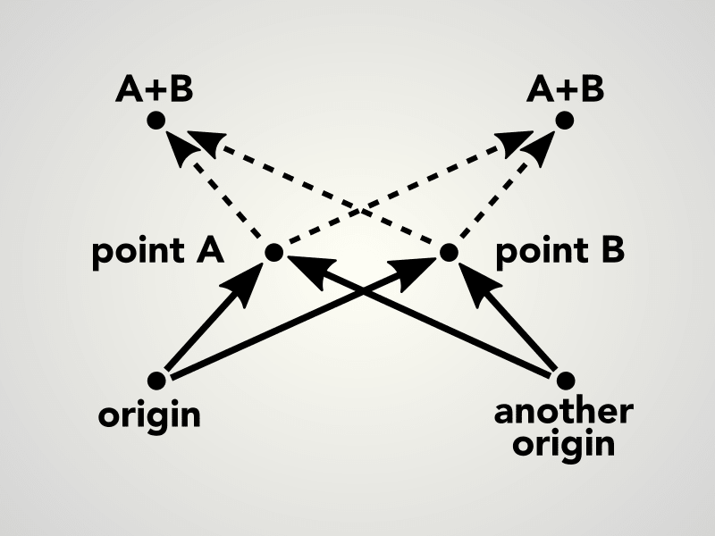
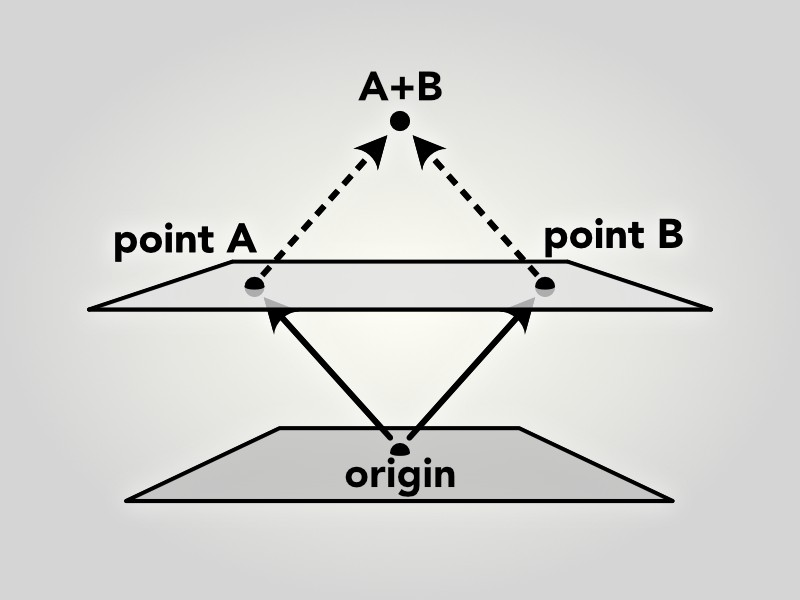

# Affineplane Appendix

This page has extra details on topics discussed in [affineplane readme](../).

## Difference between points and vectors

Affine planes have *no origin* by default. The point (0,0) on an affine plane is not an origin. This has interesting consequences that separates the often analogous concepts of the point and the vector.

Let A and B be points on an affine plane. As illustrated below, the result of their addition A + B is arbitrary and fully depends on the choice of the reference point, the origin. The situation might sound exotic but it is rather commonplace. For example, choose any two items nearby and try add their locations together. The result does not make sense, does it? Our physical world is essentially a space without a fixed origin.

In contrast, the *distance* between points A and B remains constant regardless the choice of origin. Also their difference A - B and mean C have this origin-invariant property. For the two items you chose, although you could not sum their locations, there still is a distance between the items and you can find a location at the middle.

On the other hand, *vectors* represent movement and displacement on the plane. It is easy to imagine adding two moves together to produce a larger move. Therefore, a vector can be added to another vector to produce a third vector – their sum. Also, a vector can be added to a point to produce another point. The same vector can be added to other points as well. Therefore it is apparent that vectors do not have specific location on the plane but instead represent dynamic movements of shapes and can be applied anywhere on the plane.

There is another way to understand why points on an affine plane behave in such a way. Think of a plane in 3D space so that the plane is lifted away from the space origin, as illustrated below. Now, the points A,B on the plane can be described as 3D vectors from the space origin O to the points, denoted as OA and OB. As you can see, addition of two such vectors OA + OB yields a point that does not stay on the plane and therefore cannot be represented on it.

The difference of vectors OA and OB is a vector OA - OB = BA. The vector BA parallel to the plane and the length of BA equals the distance between the points. Also, you can imagine the mean point between A and B. Does it stay on the plane?
